# 检索增强生成（Retrieval-Augmented Generation，RAG）学习视图

> 状态：`accepted_bounded / WP-P4-002 / generated / graph-first`
>
> 生成器：[`scripts/generate_rag_learning_views.py`](../../scripts/generate_rag_learning_views.py)
>
> 图谱输入：[`knowledge/rag/graph.json`](../../knowledge/rag/graph.json)；图模型：[`taxonomy/rag-graph-model.json`](../../taxonomy/rag-graph-model.json)。

本页是有向知识图谱（Directed Knowledge Graph）的可重复投影，不是知识章节（Knowledge Chapter）或工程问题/面试题（Engineering Problem / Interview Question）正文。每条图线和表格行都保留图谱节点 ID、边 ID 与受控关系；重新执行生成器会从当前图谱重建本页。

## 生成边界

- 图谱基线：`2026-09-04`，437 个节点、1930 条边。
- 当前主干（Backbone）：检索增强生成（Retrieval-Augmented Generation） [`BB-RAG`]；流程节点（Pipeline Stage）：18 个。
- 本投影不引入外部来源（External Source），不改变图谱，也不把库存草稿（Inventory Draft）升级为正式内容。来源证据（Source Evidence）仍以图中的 `supported_by` 边为准。

## 生成审计元数据（Generation Audit Metadata）

| 投影项 | 图谱受控类型 | 当前计数 | 生成处置 |
|---|---|---:|---|
| 主干（Backbone） | `backbone` | 5 | 投影已登记主干。 |
| 跨主干重叠（Cross-backbone Overlap） | `overlaps_with` | 12 | 仅投影图谱已登记的受控重叠关系；不根据共同主题推断。 |
| 条件分支（Conditional Branch） | `branches_to` | 2 | 投影图谱已登记的条件分支；不推断未登记路径。 |
| 汇合（Merge） | `merges_into` | 0 | 仅投影图谱已登记的汇合关系。 |

## 全局地铁图（Global Metro Map）

全局地铁图（Global Metro Map）投影当前主干（Backbone）、流程节点（Pipeline Stage）以及图谱已登记的 `contains`、`next_stage`、`branches_to` 和 `merges_into` 关系。实线表示有向流程或条件分支，虚线表示包含（Contains），汇合关系沿受控边保留。

```mermaid
flowchart LR
    n0["检索增强生成（Retrieval-Augmented Generation）<br/>BB-RAG"]
    n1["数据摄取（Data Ingestion）<br/>PS-DATA-INGESTION"]
    n2["文档解析（Document Parsing）<br/>PS-DOCUMENT-PARSING"]
    n3["数据治理（Data Governance）<br/>PS-DATA-GOVERNANCE"]
    n4["文本切分（Chunking）<br/>PS-CHUNKING"]
    n5["向量嵌入（Embedding）<br/>PS-EMBEDDING"]
    n6["存储与索引（Storage and Indexing）<br/>PS-STORAGE-INDEXING"]
    n7["查询理解（Query Understanding）<br/>PS-QUERY-UNDERSTANDING"]
    n8["查询改写（Query Rewrite）<br/>PS-QUERY-REWRITE"]
    n9["查询路由（Query Routing）<br/>PS-QUERY-ROUTING"]
    n10["检索（Retrieval）<br/>PS-RETRIEVAL"]
    n11["结果融合（Result Fusion）<br/>PS-RESULT-FUSION"]
    n12["重排（Reranking）<br/>PS-RERANKING"]
    n13["上下文组装（Context Assembly）<br/>PS-CONTEXT-ASSEMBLY"]
    n14["答案生成（Answer Generation）<br/>PS-ANSWER-GENERATION"]
    n15["引用与验证（Citation and Verification）<br/>PS-CITATION-VERIFICATION"]
    n16["评估（Evaluation）<br/>PS-EVALUATION"]
    n17["生产治理（Production Governance）<br/>PS-PRODUCTION-GOVERNANCE"]
    n18["高级检索增强生成（Advanced RAG）<br/>PS-ADVANCED-RAG"]
    n19["智能体（Agent）<br/>BB-AGENT"]
    n20["知识图谱（Knowledge Graph）<br/>BB-KNOWLEDGE-GRAPH"]
    n9 -->|branches_to<br/>BRANCHES-TO-PS-QUERY-ROUTING-BB-AGENT| n19
    n10 -->|branches_to<br/>BRANCHES-TO-PS-RETRIEVAL-BB-KNOWLEDGE-GRAPH| n20
    n0 -.->|contains<br/>CONTAINS-BB-RAG-PS-ADVANCED-RAG| n18
    n0 -.->|contains<br/>CONTAINS-BB-RAG-PS-ANSWER-GENERATION| n14
    n0 -.->|contains<br/>CONTAINS-BB-RAG-PS-CHUNKING| n4
    n0 -.->|contains<br/>CONTAINS-BB-RAG-PS-CITATION-VERIFICATION| n15
    n0 -.->|contains<br/>CONTAINS-BB-RAG-PS-CONTEXT-ASSEMBLY| n13
    n0 -.->|contains<br/>CONTAINS-BB-RAG-PS-DATA-GOVERNANCE| n3
    n0 -.->|contains<br/>CONTAINS-BB-RAG-PS-DATA-INGESTION| n1
    n0 -.->|contains<br/>CONTAINS-BB-RAG-PS-DOCUMENT-PARSING| n2
    n0 -.->|contains<br/>CONTAINS-BB-RAG-PS-EMBEDDING| n5
    n0 -.->|contains<br/>CONTAINS-BB-RAG-PS-EVALUATION| n16
    n0 -.->|contains<br/>CONTAINS-BB-RAG-PS-PRODUCTION-GOVERNANCE| n17
    n0 -.->|contains<br/>CONTAINS-BB-RAG-PS-QUERY-REWRITE| n8
    n0 -.->|contains<br/>CONTAINS-BB-RAG-PS-QUERY-ROUTING| n9
    n0 -.->|contains<br/>CONTAINS-BB-RAG-PS-QUERY-UNDERSTANDING| n7
    n0 -.->|contains<br/>CONTAINS-BB-RAG-PS-RERANKING| n12
    n0 -.->|contains<br/>CONTAINS-BB-RAG-PS-RESULT-FUSION| n11
    n0 -.->|contains<br/>CONTAINS-BB-RAG-PS-RETRIEVAL| n10
    n0 -.->|contains<br/>CONTAINS-BB-RAG-PS-STORAGE-INDEXING| n6
    n14 -->|next_stage<br/>NEXT-STAGE-PS-ANSWER-GENERATION-PS-CITATION-VERIFICATION| n15
    n4 -->|next_stage<br/>NEXT-STAGE-PS-CHUNKING-PS-EMBEDDING| n5
    n15 -->|next_stage<br/>NEXT-STAGE-PS-CITATION-VERIFICATION-PS-EVALUATION| n16
    n13 -->|next_stage<br/>NEXT-STAGE-PS-CONTEXT-ASSEMBLY-PS-ANSWER-GENERATION| n14
    n3 -->|next_stage<br/>NEXT-STAGE-PS-DATA-GOVERNANCE-PS-CHUNKING| n4
    n1 -->|next_stage<br/>NEXT-STAGE-PS-DATA-INGESTION-PS-DOCUMENT-PARSING| n2
    n2 -->|next_stage<br/>NEXT-STAGE-PS-DOCUMENT-PARSING-PS-DATA-GOVERNANCE| n3
    n5 -->|next_stage<br/>NEXT-STAGE-PS-EMBEDDING-PS-STORAGE-INDEXING| n6
    n16 -->|next_stage<br/>NEXT-STAGE-PS-EVALUATION-PS-PRODUCTION-GOVERNANCE| n17
    n17 -->|next_stage<br/>NEXT-STAGE-PS-PRODUCTION-GOVERNANCE-PS-ADVANCED-RAG| n18
    n8 -->|next_stage<br/>NEXT-STAGE-PS-QUERY-REWRITE-PS-QUERY-ROUTING| n9
    n9 -->|next_stage<br/>NEXT-STAGE-PS-QUERY-ROUTING-PS-RETRIEVAL| n10
    n7 -->|next_stage<br/>NEXT-STAGE-PS-QUERY-UNDERSTANDING-PS-QUERY-REWRITE| n8
    n12 -->|next_stage<br/>NEXT-STAGE-PS-RERANKING-PS-CONTEXT-ASSEMBLY| n13
    n11 -->|next_stage<br/>NEXT-STAGE-PS-RESULT-FUSION-PS-RERANKING| n12
    n10 -->|next_stage<br/>NEXT-STAGE-PS-RETRIEVAL-PS-RESULT-FUSION| n11
    n6 -->|next_stage<br/>NEXT-STAGE-PS-STORAGE-INDEXING-PS-QUERY-UNDERSTANDING| n7
```

| 边 ID | 受控关系 | 起点 | 终点 |
|---|---|---|---|
| `BRANCHES-TO-PS-QUERY-ROUTING-BB-AGENT` | 分支到（Branches To） `branches_to` | 查询路由（Query Routing） [`PS-QUERY-ROUTING`] | 智能体（Agent） [`BB-AGENT`] |
| `BRANCHES-TO-PS-RETRIEVAL-BB-KNOWLEDGE-GRAPH` | 分支到（Branches To） `branches_to` | 检索（Retrieval） [`PS-RETRIEVAL`] | 知识图谱（Knowledge Graph） [`BB-KNOWLEDGE-GRAPH`] |
| `CONTAINS-BB-RAG-PS-ADVANCED-RAG` | 包含（Contains） `contains` | 检索增强生成（Retrieval-Augmented Generation） [`BB-RAG`] | 高级检索增强生成（Advanced RAG） [`PS-ADVANCED-RAG`] |
| `CONTAINS-BB-RAG-PS-ANSWER-GENERATION` | 包含（Contains） `contains` | 检索增强生成（Retrieval-Augmented Generation） [`BB-RAG`] | 答案生成（Answer Generation） [`PS-ANSWER-GENERATION`] |
| `CONTAINS-BB-RAG-PS-CHUNKING` | 包含（Contains） `contains` | 检索增强生成（Retrieval-Augmented Generation） [`BB-RAG`] | 文本切分（Chunking） [`PS-CHUNKING`] |
| `CONTAINS-BB-RAG-PS-CITATION-VERIFICATION` | 包含（Contains） `contains` | 检索增强生成（Retrieval-Augmented Generation） [`BB-RAG`] | 引用与验证（Citation and Verification） [`PS-CITATION-VERIFICATION`] |
| `CONTAINS-BB-RAG-PS-CONTEXT-ASSEMBLY` | 包含（Contains） `contains` | 检索增强生成（Retrieval-Augmented Generation） [`BB-RAG`] | 上下文组装（Context Assembly） [`PS-CONTEXT-ASSEMBLY`] |
| `CONTAINS-BB-RAG-PS-DATA-GOVERNANCE` | 包含（Contains） `contains` | 检索增强生成（Retrieval-Augmented Generation） [`BB-RAG`] | 数据治理（Data Governance） [`PS-DATA-GOVERNANCE`] |
| `CONTAINS-BB-RAG-PS-DATA-INGESTION` | 包含（Contains） `contains` | 检索增强生成（Retrieval-Augmented Generation） [`BB-RAG`] | 数据摄取（Data Ingestion） [`PS-DATA-INGESTION`] |
| `CONTAINS-BB-RAG-PS-DOCUMENT-PARSING` | 包含（Contains） `contains` | 检索增强生成（Retrieval-Augmented Generation） [`BB-RAG`] | 文档解析（Document Parsing） [`PS-DOCUMENT-PARSING`] |
| `CONTAINS-BB-RAG-PS-EMBEDDING` | 包含（Contains） `contains` | 检索增强生成（Retrieval-Augmented Generation） [`BB-RAG`] | 向量嵌入（Embedding） [`PS-EMBEDDING`] |
| `CONTAINS-BB-RAG-PS-EVALUATION` | 包含（Contains） `contains` | 检索增强生成（Retrieval-Augmented Generation） [`BB-RAG`] | 评估（Evaluation） [`PS-EVALUATION`] |
| `CONTAINS-BB-RAG-PS-PRODUCTION-GOVERNANCE` | 包含（Contains） `contains` | 检索增强生成（Retrieval-Augmented Generation） [`BB-RAG`] | 生产治理（Production Governance） [`PS-PRODUCTION-GOVERNANCE`] |
| `CONTAINS-BB-RAG-PS-QUERY-REWRITE` | 包含（Contains） `contains` | 检索增强生成（Retrieval-Augmented Generation） [`BB-RAG`] | 查询改写（Query Rewrite） [`PS-QUERY-REWRITE`] |
| `CONTAINS-BB-RAG-PS-QUERY-ROUTING` | 包含（Contains） `contains` | 检索增强生成（Retrieval-Augmented Generation） [`BB-RAG`] | 查询路由（Query Routing） [`PS-QUERY-ROUTING`] |
| `CONTAINS-BB-RAG-PS-QUERY-UNDERSTANDING` | 包含（Contains） `contains` | 检索增强生成（Retrieval-Augmented Generation） [`BB-RAG`] | 查询理解（Query Understanding） [`PS-QUERY-UNDERSTANDING`] |
| `CONTAINS-BB-RAG-PS-RERANKING` | 包含（Contains） `contains` | 检索增强生成（Retrieval-Augmented Generation） [`BB-RAG`] | 重排（Reranking） [`PS-RERANKING`] |
| `CONTAINS-BB-RAG-PS-RESULT-FUSION` | 包含（Contains） `contains` | 检索增强生成（Retrieval-Augmented Generation） [`BB-RAG`] | 结果融合（Result Fusion） [`PS-RESULT-FUSION`] |
| `CONTAINS-BB-RAG-PS-RETRIEVAL` | 包含（Contains） `contains` | 检索增强生成（Retrieval-Augmented Generation） [`BB-RAG`] | 检索（Retrieval） [`PS-RETRIEVAL`] |
| `CONTAINS-BB-RAG-PS-STORAGE-INDEXING` | 包含（Contains） `contains` | 检索增强生成（Retrieval-Augmented Generation） [`BB-RAG`] | 存储与索引（Storage and Indexing） [`PS-STORAGE-INDEXING`] |
| `NEXT-STAGE-PS-ANSWER-GENERATION-PS-CITATION-VERIFICATION` | 下一阶段（Next Stage） `next_stage` | 答案生成（Answer Generation） [`PS-ANSWER-GENERATION`] | 引用与验证（Citation and Verification） [`PS-CITATION-VERIFICATION`] |
| `NEXT-STAGE-PS-CHUNKING-PS-EMBEDDING` | 下一阶段（Next Stage） `next_stage` | 文本切分（Chunking） [`PS-CHUNKING`] | 向量嵌入（Embedding） [`PS-EMBEDDING`] |
| `NEXT-STAGE-PS-CITATION-VERIFICATION-PS-EVALUATION` | 下一阶段（Next Stage） `next_stage` | 引用与验证（Citation and Verification） [`PS-CITATION-VERIFICATION`] | 评估（Evaluation） [`PS-EVALUATION`] |
| `NEXT-STAGE-PS-CONTEXT-ASSEMBLY-PS-ANSWER-GENERATION` | 下一阶段（Next Stage） `next_stage` | 上下文组装（Context Assembly） [`PS-CONTEXT-ASSEMBLY`] | 答案生成（Answer Generation） [`PS-ANSWER-GENERATION`] |
| `NEXT-STAGE-PS-DATA-GOVERNANCE-PS-CHUNKING` | 下一阶段（Next Stage） `next_stage` | 数据治理（Data Governance） [`PS-DATA-GOVERNANCE`] | 文本切分（Chunking） [`PS-CHUNKING`] |
| `NEXT-STAGE-PS-DATA-INGESTION-PS-DOCUMENT-PARSING` | 下一阶段（Next Stage） `next_stage` | 数据摄取（Data Ingestion） [`PS-DATA-INGESTION`] | 文档解析（Document Parsing） [`PS-DOCUMENT-PARSING`] |
| `NEXT-STAGE-PS-DOCUMENT-PARSING-PS-DATA-GOVERNANCE` | 下一阶段（Next Stage） `next_stage` | 文档解析（Document Parsing） [`PS-DOCUMENT-PARSING`] | 数据治理（Data Governance） [`PS-DATA-GOVERNANCE`] |
| `NEXT-STAGE-PS-EMBEDDING-PS-STORAGE-INDEXING` | 下一阶段（Next Stage） `next_stage` | 向量嵌入（Embedding） [`PS-EMBEDDING`] | 存储与索引（Storage and Indexing） [`PS-STORAGE-INDEXING`] |
| `NEXT-STAGE-PS-EVALUATION-PS-PRODUCTION-GOVERNANCE` | 下一阶段（Next Stage） `next_stage` | 评估（Evaluation） [`PS-EVALUATION`] | 生产治理（Production Governance） [`PS-PRODUCTION-GOVERNANCE`] |
| `NEXT-STAGE-PS-PRODUCTION-GOVERNANCE-PS-ADVANCED-RAG` | 下一阶段（Next Stage） `next_stage` | 生产治理（Production Governance） [`PS-PRODUCTION-GOVERNANCE`] | 高级检索增强生成（Advanced RAG） [`PS-ADVANCED-RAG`] |
| `NEXT-STAGE-PS-QUERY-REWRITE-PS-QUERY-ROUTING` | 下一阶段（Next Stage） `next_stage` | 查询改写（Query Rewrite） [`PS-QUERY-REWRITE`] | 查询路由（Query Routing） [`PS-QUERY-ROUTING`] |
| `NEXT-STAGE-PS-QUERY-ROUTING-PS-RETRIEVAL` | 下一阶段（Next Stage） `next_stage` | 查询路由（Query Routing） [`PS-QUERY-ROUTING`] | 检索（Retrieval） [`PS-RETRIEVAL`] |
| `NEXT-STAGE-PS-QUERY-UNDERSTANDING-PS-QUERY-REWRITE` | 下一阶段（Next Stage） `next_stage` | 查询理解（Query Understanding） [`PS-QUERY-UNDERSTANDING`] | 查询改写（Query Rewrite） [`PS-QUERY-REWRITE`] |
| `NEXT-STAGE-PS-RERANKING-PS-CONTEXT-ASSEMBLY` | 下一阶段（Next Stage） `next_stage` | 重排（Reranking） [`PS-RERANKING`] | 上下文组装（Context Assembly） [`PS-CONTEXT-ASSEMBLY`] |
| `NEXT-STAGE-PS-RESULT-FUSION-PS-RERANKING` | 下一阶段（Next Stage） `next_stage` | 结果融合（Result Fusion） [`PS-RESULT-FUSION`] | 重排（Reranking） [`PS-RERANKING`] |
| `NEXT-STAGE-PS-RETRIEVAL-PS-RESULT-FUSION` | 下一阶段（Next Stage） `next_stage` | 检索（Retrieval） [`PS-RETRIEVAL`] | 结果融合（Result Fusion） [`PS-RESULT-FUSION`] |
| `NEXT-STAGE-PS-STORAGE-INDEXING-PS-QUERY-UNDERSTANDING` | 下一阶段（Next Stage） `next_stage` | 存储与索引（Storage and Indexing） [`PS-STORAGE-INDEXING`] | 查询理解（Query Understanding） [`PS-QUERY-UNDERSTANDING`] |

## 四条 RAG 主干图（Four RAG Backbone Maps）

### 离线知识构建（Offline Knowledge Construction）

当前流程节点（Pipeline Stage）：数据摄取（Data Ingestion） [`PS-DATA-INGESTION`], 文档解析（Document Parsing） [`PS-DOCUMENT-PARSING`], 数据治理（Data Governance） [`PS-DATA-GOVERNANCE`], 文本切分（Chunking） [`PS-CHUNKING`], 向量嵌入（Embedding） [`PS-EMBEDDING`], 存储与索引（Storage and Indexing） [`PS-STORAGE-INDEXING`]。


| 边 ID | 受控关系 | 起点 | 终点 |
|---|---|---|---|
| `NEXT-STAGE-PS-CHUNKING-PS-EMBEDDING` | 下一阶段（Next Stage） `next_stage` | 文本切分（Chunking） [`PS-CHUNKING`] | 向量嵌入（Embedding） [`PS-EMBEDDING`] |
| `NEXT-STAGE-PS-DATA-GOVERNANCE-PS-CHUNKING` | 下一阶段（Next Stage） `next_stage` | 数据治理（Data Governance） [`PS-DATA-GOVERNANCE`] | 文本切分（Chunking） [`PS-CHUNKING`] |
| `NEXT-STAGE-PS-DATA-INGESTION-PS-DOCUMENT-PARSING` | 下一阶段（Next Stage） `next_stage` | 数据摄取（Data Ingestion） [`PS-DATA-INGESTION`] | 文档解析（Document Parsing） [`PS-DOCUMENT-PARSING`] |
| `NEXT-STAGE-PS-DOCUMENT-PARSING-PS-DATA-GOVERNANCE` | 下一阶段（Next Stage） `next_stage` | 文档解析（Document Parsing） [`PS-DOCUMENT-PARSING`] | 数据治理（Data Governance） [`PS-DATA-GOVERNANCE`] |
| `NEXT-STAGE-PS-EMBEDDING-PS-STORAGE-INDEXING` | 下一阶段（Next Stage） `next_stage` | 向量嵌入（Embedding） [`PS-EMBEDDING`] | 存储与索引（Storage and Indexing） [`PS-STORAGE-INDEXING`] |

与其他主干（Backbone）的已登记衔接：

| 边 ID | 受控关系 | 起点 | 终点 |
|---|---|---|---|
| `NEXT-STAGE-PS-STORAGE-INDEXING-PS-QUERY-UNDERSTANDING` | 下一阶段（Next Stage） `next_stage` | 存储与索引（Storage and Indexing） [`PS-STORAGE-INDEXING`] | 查询理解（Query Understanding） [`PS-QUERY-UNDERSTANDING`] |

### 在线问答（Online Query and Answering）

当前流程节点（Pipeline Stage）：查询理解（Query Understanding） [`PS-QUERY-UNDERSTANDING`], 查询改写（Query Rewrite） [`PS-QUERY-REWRITE`], 查询路由（Query Routing） [`PS-QUERY-ROUTING`], 检索（Retrieval） [`PS-RETRIEVAL`], 结果融合（Result Fusion） [`PS-RESULT-FUSION`], 重排（Reranking） [`PS-RERANKING`], 上下文组装（Context Assembly） [`PS-CONTEXT-ASSEMBLY`], 答案生成（Answer Generation） [`PS-ANSWER-GENERATION`], 引用与验证（Citation and Verification） [`PS-CITATION-VERIFICATION`]。

```mermaid
flowchart LR
    n0["查询理解（Query Understanding）<br/>PS-QUERY-UNDERSTANDING"]
    n1["查询改写（Query Rewrite）<br/>PS-QUERY-REWRITE"]
    n2["查询路由（Query Routing）<br/>PS-QUERY-ROUTING"]
    n3["检索（Retrieval）<br/>PS-RETRIEVAL"]
    n4["结果融合（Result Fusion）<br/>PS-RESULT-FUSION"]
    n5["重排（Reranking）<br/>PS-RERANKING"]
    n6["上下文组装（Context Assembly）<br/>PS-CONTEXT-ASSEMBLY"]
    n7["答案生成（Answer Generation）<br/>PS-ANSWER-GENERATION"]
    n8["引用与验证（Citation and Verification）<br/>PS-CITATION-VERIFICATION"]
    n7 -->|next_stage<br/>NEXT-STAGE-PS-ANSWER-GENERATION-PS-CITATION-VERIFICATION| n8
    n6 -->|next_stage<br/>NEXT-STAGE-PS-CONTEXT-ASSEMBLY-PS-ANSWER-GENERATION| n7
    n1 -->|next_stage<br/>NEXT-STAGE-PS-QUERY-REWRITE-PS-QUERY-ROUTING| n2
    n2 -->|next_stage<br/>NEXT-STAGE-PS-QUERY-ROUTING-PS-RETRIEVAL| n3
    n0 -->|next_stage<br/>NEXT-STAGE-PS-QUERY-UNDERSTANDING-PS-QUERY-REWRITE| n1
    n5 -->|next_stage<br/>NEXT-STAGE-PS-RERANKING-PS-CONTEXT-ASSEMBLY| n6
    n4 -->|next_stage<br/>NEXT-STAGE-PS-RESULT-FUSION-PS-RERANKING| n5
    n3 -->|next_stage<br/>NEXT-STAGE-PS-RETRIEVAL-PS-RESULT-FUSION| n4
```

| 边 ID | 受控关系 | 起点 | 终点 |
|---|---|---|---|
| `NEXT-STAGE-PS-ANSWER-GENERATION-PS-CITATION-VERIFICATION` | 下一阶段（Next Stage） `next_stage` | 答案生成（Answer Generation） [`PS-ANSWER-GENERATION`] | 引用与验证（Citation and Verification） [`PS-CITATION-VERIFICATION`] |
| `NEXT-STAGE-PS-CONTEXT-ASSEMBLY-PS-ANSWER-GENERATION` | 下一阶段（Next Stage） `next_stage` | 上下文组装（Context Assembly） [`PS-CONTEXT-ASSEMBLY`] | 答案生成（Answer Generation） [`PS-ANSWER-GENERATION`] |
| `NEXT-STAGE-PS-QUERY-REWRITE-PS-QUERY-ROUTING` | 下一阶段（Next Stage） `next_stage` | 查询改写（Query Rewrite） [`PS-QUERY-REWRITE`] | 查询路由（Query Routing） [`PS-QUERY-ROUTING`] |
| `NEXT-STAGE-PS-QUERY-ROUTING-PS-RETRIEVAL` | 下一阶段（Next Stage） `next_stage` | 查询路由（Query Routing） [`PS-QUERY-ROUTING`] | 检索（Retrieval） [`PS-RETRIEVAL`] |
| `NEXT-STAGE-PS-QUERY-UNDERSTANDING-PS-QUERY-REWRITE` | 下一阶段（Next Stage） `next_stage` | 查询理解（Query Understanding） [`PS-QUERY-UNDERSTANDING`] | 查询改写（Query Rewrite） [`PS-QUERY-REWRITE`] |
| `NEXT-STAGE-PS-RERANKING-PS-CONTEXT-ASSEMBLY` | 下一阶段（Next Stage） `next_stage` | 重排（Reranking） [`PS-RERANKING`] | 上下文组装（Context Assembly） [`PS-CONTEXT-ASSEMBLY`] |
| `NEXT-STAGE-PS-RESULT-FUSION-PS-RERANKING` | 下一阶段（Next Stage） `next_stage` | 结果融合（Result Fusion） [`PS-RESULT-FUSION`] | 重排（Reranking） [`PS-RERANKING`] |
| `NEXT-STAGE-PS-RETRIEVAL-PS-RESULT-FUSION` | 下一阶段（Next Stage） `next_stage` | 检索（Retrieval） [`PS-RETRIEVAL`] | 结果融合（Result Fusion） [`PS-RESULT-FUSION`] |

与其他主干（Backbone）的已登记衔接：

| 边 ID | 受控关系 | 起点 | 终点 |
|---|---|---|---|
| `NEXT-STAGE-PS-CITATION-VERIFICATION-PS-EVALUATION` | 下一阶段（Next Stage） `next_stage` | 引用与验证（Citation and Verification） [`PS-CITATION-VERIFICATION`] | 评估（Evaluation） [`PS-EVALUATION`] |
| `NEXT-STAGE-PS-STORAGE-INDEXING-PS-QUERY-UNDERSTANDING` | 下一阶段（Next Stage） `next_stage` | 存储与索引（Storage and Indexing） [`PS-STORAGE-INDEXING`] | 查询理解（Query Understanding） [`PS-QUERY-UNDERSTANDING`] |

### 评估反馈（Evaluation and Feedback）

当前流程节点（Pipeline Stage）：评估（Evaluation） [`PS-EVALUATION`]。

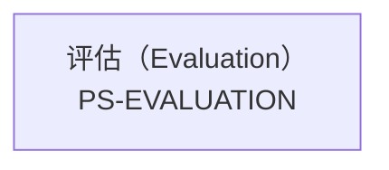

| 边 ID | 受控关系 | 起点 | 终点 |
|---|---|---|---|

与其他主干（Backbone）的已登记衔接：

| 边 ID | 受控关系 | 起点 | 终点 |
|---|---|---|---|
| `NEXT-STAGE-PS-CITATION-VERIFICATION-PS-EVALUATION` | 下一阶段（Next Stage） `next_stage` | 引用与验证（Citation and Verification） [`PS-CITATION-VERIFICATION`] | 评估（Evaluation） [`PS-EVALUATION`] |
| `NEXT-STAGE-PS-EVALUATION-PS-PRODUCTION-GOVERNANCE` | 下一阶段（Next Stage） `next_stage` | 评估（Evaluation） [`PS-EVALUATION`] | 生产治理（Production Governance） [`PS-PRODUCTION-GOVERNANCE`] |

### 生产治理（Production Governance）

当前流程节点（Pipeline Stage）：生产治理（Production Governance） [`PS-PRODUCTION-GOVERNANCE`], 高级检索增强生成（Advanced RAG） [`PS-ADVANCED-RAG`]。

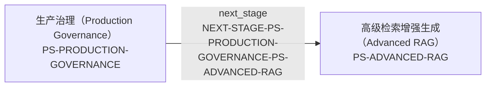

| 边 ID | 受控关系 | 起点 | 终点 |
|---|---|---|---|
| `NEXT-STAGE-PS-PRODUCTION-GOVERNANCE-PS-ADVANCED-RAG` | 下一阶段（Next Stage） `next_stage` | 生产治理（Production Governance） [`PS-PRODUCTION-GOVERNANCE`] | 高级检索增强生成（Advanced RAG） [`PS-ADVANCED-RAG`] |

与其他主干（Backbone）的已登记衔接：

| 边 ID | 受控关系 | 起点 | 终点 |
|---|---|---|---|
| `NEXT-STAGE-PS-EVALUATION-PS-PRODUCTION-GOVERNANCE` | 下一阶段（Next Stage） `next_stage` | 评估（Evaluation） [`PS-EVALUATION`] | 生产治理（Production Governance） [`PS-PRODUCTION-GOVERNANCE`] |

## 跨主干重叠图（Cross-backbone Overlap Map）

跨主干重叠图（Cross-backbone Overlap Map）只展示图谱中已登记的 `overlaps_with` 关系，并单独列出已登记的条件分支（Conditional Branch）。当前已登记 5 个主干（Backbone）、12 条重叠边和 2 条条件分支；投影不根据共同主题推断未注册关系。

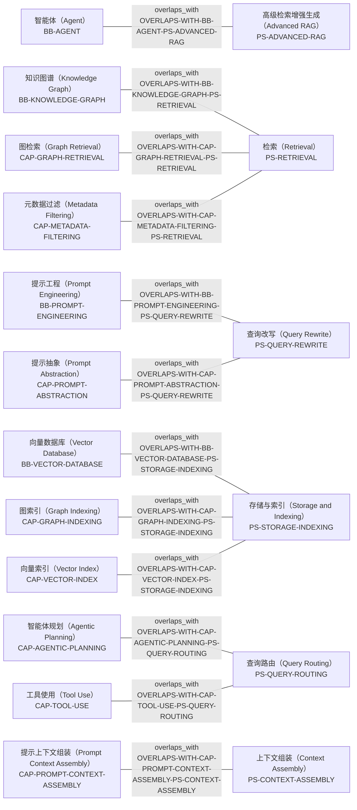

| 边 ID | 受控关系 | 起点 | 终点 |
|---|---|---|---|
| `OVERLAPS-WITH-BB-AGENT-PS-ADVANCED-RAG` | 跨主干重叠（Overlaps With） `overlaps_with` | 智能体（Agent） [`BB-AGENT`] | 高级检索增强生成（Advanced RAG） [`PS-ADVANCED-RAG`] |
| `OVERLAPS-WITH-BB-KNOWLEDGE-GRAPH-PS-RETRIEVAL` | 跨主干重叠（Overlaps With） `overlaps_with` | 知识图谱（Knowledge Graph） [`BB-KNOWLEDGE-GRAPH`] | 检索（Retrieval） [`PS-RETRIEVAL`] |
| `OVERLAPS-WITH-BB-PROMPT-ENGINEERING-PS-QUERY-REWRITE` | 跨主干重叠（Overlaps With） `overlaps_with` | 提示工程（Prompt Engineering） [`BB-PROMPT-ENGINEERING`] | 查询改写（Query Rewrite） [`PS-QUERY-REWRITE`] |
| `OVERLAPS-WITH-BB-VECTOR-DATABASE-PS-STORAGE-INDEXING` | 跨主干重叠（Overlaps With） `overlaps_with` | 向量数据库（Vector Database） [`BB-VECTOR-DATABASE`] | 存储与索引（Storage and Indexing） [`PS-STORAGE-INDEXING`] |
| `OVERLAPS-WITH-CAP-AGENTIC-PLANNING-PS-QUERY-ROUTING` | 跨主干重叠（Overlaps With） `overlaps_with` | 智能体规划（Agentic Planning） [`CAP-AGENTIC-PLANNING`] | 查询路由（Query Routing） [`PS-QUERY-ROUTING`] |
| `OVERLAPS-WITH-CAP-GRAPH-INDEXING-PS-STORAGE-INDEXING` | 跨主干重叠（Overlaps With） `overlaps_with` | 图索引（Graph Indexing） [`CAP-GRAPH-INDEXING`] | 存储与索引（Storage and Indexing） [`PS-STORAGE-INDEXING`] |
| `OVERLAPS-WITH-CAP-GRAPH-RETRIEVAL-PS-RETRIEVAL` | 跨主干重叠（Overlaps With） `overlaps_with` | 图检索（Graph Retrieval） [`CAP-GRAPH-RETRIEVAL`] | 检索（Retrieval） [`PS-RETRIEVAL`] |
| `OVERLAPS-WITH-CAP-METADATA-FILTERING-PS-RETRIEVAL` | 跨主干重叠（Overlaps With） `overlaps_with` | 元数据过滤（Metadata Filtering） [`CAP-METADATA-FILTERING`] | 检索（Retrieval） [`PS-RETRIEVAL`] |
| `OVERLAPS-WITH-CAP-PROMPT-ABSTRACTION-PS-QUERY-REWRITE` | 跨主干重叠（Overlaps With） `overlaps_with` | 提示抽象（Prompt Abstraction） [`CAP-PROMPT-ABSTRACTION`] | 查询改写（Query Rewrite） [`PS-QUERY-REWRITE`] |
| `OVERLAPS-WITH-CAP-PROMPT-CONTEXT-ASSEMBLY-PS-CONTEXT-ASSEMBLY` | 跨主干重叠（Overlaps With） `overlaps_with` | 提示上下文组装（Prompt Context Assembly） [`CAP-PROMPT-CONTEXT-ASSEMBLY`] | 上下文组装（Context Assembly） [`PS-CONTEXT-ASSEMBLY`] |
| `OVERLAPS-WITH-CAP-TOOL-USE-PS-QUERY-ROUTING` | 跨主干重叠（Overlaps With） `overlaps_with` | 工具使用（Tool Use） [`CAP-TOOL-USE`] | 查询路由（Query Routing） [`PS-QUERY-ROUTING`] |
| `OVERLAPS-WITH-CAP-VECTOR-INDEX-PS-STORAGE-INDEXING` | 跨主干重叠（Overlaps With） `overlaps_with` | 向量索引（Vector Index） [`CAP-VECTOR-INDEX`] | 存储与索引（Storage and Indexing） [`PS-STORAGE-INDEXING`] |

### 已登记条件分支（Registered Conditional Branches）

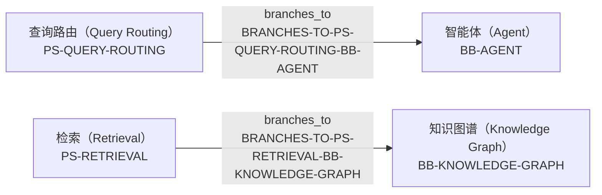

| 边 ID | 受控关系 | 起点 | 终点 |
|---|---|---|---|
| `BRANCHES-TO-PS-QUERY-ROUTING-BB-AGENT` | 分支到（Branches To） `branches_to` | 查询路由（Query Routing） [`PS-QUERY-ROUTING`] | 智能体（Agent） [`BB-AGENT`] |
| `BRANCHES-TO-PS-RETRIEVAL-BB-KNOWLEDGE-GRAPH` | 分支到（Branches To） `branches_to` | 检索（Retrieval） [`PS-RETRIEVAL`] | 知识图谱（Knowledge Graph） [`BB-KNOWLEDGE-GRAPH`] |

## 用户问题执行路径（User Query Execution Path）

当前图谱没有独立的用户问题（User Query）节点；因此本路径从查询理解（Query Understanding）开始，严格投影在线问答（Online Query and Answering）的已登记 `next_stage` 与条件分支（`branches_to`）。分支只表示图谱中的可选路由，不表示每个请求都必然执行所有策略。

```mermaid
flowchart LR
    n0["查询理解（Query Understanding）<br/>PS-QUERY-UNDERSTANDING"]
    n1["查询改写（Query Rewrite）<br/>PS-QUERY-REWRITE"]
    n2["查询路由（Query Routing）<br/>PS-QUERY-ROUTING"]
    n3["检索（Retrieval）<br/>PS-RETRIEVAL"]
    n4["结果融合（Result Fusion）<br/>PS-RESULT-FUSION"]
    n5["重排（Reranking）<br/>PS-RERANKING"]
    n6["上下文组装（Context Assembly）<br/>PS-CONTEXT-ASSEMBLY"]
    n7["答案生成（Answer Generation）<br/>PS-ANSWER-GENERATION"]
    n8["引用与验证（Citation and Verification）<br/>PS-CITATION-VERIFICATION"]
    n9["智能体（Agent）<br/>BB-AGENT"]
    n10["知识图谱（Knowledge Graph）<br/>BB-KNOWLEDGE-GRAPH"]
    n2 -->|branches_to<br/>BRANCHES-TO-PS-QUERY-ROUTING-BB-AGENT| n9
    n3 -->|branches_to<br/>BRANCHES-TO-PS-RETRIEVAL-BB-KNOWLEDGE-GRAPH| n10
    n7 -->|next_stage<br/>NEXT-STAGE-PS-ANSWER-GENERATION-PS-CITATION-VERIFICATION| n8
    n6 -->|next_stage<br/>NEXT-STAGE-PS-CONTEXT-ASSEMBLY-PS-ANSWER-GENERATION| n7
    n1 -->|next_stage<br/>NEXT-STAGE-PS-QUERY-REWRITE-PS-QUERY-ROUTING| n2
    n2 -->|next_stage<br/>NEXT-STAGE-PS-QUERY-ROUTING-PS-RETRIEVAL| n3
    n0 -->|next_stage<br/>NEXT-STAGE-PS-QUERY-UNDERSTANDING-PS-QUERY-REWRITE| n1
    n5 -->|next_stage<br/>NEXT-STAGE-PS-RERANKING-PS-CONTEXT-ASSEMBLY| n6
    n4 -->|next_stage<br/>NEXT-STAGE-PS-RESULT-FUSION-PS-RERANKING| n5
    n3 -->|next_stage<br/>NEXT-STAGE-PS-RETRIEVAL-PS-RESULT-FUSION| n4
```

| 边 ID | 受控关系 | 起点 | 终点 |
|---|---|---|---|
| `BRANCHES-TO-PS-QUERY-ROUTING-BB-AGENT` | 分支到（Branches To） `branches_to` | 查询路由（Query Routing） [`PS-QUERY-ROUTING`] | 智能体（Agent） [`BB-AGENT`] |
| `BRANCHES-TO-PS-RETRIEVAL-BB-KNOWLEDGE-GRAPH` | 分支到（Branches To） `branches_to` | 检索（Retrieval） [`PS-RETRIEVAL`] | 知识图谱（Knowledge Graph） [`BB-KNOWLEDGE-GRAPH`] |
| `NEXT-STAGE-PS-ANSWER-GENERATION-PS-CITATION-VERIFICATION` | 下一阶段（Next Stage） `next_stage` | 答案生成（Answer Generation） [`PS-ANSWER-GENERATION`] | 引用与验证（Citation and Verification） [`PS-CITATION-VERIFICATION`] |
| `NEXT-STAGE-PS-CONTEXT-ASSEMBLY-PS-ANSWER-GENERATION` | 下一阶段（Next Stage） `next_stage` | 上下文组装（Context Assembly） [`PS-CONTEXT-ASSEMBLY`] | 答案生成（Answer Generation） [`PS-ANSWER-GENERATION`] |
| `NEXT-STAGE-PS-QUERY-REWRITE-PS-QUERY-ROUTING` | 下一阶段（Next Stage） `next_stage` | 查询改写（Query Rewrite） [`PS-QUERY-REWRITE`] | 查询路由（Query Routing） [`PS-QUERY-ROUTING`] |
| `NEXT-STAGE-PS-QUERY-ROUTING-PS-RETRIEVAL` | 下一阶段（Next Stage） `next_stage` | 查询路由（Query Routing） [`PS-QUERY-ROUTING`] | 检索（Retrieval） [`PS-RETRIEVAL`] |
| `NEXT-STAGE-PS-QUERY-UNDERSTANDING-PS-QUERY-REWRITE` | 下一阶段（Next Stage） `next_stage` | 查询理解（Query Understanding） [`PS-QUERY-UNDERSTANDING`] | 查询改写（Query Rewrite） [`PS-QUERY-REWRITE`] |
| `NEXT-STAGE-PS-RERANKING-PS-CONTEXT-ASSEMBLY` | 下一阶段（Next Stage） `next_stage` | 重排（Reranking） [`PS-RERANKING`] | 上下文组装（Context Assembly） [`PS-CONTEXT-ASSEMBLY`] |
| `NEXT-STAGE-PS-RESULT-FUSION-PS-RERANKING` | 下一阶段（Next Stage） `next_stage` | 结果融合（Result Fusion） [`PS-RESULT-FUSION`] | 重排（Reranking） [`PS-RERANKING`] |
| `NEXT-STAGE-PS-RETRIEVAL-PS-RESULT-FUSION` | 下一阶段（Next Stage） `next_stage` | 检索（Retrieval） [`PS-RETRIEVAL`] | 结果融合（Result Fusion） [`PS-RESULT-FUSION`] |

## 工程问题反向路径（Engineering Problem Diagnosis Path）

本示例从 产品编号和专业术语依赖精确匹配、口语问题又依赖语义检索时，如何设计 Dense、Sparse 与 Hybrid Search 多路召回，并诊断零召回、噪声召回和权限过滤问题？（RAG engineering problem RAG-SCENE-017） [`PQ-RAG-0017`] 反向定位受影响知识节点（Knowledge Node），并沿已登记解决方案（Solution）、具体实现（Implementation）、评估方法（Evaluation Method）和来源证据（Source Evidence）关系展开。该问题的来源类型和定位仍以图谱节点字段为准。

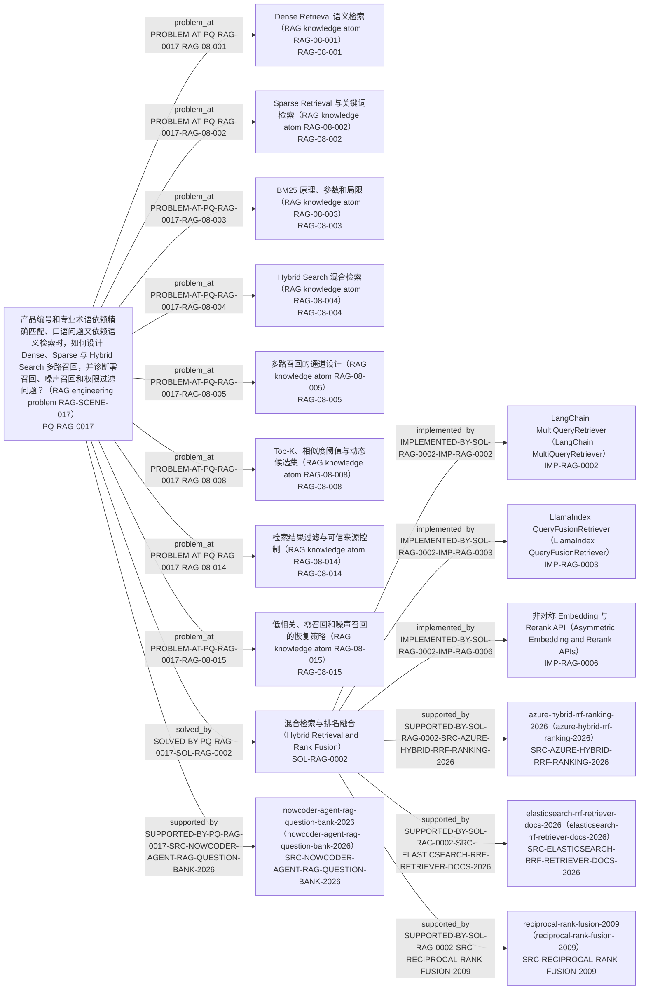

| 边 ID | 受控关系 | 起点 | 终点 |
|---|---|---|---|
| `IMPLEMENTED-BY-SOL-RAG-0002-IMP-RAG-0002` | 具体实现（Implemented By） `implemented_by` | 混合检索与排名融合（Hybrid Retrieval and Rank Fusion） [`SOL-RAG-0002`] | LangChain MultiQueryRetriever（LangChain MultiQueryRetriever） [`IMP-RAG-0002`] |
| `IMPLEMENTED-BY-SOL-RAG-0002-IMP-RAG-0003` | 具体实现（Implemented By） `implemented_by` | 混合检索与排名融合（Hybrid Retrieval and Rank Fusion） [`SOL-RAG-0002`] | LlamaIndex QueryFusionRetriever（LlamaIndex QueryFusionRetriever） [`IMP-RAG-0003`] |
| `IMPLEMENTED-BY-SOL-RAG-0002-IMP-RAG-0006` | 具体实现（Implemented By） `implemented_by` | 混合检索与排名融合（Hybrid Retrieval and Rank Fusion） [`SOL-RAG-0002`] | 非对称 Embedding 与 Rerank API（Asymmetric Embedding and Rerank APIs） [`IMP-RAG-0006`] |
| `PROBLEM-AT-PQ-RAG-0017-RAG-08-001` | 出现问题于（Problem At） `problem_at` | 产品编号和专业术语依赖精确匹配、口语问题又依赖语义检索时，如何设计 Dense、Sparse 与 Hybrid Search 多路召回，并诊断零召回、噪声召回和权限过滤问题？（RAG engineering problem RAG-SCENE-017） [`PQ-RAG-0017`] | Dense Retrieval 语义检索（RAG knowledge atom RAG-08-001） [`RAG-08-001`] |
| `PROBLEM-AT-PQ-RAG-0017-RAG-08-002` | 出现问题于（Problem At） `problem_at` | 产品编号和专业术语依赖精确匹配、口语问题又依赖语义检索时，如何设计 Dense、Sparse 与 Hybrid Search 多路召回，并诊断零召回、噪声召回和权限过滤问题？（RAG engineering problem RAG-SCENE-017） [`PQ-RAG-0017`] | Sparse Retrieval 与关键词检索（RAG knowledge atom RAG-08-002） [`RAG-08-002`] |
| `PROBLEM-AT-PQ-RAG-0017-RAG-08-003` | 出现问题于（Problem At） `problem_at` | 产品编号和专业术语依赖精确匹配、口语问题又依赖语义检索时，如何设计 Dense、Sparse 与 Hybrid Search 多路召回，并诊断零召回、噪声召回和权限过滤问题？（RAG engineering problem RAG-SCENE-017） [`PQ-RAG-0017`] | BM25 原理、参数和局限（RAG knowledge atom RAG-08-003） [`RAG-08-003`] |
| `PROBLEM-AT-PQ-RAG-0017-RAG-08-004` | 出现问题于（Problem At） `problem_at` | 产品编号和专业术语依赖精确匹配、口语问题又依赖语义检索时，如何设计 Dense、Sparse 与 Hybrid Search 多路召回，并诊断零召回、噪声召回和权限过滤问题？（RAG engineering problem RAG-SCENE-017） [`PQ-RAG-0017`] | Hybrid Search 混合检索（RAG knowledge atom RAG-08-004） [`RAG-08-004`] |
| `PROBLEM-AT-PQ-RAG-0017-RAG-08-005` | 出现问题于（Problem At） `problem_at` | 产品编号和专业术语依赖精确匹配、口语问题又依赖语义检索时，如何设计 Dense、Sparse 与 Hybrid Search 多路召回，并诊断零召回、噪声召回和权限过滤问题？（RAG engineering problem RAG-SCENE-017） [`PQ-RAG-0017`] | 多路召回的通道设计（RAG knowledge atom RAG-08-005） [`RAG-08-005`] |
| `PROBLEM-AT-PQ-RAG-0017-RAG-08-008` | 出现问题于（Problem At） `problem_at` | 产品编号和专业术语依赖精确匹配、口语问题又依赖语义检索时，如何设计 Dense、Sparse 与 Hybrid Search 多路召回，并诊断零召回、噪声召回和权限过滤问题？（RAG engineering problem RAG-SCENE-017） [`PQ-RAG-0017`] | Top-K、相似度阈值与动态候选集（RAG knowledge atom RAG-08-008） [`RAG-08-008`] |
| `PROBLEM-AT-PQ-RAG-0017-RAG-08-014` | 出现问题于（Problem At） `problem_at` | 产品编号和专业术语依赖精确匹配、口语问题又依赖语义检索时，如何设计 Dense、Sparse 与 Hybrid Search 多路召回，并诊断零召回、噪声召回和权限过滤问题？（RAG engineering problem RAG-SCENE-017） [`PQ-RAG-0017`] | 检索结果过滤与可信来源控制（RAG knowledge atom RAG-08-014） [`RAG-08-014`] |
| `PROBLEM-AT-PQ-RAG-0017-RAG-08-015` | 出现问题于（Problem At） `problem_at` | 产品编号和专业术语依赖精确匹配、口语问题又依赖语义检索时，如何设计 Dense、Sparse 与 Hybrid Search 多路召回，并诊断零召回、噪声召回和权限过滤问题？（RAG engineering problem RAG-SCENE-017） [`PQ-RAG-0017`] | 低相关、零召回和噪声召回的恢复策略（RAG knowledge atom RAG-08-015） [`RAG-08-015`] |
| `SOLVED-BY-PQ-RAG-0017-SOL-RAG-0002` | 由其解决（Solved By） `solved_by` | 产品编号和专业术语依赖精确匹配、口语问题又依赖语义检索时，如何设计 Dense、Sparse 与 Hybrid Search 多路召回，并诊断零召回、噪声召回和权限过滤问题？（RAG engineering problem RAG-SCENE-017） [`PQ-RAG-0017`] | 混合检索与排名融合（Hybrid Retrieval and Rank Fusion） [`SOL-RAG-0002`] |
| `SUPPORTED-BY-PQ-RAG-0017-SRC-NOWCODER-AGENT-RAG-QUESTION-BANK-2026` | 来源支持（Supported By） `supported_by` | 产品编号和专业术语依赖精确匹配、口语问题又依赖语义检索时，如何设计 Dense、Sparse 与 Hybrid Search 多路召回，并诊断零召回、噪声召回和权限过滤问题？（RAG engineering problem RAG-SCENE-017） [`PQ-RAG-0017`] | nowcoder-agent-rag-question-bank-2026（nowcoder-agent-rag-question-bank-2026） [`SRC-NOWCODER-AGENT-RAG-QUESTION-BANK-2026`] |
| `SUPPORTED-BY-SOL-RAG-0002-SRC-AZURE-HYBRID-RRF-RANKING-2026` | 来源支持（Supported By） `supported_by` | 混合检索与排名融合（Hybrid Retrieval and Rank Fusion） [`SOL-RAG-0002`] | azure-hybrid-rrf-ranking-2026（azure-hybrid-rrf-ranking-2026） [`SRC-AZURE-HYBRID-RRF-RANKING-2026`] |
| `SUPPORTED-BY-SOL-RAG-0002-SRC-ELASTICSEARCH-RRF-RETRIEVER-DOCS-2026` | 来源支持（Supported By） `supported_by` | 混合检索与排名融合（Hybrid Retrieval and Rank Fusion） [`SOL-RAG-0002`] | elasticsearch-rrf-retriever-docs-2026（elasticsearch-rrf-retriever-docs-2026） [`SRC-ELASTICSEARCH-RRF-RETRIEVER-DOCS-2026`] |
| `SUPPORTED-BY-SOL-RAG-0002-SRC-RECIPROCAL-RANK-FUSION-2009` | 来源支持（Supported By） `supported_by` | 混合检索与排名融合（Hybrid Retrieval and Rank Fusion） [`SOL-RAG-0002`] | reciprocal-rank-fusion-2009（reciprocal-rank-fusion-2009） [`SRC-RECIPROCAL-RANK-FUSION-2009`] |

## 流程节点局部图索引（Pipeline-stage Local Map Index）

为避免主观判断“复杂”，本索引导出全部 18 个流程节点（Pipeline Stage）。每个局部图（Local Node Map）保留一跳的阶段包含（Contains）、下一阶段（Next Stage）、条件分支（Branches To）和汇合（Merges Into）关系；二跳仅沿问题定位（Problem At）、解决方案（Solved By）、具体实现（Implemented By）、评估（Evaluated By）与实现（Implements）关系展开。它不会经由 `BB-RAG` 或来源证据（Source Evidence）节点扩散为全图。

| 流程节点（Pipeline Stage） | 一跳边数 | 二跳扩展边数 | 局部图锚点 |
|---|---:|---:|---|
| 数据摄取（Data Ingestion） [`PS-DATA-INGESTION`] | 1 | 0 | [查看局部图](#ps-data-ingestion) |
| 文档解析（Document Parsing） [`PS-DOCUMENT-PARSING`] | 17 | 16 | [查看局部图](#ps-document-parsing) |
| 数据治理（Data Governance） [`PS-DATA-GOVERNANCE`] | 17 | 16 | [查看局部图](#ps-data-governance) |
| 文本切分（Chunking） [`PS-CHUNKING`] | 19 | 30 | [查看局部图](#ps-chunking) |
| 向量嵌入（Embedding） [`PS-EMBEDDING`] | 18 | 23 | [查看局部图](#ps-embedding) |
| 存储与索引（Storage and Indexing） [`PS-STORAGE-INDEXING`] | 17 | 28 | [查看局部图](#ps-storage-indexing) |
| 查询理解（Query Understanding） [`PS-QUERY-UNDERSTANDING`] | 14 | 25 | [查看局部图](#ps-query-understanding) |
| 查询改写（Query Rewrite） [`PS-QUERY-REWRITE`] | 2 | 0 | [查看局部图](#ps-query-rewrite) |
| 查询路由（Query Routing） [`PS-QUERY-ROUTING`] | 3 | 0 | [查看局部图](#ps-query-routing) |
| 检索（Retrieval） [`PS-RETRIEVAL`] | 19 | 56 | [查看局部图](#ps-retrieval) |
| 结果融合（Result Fusion） [`PS-RESULT-FUSION`] | 18 | 56 | [查看局部图](#ps-result-fusion) |
| 重排（Reranking） [`PS-RERANKING`] | 18 | 56 | [查看局部图](#ps-reranking) |
| 上下文组装（Context Assembly） [`PS-CONTEXT-ASSEMBLY`] | 18 | 17 | [查看局部图](#ps-context-assembly) |
| 答案生成（Answer Generation） [`PS-ANSWER-GENERATION`] | 18 | 17 | [查看局部图](#ps-answer-generation) |
| 引用与验证（Citation and Verification） [`PS-CITATION-VERIFICATION`] | 18 | 17 | [查看局部图](#ps-citation-verification) |
| 评估（Evaluation） [`PS-EVALUATION`] | 16 | 52 | [查看局部图](#ps-evaluation) |
| 生产治理（Production Governance） [`PS-PRODUCTION-GOVERNANCE`] | 21 | 28 | [查看局部图](#ps-production-governance) |
| 高级检索增强生成（Advanced RAG） [`PS-ADVANCED-RAG`] | 21 | 14 | [查看局部图](#ps-advanced-rag) |

<a id="ps-data-ingestion"></a>
### 数据摄取（Data Ingestion） [`PS-DATA-INGESTION`]

一跳局部图（One-hop Local Map）含 1 条边；二跳扩展（Two-hop Expansion）含 0 条边。包含的知识节点（Knowledge Node）：无。

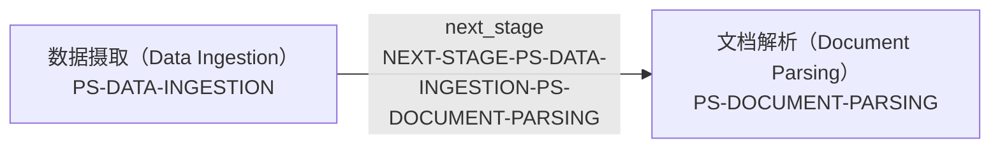

局部节点（Local Nodes）：pipeline_stage: `PS-DATA-INGESTION`, `PS-DOCUMENT-PARSING`。

| 边 ID | 受控关系 | 起点 | 终点 |
|---|---|---|---|
| `NEXT-STAGE-PS-DATA-INGESTION-PS-DOCUMENT-PARSING` | 下一阶段（Next Stage） `next_stage` | 数据摄取（Data Ingestion） [`PS-DATA-INGESTION`] | 文档解析（Document Parsing） [`PS-DOCUMENT-PARSING`] |

<a id="ps-document-parsing"></a>
### 文档解析（Document Parsing） [`PS-DOCUMENT-PARSING`]

一跳局部图（One-hop Local Map）含 17 条边；二跳扩展（Two-hop Expansion）含 16 条边。包含的知识节点（Knowledge Node）：`RAG-03-001`, `RAG-03-002`, `RAG-03-003`, `RAG-03-004`, `RAG-03-005`, `RAG-03-006`, `RAG-03-007`, `RAG-03-008`, `RAG-03-009`, `RAG-03-010`, `RAG-03-011`, `RAG-03-012`, `RAG-03-013`, `RAG-03-014`, `RAG-03-015`。

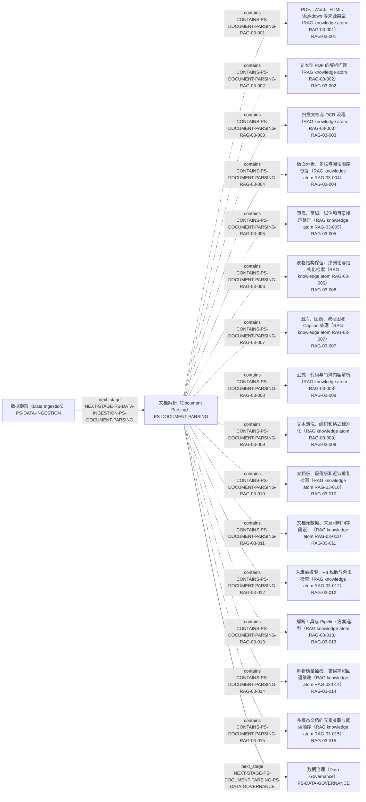

局部节点（Local Nodes）：implementation: `IMP-RAG-0004`, `IMP-RAG-0005`; knowledge: `RAG-03-001`, `RAG-03-002`, `RAG-03-003`, `RAG-03-004`, `RAG-03-005`, `RAG-03-006`, `RAG-03-007`, `RAG-03-008`, `RAG-03-009`, `RAG-03-010`, `RAG-03-011`, `RAG-03-012`, `RAG-03-013`, `RAG-03-014`, `RAG-03-015`; pipeline_stage: `PS-DATA-GOVERNANCE`, `PS-DATA-INGESTION`, `PS-DOCUMENT-PARSING`; problem_question: `PQ-RAG-0002`, `PQ-RAG-0008`, `PQ-RAG-0011`, `PQ-RAG-0022`。

| 边 ID | 受控关系 | 起点 | 终点 |
|---|---|---|---|
| `CONTAINS-PS-DOCUMENT-PARSING-RAG-03-001` | 包含（Contains） `contains` | 文档解析（Document Parsing） [`PS-DOCUMENT-PARSING`] | PDF、Word、HTML、Markdown 等来源类型（RAG knowledge atom RAG-03-001） [`RAG-03-001`] |
| `CONTAINS-PS-DOCUMENT-PARSING-RAG-03-002` | 包含（Contains） `contains` | 文档解析（Document Parsing） [`PS-DOCUMENT-PARSING`] | 文本型 PDF 的解析问题（RAG knowledge atom RAG-03-002） [`RAG-03-002`] |
| `CONTAINS-PS-DOCUMENT-PARSING-RAG-03-003` | 包含（Contains） `contains` | 文档解析（Document Parsing） [`PS-DOCUMENT-PARSING`] | 扫描文档与 OCR 流程（RAG knowledge atom RAG-03-003） [`RAG-03-003`] |
| `CONTAINS-PS-DOCUMENT-PARSING-RAG-03-004` | 包含（Contains） `contains` | 文档解析（Document Parsing） [`PS-DOCUMENT-PARSING`] | 版面分析、多栏与阅读顺序恢复（RAG knowledge atom RAG-03-004） [`RAG-03-004`] |
| `CONTAINS-PS-DOCUMENT-PARSING-RAG-03-005` | 包含（Contains） `contains` | 文档解析（Document Parsing） [`PS-DOCUMENT-PARSING`] | 页眉、页脚、脚注和目录噪声处理（RAG knowledge atom RAG-03-005） [`RAG-03-005`] |
| `CONTAINS-PS-DOCUMENT-PARSING-RAG-03-006` | 包含（Contains） `contains` | 文档解析（Document Parsing） [`PS-DOCUMENT-PARSING`] | 表格结构保留、序列化与结构化检索（RAG knowledge atom RAG-03-006） [`RAG-03-006`] |
| `CONTAINS-PS-DOCUMENT-PARSING-RAG-03-007` | 包含（Contains） `contains` | 文档解析（Document Parsing） [`PS-DOCUMENT-PARSING`] | 图片、图表、流程图和 Caption 处理（RAG knowledge atom RAG-03-007） [`RAG-03-007`] |
| `CONTAINS-PS-DOCUMENT-PARSING-RAG-03-008` | 包含（Contains） `contains` | 文档解析（Document Parsing） [`PS-DOCUMENT-PARSING`] | 公式、代码与特殊内容解析（RAG knowledge atom RAG-03-008） [`RAG-03-008`] |
| `CONTAINS-PS-DOCUMENT-PARSING-RAG-03-009` | 包含（Contains） `contains` | 文档解析（Document Parsing） [`PS-DOCUMENT-PARSING`] | 文本清洗、编码和格式标准化（RAG knowledge atom RAG-03-009） [`RAG-03-009`] |
| `CONTAINS-PS-DOCUMENT-PARSING-RAG-03-010` | 包含（Contains） `contains` | 文档解析（Document Parsing） [`PS-DOCUMENT-PARSING`] | 文档级、段落级和近似重复检测（RAG knowledge atom RAG-03-010） [`RAG-03-010`] |
| `CONTAINS-PS-DOCUMENT-PARSING-RAG-03-011` | 包含（Contains） `contains` | 文档解析（Document Parsing） [`PS-DOCUMENT-PARSING`] | 文档元数据、来源和时间字段设计（RAG knowledge atom RAG-03-011） [`RAG-03-011`] |
| `CONTAINS-PS-DOCUMENT-PARSING-RAG-03-012` | 包含（Contains） `contains` | 文档解析（Document Parsing） [`PS-DOCUMENT-PARSING`] | 入库前权限、PII 脱敏与合规检查（RAG knowledge atom RAG-03-012） [`RAG-03-012`] |
| `CONTAINS-PS-DOCUMENT-PARSING-RAG-03-013` | 包含（Contains） `contains` | 文档解析（Document Parsing） [`PS-DOCUMENT-PARSING`] | 解析工具与 Pipeline 方案选型（RAG knowledge atom RAG-03-013） [`RAG-03-013`] |
| `CONTAINS-PS-DOCUMENT-PARSING-RAG-03-014` | 包含（Contains） `contains` | 文档解析（Document Parsing） [`PS-DOCUMENT-PARSING`] | 解析质量抽检、错误率和回退策略（RAG knowledge atom RAG-03-014） [`RAG-03-014`] |
| `CONTAINS-PS-DOCUMENT-PARSING-RAG-03-015` | 包含（Contains） `contains` | 文档解析（Document Parsing） [`PS-DOCUMENT-PARSING`] | 多模态文档的元素关联与阅读顺序（RAG knowledge atom RAG-03-015） [`RAG-03-015`] |
| `IMPLEMENTS-IMP-RAG-0004-RAG-03-003` | 实现（Implements） `implements` | Unstructured 解析与切分策略（Unstructured Partitioning and Chunking） [`IMP-RAG-0004`] | 扫描文档与 OCR 流程（RAG knowledge atom RAG-03-003） [`RAG-03-003`] |
| `IMPLEMENTS-IMP-RAG-0004-RAG-03-004` | 实现（Implements） `implements` | Unstructured 解析与切分策略（Unstructured Partitioning and Chunking） [`IMP-RAG-0004`] | 版面分析、多栏与阅读顺序恢复（RAG knowledge atom RAG-03-004） [`RAG-03-004`] |
| `IMPLEMENTS-IMP-RAG-0004-RAG-03-006` | 实现（Implements） `implements` | Unstructured 解析与切分策略（Unstructured Partitioning and Chunking） [`IMP-RAG-0004`] | 表格结构保留、序列化与结构化检索（RAG knowledge atom RAG-03-006） [`RAG-03-006`] |
| `IMPLEMENTS-IMP-RAG-0004-RAG-03-014` | 实现（Implements） `implements` | Unstructured 解析与切分策略（Unstructured Partitioning and Chunking） [`IMP-RAG-0004`] | 解析质量抽检、错误率和回退策略（RAG knowledge atom RAG-03-014） [`RAG-03-014`] |
| `IMPLEMENTS-IMP-RAG-0005-RAG-03-003` | 实现（Implements） `implements` | Qdrant/Azure 索引更新与迁移（Qdrant/Azure Index Updates and Migration） [`IMP-RAG-0005`] | 扫描文档与 OCR 流程（RAG knowledge atom RAG-03-003） [`RAG-03-003`] |
| `IMPLEMENTS-IMP-RAG-0005-RAG-03-012` | 实现（Implements） `implements` | Qdrant/Azure 索引更新与迁移（Qdrant/Azure Index Updates and Migration） [`IMP-RAG-0005`] | 入库前权限、PII 脱敏与合规检查（RAG knowledge atom RAG-03-012） [`RAG-03-012`] |
| `NEXT-STAGE-PS-DATA-INGESTION-PS-DOCUMENT-PARSING` | 下一阶段（Next Stage） `next_stage` | 数据摄取（Data Ingestion） [`PS-DATA-INGESTION`] | 文档解析（Document Parsing） [`PS-DOCUMENT-PARSING`] |
| `NEXT-STAGE-PS-DOCUMENT-PARSING-PS-DATA-GOVERNANCE` | 下一阶段（Next Stage） `next_stage` | 文档解析（Document Parsing） [`PS-DOCUMENT-PARSING`] | 数据治理（Data Governance） [`PS-DATA-GOVERNANCE`] |
| `PROBLEM-AT-PQ-RAG-0002-RAG-03-003` | 出现问题于（Problem At） `problem_at` | 法律条文包含条、款、项、引用关系和扫描件噪声时，如何设计结构解析、父子 Chunk、Metadata、Hybrid Retrieval、Rerank、引用和质检？（RAG engineering problem RAG-SCENE-002） [`PQ-RAG-0002`] | 扫描文档与 OCR 流程（RAG knowledge atom RAG-03-003） [`RAG-03-003`] |
| `PROBLEM-AT-PQ-RAG-0002-RAG-03-004` | 出现问题于（Problem At） `problem_at` | 法律条文包含条、款、项、引用关系和扫描件噪声时，如何设计结构解析、父子 Chunk、Metadata、Hybrid Retrieval、Rerank、引用和质检？（RAG engineering problem RAG-SCENE-002） [`PQ-RAG-0002`] | 版面分析、多栏与阅读顺序恢复（RAG knowledge atom RAG-03-004） [`RAG-03-004`] |
| `PROBLEM-AT-PQ-RAG-0002-RAG-03-014` | 出现问题于（Problem At） `problem_at` | 法律条文包含条、款、项、引用关系和扫描件噪声时，如何设计结构解析、父子 Chunk、Metadata、Hybrid Retrieval、Rerank、引用和质检？（RAG engineering problem RAG-SCENE-002） [`PQ-RAG-0002`] | 解析质量抽检、错误率和回退策略（RAG knowledge atom RAG-03-014） [`RAG-03-014`] |
| `PROBLEM-AT-PQ-RAG-0008-RAG-03-003` | 出现问题于（Problem At） `problem_at` | 生产 RAG 面对复杂文档解析、增量索引、多语言检索、延迟、模型升级、缓存、监控和敏感信息权限时，应如何分层定位与治理？（RAG engineering problem RAG-SCENE-008） [`PQ-RAG-0008`] | 扫描文档与 OCR 流程（RAG knowledge atom RAG-03-003） [`RAG-03-003`] |
| `PROBLEM-AT-PQ-RAG-0008-RAG-03-012` | 出现问题于（Problem At） `problem_at` | 生产 RAG 面对复杂文档解析、增量索引、多语言检索、延迟、模型升级、缓存、监控和敏感信息权限时，应如何分层定位与治理？（RAG engineering problem RAG-SCENE-008） [`PQ-RAG-0008`] | 入库前权限、PII 脱敏与合规检查（RAG knowledge atom RAG-03-012） [`RAG-03-012`] |
| `PROBLEM-AT-PQ-RAG-0011-RAG-03-003` | 出现问题于（Problem At） `problem_at` | 如何从混合文本、表格和图片的 PDF 中保留版面、页码和模态关系，分别建立检索表示，并在答案中恢复可靠引用？（RAG engineering problem RAG-SCENE-011） [`PQ-RAG-0011`] | 扫描文档与 OCR 流程（RAG knowledge atom RAG-03-003） [`RAG-03-003`] |
| `PROBLEM-AT-PQ-RAG-0011-RAG-03-004` | 出现问题于（Problem At） `problem_at` | 如何从混合文本、表格和图片的 PDF 中保留版面、页码和模态关系，分别建立检索表示，并在答案中恢复可靠引用？（RAG engineering problem RAG-SCENE-011） [`PQ-RAG-0011`] | 版面分析、多栏与阅读顺序恢复（RAG knowledge atom RAG-03-004） [`RAG-03-004`] |
| `PROBLEM-AT-PQ-RAG-0011-RAG-03-006` | 出现问题于（Problem At） `problem_at` | 如何从混合文本、表格和图片的 PDF 中保留版面、页码和模态关系，分别建立检索表示，并在答案中恢复可靠引用？（RAG engineering problem RAG-SCENE-011） [`PQ-RAG-0011`] | 表格结构保留、序列化与结构化检索（RAG knowledge atom RAG-03-006） [`RAG-03-006`] |
| `PROBLEM-AT-PQ-RAG-0011-RAG-03-014` | 出现问题于（Problem At） `problem_at` | 如何从混合文本、表格和图片的 PDF 中保留版面、页码和模态关系，分别建立检索表示，并在答案中恢复可靠引用？（RAG engineering problem RAG-SCENE-011） [`PQ-RAG-0011`] | 解析质量抽检、错误率和回退策略（RAG knowledge atom RAG-03-014） [`RAG-03-014`] |
| `PROBLEM-AT-PQ-RAG-0022-RAG-03-003` | 出现问题于（Problem At） `problem_at` | 为大量企业租户设计支持复杂文档、增量更新、文档级权限、检索质量目标和 P99 延迟目标的 RAG 系统时，如何选择索引与隔离方式，规划分片副本、无停机模型迁移、备份恢复和分层评测？（RAG engineering problem RAG-SCENE-022） [`PQ-RAG-0022`] | 扫描文档与 OCR 流程（RAG knowledge atom RAG-03-003） [`RAG-03-003`] |

<a id="ps-data-governance"></a>
### 数据治理（Data Governance） [`PS-DATA-GOVERNANCE`]

一跳局部图（One-hop Local Map）含 17 条边；二跳扩展（Two-hop Expansion）含 16 条边。包含的知识节点（Knowledge Node）：`RAG-03-001`, `RAG-03-002`, `RAG-03-003`, `RAG-03-004`, `RAG-03-005`, `RAG-03-006`, `RAG-03-007`, `RAG-03-008`, `RAG-03-009`, `RAG-03-010`, `RAG-03-011`, `RAG-03-012`, `RAG-03-013`, `RAG-03-014`, `RAG-03-015`。

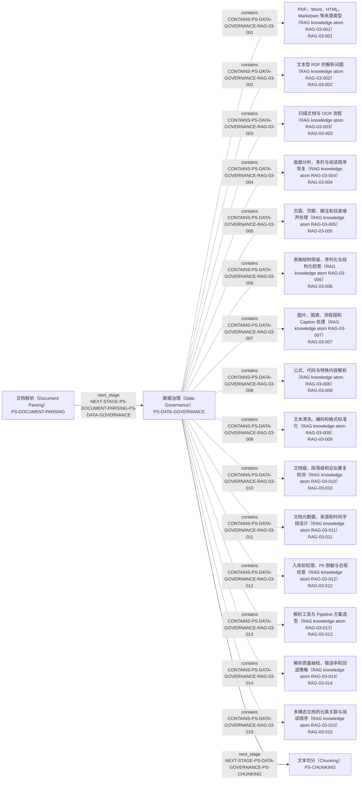

局部节点（Local Nodes）：implementation: `IMP-RAG-0004`, `IMP-RAG-0005`; knowledge: `RAG-03-001`, `RAG-03-002`, `RAG-03-003`, `RAG-03-004`, `RAG-03-005`, `RAG-03-006`, `RAG-03-007`, `RAG-03-008`, `RAG-03-009`, `RAG-03-010`, `RAG-03-011`, `RAG-03-012`, `RAG-03-013`, `RAG-03-014`, `RAG-03-015`; pipeline_stage: `PS-CHUNKING`, `PS-DATA-GOVERNANCE`, `PS-DOCUMENT-PARSING`; problem_question: `PQ-RAG-0002`, `PQ-RAG-0008`, `PQ-RAG-0011`, `PQ-RAG-0022`。

| 边 ID | 受控关系 | 起点 | 终点 |
|---|---|---|---|
| `CONTAINS-PS-DATA-GOVERNANCE-RAG-03-001` | 包含（Contains） `contains` | 数据治理（Data Governance） [`PS-DATA-GOVERNANCE`] | PDF、Word、HTML、Markdown 等来源类型（RAG knowledge atom RAG-03-001） [`RAG-03-001`] |
| `CONTAINS-PS-DATA-GOVERNANCE-RAG-03-002` | 包含（Contains） `contains` | 数据治理（Data Governance） [`PS-DATA-GOVERNANCE`] | 文本型 PDF 的解析问题（RAG knowledge atom RAG-03-002） [`RAG-03-002`] |
| `CONTAINS-PS-DATA-GOVERNANCE-RAG-03-003` | 包含（Contains） `contains` | 数据治理（Data Governance） [`PS-DATA-GOVERNANCE`] | 扫描文档与 OCR 流程（RAG knowledge atom RAG-03-003） [`RAG-03-003`] |
| `CONTAINS-PS-DATA-GOVERNANCE-RAG-03-004` | 包含（Contains） `contains` | 数据治理（Data Governance） [`PS-DATA-GOVERNANCE`] | 版面分析、多栏与阅读顺序恢复（RAG knowledge atom RAG-03-004） [`RAG-03-004`] |
| `CONTAINS-PS-DATA-GOVERNANCE-RAG-03-005` | 包含（Contains） `contains` | 数据治理（Data Governance） [`PS-DATA-GOVERNANCE`] | 页眉、页脚、脚注和目录噪声处理（RAG knowledge atom RAG-03-005） [`RAG-03-005`] |
| `CONTAINS-PS-DATA-GOVERNANCE-RAG-03-006` | 包含（Contains） `contains` | 数据治理（Data Governance） [`PS-DATA-GOVERNANCE`] | 表格结构保留、序列化与结构化检索（RAG knowledge atom RAG-03-006） [`RAG-03-006`] |
| `CONTAINS-PS-DATA-GOVERNANCE-RAG-03-007` | 包含（Contains） `contains` | 数据治理（Data Governance） [`PS-DATA-GOVERNANCE`] | 图片、图表、流程图和 Caption 处理（RAG knowledge atom RAG-03-007） [`RAG-03-007`] |
| `CONTAINS-PS-DATA-GOVERNANCE-RAG-03-008` | 包含（Contains） `contains` | 数据治理（Data Governance） [`PS-DATA-GOVERNANCE`] | 公式、代码与特殊内容解析（RAG knowledge atom RAG-03-008） [`RAG-03-008`] |
| `CONTAINS-PS-DATA-GOVERNANCE-RAG-03-009` | 包含（Contains） `contains` | 数据治理（Data Governance） [`PS-DATA-GOVERNANCE`] | 文本清洗、编码和格式标准化（RAG knowledge atom RAG-03-009） [`RAG-03-009`] |
| `CONTAINS-PS-DATA-GOVERNANCE-RAG-03-010` | 包含（Contains） `contains` | 数据治理（Data Governance） [`PS-DATA-GOVERNANCE`] | 文档级、段落级和近似重复检测（RAG knowledge atom RAG-03-010） [`RAG-03-010`] |
| `CONTAINS-PS-DATA-GOVERNANCE-RAG-03-011` | 包含（Contains） `contains` | 数据治理（Data Governance） [`PS-DATA-GOVERNANCE`] | 文档元数据、来源和时间字段设计（RAG knowledge atom RAG-03-011） [`RAG-03-011`] |
| `CONTAINS-PS-DATA-GOVERNANCE-RAG-03-012` | 包含（Contains） `contains` | 数据治理（Data Governance） [`PS-DATA-GOVERNANCE`] | 入库前权限、PII 脱敏与合规检查（RAG knowledge atom RAG-03-012） [`RAG-03-012`] |
| `CONTAINS-PS-DATA-GOVERNANCE-RAG-03-013` | 包含（Contains） `contains` | 数据治理（Data Governance） [`PS-DATA-GOVERNANCE`] | 解析工具与 Pipeline 方案选型（RAG knowledge atom RAG-03-013） [`RAG-03-013`] |
| `CONTAINS-PS-DATA-GOVERNANCE-RAG-03-014` | 包含（Contains） `contains` | 数据治理（Data Governance） [`PS-DATA-GOVERNANCE`] | 解析质量抽检、错误率和回退策略（RAG knowledge atom RAG-03-014） [`RAG-03-014`] |
| `CONTAINS-PS-DATA-GOVERNANCE-RAG-03-015` | 包含（Contains） `contains` | 数据治理（Data Governance） [`PS-DATA-GOVERNANCE`] | 多模态文档的元素关联与阅读顺序（RAG knowledge atom RAG-03-015） [`RAG-03-015`] |
| `IMPLEMENTS-IMP-RAG-0004-RAG-03-003` | 实现（Implements） `implements` | Unstructured 解析与切分策略（Unstructured Partitioning and Chunking） [`IMP-RAG-0004`] | 扫描文档与 OCR 流程（RAG knowledge atom RAG-03-003） [`RAG-03-003`] |
| `IMPLEMENTS-IMP-RAG-0004-RAG-03-004` | 实现（Implements） `implements` | Unstructured 解析与切分策略（Unstructured Partitioning and Chunking） [`IMP-RAG-0004`] | 版面分析、多栏与阅读顺序恢复（RAG knowledge atom RAG-03-004） [`RAG-03-004`] |
| `IMPLEMENTS-IMP-RAG-0004-RAG-03-006` | 实现（Implements） `implements` | Unstructured 解析与切分策略（Unstructured Partitioning and Chunking） [`IMP-RAG-0004`] | 表格结构保留、序列化与结构化检索（RAG knowledge atom RAG-03-006） [`RAG-03-006`] |
| `IMPLEMENTS-IMP-RAG-0004-RAG-03-014` | 实现（Implements） `implements` | Unstructured 解析与切分策略（Unstructured Partitioning and Chunking） [`IMP-RAG-0004`] | 解析质量抽检、错误率和回退策略（RAG knowledge atom RAG-03-014） [`RAG-03-014`] |
| `IMPLEMENTS-IMP-RAG-0005-RAG-03-003` | 实现（Implements） `implements` | Qdrant/Azure 索引更新与迁移（Qdrant/Azure Index Updates and Migration） [`IMP-RAG-0005`] | 扫描文档与 OCR 流程（RAG knowledge atom RAG-03-003） [`RAG-03-003`] |
| `IMPLEMENTS-IMP-RAG-0005-RAG-03-012` | 实现（Implements） `implements` | Qdrant/Azure 索引更新与迁移（Qdrant/Azure Index Updates and Migration） [`IMP-RAG-0005`] | 入库前权限、PII 脱敏与合规检查（RAG knowledge atom RAG-03-012） [`RAG-03-012`] |
| `NEXT-STAGE-PS-DATA-GOVERNANCE-PS-CHUNKING` | 下一阶段（Next Stage） `next_stage` | 数据治理（Data Governance） [`PS-DATA-GOVERNANCE`] | 文本切分（Chunking） [`PS-CHUNKING`] |
| `NEXT-STAGE-PS-DOCUMENT-PARSING-PS-DATA-GOVERNANCE` | 下一阶段（Next Stage） `next_stage` | 文档解析（Document Parsing） [`PS-DOCUMENT-PARSING`] | 数据治理（Data Governance） [`PS-DATA-GOVERNANCE`] |
| `PROBLEM-AT-PQ-RAG-0002-RAG-03-003` | 出现问题于（Problem At） `problem_at` | 法律条文包含条、款、项、引用关系和扫描件噪声时，如何设计结构解析、父子 Chunk、Metadata、Hybrid Retrieval、Rerank、引用和质检？（RAG engineering problem RAG-SCENE-002） [`PQ-RAG-0002`] | 扫描文档与 OCR 流程（RAG knowledge atom RAG-03-003） [`RAG-03-003`] |
| `PROBLEM-AT-PQ-RAG-0002-RAG-03-004` | 出现问题于（Problem At） `problem_at` | 法律条文包含条、款、项、引用关系和扫描件噪声时，如何设计结构解析、父子 Chunk、Metadata、Hybrid Retrieval、Rerank、引用和质检？（RAG engineering problem RAG-SCENE-002） [`PQ-RAG-0002`] | 版面分析、多栏与阅读顺序恢复（RAG knowledge atom RAG-03-004） [`RAG-03-004`] |
| `PROBLEM-AT-PQ-RAG-0002-RAG-03-014` | 出现问题于（Problem At） `problem_at` | 法律条文包含条、款、项、引用关系和扫描件噪声时，如何设计结构解析、父子 Chunk、Metadata、Hybrid Retrieval、Rerank、引用和质检？（RAG engineering problem RAG-SCENE-002） [`PQ-RAG-0002`] | 解析质量抽检、错误率和回退策略（RAG knowledge atom RAG-03-014） [`RAG-03-014`] |
| `PROBLEM-AT-PQ-RAG-0008-RAG-03-003` | 出现问题于（Problem At） `problem_at` | 生产 RAG 面对复杂文档解析、增量索引、多语言检索、延迟、模型升级、缓存、监控和敏感信息权限时，应如何分层定位与治理？（RAG engineering problem RAG-SCENE-008） [`PQ-RAG-0008`] | 扫描文档与 OCR 流程（RAG knowledge atom RAG-03-003） [`RAG-03-003`] |
| `PROBLEM-AT-PQ-RAG-0008-RAG-03-012` | 出现问题于（Problem At） `problem_at` | 生产 RAG 面对复杂文档解析、增量索引、多语言检索、延迟、模型升级、缓存、监控和敏感信息权限时，应如何分层定位与治理？（RAG engineering problem RAG-SCENE-008） [`PQ-RAG-0008`] | 入库前权限、PII 脱敏与合规检查（RAG knowledge atom RAG-03-012） [`RAG-03-012`] |
| `PROBLEM-AT-PQ-RAG-0011-RAG-03-003` | 出现问题于（Problem At） `problem_at` | 如何从混合文本、表格和图片的 PDF 中保留版面、页码和模态关系，分别建立检索表示，并在答案中恢复可靠引用？（RAG engineering problem RAG-SCENE-011） [`PQ-RAG-0011`] | 扫描文档与 OCR 流程（RAG knowledge atom RAG-03-003） [`RAG-03-003`] |
| `PROBLEM-AT-PQ-RAG-0011-RAG-03-004` | 出现问题于（Problem At） `problem_at` | 如何从混合文本、表格和图片的 PDF 中保留版面、页码和模态关系，分别建立检索表示，并在答案中恢复可靠引用？（RAG engineering problem RAG-SCENE-011） [`PQ-RAG-0011`] | 版面分析、多栏与阅读顺序恢复（RAG knowledge atom RAG-03-004） [`RAG-03-004`] |
| `PROBLEM-AT-PQ-RAG-0011-RAG-03-006` | 出现问题于（Problem At） `problem_at` | 如何从混合文本、表格和图片的 PDF 中保留版面、页码和模态关系，分别建立检索表示，并在答案中恢复可靠引用？（RAG engineering problem RAG-SCENE-011） [`PQ-RAG-0011`] | 表格结构保留、序列化与结构化检索（RAG knowledge atom RAG-03-006） [`RAG-03-006`] |
| `PROBLEM-AT-PQ-RAG-0011-RAG-03-014` | 出现问题于（Problem At） `problem_at` | 如何从混合文本、表格和图片的 PDF 中保留版面、页码和模态关系，分别建立检索表示，并在答案中恢复可靠引用？（RAG engineering problem RAG-SCENE-011） [`PQ-RAG-0011`] | 解析质量抽检、错误率和回退策略（RAG knowledge atom RAG-03-014） [`RAG-03-014`] |
| `PROBLEM-AT-PQ-RAG-0022-RAG-03-003` | 出现问题于（Problem At） `problem_at` | 为大量企业租户设计支持复杂文档、增量更新、文档级权限、检索质量目标和 P99 延迟目标的 RAG 系统时，如何选择索引与隔离方式，规划分片副本、无停机模型迁移、备份恢复和分层评测？（RAG engineering problem RAG-SCENE-022） [`PQ-RAG-0022`] | 扫描文档与 OCR 流程（RAG knowledge atom RAG-03-003） [`RAG-03-003`] |

<a id="ps-chunking"></a>
### 文本切分（Chunking） [`PS-CHUNKING`]

一跳局部图（One-hop Local Map）含 19 条边；二跳扩展（Two-hop Expansion）含 30 条边。包含的知识节点（Knowledge Node）：`RAG-04-001`, `RAG-04-002`, `RAG-04-003`, `RAG-04-004`, `RAG-04-005`, `RAG-04-006`, `RAG-04-007`, `RAG-04-008`, `RAG-04-009`, `RAG-04-010`, `RAG-04-011`, `RAG-04-012`, `RAG-04-013`, `RAG-04-014`, `RAG-04-015`, `RAG-04-016`, `RAG-04-017`。

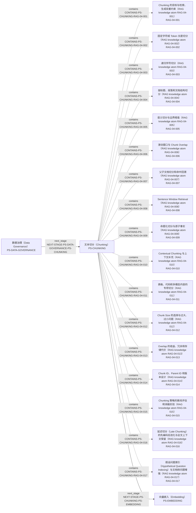

局部节点（Local Nodes）：implementation: `IMP-RAG-0004`, `IMP-RAG-0005`; knowledge: `RAG-04-001`, `RAG-04-002`, `RAG-04-003`, `RAG-04-004`, `RAG-04-005`, `RAG-04-006`, `RAG-04-007`, `RAG-04-008`, `RAG-04-009`, `RAG-04-010`, `RAG-04-011`, `RAG-04-012`, `RAG-04-013`, `RAG-04-014`, `RAG-04-015`, `RAG-04-016`, `RAG-04-017`; pipeline_stage: `PS-CHUNKING`, `PS-DATA-GOVERNANCE`, `PS-EMBEDDING`; problem_question: `PQ-RAG-0002`, `PQ-RAG-0003`, `PQ-RAG-0007`, `PQ-RAG-0010`, `PQ-RAG-0011`, `PQ-RAG-0022`。

| 边 ID | 受控关系 | 起点 | 终点 |
|---|---|---|---|
| `CONTAINS-PS-CHUNKING-RAG-04-001` | 包含（Contains） `contains` | 文本切分（Chunking） [`PS-CHUNKING`] | Chunking 的目标与检索、生成双重约束（RAG knowledge atom RAG-04-001） [`RAG-04-001`] |
| `CONTAINS-PS-CHUNKING-RAG-04-002` | 包含（Contains） `contains` | 文本切分（Chunking） [`PS-CHUNKING`] | 固定字符或 Token 长度切分（RAG knowledge atom RAG-04-002） [`RAG-04-002`] |
| `CONTAINS-PS-CHUNKING-RAG-04-003` | 包含（Contains） `contains` | 文本切分（Chunking） [`PS-CHUNKING`] | 递归字符切分（RAG knowledge atom RAG-04-003） [`RAG-04-003`] |
| `CONTAINS-PS-CHUNKING-RAG-04-004` | 包含（Contains） `contains` | 文本切分（Chunking） [`PS-CHUNKING`] | 按标题、段落和文档结构切分（RAG knowledge atom RAG-04-004） [`RAG-04-004`] |
| `CONTAINS-PS-CHUNKING-RAG-04-005` | 包含（Contains） `contains` | 文本切分（Chunking） [`PS-CHUNKING`] | 语义切分与边界阈值（RAG knowledge atom RAG-04-005） [`RAG-04-005`] |
| `CONTAINS-PS-CHUNKING-RAG-04-006` | 包含（Contains） `contains` | 文本切分（Chunking） [`PS-CHUNKING`] | 滑动窗口与 Chunk Overlap（RAG knowledge atom RAG-04-006） [`RAG-04-006`] |
| `CONTAINS-PS-CHUNKING-RAG-04-007` | 包含（Contains） `contains` | 文本切分（Chunking） [`PS-CHUNKING`] | 父子文档切分和命中回溯（RAG knowledge atom RAG-04-007） [`RAG-04-007`] |
| `CONTAINS-PS-CHUNKING-RAG-04-008` | 包含（Contains） `contains` | 文本切分（Chunking） [`PS-CHUNKING`] | Sentence Window Retrieval（RAG knowledge atom RAG-04-008） [`RAG-04-008`] |
| `CONTAINS-PS-CHUNKING-RAG-04-009` | 包含（Contains） `contains` | 文本切分（Chunking） [`PS-CHUNKING`] | 命题化切分与原子事实（RAG knowledge atom RAG-04-009） [`RAG-04-009`] |
| `CONTAINS-PS-CHUNKING-RAG-04-010` | 包含（Contains） `contains` | 文本切分（Chunking） [`PS-CHUNKING`] | Contextual Chunking 与上下文补充（RAG knowledge atom RAG-04-010） [`RAG-04-010`] |
| `CONTAINS-PS-CHUNKING-RAG-04-011` | 包含（Contains） `contains` | 文本切分（Chunking） [`PS-CHUNKING`] | 表格、代码和多模态内容的专项切分（RAG knowledge atom RAG-04-011） [`RAG-04-011`] |
| `CONTAINS-PS-CHUNKING-RAG-04-012` | 包含（Contains） `contains` | 文本切分（Chunking） [`PS-CHUNKING`] | Chunk Size 的选择与过大、过小问题（RAG knowledge atom RAG-04-012） [`RAG-04-012`] |
| `CONTAINS-PS-CHUNKING-RAG-04-013` | 包含（Contains） `contains` | 文本切分（Chunking） [`PS-CHUNKING`] | Overlap 的收益、冗余和存储代价（RAG knowledge atom RAG-04-013） [`RAG-04-013`] |
| `CONTAINS-PS-CHUNKING-RAG-04-014` | 包含（Contains） `contains` | 文本切分（Chunking） [`PS-CHUNKING`] | Chunk ID、Parent ID 和版本设计（RAG knowledge atom RAG-04-014） [`RAG-04-014`] |
| `CONTAINS-PS-CHUNKING-RAG-04-015` | 包含（Contains） `contains` | 文本切分（Chunking） [`PS-CHUNKING`] | Chunking 策略的离线评估和消融实验（RAG knowledge atom RAG-04-015） [`RAG-04-015`] |
| `CONTAINS-PS-CHUNKING-RAG-04-016` | 包含（Contains） `contains` | 文本切分（Chunking） [`PS-CHUNKING`] | 延迟切分（Late Chunking）的先编码后池化与全文上下文保留（RAG knowledge atom RAG-04-016） [`RAG-04-016`] |
| `CONTAINS-PS-CHUNKING-RAG-04-017` | 包含（Contains） `contains` | 文本切分（Chunking） [`PS-CHUNKING`] | 假设问题索引（Hypothetical Question Indexing）与文档侧问题增强（RAG knowledge atom RAG-04-017） [`RAG-04-017`] |
| `IMPLEMENTS-IMP-RAG-0004-RAG-04-002` | 实现（Implements） `implements` | Unstructured 解析与切分策略（Unstructured Partitioning and Chunking） [`IMP-RAG-0004`] | 固定字符或 Token 长度切分（RAG knowledge atom RAG-04-002） [`RAG-04-002`] |
| `IMPLEMENTS-IMP-RAG-0004-RAG-04-003` | 实现（Implements） `implements` | Unstructured 解析与切分策略（Unstructured Partitioning and Chunking） [`IMP-RAG-0004`] | 递归字符切分（RAG knowledge atom RAG-04-003） [`RAG-04-003`] |
| `IMPLEMENTS-IMP-RAG-0004-RAG-04-004` | 实现（Implements） `implements` | Unstructured 解析与切分策略（Unstructured Partitioning and Chunking） [`IMP-RAG-0004`] | 按标题、段落和文档结构切分（RAG knowledge atom RAG-04-004） [`RAG-04-004`] |
| `IMPLEMENTS-IMP-RAG-0004-RAG-04-005` | 实现（Implements） `implements` | Unstructured 解析与切分策略（Unstructured Partitioning and Chunking） [`IMP-RAG-0004`] | 语义切分与边界阈值（RAG knowledge atom RAG-04-005） [`RAG-04-005`] |
| `IMPLEMENTS-IMP-RAG-0004-RAG-04-007` | 实现（Implements） `implements` | Unstructured 解析与切分策略（Unstructured Partitioning and Chunking） [`IMP-RAG-0004`] | 父子文档切分和命中回溯（RAG knowledge atom RAG-04-007） [`RAG-04-007`] |
| `IMPLEMENTS-IMP-RAG-0004-RAG-04-011` | 实现（Implements） `implements` | Unstructured 解析与切分策略（Unstructured Partitioning and Chunking） [`IMP-RAG-0004`] | 表格、代码和多模态内容的专项切分（RAG knowledge atom RAG-04-011） [`RAG-04-011`] |
| `IMPLEMENTS-IMP-RAG-0004-RAG-04-012` | 实现（Implements） `implements` | Unstructured 解析与切分策略（Unstructured Partitioning and Chunking） [`IMP-RAG-0004`] | Chunk Size 的选择与过大、过小问题（RAG knowledge atom RAG-04-012） [`RAG-04-012`] |
| `IMPLEMENTS-IMP-RAG-0004-RAG-04-013` | 实现（Implements） `implements` | Unstructured 解析与切分策略（Unstructured Partitioning and Chunking） [`IMP-RAG-0004`] | Overlap 的收益、冗余和存储代价（RAG knowledge atom RAG-04-013） [`RAG-04-013`] |
| `IMPLEMENTS-IMP-RAG-0004-RAG-04-014` | 实现（Implements） `implements` | Unstructured 解析与切分策略（Unstructured Partitioning and Chunking） [`IMP-RAG-0004`] | Chunk ID、Parent ID 和版本设计（RAG knowledge atom RAG-04-014） [`RAG-04-014`] |
| `IMPLEMENTS-IMP-RAG-0005-RAG-04-007` | 实现（Implements） `implements` | Qdrant/Azure 索引更新与迁移（Qdrant/Azure Index Updates and Migration） [`IMP-RAG-0005`] | 父子文档切分和命中回溯（RAG knowledge atom RAG-04-007） [`RAG-04-007`] |
| `NEXT-STAGE-PS-CHUNKING-PS-EMBEDDING` | 下一阶段（Next Stage） `next_stage` | 文本切分（Chunking） [`PS-CHUNKING`] | 向量嵌入（Embedding） [`PS-EMBEDDING`] |
| `NEXT-STAGE-PS-DATA-GOVERNANCE-PS-CHUNKING` | 下一阶段（Next Stage） `next_stage` | 数据治理（Data Governance） [`PS-DATA-GOVERNANCE`] | 文本切分（Chunking） [`PS-CHUNKING`] |
| `PROBLEM-AT-PQ-RAG-0002-RAG-04-004` | 出现问题于（Problem At） `problem_at` | 法律条文包含条、款、项、引用关系和扫描件噪声时，如何设计结构解析、父子 Chunk、Metadata、Hybrid Retrieval、Rerank、引用和质检？（RAG engineering problem RAG-SCENE-002） [`PQ-RAG-0002`] | 按标题、段落和文档结构切分（RAG knowledge atom RAG-04-004） [`RAG-04-004`] |
| `PROBLEM-AT-PQ-RAG-0002-RAG-04-007` | 出现问题于（Problem At） `problem_at` | 法律条文包含条、款、项、引用关系和扫描件噪声时，如何设计结构解析、父子 Chunk、Metadata、Hybrid Retrieval、Rerank、引用和质检？（RAG engineering problem RAG-SCENE-002） [`PQ-RAG-0002`] | 父子文档切分和命中回溯（RAG knowledge atom RAG-04-007） [`RAG-04-007`] |
| `PROBLEM-AT-PQ-RAG-0002-RAG-04-014` | 出现问题于（Problem At） `problem_at` | 法律条文包含条、款、项、引用关系和扫描件噪声时，如何设计结构解析、父子 Chunk、Metadata、Hybrid Retrieval、Rerank、引用和质检？（RAG engineering problem RAG-SCENE-002） [`PQ-RAG-0002`] | Chunk ID、Parent ID 和版本设计（RAG knowledge atom RAG-04-014） [`RAG-04-014`] |
| `PROBLEM-AT-PQ-RAG-0003-RAG-04-012` | 出现问题于（Problem At） `problem_at` | 面对给定文档量、Chunk 数和固定 Token 长度，如何验证切分参数自洽，并用数据而不是经验值证明选择？（RAG engineering problem RAG-SCENE-003） [`PQ-RAG-0003`] | Chunk Size 的选择与过大、过小问题（RAG knowledge atom RAG-04-012） [`RAG-04-012`] |
| `PROBLEM-AT-PQ-RAG-0003-RAG-04-013` | 出现问题于（Problem At） `problem_at` | 面对给定文档量、Chunk 数和固定 Token 长度，如何验证切分参数自洽，并用数据而不是经验值证明选择？（RAG engineering problem RAG-SCENE-003） [`PQ-RAG-0003`] | Overlap 的收益、冗余和存储代价（RAG knowledge atom RAG-04-013） [`RAG-04-013`] |
| `PROBLEM-AT-PQ-RAG-0003-RAG-04-015` | 出现问题于（Problem At） `problem_at` | 面对给定文档量、Chunk 数和固定 Token 长度，如何验证切分参数自洽，并用数据而不是经验值证明选择？（RAG engineering problem RAG-SCENE-003） [`PQ-RAG-0003`] | Chunking 策略的离线评估和消融实验（RAG knowledge atom RAG-04-015） [`RAG-04-015`] |
| `PROBLEM-AT-PQ-RAG-0007-RAG-04-002` | 出现问题于（Problem At） `problem_at` | 如何按文档结构、模型长度和业务查询选择文本切分大小、重叠与高级切分方案，并用检索和端到端实验验证参数？（RAG engineering problem RAG-SCENE-007） [`PQ-RAG-0007`] | 固定字符或 Token 长度切分（RAG knowledge atom RAG-04-002） [`RAG-04-002`] |
| `PROBLEM-AT-PQ-RAG-0007-RAG-04-003` | 出现问题于（Problem At） `problem_at` | 如何按文档结构、模型长度和业务查询选择文本切分大小、重叠与高级切分方案，并用检索和端到端实验验证参数？（RAG engineering problem RAG-SCENE-007） [`PQ-RAG-0007`] | 递归字符切分（RAG knowledge atom RAG-04-003） [`RAG-04-003`] |
| `PROBLEM-AT-PQ-RAG-0007-RAG-04-004` | 出现问题于（Problem At） `problem_at` | 如何按文档结构、模型长度和业务查询选择文本切分大小、重叠与高级切分方案，并用检索和端到端实验验证参数？（RAG engineering problem RAG-SCENE-007） [`PQ-RAG-0007`] | 按标题、段落和文档结构切分（RAG knowledge atom RAG-04-004） [`RAG-04-004`] |
| `PROBLEM-AT-PQ-RAG-0007-RAG-04-005` | 出现问题于（Problem At） `problem_at` | 如何按文档结构、模型长度和业务查询选择文本切分大小、重叠与高级切分方案，并用检索和端到端实验验证参数？（RAG engineering problem RAG-SCENE-007） [`PQ-RAG-0007`] | 语义切分与边界阈值（RAG knowledge atom RAG-04-005） [`RAG-04-005`] |
| `PROBLEM-AT-PQ-RAG-0007-RAG-04-007` | 出现问题于（Problem At） `problem_at` | 如何按文档结构、模型长度和业务查询选择文本切分大小、重叠与高级切分方案，并用检索和端到端实验验证参数？（RAG engineering problem RAG-SCENE-007） [`PQ-RAG-0007`] | 父子文档切分和命中回溯（RAG knowledge atom RAG-04-007） [`RAG-04-007`] |
| `PROBLEM-AT-PQ-RAG-0007-RAG-04-012` | 出现问题于（Problem At） `problem_at` | 如何按文档结构、模型长度和业务查询选择文本切分大小、重叠与高级切分方案，并用检索和端到端实验验证参数？（RAG engineering problem RAG-SCENE-007） [`PQ-RAG-0007`] | Chunk Size 的选择与过大、过小问题（RAG knowledge atom RAG-04-012） [`RAG-04-012`] |
| `PROBLEM-AT-PQ-RAG-0007-RAG-04-013` | 出现问题于（Problem At） `problem_at` | 如何按文档结构、模型长度和业务查询选择文本切分大小、重叠与高级切分方案，并用检索和端到端实验验证参数？（RAG engineering problem RAG-SCENE-007） [`PQ-RAG-0007`] | Overlap 的收益、冗余和存储代价（RAG knowledge atom RAG-04-013） [`RAG-04-013`] |
| `PROBLEM-AT-PQ-RAG-0010-RAG-04-002` | 出现问题于（Problem At） `problem_at` | 固定长度、滑动窗口、语义切分和分层切分分别怎样影响召回、精度、索引规模和上下文完整性，应该如何设计对照实验？（RAG engineering problem RAG-SCENE-010） [`PQ-RAG-0010`] | 固定字符或 Token 长度切分（RAG knowledge atom RAG-04-002） [`RAG-04-002`] |
| `PROBLEM-AT-PQ-RAG-0010-RAG-04-005` | 出现问题于（Problem At） `problem_at` | 固定长度、滑动窗口、语义切分和分层切分分别怎样影响召回、精度、索引规模和上下文完整性，应该如何设计对照实验？（RAG engineering problem RAG-SCENE-010） [`PQ-RAG-0010`] | 语义切分与边界阈值（RAG knowledge atom RAG-04-005） [`RAG-04-005`] |
| `PROBLEM-AT-PQ-RAG-0010-RAG-04-007` | 出现问题于（Problem At） `problem_at` | 固定长度、滑动窗口、语义切分和分层切分分别怎样影响召回、精度、索引规模和上下文完整性，应该如何设计对照实验？（RAG engineering problem RAG-SCENE-010） [`PQ-RAG-0010`] | 父子文档切分和命中回溯（RAG knowledge atom RAG-04-007） [`RAG-04-007`] |
| `PROBLEM-AT-PQ-RAG-0010-RAG-04-012` | 出现问题于（Problem At） `problem_at` | 固定长度、滑动窗口、语义切分和分层切分分别怎样影响召回、精度、索引规模和上下文完整性，应该如何设计对照实验？（RAG engineering problem RAG-SCENE-010） [`PQ-RAG-0010`] | Chunk Size 的选择与过大、过小问题（RAG knowledge atom RAG-04-012） [`RAG-04-012`] |
| `PROBLEM-AT-PQ-RAG-0010-RAG-04-013` | 出现问题于（Problem At） `problem_at` | 固定长度、滑动窗口、语义切分和分层切分分别怎样影响召回、精度、索引规模和上下文完整性，应该如何设计对照实验？（RAG engineering problem RAG-SCENE-010） [`PQ-RAG-0010`] | Overlap 的收益、冗余和存储代价（RAG knowledge atom RAG-04-013） [`RAG-04-013`] |
| `PROBLEM-AT-PQ-RAG-0011-RAG-04-011` | 出现问题于（Problem At） `problem_at` | 如何从混合文本、表格和图片的 PDF 中保留版面、页码和模态关系，分别建立检索表示，并在答案中恢复可靠引用？（RAG engineering problem RAG-SCENE-011） [`PQ-RAG-0011`] | 表格、代码和多模态内容的专项切分（RAG knowledge atom RAG-04-011） [`RAG-04-011`] |
| `PROBLEM-AT-PQ-RAG-0022-RAG-04-007` | 出现问题于（Problem At） `problem_at` | 为大量企业租户设计支持复杂文档、增量更新、文档级权限、检索质量目标和 P99 延迟目标的 RAG 系统时，如何选择索引与隔离方式，规划分片副本、无停机模型迁移、备份恢复和分层评测？（RAG engineering problem RAG-SCENE-022） [`PQ-RAG-0022`] | 父子文档切分和命中回溯（RAG knowledge atom RAG-04-007） [`RAG-04-007`] |

<a id="ps-embedding"></a>
### 向量嵌入（Embedding） [`PS-EMBEDDING`]

一跳局部图（One-hop Local Map）含 18 条边；二跳扩展（Two-hop Expansion）含 23 条边。包含的知识节点（Knowledge Node）：`RAG-05-001`, `RAG-05-002`, `RAG-05-003`, `RAG-05-004`, `RAG-05-005`, `RAG-05-006`, `RAG-05-007`, `RAG-05-008`, `RAG-05-009`, `RAG-05-010`, `RAG-05-011`, `RAG-05-012`, `RAG-05-013`, `RAG-05-014`, `RAG-05-015`, `RAG-05-016`。

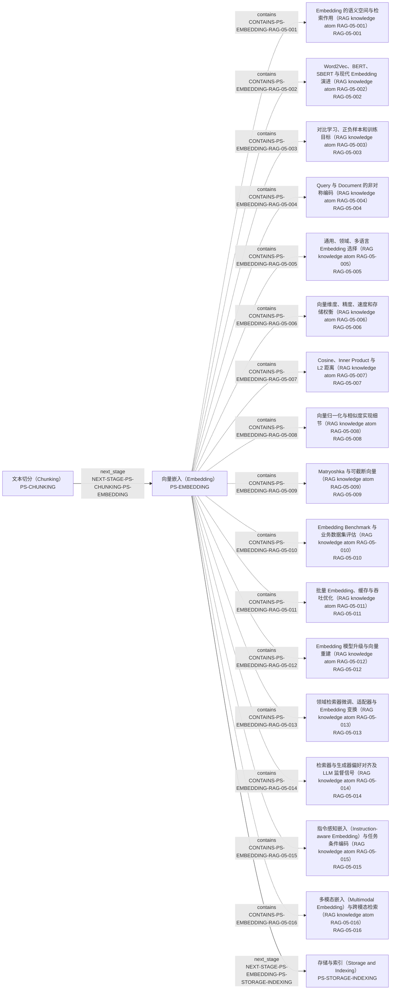

局部节点（Local Nodes）：implementation: `IMP-RAG-0001`, `IMP-RAG-0005`, `IMP-RAG-0006`; knowledge: `RAG-05-001`, `RAG-05-002`, `RAG-05-003`, `RAG-05-004`, `RAG-05-005`, `RAG-05-006`, `RAG-05-007`, `RAG-05-008`, `RAG-05-009`, `RAG-05-010`, `RAG-05-011`, `RAG-05-012`, `RAG-05-013`, `RAG-05-014`, `RAG-05-015`, `RAG-05-016`; pipeline_stage: `PS-CHUNKING`, `PS-EMBEDDING`, `PS-STORAGE-INDEXING`; problem_question: `PQ-RAG-0004`, `PQ-RAG-0012`, `PQ-RAG-0013`, `PQ-RAG-0022`。

| 边 ID | 受控关系 | 起点 | 终点 |
|---|---|---|---|
| `CONTAINS-PS-EMBEDDING-RAG-05-001` | 包含（Contains） `contains` | 向量嵌入（Embedding） [`PS-EMBEDDING`] | Embedding 的语义空间与检索作用（RAG knowledge atom RAG-05-001） [`RAG-05-001`] |
| `CONTAINS-PS-EMBEDDING-RAG-05-002` | 包含（Contains） `contains` | 向量嵌入（Embedding） [`PS-EMBEDDING`] | Word2Vec、BERT、SBERT 与现代 Embedding 演进（RAG knowledge atom RAG-05-002） [`RAG-05-002`] |
| `CONTAINS-PS-EMBEDDING-RAG-05-003` | 包含（Contains） `contains` | 向量嵌入（Embedding） [`PS-EMBEDDING`] | 对比学习、正负样本和训练目标（RAG knowledge atom RAG-05-003） [`RAG-05-003`] |
| `CONTAINS-PS-EMBEDDING-RAG-05-004` | 包含（Contains） `contains` | 向量嵌入（Embedding） [`PS-EMBEDDING`] | Query 与 Document 的非对称编码（RAG knowledge atom RAG-05-004） [`RAG-05-004`] |
| `CONTAINS-PS-EMBEDDING-RAG-05-005` | 包含（Contains） `contains` | 向量嵌入（Embedding） [`PS-EMBEDDING`] | 通用、领域、多语言 Embedding 选择（RAG knowledge atom RAG-05-005） [`RAG-05-005`] |
| `CONTAINS-PS-EMBEDDING-RAG-05-006` | 包含（Contains） `contains` | 向量嵌入（Embedding） [`PS-EMBEDDING`] | 向量维度、精度、速度和存储权衡（RAG knowledge atom RAG-05-006） [`RAG-05-006`] |
| `CONTAINS-PS-EMBEDDING-RAG-05-007` | 包含（Contains） `contains` | 向量嵌入（Embedding） [`PS-EMBEDDING`] | Cosine、Inner Product 与 L2 距离（RAG knowledge atom RAG-05-007） [`RAG-05-007`] |
| `CONTAINS-PS-EMBEDDING-RAG-05-008` | 包含（Contains） `contains` | 向量嵌入（Embedding） [`PS-EMBEDDING`] | 向量归一化与相似度实现细节（RAG knowledge atom RAG-05-008） [`RAG-05-008`] |
| `CONTAINS-PS-EMBEDDING-RAG-05-009` | 包含（Contains） `contains` | 向量嵌入（Embedding） [`PS-EMBEDDING`] | Matryoshka 与可截断向量（RAG knowledge atom RAG-05-009） [`RAG-05-009`] |
| `CONTAINS-PS-EMBEDDING-RAG-05-010` | 包含（Contains） `contains` | 向量嵌入（Embedding） [`PS-EMBEDDING`] | Embedding Benchmark 与业务数据集评估（RAG knowledge atom RAG-05-010） [`RAG-05-010`] |
| `CONTAINS-PS-EMBEDDING-RAG-05-011` | 包含（Contains） `contains` | 向量嵌入（Embedding） [`PS-EMBEDDING`] | 批量 Embedding、缓存与吞吐优化（RAG knowledge atom RAG-05-011） [`RAG-05-011`] |
| `CONTAINS-PS-EMBEDDING-RAG-05-012` | 包含（Contains） `contains` | 向量嵌入（Embedding） [`PS-EMBEDDING`] | Embedding 模型升级与向量重建（RAG knowledge atom RAG-05-012） [`RAG-05-012`] |
| `CONTAINS-PS-EMBEDDING-RAG-05-013` | 包含（Contains） `contains` | 向量嵌入（Embedding） [`PS-EMBEDDING`] | 领域检索器微调、适配器与 Embedding 变换（RAG knowledge atom RAG-05-013） [`RAG-05-013`] |
| `CONTAINS-PS-EMBEDDING-RAG-05-014` | 包含（Contains） `contains` | 向量嵌入（Embedding） [`PS-EMBEDDING`] | 检索器与生成器偏好对齐及 LLM 监督信号（RAG knowledge atom RAG-05-014） [`RAG-05-014`] |
| `CONTAINS-PS-EMBEDDING-RAG-05-015` | 包含（Contains） `contains` | 向量嵌入（Embedding） [`PS-EMBEDDING`] | 指令感知嵌入（Instruction-aware Embedding）与任务条件编码（RAG knowledge atom RAG-05-015） [`RAG-05-015`] |
| `CONTAINS-PS-EMBEDDING-RAG-05-016` | 包含（Contains） `contains` | 向量嵌入（Embedding） [`PS-EMBEDDING`] | 多模态嵌入（Multimodal Embedding）与跨模态检索（RAG knowledge atom RAG-05-016） [`RAG-05-016`] |
| `IMPLEMENTS-IMP-RAG-0001-RAG-05-004` | 实现（Implements） `implements` | VectorRAG 与 FAISS 链路（VectorRAG and FAISS Pipeline） [`IMP-RAG-0001`] | Query 与 Document 的非对称编码（RAG knowledge atom RAG-05-004） [`RAG-05-004`] |
| `IMPLEMENTS-IMP-RAG-0001-RAG-05-008` | 实现（Implements） `implements` | VectorRAG 与 FAISS 链路（VectorRAG and FAISS Pipeline） [`IMP-RAG-0001`] | 向量归一化与相似度实现细节（RAG knowledge atom RAG-05-008） [`RAG-05-008`] |
| `IMPLEMENTS-IMP-RAG-0001-RAG-05-011` | 实现（Implements） `implements` | VectorRAG 与 FAISS 链路（VectorRAG and FAISS Pipeline） [`IMP-RAG-0001`] | 批量 Embedding、缓存与吞吐优化（RAG knowledge atom RAG-05-011） [`RAG-05-011`] |
| `IMPLEMENTS-IMP-RAG-0005-RAG-05-012` | 实现（Implements） `implements` | Qdrant/Azure 索引更新与迁移（Qdrant/Azure Index Updates and Migration） [`IMP-RAG-0005`] | Embedding 模型升级与向量重建（RAG knowledge atom RAG-05-012） [`RAG-05-012`] |
| `IMPLEMENTS-IMP-RAG-0006-RAG-05-004` | 实现（Implements） `implements` | 非对称 Embedding 与 Rerank API（Asymmetric Embedding and Rerank APIs） [`IMP-RAG-0006`] | Query 与 Document 的非对称编码（RAG knowledge atom RAG-05-004） [`RAG-05-004`] |
| `IMPLEMENTS-IMP-RAG-0006-RAG-05-005` | 实现（Implements） `implements` | 非对称 Embedding 与 Rerank API（Asymmetric Embedding and Rerank APIs） [`IMP-RAG-0006`] | 通用、领域、多语言 Embedding 选择（RAG knowledge atom RAG-05-005） [`RAG-05-005`] |
| `IMPLEMENTS-IMP-RAG-0006-RAG-05-006` | 实现（Implements） `implements` | 非对称 Embedding 与 Rerank API（Asymmetric Embedding and Rerank APIs） [`IMP-RAG-0006`] | 向量维度、精度、速度和存储权衡（RAG knowledge atom RAG-05-006） [`RAG-05-006`] |
| `IMPLEMENTS-IMP-RAG-0006-RAG-05-009` | 实现（Implements） `implements` | 非对称 Embedding 与 Rerank API（Asymmetric Embedding and Rerank APIs） [`IMP-RAG-0006`] | Matryoshka 与可截断向量（RAG knowledge atom RAG-05-009） [`RAG-05-009`] |
| `IMPLEMENTS-IMP-RAG-0006-RAG-05-010` | 实现（Implements） `implements` | 非对称 Embedding 与 Rerank API（Asymmetric Embedding and Rerank APIs） [`IMP-RAG-0006`] | Embedding Benchmark 与业务数据集评估（RAG knowledge atom RAG-05-010） [`RAG-05-010`] |
| `IMPLEMENTS-IMP-RAG-0006-RAG-05-011` | 实现（Implements） `implements` | 非对称 Embedding 与 Rerank API（Asymmetric Embedding and Rerank APIs） [`IMP-RAG-0006`] | 批量 Embedding、缓存与吞吐优化（RAG knowledge atom RAG-05-011） [`RAG-05-011`] |
| `IMPLEMENTS-IMP-RAG-0006-RAG-05-012` | 实现（Implements） `implements` | 非对称 Embedding 与 Rerank API（Asymmetric Embedding and Rerank APIs） [`IMP-RAG-0006`] | Embedding 模型升级与向量重建（RAG knowledge atom RAG-05-012） [`RAG-05-012`] |
| `NEXT-STAGE-PS-CHUNKING-PS-EMBEDDING` | 下一阶段（Next Stage） `next_stage` | 文本切分（Chunking） [`PS-CHUNKING`] | 向量嵌入（Embedding） [`PS-EMBEDDING`] |
| `NEXT-STAGE-PS-EMBEDDING-PS-STORAGE-INDEXING` | 下一阶段（Next Stage） `next_stage` | 向量嵌入（Embedding） [`PS-EMBEDDING`] | 存储与索引（Storage and Indexing） [`PS-STORAGE-INDEXING`] |
| `PROBLEM-AT-PQ-RAG-0004-RAG-05-004` | 出现问题于（Problem At） `problem_at` | 补全 Query/Document Embedding、批量建库、FAISS Top-K 检索、ID 映射、上下文生成和准确率记录的完整 VectorRAG 链路。（RAG engineering problem RAG-SCENE-004） [`PQ-RAG-0004`] | Query 与 Document 的非对称编码（RAG knowledge atom RAG-05-004） [`RAG-05-004`] |
| `PROBLEM-AT-PQ-RAG-0004-RAG-05-008` | 出现问题于（Problem At） `problem_at` | 补全 Query/Document Embedding、批量建库、FAISS Top-K 检索、ID 映射、上下文生成和准确率记录的完整 VectorRAG 链路。（RAG engineering problem RAG-SCENE-004） [`PQ-RAG-0004`] | 向量归一化与相似度实现细节（RAG knowledge atom RAG-05-008） [`RAG-05-008`] |
| `PROBLEM-AT-PQ-RAG-0004-RAG-05-011` | 出现问题于（Problem At） `problem_at` | 补全 Query/Document Embedding、批量建库、FAISS Top-K 检索、ID 映射、上下文生成和准确率记录的完整 VectorRAG 链路。（RAG engineering problem RAG-SCENE-004） [`PQ-RAG-0004`] | 批量 Embedding、缓存与吞吐优化（RAG knowledge atom RAG-05-011） [`RAG-05-011`] |
| `PROBLEM-AT-PQ-RAG-0012-RAG-05-004` | 出现问题于（Problem At） `problem_at` | 面对中文、多语言、领域术语和短 Query—长 Document 的非对称检索，如何选择 Embedding 模型，并共同评估效果、维度、吞吐、存储、成本及模型升级重建风险？（RAG engineering problem RAG-SCENE-012） [`PQ-RAG-0012`] | Query 与 Document 的非对称编码（RAG knowledge atom RAG-05-004） [`RAG-05-004`] |
| `PROBLEM-AT-PQ-RAG-0012-RAG-05-005` | 出现问题于（Problem At） `problem_at` | 面对中文、多语言、领域术语和短 Query—长 Document 的非对称检索，如何选择 Embedding 模型，并共同评估效果、维度、吞吐、存储、成本及模型升级重建风险？（RAG engineering problem RAG-SCENE-012） [`PQ-RAG-0012`] | 通用、领域、多语言 Embedding 选择（RAG knowledge atom RAG-05-005） [`RAG-05-005`] |
| `PROBLEM-AT-PQ-RAG-0012-RAG-05-006` | 出现问题于（Problem At） `problem_at` | 面对中文、多语言、领域术语和短 Query—长 Document 的非对称检索，如何选择 Embedding 模型，并共同评估效果、维度、吞吐、存储、成本及模型升级重建风险？（RAG engineering problem RAG-SCENE-012） [`PQ-RAG-0012`] | 向量维度、精度、速度和存储权衡（RAG knowledge atom RAG-05-006） [`RAG-05-006`] |
| `PROBLEM-AT-PQ-RAG-0012-RAG-05-009` | 出现问题于（Problem At） `problem_at` | 面对中文、多语言、领域术语和短 Query—长 Document 的非对称检索，如何选择 Embedding 模型，并共同评估效果、维度、吞吐、存储、成本及模型升级重建风险？（RAG engineering problem RAG-SCENE-012） [`PQ-RAG-0012`] | Matryoshka 与可截断向量（RAG knowledge atom RAG-05-009） [`RAG-05-009`] |
| `PROBLEM-AT-PQ-RAG-0012-RAG-05-010` | 出现问题于（Problem At） `problem_at` | 面对中文、多语言、领域术语和短 Query—长 Document 的非对称检索，如何选择 Embedding 模型，并共同评估效果、维度、吞吐、存储、成本及模型升级重建风险？（RAG engineering problem RAG-SCENE-012） [`PQ-RAG-0012`] | Embedding Benchmark 与业务数据集评估（RAG knowledge atom RAG-05-010） [`RAG-05-010`] |
| `PROBLEM-AT-PQ-RAG-0012-RAG-05-011` | 出现问题于（Problem At） `problem_at` | 面对中文、多语言、领域术语和短 Query—长 Document 的非对称检索，如何选择 Embedding 模型，并共同评估效果、维度、吞吐、存储、成本及模型升级重建风险？（RAG engineering problem RAG-SCENE-012） [`PQ-RAG-0012`] | 批量 Embedding、缓存与吞吐优化（RAG knowledge atom RAG-05-011） [`RAG-05-011`] |
| `PROBLEM-AT-PQ-RAG-0012-RAG-05-012` | 出现问题于（Problem At） `problem_at` | 面对中文、多语言、领域术语和短 Query—长 Document 的非对称检索，如何选择 Embedding 模型，并共同评估效果、维度、吞吐、存储、成本及模型升级重建风险？（RAG engineering problem RAG-SCENE-012） [`PQ-RAG-0012`] | Embedding 模型升级与向量重建（RAG knowledge atom RAG-05-012） [`RAG-05-012`] |
| `PROBLEM-AT-PQ-RAG-0013-RAG-05-012` | 出现问题于（Problem At） `problem_at` | 向量数据库在数据增长、高并发、Metadata 过滤、删除更新和 Embedding 模型升级时，如何选择 Exact、HNSW 或 IVF，定位过滤后召回下降，并完成无停机索引迁移？（RAG engineering problem RAG-SCENE-013） [`PQ-RAG-0013`] | Embedding 模型升级与向量重建（RAG knowledge atom RAG-05-012） [`RAG-05-012`] |
| `PROBLEM-AT-PQ-RAG-0022-RAG-05-012` | 出现问题于（Problem At） `problem_at` | 为大量企业租户设计支持复杂文档、增量更新、文档级权限、检索质量目标和 P99 延迟目标的 RAG 系统时，如何选择索引与隔离方式，规划分片副本、无停机模型迁移、备份恢复和分层评测？（RAG engineering problem RAG-SCENE-022） [`PQ-RAG-0022`] | Embedding 模型升级与向量重建（RAG knowledge atom RAG-05-012） [`RAG-05-012`] |

<a id="ps-storage-indexing"></a>
### 存储与索引（Storage and Indexing） [`PS-STORAGE-INDEXING`]

一跳局部图（One-hop Local Map）含 17 条边；二跳扩展（Two-hop Expansion）含 28 条边。包含的知识节点（Knowledge Node）：`RAG-06-001`, `RAG-06-002`, `RAG-06-003`, `RAG-06-004`, `RAG-06-005`, `RAG-06-006`, `RAG-06-007`, `RAG-06-008`, `RAG-06-009`, `RAG-06-010`, `RAG-06-011`, `RAG-06-012`, `RAG-06-013`, `RAG-06-014`, `RAG-06-015`。

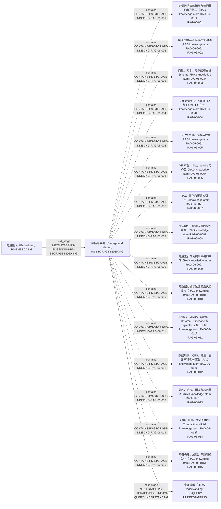

局部节点（Local Nodes）：implementation: `IMP-RAG-0001`, `IMP-RAG-0005`, `IMP-RAG-0006`; knowledge: `RAG-06-001`, `RAG-06-002`, `RAG-06-003`, `RAG-06-004`, `RAG-06-005`, `RAG-06-006`, `RAG-06-007`, `RAG-06-008`, `RAG-06-009`, `RAG-06-010`, `RAG-06-011`, `RAG-06-012`, `RAG-06-013`, `RAG-06-014`, `RAG-06-015`; pipeline_stage: `PS-EMBEDDING`, `PS-QUERY-UNDERSTANDING`, `PS-STORAGE-INDEXING`; problem_question: `PQ-RAG-0003`, `PQ-RAG-0004`, `PQ-RAG-0008`, `PQ-RAG-0009`, `PQ-RAG-0012`, `PQ-RAG-0013`, `PQ-RAG-0022`。

| 边 ID | 受控关系 | 起点 | 终点 |
|---|---|---|---|
| `CONTAINS-PS-STORAGE-INDEXING-RAG-06-001` | 包含（Contains） `contains` | 存储与索引（Storage and Indexing） [`PS-STORAGE-INDEXING`] | 向量数据库的职责与普通数据库的差异（RAG knowledge atom RAG-06-001） [`RAG-06-001`] |
| `CONTAINS-PS-STORAGE-INDEXING-RAG-06-002` | 包含（Contains） `contains` | 存储与索引（Storage and Indexing） [`PS-STORAGE-INDEXING`] | 精确检索与近似最近邻 ANN（RAG knowledge atom RAG-06-002） [`RAG-06-002`] |
| `CONTAINS-PS-STORAGE-INDEXING-RAG-06-003` | 包含（Contains） `contains` | 存储与索引（Storage and Indexing） [`PS-STORAGE-INDEXING`] | 向量、文本、元数据和主键 Schema（RAG knowledge atom RAG-06-003） [`RAG-06-003`] |
| `CONTAINS-PS-STORAGE-INDEXING-RAG-06-004` | 包含（Contains） `contains` | 存储与索引（Storage and Indexing） [`PS-STORAGE-INDEXING`] | Document ID、Chunk ID 与 Parent ID（RAG knowledge atom RAG-06-004） [`RAG-06-004`] |
| `CONTAINS-PS-STORAGE-INDEXING-RAG-06-005` | 包含（Contains） `contains` | 存储与索引（Storage and Indexing） [`PS-STORAGE-INDEXING`] | HNSW 原理、参数与权衡（RAG knowledge atom RAG-06-005） [`RAG-06-005`] |
| `CONTAINS-PS-STORAGE-INDEXING-RAG-06-006` | 包含（Contains） `contains` | 存储与索引（Storage and Indexing） [`PS-STORAGE-INDEXING`] | IVF 原理、nlist、nprobe 与权衡（RAG knowledge atom RAG-06-006） [`RAG-06-006`] |
| `CONTAINS-PS-STORAGE-INDEXING-RAG-06-007` | 包含（Contains） `contains` | 存储与索引（Storage and Indexing） [`PS-STORAGE-INDEXING`] | PQ、量化和压缩索引（RAG knowledge atom RAG-06-007） [`RAG-06-007`] |
| `CONTAINS-PS-STORAGE-INDEXING-RAG-06-008` | 包含（Contains） `contains` | 存储与索引（Storage and Indexing） [`PS-STORAGE-INDEXING`] | 倒排索引、稀疏向量和全文索引（RAG knowledge atom RAG-06-008） [`RAG-06-008`] |
| `CONTAINS-PS-STORAGE-INDEXING-RAG-06-009` | 包含（Contains） `contains` | 存储与索引（Storage and Indexing） [`PS-STORAGE-INDEXING`] | 向量索引与关键词索引的共存（RAG knowledge atom RAG-06-009） [`RAG-06-009`] |
| `CONTAINS-PS-STORAGE-INDEXING-RAG-06-010` | 包含（Contains） `contains` | 存储与索引（Storage and Indexing） [`PS-STORAGE-INDEXING`] | 元数据过滤与过滤前后执行顺序（RAG knowledge atom RAG-06-010） [`RAG-06-010`] |
| `CONTAINS-PS-STORAGE-INDEXING-RAG-06-011` | 包含（Contains） `contains` | 存储与索引（Storage and Indexing） [`PS-STORAGE-INDEXING`] | FAISS、Milvus、Qdrant、Chroma、Pinecone 与 pgvector 选型（RAG knowledge atom RAG-06-011） [`RAG-06-011`] |
| `CONTAINS-PS-STORAGE-INDEXING-RAG-06-012` | 包含（Contains） `contains` | 存储与索引（Storage and Indexing） [`PS-STORAGE-INDEXING`] | 数据规模、QPS、延迟、召回率和成本基准（RAG knowledge atom RAG-06-012） [`RAG-06-012`] |
| `CONTAINS-PS-STORAGE-INDEXING-RAG-06-013` | 包含（Contains） `contains` | 存储与索引（Storage and Indexing） [`PS-STORAGE-INDEXING`] | 分区、分片、副本与冷热数据（RAG knowledge atom RAG-06-013） [`RAG-06-013`] |
| `CONTAINS-PS-STORAGE-INDEXING-RAG-06-014` | 包含（Contains） `contains` | 存储与索引（Storage and Indexing） [`PS-STORAGE-INDEXING`] | 新增、删除、更新和索引 Compaction（RAG knowledge atom RAG-06-014） [`RAG-06-014`] |
| `CONTAINS-PS-STORAGE-INDEXING-RAG-06-015` | 包含（Contains） `contains` | 存储与索引（Storage and Indexing） [`PS-STORAGE-INDEXING`] | 索引构建、加载、预热和持久化（RAG knowledge atom RAG-06-015） [`RAG-06-015`] |
| `IMPLEMENTS-IMP-RAG-0001-RAG-06-003` | 实现（Implements） `implements` | VectorRAG 与 FAISS 链路（VectorRAG and FAISS Pipeline） [`IMP-RAG-0001`] | 向量、文本、元数据和主键 Schema（RAG knowledge atom RAG-06-003） [`RAG-06-003`] |
| `IMPLEMENTS-IMP-RAG-0001-RAG-06-015` | 实现（Implements） `implements` | VectorRAG 与 FAISS 链路（VectorRAG and FAISS Pipeline） [`IMP-RAG-0001`] | 索引构建、加载、预热和持久化（RAG knowledge atom RAG-06-015） [`RAG-06-015`] |
| `IMPLEMENTS-IMP-RAG-0005-RAG-06-001` | 实现（Implements） `implements` | Qdrant/Azure 索引更新与迁移（Qdrant/Azure Index Updates and Migration） [`IMP-RAG-0005`] | 向量数据库的职责与普通数据库的差异（RAG knowledge atom RAG-06-001） [`RAG-06-001`] |
| `IMPLEMENTS-IMP-RAG-0005-RAG-06-002` | 实现（Implements） `implements` | Qdrant/Azure 索引更新与迁移（Qdrant/Azure Index Updates and Migration） [`IMP-RAG-0005`] | 精确检索与近似最近邻 ANN（RAG knowledge atom RAG-06-002） [`RAG-06-002`] |
| `IMPLEMENTS-IMP-RAG-0005-RAG-06-005` | 实现（Implements） `implements` | Qdrant/Azure 索引更新与迁移（Qdrant/Azure Index Updates and Migration） [`IMP-RAG-0005`] | HNSW 原理、参数与权衡（RAG knowledge atom RAG-06-005） [`RAG-06-005`] |
| `IMPLEMENTS-IMP-RAG-0005-RAG-06-006` | 实现（Implements） `implements` | Qdrant/Azure 索引更新与迁移（Qdrant/Azure Index Updates and Migration） [`IMP-RAG-0005`] | IVF 原理、nlist、nprobe 与权衡（RAG knowledge atom RAG-06-006） [`RAG-06-006`] |
| `IMPLEMENTS-IMP-RAG-0005-RAG-06-010` | 实现（Implements） `implements` | Qdrant/Azure 索引更新与迁移（Qdrant/Azure Index Updates and Migration） [`IMP-RAG-0005`] | 元数据过滤与过滤前后执行顺序（RAG knowledge atom RAG-06-010） [`RAG-06-010`] |
| `IMPLEMENTS-IMP-RAG-0005-RAG-06-012` | 实现（Implements） `implements` | Qdrant/Azure 索引更新与迁移（Qdrant/Azure Index Updates and Migration） [`IMP-RAG-0005`] | 数据规模、QPS、延迟、召回率和成本基准（RAG knowledge atom RAG-06-012） [`RAG-06-012`] |
| `IMPLEMENTS-IMP-RAG-0005-RAG-06-013` | 实现（Implements） `implements` | Qdrant/Azure 索引更新与迁移（Qdrant/Azure Index Updates and Migration） [`IMP-RAG-0005`] | 分区、分片、副本与冷热数据（RAG knowledge atom RAG-06-013） [`RAG-06-013`] |
| `IMPLEMENTS-IMP-RAG-0005-RAG-06-014` | 实现（Implements） `implements` | Qdrant/Azure 索引更新与迁移（Qdrant/Azure Index Updates and Migration） [`IMP-RAG-0005`] | 新增、删除、更新和索引 Compaction（RAG knowledge atom RAG-06-014） [`RAG-06-014`] |
| `IMPLEMENTS-IMP-RAG-0006-RAG-06-012` | 实现（Implements） `implements` | 非对称 Embedding 与 Rerank API（Asymmetric Embedding and Rerank APIs） [`IMP-RAG-0006`] | 数据规模、QPS、延迟、召回率和成本基准（RAG knowledge atom RAG-06-012） [`RAG-06-012`] |
| `NEXT-STAGE-PS-EMBEDDING-PS-STORAGE-INDEXING` | 下一阶段（Next Stage） `next_stage` | 向量嵌入（Embedding） [`PS-EMBEDDING`] | 存储与索引（Storage and Indexing） [`PS-STORAGE-INDEXING`] |
| `NEXT-STAGE-PS-STORAGE-INDEXING-PS-QUERY-UNDERSTANDING` | 下一阶段（Next Stage） `next_stage` | 存储与索引（Storage and Indexing） [`PS-STORAGE-INDEXING`] | 查询理解（Query Understanding） [`PS-QUERY-UNDERSTANDING`] |
| `PROBLEM-AT-PQ-RAG-0003-RAG-06-012` | 出现问题于（Problem At） `problem_at` | 面对给定文档量、Chunk 数和固定 Token 长度，如何验证切分参数自洽，并用数据而不是经验值证明选择？（RAG engineering problem RAG-SCENE-003） [`PQ-RAG-0003`] | 数据规模、QPS、延迟、召回率和成本基准（RAG knowledge atom RAG-06-012） [`RAG-06-012`] |
| `PROBLEM-AT-PQ-RAG-0004-RAG-06-003` | 出现问题于（Problem At） `problem_at` | 补全 Query/Document Embedding、批量建库、FAISS Top-K 检索、ID 映射、上下文生成和准确率记录的完整 VectorRAG 链路。（RAG engineering problem RAG-SCENE-004） [`PQ-RAG-0004`] | 向量、文本、元数据和主键 Schema（RAG knowledge atom RAG-06-003） [`RAG-06-003`] |
| `PROBLEM-AT-PQ-RAG-0004-RAG-06-015` | 出现问题于（Problem At） `problem_at` | 补全 Query/Document Embedding、批量建库、FAISS Top-K 检索、ID 映射、上下文生成和准确率记录的完整 VectorRAG 链路。（RAG engineering problem RAG-SCENE-004） [`PQ-RAG-0004`] | 索引构建、加载、预热和持久化（RAG knowledge atom RAG-06-015） [`RAG-06-015`] |
| `PROBLEM-AT-PQ-RAG-0008-RAG-06-014` | 出现问题于（Problem At） `problem_at` | 生产 RAG 面对复杂文档解析、增量索引、多语言检索、延迟、模型升级、缓存、监控和敏感信息权限时，应如何分层定位与治理？（RAG engineering problem RAG-SCENE-008） [`PQ-RAG-0008`] | 新增、删除、更新和索引 Compaction（RAG knowledge atom RAG-06-014） [`RAG-06-014`] |
| `PROBLEM-AT-PQ-RAG-0009-RAG-06-014` | 出现问题于（Problem At） `problem_at` | 向量索引中的文档发生新增、修改和删除时，如何在全量重建、软删除、版本化标识和延迟压缩之间选择，并保证在线一致性与回滚能力？（RAG engineering problem RAG-SCENE-009） [`PQ-RAG-0009`] | 新增、删除、更新和索引 Compaction（RAG knowledge atom RAG-06-014） [`RAG-06-014`] |
| `PROBLEM-AT-PQ-RAG-0012-RAG-06-012` | 出现问题于（Problem At） `problem_at` | 面对中文、多语言、领域术语和短 Query—长 Document 的非对称检索，如何选择 Embedding 模型，并共同评估效果、维度、吞吐、存储、成本及模型升级重建风险？（RAG engineering problem RAG-SCENE-012） [`PQ-RAG-0012`] | 数据规模、QPS、延迟、召回率和成本基准（RAG knowledge atom RAG-06-012） [`RAG-06-012`] |
| `PROBLEM-AT-PQ-RAG-0013-RAG-06-001` | 出现问题于（Problem At） `problem_at` | 向量数据库在数据增长、高并发、Metadata 过滤、删除更新和 Embedding 模型升级时，如何选择 Exact、HNSW 或 IVF，定位过滤后召回下降，并完成无停机索引迁移？（RAG engineering problem RAG-SCENE-013） [`PQ-RAG-0013`] | 向量数据库的职责与普通数据库的差异（RAG knowledge atom RAG-06-001） [`RAG-06-001`] |
| `PROBLEM-AT-PQ-RAG-0013-RAG-06-002` | 出现问题于（Problem At） `problem_at` | 向量数据库在数据增长、高并发、Metadata 过滤、删除更新和 Embedding 模型升级时，如何选择 Exact、HNSW 或 IVF，定位过滤后召回下降，并完成无停机索引迁移？（RAG engineering problem RAG-SCENE-013） [`PQ-RAG-0013`] | 精确检索与近似最近邻 ANN（RAG knowledge atom RAG-06-002） [`RAG-06-002`] |
| `PROBLEM-AT-PQ-RAG-0013-RAG-06-005` | 出现问题于（Problem At） `problem_at` | 向量数据库在数据增长、高并发、Metadata 过滤、删除更新和 Embedding 模型升级时，如何选择 Exact、HNSW 或 IVF，定位过滤后召回下降，并完成无停机索引迁移？（RAG engineering problem RAG-SCENE-013） [`PQ-RAG-0013`] | HNSW 原理、参数与权衡（RAG knowledge atom RAG-06-005） [`RAG-06-005`] |
| `PROBLEM-AT-PQ-RAG-0013-RAG-06-006` | 出现问题于（Problem At） `problem_at` | 向量数据库在数据增长、高并发、Metadata 过滤、删除更新和 Embedding 模型升级时，如何选择 Exact、HNSW 或 IVF，定位过滤后召回下降，并完成无停机索引迁移？（RAG engineering problem RAG-SCENE-013） [`PQ-RAG-0013`] | IVF 原理、nlist、nprobe 与权衡（RAG knowledge atom RAG-06-006） [`RAG-06-006`] |
| `PROBLEM-AT-PQ-RAG-0013-RAG-06-010` | 出现问题于（Problem At） `problem_at` | 向量数据库在数据增长、高并发、Metadata 过滤、删除更新和 Embedding 模型升级时，如何选择 Exact、HNSW 或 IVF，定位过滤后召回下降，并完成无停机索引迁移？（RAG engineering problem RAG-SCENE-013） [`PQ-RAG-0013`] | 元数据过滤与过滤前后执行顺序（RAG knowledge atom RAG-06-010） [`RAG-06-010`] |
| `PROBLEM-AT-PQ-RAG-0013-RAG-06-012` | 出现问题于（Problem At） `problem_at` | 向量数据库在数据增长、高并发、Metadata 过滤、删除更新和 Embedding 模型升级时，如何选择 Exact、HNSW 或 IVF，定位过滤后召回下降，并完成无停机索引迁移？（RAG engineering problem RAG-SCENE-013） [`PQ-RAG-0013`] | 数据规模、QPS、延迟、召回率和成本基准（RAG knowledge atom RAG-06-012） [`RAG-06-012`] |
| `PROBLEM-AT-PQ-RAG-0013-RAG-06-014` | 出现问题于（Problem At） `problem_at` | 向量数据库在数据增长、高并发、Metadata 过滤、删除更新和 Embedding 模型升级时，如何选择 Exact、HNSW 或 IVF，定位过滤后召回下降，并完成无停机索引迁移？（RAG engineering problem RAG-SCENE-013） [`PQ-RAG-0013`] | 新增、删除、更新和索引 Compaction（RAG knowledge atom RAG-06-014） [`RAG-06-014`] |
| `PROBLEM-AT-PQ-RAG-0022-RAG-06-010` | 出现问题于（Problem At） `problem_at` | 为大量企业租户设计支持复杂文档、增量更新、文档级权限、检索质量目标和 P99 延迟目标的 RAG 系统时，如何选择索引与隔离方式，规划分片副本、无停机模型迁移、备份恢复和分层评测？（RAG engineering problem RAG-SCENE-022） [`PQ-RAG-0022`] | 元数据过滤与过滤前后执行顺序（RAG knowledge atom RAG-06-010） [`RAG-06-010`] |
| `PROBLEM-AT-PQ-RAG-0022-RAG-06-012` | 出现问题于（Problem At） `problem_at` | 为大量企业租户设计支持复杂文档、增量更新、文档级权限、检索质量目标和 P99 延迟目标的 RAG 系统时，如何选择索引与隔离方式，规划分片副本、无停机模型迁移、备份恢复和分层评测？（RAG engineering problem RAG-SCENE-022） [`PQ-RAG-0022`] | 数据规模、QPS、延迟、召回率和成本基准（RAG knowledge atom RAG-06-012） [`RAG-06-012`] |
| `PROBLEM-AT-PQ-RAG-0022-RAG-06-013` | 出现问题于（Problem At） `problem_at` | 为大量企业租户设计支持复杂文档、增量更新、文档级权限、检索质量目标和 P99 延迟目标的 RAG 系统时，如何选择索引与隔离方式，规划分片副本、无停机模型迁移、备份恢复和分层评测？（RAG engineering problem RAG-SCENE-022） [`PQ-RAG-0022`] | 分区、分片、副本与冷热数据（RAG knowledge atom RAG-06-013） [`RAG-06-013`] |
| `PROBLEM-AT-PQ-RAG-0022-RAG-06-014` | 出现问题于（Problem At） `problem_at` | 为大量企业租户设计支持复杂文档、增量更新、文档级权限、检索质量目标和 P99 延迟目标的 RAG 系统时，如何选择索引与隔离方式，规划分片副本、无停机模型迁移、备份恢复和分层评测？（RAG engineering problem RAG-SCENE-022） [`PQ-RAG-0022`] | 新增、删除、更新和索引 Compaction（RAG knowledge atom RAG-06-014） [`RAG-06-014`] |

<a id="ps-query-understanding"></a>
### 查询理解（Query Understanding） [`PS-QUERY-UNDERSTANDING`]

一跳局部图（One-hop Local Map）含 14 条边；二跳扩展（Two-hop Expansion）含 25 条边。包含的知识节点（Knowledge Node）：`RAG-07-001`, `RAG-07-002`, `RAG-07-003`, `RAG-07-004`, `RAG-07-005`, `RAG-07-006`, `RAG-07-007`, `RAG-07-008`, `RAG-07-009`, `RAG-07-010`, `RAG-07-011`, `RAG-07-012`。

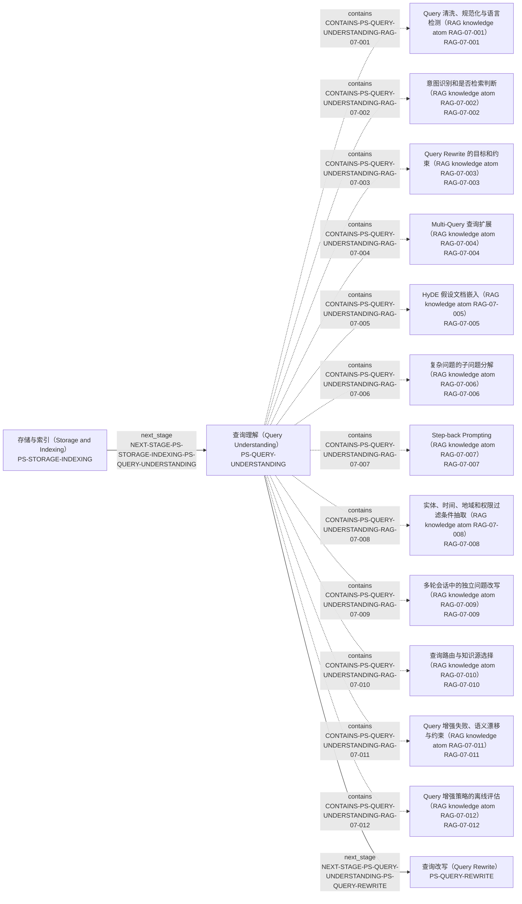

局部节点（Local Nodes）：implementation: `IMP-RAG-0002`; knowledge: `RAG-07-001`, `RAG-07-002`, `RAG-07-003`, `RAG-07-004`, `RAG-07-005`, `RAG-07-006`, `RAG-07-007`, `RAG-07-008`, `RAG-07-009`, `RAG-07-010`, `RAG-07-011`, `RAG-07-012`; pipeline_stage: `PS-QUERY-REWRITE`, `PS-QUERY-UNDERSTANDING`, `PS-STORAGE-INDEXING`; problem_question: `PQ-RAG-0014`, `PQ-RAG-0015`, `PQ-RAG-0016`。

| 边 ID | 受控关系 | 起点 | 终点 |
|---|---|---|---|
| `CONTAINS-PS-QUERY-UNDERSTANDING-RAG-07-001` | 包含（Contains） `contains` | 查询理解（Query Understanding） [`PS-QUERY-UNDERSTANDING`] | Query 清洗、规范化与语言检测（RAG knowledge atom RAG-07-001） [`RAG-07-001`] |
| `CONTAINS-PS-QUERY-UNDERSTANDING-RAG-07-002` | 包含（Contains） `contains` | 查询理解（Query Understanding） [`PS-QUERY-UNDERSTANDING`] | 意图识别和是否检索判断（RAG knowledge atom RAG-07-002） [`RAG-07-002`] |
| `CONTAINS-PS-QUERY-UNDERSTANDING-RAG-07-003` | 包含（Contains） `contains` | 查询理解（Query Understanding） [`PS-QUERY-UNDERSTANDING`] | Query Rewrite 的目标和约束（RAG knowledge atom RAG-07-003） [`RAG-07-003`] |
| `CONTAINS-PS-QUERY-UNDERSTANDING-RAG-07-004` | 包含（Contains） `contains` | 查询理解（Query Understanding） [`PS-QUERY-UNDERSTANDING`] | Multi-Query 查询扩展（RAG knowledge atom RAG-07-004） [`RAG-07-004`] |
| `CONTAINS-PS-QUERY-UNDERSTANDING-RAG-07-005` | 包含（Contains） `contains` | 查询理解（Query Understanding） [`PS-QUERY-UNDERSTANDING`] | HyDE 假设文档嵌入（RAG knowledge atom RAG-07-005） [`RAG-07-005`] |
| `CONTAINS-PS-QUERY-UNDERSTANDING-RAG-07-006` | 包含（Contains） `contains` | 查询理解（Query Understanding） [`PS-QUERY-UNDERSTANDING`] | 复杂问题的子问题分解（RAG knowledge atom RAG-07-006） [`RAG-07-006`] |
| `CONTAINS-PS-QUERY-UNDERSTANDING-RAG-07-007` | 包含（Contains） `contains` | 查询理解（Query Understanding） [`PS-QUERY-UNDERSTANDING`] | Step-back Prompting（RAG knowledge atom RAG-07-007） [`RAG-07-007`] |
| `CONTAINS-PS-QUERY-UNDERSTANDING-RAG-07-008` | 包含（Contains） `contains` | 查询理解（Query Understanding） [`PS-QUERY-UNDERSTANDING`] | 实体、时间、地域和权限过滤条件抽取（RAG knowledge atom RAG-07-008） [`RAG-07-008`] |
| `CONTAINS-PS-QUERY-UNDERSTANDING-RAG-07-009` | 包含（Contains） `contains` | 查询理解（Query Understanding） [`PS-QUERY-UNDERSTANDING`] | 多轮会话中的独立问题改写（RAG knowledge atom RAG-07-009） [`RAG-07-009`] |
| `CONTAINS-PS-QUERY-UNDERSTANDING-RAG-07-010` | 包含（Contains） `contains` | 查询理解（Query Understanding） [`PS-QUERY-UNDERSTANDING`] | 查询路由与知识源选择（RAG knowledge atom RAG-07-010） [`RAG-07-010`] |
| `CONTAINS-PS-QUERY-UNDERSTANDING-RAG-07-011` | 包含（Contains） `contains` | 查询理解（Query Understanding） [`PS-QUERY-UNDERSTANDING`] | Query 增强失败、语义漂移与约束（RAG knowledge atom RAG-07-011） [`RAG-07-011`] |
| `CONTAINS-PS-QUERY-UNDERSTANDING-RAG-07-012` | 包含（Contains） `contains` | 查询理解（Query Understanding） [`PS-QUERY-UNDERSTANDING`] | Query 增强策略的离线评估（RAG knowledge atom RAG-07-012） [`RAG-07-012`] |
| `IMPLEMENTS-IMP-RAG-0002-RAG-07-003` | 实现（Implements） `implements` | LangChain MultiQueryRetriever（LangChain MultiQueryRetriever） [`IMP-RAG-0002`] | Query Rewrite 的目标和约束（RAG knowledge atom RAG-07-003） [`RAG-07-003`] |
| `IMPLEMENTS-IMP-RAG-0002-RAG-07-004` | 实现（Implements） `implements` | LangChain MultiQueryRetriever（LangChain MultiQueryRetriever） [`IMP-RAG-0002`] | Multi-Query 查询扩展（RAG knowledge atom RAG-07-004） [`RAG-07-004`] |
| `IMPLEMENTS-IMP-RAG-0002-RAG-07-005` | 实现（Implements） `implements` | LangChain MultiQueryRetriever（LangChain MultiQueryRetriever） [`IMP-RAG-0002`] | HyDE 假设文档嵌入（RAG knowledge atom RAG-07-005） [`RAG-07-005`] |
| `IMPLEMENTS-IMP-RAG-0002-RAG-07-006` | 实现（Implements） `implements` | LangChain MultiQueryRetriever（LangChain MultiQueryRetriever） [`IMP-RAG-0002`] | 复杂问题的子问题分解（RAG knowledge atom RAG-07-006） [`RAG-07-006`] |
| `IMPLEMENTS-IMP-RAG-0002-RAG-07-007` | 实现（Implements） `implements` | LangChain MultiQueryRetriever（LangChain MultiQueryRetriever） [`IMP-RAG-0002`] | Step-back Prompting（RAG knowledge atom RAG-07-007） [`RAG-07-007`] |
| `IMPLEMENTS-IMP-RAG-0002-RAG-07-009` | 实现（Implements） `implements` | LangChain MultiQueryRetriever（LangChain MultiQueryRetriever） [`IMP-RAG-0002`] | 多轮会话中的独立问题改写（RAG knowledge atom RAG-07-009） [`RAG-07-009`] |
| `IMPLEMENTS-IMP-RAG-0002-RAG-07-011` | 实现（Implements） `implements` | LangChain MultiQueryRetriever（LangChain MultiQueryRetriever） [`IMP-RAG-0002`] | Query 增强失败、语义漂移与约束（RAG knowledge atom RAG-07-011） [`RAG-07-011`] |
| `IMPLEMENTS-IMP-RAG-0002-RAG-07-012` | 实现（Implements） `implements` | LangChain MultiQueryRetriever（LangChain MultiQueryRetriever） [`IMP-RAG-0002`] | Query 增强策略的离线评估（RAG knowledge atom RAG-07-012） [`RAG-07-012`] |
| `NEXT-STAGE-PS-QUERY-UNDERSTANDING-PS-QUERY-REWRITE` | 下一阶段（Next Stage） `next_stage` | 查询理解（Query Understanding） [`PS-QUERY-UNDERSTANDING`] | 查询改写（Query Rewrite） [`PS-QUERY-REWRITE`] |
| `NEXT-STAGE-PS-STORAGE-INDEXING-PS-QUERY-UNDERSTANDING` | 下一阶段（Next Stage） `next_stage` | 存储与索引（Storage and Indexing） [`PS-STORAGE-INDEXING`] | 查询理解（Query Understanding） [`PS-QUERY-UNDERSTANDING`] |
| `PROBLEM-AT-PQ-RAG-0014-RAG-07-001` | 出现问题于（Problem At） `problem_at` | 线上存在复合意图、表达省略、地域歧义和新业务类型时，如何证明规则与模型的意图识别覆盖真实流量，并用影子对比、拒识和错误路由样本发现盲区？（RAG engineering problem RAG-SCENE-014） [`PQ-RAG-0014`] | Query 清洗、规范化与语言检测（RAG knowledge atom RAG-07-001） [`RAG-07-001`] |
| `PROBLEM-AT-PQ-RAG-0014-RAG-07-002` | 出现问题于（Problem At） `problem_at` | 线上存在复合意图、表达省略、地域歧义和新业务类型时，如何证明规则与模型的意图识别覆盖真实流量，并用影子对比、拒识和错误路由样本发现盲区？（RAG engineering problem RAG-SCENE-014） [`PQ-RAG-0014`] | 意图识别和是否检索判断（RAG knowledge atom RAG-07-002） [`RAG-07-002`] |
| `PROBLEM-AT-PQ-RAG-0014-RAG-07-008` | 出现问题于（Problem At） `problem_at` | 线上存在复合意图、表达省略、地域歧义和新业务类型时，如何证明规则与模型的意图识别覆盖真实流量，并用影子对比、拒识和错误路由样本发现盲区？（RAG engineering problem RAG-SCENE-014） [`PQ-RAG-0014`] | 实体、时间、地域和权限过滤条件抽取（RAG knowledge atom RAG-07-008） [`RAG-07-008`] |
| `PROBLEM-AT-PQ-RAG-0014-RAG-07-010` | 出现问题于（Problem At） `problem_at` | 线上存在复合意图、表达省略、地域歧义和新业务类型时，如何证明规则与模型的意图识别覆盖真实流量，并用影子对比、拒识和错误路由样本发现盲区？（RAG engineering problem RAG-SCENE-014） [`PQ-RAG-0014`] | 查询路由与知识源选择（RAG knowledge atom RAG-07-010） [`RAG-07-010`] |
| `PROBLEM-AT-PQ-RAG-0014-RAG-07-011` | 出现问题于（Problem At） `problem_at` | 线上存在复合意图、表达省略、地域歧义和新业务类型时，如何证明规则与模型的意图识别覆盖真实流量，并用影子对比、拒识和错误路由样本发现盲区？（RAG engineering problem RAG-SCENE-014） [`PQ-RAG-0014`] | Query 增强失败、语义漂移与约束（RAG knowledge atom RAG-07-011） [`RAG-07-011`] |
| `PROBLEM-AT-PQ-RAG-0014-RAG-07-012` | 出现问题于（Problem At） `problem_at` | 线上存在复合意图、表达省略、地域歧义和新业务类型时，如何证明规则与模型的意图识别覆盖真实流量，并用影子对比、拒识和错误路由样本发现盲区？（RAG engineering problem RAG-SCENE-014） [`PQ-RAG-0014`] | Query 增强策略的离线评估（RAG knowledge atom RAG-07-012） [`RAG-07-012`] |
| `PROBLEM-AT-PQ-RAG-0015-RAG-07-003` | 出现问题于（Problem At） `problem_at` | 长尾 Query 召回低时，如何在 Multi-Query、HyDE、子问题分解、会话改写和 Step-back Prompting 之间选择，并防止专有名词丢失、语义漂移、噪声放大及延迟失控？（RAG engineering problem RAG-SCENE-015） [`PQ-RAG-0015`] | Query Rewrite 的目标和约束（RAG knowledge atom RAG-07-003） [`RAG-07-003`] |
| `PROBLEM-AT-PQ-RAG-0015-RAG-07-004` | 出现问题于（Problem At） `problem_at` | 长尾 Query 召回低时，如何在 Multi-Query、HyDE、子问题分解、会话改写和 Step-back Prompting 之间选择，并防止专有名词丢失、语义漂移、噪声放大及延迟失控？（RAG engineering problem RAG-SCENE-015） [`PQ-RAG-0015`] | Multi-Query 查询扩展（RAG knowledge atom RAG-07-004） [`RAG-07-004`] |
| `PROBLEM-AT-PQ-RAG-0015-RAG-07-005` | 出现问题于（Problem At） `problem_at` | 长尾 Query 召回低时，如何在 Multi-Query、HyDE、子问题分解、会话改写和 Step-back Prompting 之间选择，并防止专有名词丢失、语义漂移、噪声放大及延迟失控？（RAG engineering problem RAG-SCENE-015） [`PQ-RAG-0015`] | HyDE 假设文档嵌入（RAG knowledge atom RAG-07-005） [`RAG-07-005`] |
| `PROBLEM-AT-PQ-RAG-0015-RAG-07-006` | 出现问题于（Problem At） `problem_at` | 长尾 Query 召回低时，如何在 Multi-Query、HyDE、子问题分解、会话改写和 Step-back Prompting 之间选择，并防止专有名词丢失、语义漂移、噪声放大及延迟失控？（RAG engineering problem RAG-SCENE-015） [`PQ-RAG-0015`] | 复杂问题的子问题分解（RAG knowledge atom RAG-07-006） [`RAG-07-006`] |
| `PROBLEM-AT-PQ-RAG-0015-RAG-07-007` | 出现问题于（Problem At） `problem_at` | 长尾 Query 召回低时，如何在 Multi-Query、HyDE、子问题分解、会话改写和 Step-back Prompting 之间选择，并防止专有名词丢失、语义漂移、噪声放大及延迟失控？（RAG engineering problem RAG-SCENE-015） [`PQ-RAG-0015`] | Step-back Prompting（RAG knowledge atom RAG-07-007） [`RAG-07-007`] |
| `PROBLEM-AT-PQ-RAG-0015-RAG-07-009` | 出现问题于（Problem At） `problem_at` | 长尾 Query 召回低时，如何在 Multi-Query、HyDE、子问题分解、会话改写和 Step-back Prompting 之间选择，并防止专有名词丢失、语义漂移、噪声放大及延迟失控？（RAG engineering problem RAG-SCENE-015） [`PQ-RAG-0015`] | 多轮会话中的独立问题改写（RAG knowledge atom RAG-07-009） [`RAG-07-009`] |
| `PROBLEM-AT-PQ-RAG-0015-RAG-07-011` | 出现问题于（Problem At） `problem_at` | 长尾 Query 召回低时，如何在 Multi-Query、HyDE、子问题分解、会话改写和 Step-back Prompting 之间选择，并防止专有名词丢失、语义漂移、噪声放大及延迟失控？（RAG engineering problem RAG-SCENE-015） [`PQ-RAG-0015`] | Query 增强失败、语义漂移与约束（RAG knowledge atom RAG-07-011） [`RAG-07-011`] |
| `PROBLEM-AT-PQ-RAG-0015-RAG-07-012` | 出现问题于（Problem At） `problem_at` | 长尾 Query 召回低时，如何在 Multi-Query、HyDE、子问题分解、会话改写和 Step-back Prompting 之间选择，并防止专有名词丢失、语义漂移、噪声放大及延迟失控？（RAG engineering problem RAG-SCENE-015） [`PQ-RAG-0015`] | Query 增强策略的离线评估（RAG knowledge atom RAG-07-012） [`RAG-07-012`] |
| `PROBLEM-AT-PQ-RAG-0016-RAG-07-002` | 出现问题于（Problem At） `problem_at` | 一个请求什么时候无需检索、只需单次检索、需要多次检索或应路由到外部工具，如何设计置信度、成本预算、降级和错误路由评估？（RAG engineering problem RAG-SCENE-016） [`PQ-RAG-0016`] | 意图识别和是否检索判断（RAG knowledge atom RAG-07-002） [`RAG-07-002`] |
| `PROBLEM-AT-PQ-RAG-0016-RAG-07-010` | 出现问题于（Problem At） `problem_at` | 一个请求什么时候无需检索、只需单次检索、需要多次检索或应路由到外部工具，如何设计置信度、成本预算、降级和错误路由评估？（RAG engineering problem RAG-SCENE-016） [`PQ-RAG-0016`] | 查询路由与知识源选择（RAG knowledge atom RAG-07-010） [`RAG-07-010`] |
| `PROBLEM-AT-PQ-RAG-0016-RAG-07-012` | 出现问题于（Problem At） `problem_at` | 一个请求什么时候无需检索、只需单次检索、需要多次检索或应路由到外部工具，如何设计置信度、成本预算、降级和错误路由评估？（RAG engineering problem RAG-SCENE-016） [`PQ-RAG-0016`] | Query 增强策略的离线评估（RAG knowledge atom RAG-07-012） [`RAG-07-012`] |

<a id="ps-query-rewrite"></a>
### 查询改写（Query Rewrite） [`PS-QUERY-REWRITE`]

一跳局部图（One-hop Local Map）含 2 条边；二跳扩展（Two-hop Expansion）含 0 条边。包含的知识节点（Knowledge Node）：无。

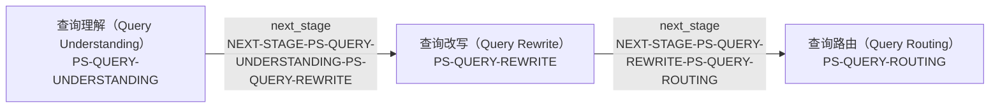

局部节点（Local Nodes）：pipeline_stage: `PS-QUERY-REWRITE`, `PS-QUERY-ROUTING`, `PS-QUERY-UNDERSTANDING`。

| 边 ID | 受控关系 | 起点 | 终点 |
|---|---|---|---|
| `NEXT-STAGE-PS-QUERY-REWRITE-PS-QUERY-ROUTING` | 下一阶段（Next Stage） `next_stage` | 查询改写（Query Rewrite） [`PS-QUERY-REWRITE`] | 查询路由（Query Routing） [`PS-QUERY-ROUTING`] |
| `NEXT-STAGE-PS-QUERY-UNDERSTANDING-PS-QUERY-REWRITE` | 下一阶段（Next Stage） `next_stage` | 查询理解（Query Understanding） [`PS-QUERY-UNDERSTANDING`] | 查询改写（Query Rewrite） [`PS-QUERY-REWRITE`] |

<a id="ps-query-routing"></a>
### 查询路由（Query Routing） [`PS-QUERY-ROUTING`]

一跳局部图（One-hop Local Map）含 3 条边；二跳扩展（Two-hop Expansion）含 0 条边。包含的知识节点（Knowledge Node）：无。

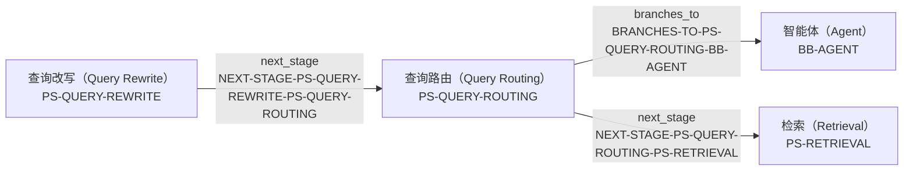

局部节点（Local Nodes）：backbone: `BB-AGENT`; pipeline_stage: `PS-QUERY-REWRITE`, `PS-QUERY-ROUTING`, `PS-RETRIEVAL`。

| 边 ID | 受控关系 | 起点 | 终点 |
|---|---|---|---|
| `BRANCHES-TO-PS-QUERY-ROUTING-BB-AGENT` | 分支到（Branches To） `branches_to` | 查询路由（Query Routing） [`PS-QUERY-ROUTING`] | 智能体（Agent） [`BB-AGENT`] |
| `NEXT-STAGE-PS-QUERY-REWRITE-PS-QUERY-ROUTING` | 下一阶段（Next Stage） `next_stage` | 查询改写（Query Rewrite） [`PS-QUERY-REWRITE`] | 查询路由（Query Routing） [`PS-QUERY-ROUTING`] |
| `NEXT-STAGE-PS-QUERY-ROUTING-PS-RETRIEVAL` | 下一阶段（Next Stage） `next_stage` | 查询路由（Query Routing） [`PS-QUERY-ROUTING`] | 检索（Retrieval） [`PS-RETRIEVAL`] |

<a id="ps-retrieval"></a>
### 检索（Retrieval） [`PS-RETRIEVAL`]

一跳局部图（One-hop Local Map）含 19 条边；二跳扩展（Two-hop Expansion）含 56 条边。包含的知识节点（Knowledge Node）：`RAG-08-001`, `RAG-08-002`, `RAG-08-003`, `RAG-08-004`, `RAG-08-005`, `RAG-08-006`, `RAG-08-007`, `RAG-08-008`, `RAG-08-009`, `RAG-08-010`, `RAG-08-011`, `RAG-08-012`, `RAG-08-013`, `RAG-08-014`, `RAG-08-015`, `RAG-08-016`。

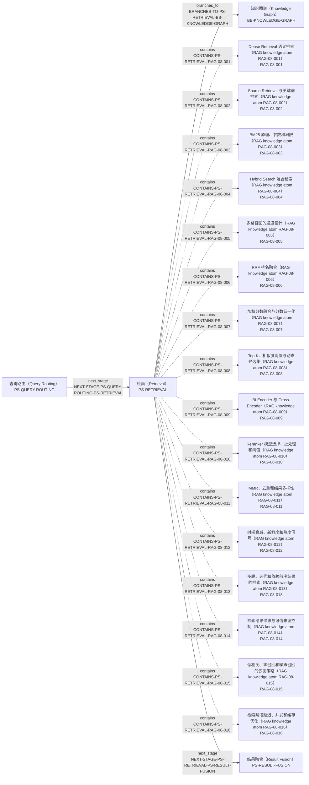

局部节点（Local Nodes）：backbone: `BB-KNOWLEDGE-GRAPH`; implementation: `IMP-RAG-0001`, `IMP-RAG-0002`, `IMP-RAG-0003`, `IMP-RAG-0004`, `IMP-RAG-0006`; knowledge: `RAG-08-001`, `RAG-08-002`, `RAG-08-003`, `RAG-08-004`, `RAG-08-005`, `RAG-08-006`, `RAG-08-007`, `RAG-08-008`, `RAG-08-009`, `RAG-08-010`, `RAG-08-011`, `RAG-08-012`, `RAG-08-013`, `RAG-08-014`, `RAG-08-015`, `RAG-08-016`; pipeline_stage: `PS-QUERY-ROUTING`, `PS-RESULT-FUSION`, `PS-RETRIEVAL`; problem_question: `PQ-RAG-0002`, `PQ-RAG-0004`, `PQ-RAG-0005`, `PQ-RAG-0015`, `PQ-RAG-0016`, `PQ-RAG-0017`, `PQ-RAG-0018`, `PQ-RAG-0019`, `PQ-RAG-0023`, `PQ-RAG-0024`。

| 边 ID | 受控关系 | 起点 | 终点 |
|---|---|---|---|
| `BRANCHES-TO-PS-RETRIEVAL-BB-KNOWLEDGE-GRAPH` | 分支到（Branches To） `branches_to` | 检索（Retrieval） [`PS-RETRIEVAL`] | 知识图谱（Knowledge Graph） [`BB-KNOWLEDGE-GRAPH`] |
| `CONTAINS-PS-RETRIEVAL-RAG-08-001` | 包含（Contains） `contains` | 检索（Retrieval） [`PS-RETRIEVAL`] | Dense Retrieval 语义检索（RAG knowledge atom RAG-08-001） [`RAG-08-001`] |
| `CONTAINS-PS-RETRIEVAL-RAG-08-002` | 包含（Contains） `contains` | 检索（Retrieval） [`PS-RETRIEVAL`] | Sparse Retrieval 与关键词检索（RAG knowledge atom RAG-08-002） [`RAG-08-002`] |
| `CONTAINS-PS-RETRIEVAL-RAG-08-003` | 包含（Contains） `contains` | 检索（Retrieval） [`PS-RETRIEVAL`] | BM25 原理、参数和局限（RAG knowledge atom RAG-08-003） [`RAG-08-003`] |
| `CONTAINS-PS-RETRIEVAL-RAG-08-004` | 包含（Contains） `contains` | 检索（Retrieval） [`PS-RETRIEVAL`] | Hybrid Search 混合检索（RAG knowledge atom RAG-08-004） [`RAG-08-004`] |
| `CONTAINS-PS-RETRIEVAL-RAG-08-005` | 包含（Contains） `contains` | 检索（Retrieval） [`PS-RETRIEVAL`] | 多路召回的通道设计（RAG knowledge atom RAG-08-005） [`RAG-08-005`] |
| `CONTAINS-PS-RETRIEVAL-RAG-08-006` | 包含（Contains） `contains` | 检索（Retrieval） [`PS-RETRIEVAL`] | RRF 排名融合（RAG knowledge atom RAG-08-006） [`RAG-08-006`] |
| `CONTAINS-PS-RETRIEVAL-RAG-08-007` | 包含（Contains） `contains` | 检索（Retrieval） [`PS-RETRIEVAL`] | 加权分数融合与分数归一化（RAG knowledge atom RAG-08-007） [`RAG-08-007`] |
| `CONTAINS-PS-RETRIEVAL-RAG-08-008` | 包含（Contains） `contains` | 检索（Retrieval） [`PS-RETRIEVAL`] | Top-K、相似度阈值与动态候选集（RAG knowledge atom RAG-08-008） [`RAG-08-008`] |
| `CONTAINS-PS-RETRIEVAL-RAG-08-009` | 包含（Contains） `contains` | 检索（Retrieval） [`PS-RETRIEVAL`] | Bi-Encoder 与 Cross-Encoder（RAG knowledge atom RAG-08-009） [`RAG-08-009`] |
| `CONTAINS-PS-RETRIEVAL-RAG-08-010` | 包含（Contains） `contains` | 检索（Retrieval） [`PS-RETRIEVAL`] | Reranker 模型选择、批处理和阈值（RAG knowledge atom RAG-08-010） [`RAG-08-010`] |
| `CONTAINS-PS-RETRIEVAL-RAG-08-011` | 包含（Contains） `contains` | 检索（Retrieval） [`PS-RETRIEVAL`] | MMR、去重和结果多样性（RAG knowledge atom RAG-08-011） [`RAG-08-011`] |
| `CONTAINS-PS-RETRIEVAL-RAG-08-012` | 包含（Contains） `contains` | 检索（Retrieval） [`PS-RETRIEVAL`] | 时间衰减、新鲜度和热度信号（RAG knowledge atom RAG-08-012） [`RAG-08-012`] |
| `CONTAINS-PS-RETRIEVAL-RAG-08-013` | 包含（Contains） `contains` | 检索（Retrieval） [`PS-RETRIEVAL`] | 多跳、迭代和依赖前序结果的检索（RAG knowledge atom RAG-08-013） [`RAG-08-013`] |
| `CONTAINS-PS-RETRIEVAL-RAG-08-014` | 包含（Contains） `contains` | 检索（Retrieval） [`PS-RETRIEVAL`] | 检索结果过滤与可信来源控制（RAG knowledge atom RAG-08-014） [`RAG-08-014`] |
| `CONTAINS-PS-RETRIEVAL-RAG-08-015` | 包含（Contains） `contains` | 检索（Retrieval） [`PS-RETRIEVAL`] | 低相关、零召回和噪声召回的恢复策略（RAG knowledge atom RAG-08-015） [`RAG-08-015`] |
| `CONTAINS-PS-RETRIEVAL-RAG-08-016` | 包含（Contains） `contains` | 检索（Retrieval） [`PS-RETRIEVAL`] | 检索阶段延迟、并发和缓存优化（RAG knowledge atom RAG-08-016） [`RAG-08-016`] |
| `IMPLEMENTS-IMP-RAG-0001-RAG-08-008` | 实现（Implements） `implements` | VectorRAG 与 FAISS 链路（VectorRAG and FAISS Pipeline） [`IMP-RAG-0001`] | Top-K、相似度阈值与动态候选集（RAG knowledge atom RAG-08-008） [`RAG-08-008`] |
| `IMPLEMENTS-IMP-RAG-0001-RAG-08-013` | 实现（Implements） `implements` | VectorRAG 与 FAISS 链路（VectorRAG and FAISS Pipeline） [`IMP-RAG-0001`] | 多跳、迭代和依赖前序结果的检索（RAG knowledge atom RAG-08-013） [`RAG-08-013`] |
| `IMPLEMENTS-IMP-RAG-0002-RAG-08-001` | 实现（Implements） `implements` | LangChain MultiQueryRetriever（LangChain MultiQueryRetriever） [`IMP-RAG-0002`] | Dense Retrieval 语义检索（RAG knowledge atom RAG-08-001） [`RAG-08-001`] |
| `IMPLEMENTS-IMP-RAG-0002-RAG-08-002` | 实现（Implements） `implements` | LangChain MultiQueryRetriever（LangChain MultiQueryRetriever） [`IMP-RAG-0002`] | Sparse Retrieval 与关键词检索（RAG knowledge atom RAG-08-002） [`RAG-08-002`] |
| `IMPLEMENTS-IMP-RAG-0002-RAG-08-003` | 实现（Implements） `implements` | LangChain MultiQueryRetriever（LangChain MultiQueryRetriever） [`IMP-RAG-0002`] | BM25 原理、参数和局限（RAG knowledge atom RAG-08-003） [`RAG-08-003`] |
| `IMPLEMENTS-IMP-RAG-0002-RAG-08-004` | 实现（Implements） `implements` | LangChain MultiQueryRetriever（LangChain MultiQueryRetriever） [`IMP-RAG-0002`] | Hybrid Search 混合检索（RAG knowledge atom RAG-08-004） [`RAG-08-004`] |
| `IMPLEMENTS-IMP-RAG-0002-RAG-08-005` | 实现（Implements） `implements` | LangChain MultiQueryRetriever（LangChain MultiQueryRetriever） [`IMP-RAG-0002`] | 多路召回的通道设计（RAG knowledge atom RAG-08-005） [`RAG-08-005`] |
| `IMPLEMENTS-IMP-RAG-0002-RAG-08-008` | 实现（Implements） `implements` | LangChain MultiQueryRetriever（LangChain MultiQueryRetriever） [`IMP-RAG-0002`] | Top-K、相似度阈值与动态候选集（RAG knowledge atom RAG-08-008） [`RAG-08-008`] |
| `IMPLEMENTS-IMP-RAG-0002-RAG-08-011` | 实现（Implements） `implements` | LangChain MultiQueryRetriever（LangChain MultiQueryRetriever） [`IMP-RAG-0002`] | MMR、去重和结果多样性（RAG knowledge atom RAG-08-011） [`RAG-08-011`] |
| `IMPLEMENTS-IMP-RAG-0002-RAG-08-014` | 实现（Implements） `implements` | LangChain MultiQueryRetriever（LangChain MultiQueryRetriever） [`IMP-RAG-0002`] | 检索结果过滤与可信来源控制（RAG knowledge atom RAG-08-014） [`RAG-08-014`] |
| `IMPLEMENTS-IMP-RAG-0002-RAG-08-015` | 实现（Implements） `implements` | LangChain MultiQueryRetriever（LangChain MultiQueryRetriever） [`IMP-RAG-0002`] | 低相关、零召回和噪声召回的恢复策略（RAG knowledge atom RAG-08-015） [`RAG-08-015`] |
| `IMPLEMENTS-IMP-RAG-0003-RAG-08-004` | 实现（Implements） `implements` | LlamaIndex QueryFusionRetriever（LlamaIndex QueryFusionRetriever） [`IMP-RAG-0003`] | Hybrid Search 混合检索（RAG knowledge atom RAG-08-004） [`RAG-08-004`] |
| `IMPLEMENTS-IMP-RAG-0003-RAG-08-005` | 实现（Implements） `implements` | LlamaIndex QueryFusionRetriever（LlamaIndex QueryFusionRetriever） [`IMP-RAG-0003`] | 多路召回的通道设计（RAG knowledge atom RAG-08-005） [`RAG-08-005`] |
| `IMPLEMENTS-IMP-RAG-0003-RAG-08-006` | 实现（Implements） `implements` | LlamaIndex QueryFusionRetriever（LlamaIndex QueryFusionRetriever） [`IMP-RAG-0003`] | RRF 排名融合（RAG knowledge atom RAG-08-006） [`RAG-08-006`] |
| `IMPLEMENTS-IMP-RAG-0003-RAG-08-007` | 实现（Implements） `implements` | LlamaIndex QueryFusionRetriever（LlamaIndex QueryFusionRetriever） [`IMP-RAG-0003`] | 加权分数融合与分数归一化（RAG knowledge atom RAG-08-007） [`RAG-08-007`] |
| `IMPLEMENTS-IMP-RAG-0003-RAG-08-008` | 实现（Implements） `implements` | LlamaIndex QueryFusionRetriever（LlamaIndex QueryFusionRetriever） [`IMP-RAG-0003`] | Top-K、相似度阈值与动态候选集（RAG knowledge atom RAG-08-008） [`RAG-08-008`] |
| `IMPLEMENTS-IMP-RAG-0003-RAG-08-009` | 实现（Implements） `implements` | LlamaIndex QueryFusionRetriever（LlamaIndex QueryFusionRetriever） [`IMP-RAG-0003`] | Bi-Encoder 与 Cross-Encoder（RAG knowledge atom RAG-08-009） [`RAG-08-009`] |
| `IMPLEMENTS-IMP-RAG-0003-RAG-08-010` | 实现（Implements） `implements` | LlamaIndex QueryFusionRetriever（LlamaIndex QueryFusionRetriever） [`IMP-RAG-0003`] | Reranker 模型选择、批处理和阈值（RAG knowledge atom RAG-08-010） [`RAG-08-010`] |
| `IMPLEMENTS-IMP-RAG-0003-RAG-08-011` | 实现（Implements） `implements` | LlamaIndex QueryFusionRetriever（LlamaIndex QueryFusionRetriever） [`IMP-RAG-0003`] | MMR、去重和结果多样性（RAG knowledge atom RAG-08-011） [`RAG-08-011`] |
| `IMPLEMENTS-IMP-RAG-0003-RAG-08-016` | 实现（Implements） `implements` | LlamaIndex QueryFusionRetriever（LlamaIndex QueryFusionRetriever） [`IMP-RAG-0003`] | 检索阶段延迟、并发和缓存优化（RAG knowledge atom RAG-08-016） [`RAG-08-016`] |
| `IMPLEMENTS-IMP-RAG-0004-RAG-08-004` | 实现（Implements） `implements` | Unstructured 解析与切分策略（Unstructured Partitioning and Chunking） [`IMP-RAG-0004`] | Hybrid Search 混合检索（RAG knowledge atom RAG-08-004） [`RAG-08-004`] |
| `IMPLEMENTS-IMP-RAG-0004-RAG-08-010` | 实现（Implements） `implements` | Unstructured 解析与切分策略（Unstructured Partitioning and Chunking） [`IMP-RAG-0004`] | Reranker 模型选择、批处理和阈值（RAG knowledge atom RAG-08-010） [`RAG-08-010`] |
| `IMPLEMENTS-IMP-RAG-0006-RAG-08-008` | 实现（Implements） `implements` | 非对称 Embedding 与 Rerank API（Asymmetric Embedding and Rerank APIs） [`IMP-RAG-0006`] | Top-K、相似度阈值与动态候选集（RAG knowledge atom RAG-08-008） [`RAG-08-008`] |
| `IMPLEMENTS-IMP-RAG-0006-RAG-08-009` | 实现（Implements） `implements` | 非对称 Embedding 与 Rerank API（Asymmetric Embedding and Rerank APIs） [`IMP-RAG-0006`] | Bi-Encoder 与 Cross-Encoder（RAG knowledge atom RAG-08-009） [`RAG-08-009`] |
| `IMPLEMENTS-IMP-RAG-0006-RAG-08-010` | 实现（Implements） `implements` | 非对称 Embedding 与 Rerank API（Asymmetric Embedding and Rerank APIs） [`IMP-RAG-0006`] | Reranker 模型选择、批处理和阈值（RAG knowledge atom RAG-08-010） [`RAG-08-010`] |
| `IMPLEMENTS-IMP-RAG-0006-RAG-08-011` | 实现（Implements） `implements` | 非对称 Embedding 与 Rerank API（Asymmetric Embedding and Rerank APIs） [`IMP-RAG-0006`] | MMR、去重和结果多样性（RAG knowledge atom RAG-08-011） [`RAG-08-011`] |
| `IMPLEMENTS-IMP-RAG-0006-RAG-08-016` | 实现（Implements） `implements` | 非对称 Embedding 与 Rerank API（Asymmetric Embedding and Rerank APIs） [`IMP-RAG-0006`] | 检索阶段延迟、并发和缓存优化（RAG knowledge atom RAG-08-016） [`RAG-08-016`] |
| `NEXT-STAGE-PS-QUERY-ROUTING-PS-RETRIEVAL` | 下一阶段（Next Stage） `next_stage` | 查询路由（Query Routing） [`PS-QUERY-ROUTING`] | 检索（Retrieval） [`PS-RETRIEVAL`] |
| `NEXT-STAGE-PS-RETRIEVAL-PS-RESULT-FUSION` | 下一阶段（Next Stage） `next_stage` | 检索（Retrieval） [`PS-RETRIEVAL`] | 结果融合（Result Fusion） [`PS-RESULT-FUSION`] |
| `PROBLEM-AT-PQ-RAG-0002-RAG-08-004` | 出现问题于（Problem At） `problem_at` | 法律条文包含条、款、项、引用关系和扫描件噪声时，如何设计结构解析、父子 Chunk、Metadata、Hybrid Retrieval、Rerank、引用和质检？（RAG engineering problem RAG-SCENE-002） [`PQ-RAG-0002`] | Hybrid Search 混合检索（RAG knowledge atom RAG-08-004） [`RAG-08-004`] |
| `PROBLEM-AT-PQ-RAG-0002-RAG-08-010` | 出现问题于（Problem At） `problem_at` | 法律条文包含条、款、项、引用关系和扫描件噪声时，如何设计结构解析、父子 Chunk、Metadata、Hybrid Retrieval、Rerank、引用和质检？（RAG engineering problem RAG-SCENE-002） [`PQ-RAG-0002`] | Reranker 模型选择、批处理和阈值（RAG knowledge atom RAG-08-010） [`RAG-08-010`] |
| `PROBLEM-AT-PQ-RAG-0004-RAG-08-008` | 出现问题于（Problem At） `problem_at` | 补全 Query/Document Embedding、批量建库、FAISS Top-K 检索、ID 映射、上下文生成和准确率记录的完整 VectorRAG 链路。（RAG engineering problem RAG-SCENE-004） [`PQ-RAG-0004`] | Top-K、相似度阈值与动态候选集（RAG knowledge atom RAG-08-008） [`RAG-08-008`] |
| `PROBLEM-AT-PQ-RAG-0005-RAG-08-013` | 出现问题于（Problem At） `problem_at` | 实现实体召回、多跳子图抽取、路径去重、语义剪枝、生产者消费者队列、提前停止，并分析路径爆炸和图算法选型。（RAG engineering problem RAG-SCENE-005） [`PQ-RAG-0005`] | 多跳、迭代和依赖前序结果的检索（RAG knowledge atom RAG-08-013） [`RAG-08-013`] |
| `PROBLEM-AT-PQ-RAG-0015-RAG-08-011` | 出现问题于（Problem At） `problem_at` | 长尾 Query 召回低时，如何在 Multi-Query、HyDE、子问题分解、会话改写和 Step-back Prompting 之间选择，并防止专有名词丢失、语义漂移、噪声放大及延迟失控？（RAG engineering problem RAG-SCENE-015） [`PQ-RAG-0015`] | MMR、去重和结果多样性（RAG knowledge atom RAG-08-011） [`RAG-08-011`] |
| `PROBLEM-AT-PQ-RAG-0016-RAG-08-013` | 出现问题于（Problem At） `problem_at` | 一个请求什么时候无需检索、只需单次检索、需要多次检索或应路由到外部工具，如何设计置信度、成本预算、降级和错误路由评估？（RAG engineering problem RAG-SCENE-016） [`PQ-RAG-0016`] | 多跳、迭代和依赖前序结果的检索（RAG knowledge atom RAG-08-013） [`RAG-08-013`] |
| `PROBLEM-AT-PQ-RAG-0017-RAG-08-001` | 出现问题于（Problem At） `problem_at` | 产品编号和专业术语依赖精确匹配、口语问题又依赖语义检索时，如何设计 Dense、Sparse 与 Hybrid Search 多路召回，并诊断零召回、噪声召回和权限过滤问题？（RAG engineering problem RAG-SCENE-017） [`PQ-RAG-0017`] | Dense Retrieval 语义检索（RAG knowledge atom RAG-08-001） [`RAG-08-001`] |
| `PROBLEM-AT-PQ-RAG-0017-RAG-08-002` | 出现问题于（Problem At） `problem_at` | 产品编号和专业术语依赖精确匹配、口语问题又依赖语义检索时，如何设计 Dense、Sparse 与 Hybrid Search 多路召回，并诊断零召回、噪声召回和权限过滤问题？（RAG engineering problem RAG-SCENE-017） [`PQ-RAG-0017`] | Sparse Retrieval 与关键词检索（RAG knowledge atom RAG-08-002） [`RAG-08-002`] |
| `PROBLEM-AT-PQ-RAG-0017-RAG-08-003` | 出现问题于（Problem At） `problem_at` | 产品编号和专业术语依赖精确匹配、口语问题又依赖语义检索时，如何设计 Dense、Sparse 与 Hybrid Search 多路召回，并诊断零召回、噪声召回和权限过滤问题？（RAG engineering problem RAG-SCENE-017） [`PQ-RAG-0017`] | BM25 原理、参数和局限（RAG knowledge atom RAG-08-003） [`RAG-08-003`] |
| `PROBLEM-AT-PQ-RAG-0017-RAG-08-004` | 出现问题于（Problem At） `problem_at` | 产品编号和专业术语依赖精确匹配、口语问题又依赖语义检索时，如何设计 Dense、Sparse 与 Hybrid Search 多路召回，并诊断零召回、噪声召回和权限过滤问题？（RAG engineering problem RAG-SCENE-017） [`PQ-RAG-0017`] | Hybrid Search 混合检索（RAG knowledge atom RAG-08-004） [`RAG-08-004`] |
| `PROBLEM-AT-PQ-RAG-0017-RAG-08-005` | 出现问题于（Problem At） `problem_at` | 产品编号和专业术语依赖精确匹配、口语问题又依赖语义检索时，如何设计 Dense、Sparse 与 Hybrid Search 多路召回，并诊断零召回、噪声召回和权限过滤问题？（RAG engineering problem RAG-SCENE-017） [`PQ-RAG-0017`] | 多路召回的通道设计（RAG knowledge atom RAG-08-005） [`RAG-08-005`] |
| `PROBLEM-AT-PQ-RAG-0017-RAG-08-008` | 出现问题于（Problem At） `problem_at` | 产品编号和专业术语依赖精确匹配、口语问题又依赖语义检索时，如何设计 Dense、Sparse 与 Hybrid Search 多路召回，并诊断零召回、噪声召回和权限过滤问题？（RAG engineering problem RAG-SCENE-017） [`PQ-RAG-0017`] | Top-K、相似度阈值与动态候选集（RAG knowledge atom RAG-08-008） [`RAG-08-008`] |
| `PROBLEM-AT-PQ-RAG-0017-RAG-08-014` | 出现问题于（Problem At） `problem_at` | 产品编号和专业术语依赖精确匹配、口语问题又依赖语义检索时，如何设计 Dense、Sparse 与 Hybrid Search 多路召回，并诊断零召回、噪声召回和权限过滤问题？（RAG engineering problem RAG-SCENE-017） [`PQ-RAG-0017`] | 检索结果过滤与可信来源控制（RAG knowledge atom RAG-08-014） [`RAG-08-014`] |
| `PROBLEM-AT-PQ-RAG-0017-RAG-08-015` | 出现问题于（Problem At） `problem_at` | 产品编号和专业术语依赖精确匹配、口语问题又依赖语义检索时，如何设计 Dense、Sparse 与 Hybrid Search 多路召回，并诊断零召回、噪声召回和权限过滤问题？（RAG engineering problem RAG-SCENE-017） [`PQ-RAG-0017`] | 低相关、零召回和噪声召回的恢复策略（RAG knowledge atom RAG-08-015） [`RAG-08-015`] |
| `PROBLEM-AT-PQ-RAG-0018-RAG-08-004` | 出现问题于（Problem At） `problem_at` | BM25 与向量检索的原始分数尺度不可直接比较且会返回重复 Chunk 时，如何用 RRF 或分数归一化融合、去重，并验证某个通道没有被系统性淹没？（RAG engineering problem RAG-SCENE-018） [`PQ-RAG-0018`] | Hybrid Search 混合检索（RAG knowledge atom RAG-08-004） [`RAG-08-004`] |
| `PROBLEM-AT-PQ-RAG-0018-RAG-08-005` | 出现问题于（Problem At） `problem_at` | BM25 与向量检索的原始分数尺度不可直接比较且会返回重复 Chunk 时，如何用 RRF 或分数归一化融合、去重，并验证某个通道没有被系统性淹没？（RAG engineering problem RAG-SCENE-018） [`PQ-RAG-0018`] | 多路召回的通道设计（RAG knowledge atom RAG-08-005） [`RAG-08-005`] |
| `PROBLEM-AT-PQ-RAG-0018-RAG-08-006` | 出现问题于（Problem At） `problem_at` | BM25 与向量检索的原始分数尺度不可直接比较且会返回重复 Chunk 时，如何用 RRF 或分数归一化融合、去重，并验证某个通道没有被系统性淹没？（RAG engineering problem RAG-SCENE-018） [`PQ-RAG-0018`] | RRF 排名融合（RAG knowledge atom RAG-08-006） [`RAG-08-006`] |
| `PROBLEM-AT-PQ-RAG-0018-RAG-08-007` | 出现问题于（Problem At） `problem_at` | BM25 与向量检索的原始分数尺度不可直接比较且会返回重复 Chunk 时，如何用 RRF 或分数归一化融合、去重，并验证某个通道没有被系统性淹没？（RAG engineering problem RAG-SCENE-018） [`PQ-RAG-0018`] | 加权分数融合与分数归一化（RAG knowledge atom RAG-08-007） [`RAG-08-007`] |
| `PROBLEM-AT-PQ-RAG-0018-RAG-08-008` | 出现问题于（Problem At） `problem_at` | BM25 与向量检索的原始分数尺度不可直接比较且会返回重复 Chunk 时，如何用 RRF 或分数归一化融合、去重，并验证某个通道没有被系统性淹没？（RAG engineering problem RAG-SCENE-018） [`PQ-RAG-0018`] | Top-K、相似度阈值与动态候选集（RAG knowledge atom RAG-08-008） [`RAG-08-008`] |
| `PROBLEM-AT-PQ-RAG-0018-RAG-08-011` | 出现问题于（Problem At） `problem_at` | BM25 与向量检索的原始分数尺度不可直接比较且会返回重复 Chunk 时，如何用 RRF 或分数归一化融合、去重，并验证某个通道没有被系统性淹没？（RAG engineering problem RAG-SCENE-018） [`PQ-RAG-0018`] | MMR、去重和结果多样性（RAG knowledge atom RAG-08-011） [`RAG-08-011`] |
| `PROBLEM-AT-PQ-RAG-0019-RAG-08-008` | 出现问题于（Problem At） `problem_at` | Reranker 不新增候选却增加明显延迟时，怎样选择进入重排的候选数、最终 Top-N、跳过重排条件和降级链路，并分别解释 Recall、NDCG 与 MRR 的变化？（RAG engineering problem RAG-SCENE-019） [`PQ-RAG-0019`] | Top-K、相似度阈值与动态候选集（RAG knowledge atom RAG-08-008） [`RAG-08-008`] |
| `PROBLEM-AT-PQ-RAG-0019-RAG-08-009` | 出现问题于（Problem At） `problem_at` | Reranker 不新增候选却增加明显延迟时，怎样选择进入重排的候选数、最终 Top-N、跳过重排条件和降级链路，并分别解释 Recall、NDCG 与 MRR 的变化？（RAG engineering problem RAG-SCENE-019） [`PQ-RAG-0019`] | Bi-Encoder 与 Cross-Encoder（RAG knowledge atom RAG-08-009） [`RAG-08-009`] |
| `PROBLEM-AT-PQ-RAG-0019-RAG-08-010` | 出现问题于（Problem At） `problem_at` | Reranker 不新增候选却增加明显延迟时，怎样选择进入重排的候选数、最终 Top-N、跳过重排条件和降级链路，并分别解释 Recall、NDCG 与 MRR 的变化？（RAG engineering problem RAG-SCENE-019） [`PQ-RAG-0019`] | Reranker 模型选择、批处理和阈值（RAG knowledge atom RAG-08-010） [`RAG-08-010`] |
| `PROBLEM-AT-PQ-RAG-0019-RAG-08-011` | 出现问题于（Problem At） `problem_at` | Reranker 不新增候选却增加明显延迟时，怎样选择进入重排的候选数、最终 Top-N、跳过重排条件和降级链路，并分别解释 Recall、NDCG 与 MRR 的变化？（RAG engineering problem RAG-SCENE-019） [`PQ-RAG-0019`] | MMR、去重和结果多样性（RAG knowledge atom RAG-08-011） [`RAG-08-011`] |
| `PROBLEM-AT-PQ-RAG-0019-RAG-08-016` | 出现问题于（Problem At） `problem_at` | Reranker 不新增候选却增加明显延迟时，怎样选择进入重排的候选数、最终 Top-N、跳过重排条件和降级链路，并分别解释 Recall、NDCG 与 MRR 的变化？（RAG engineering problem RAG-SCENE-019） [`PQ-RAG-0019`] | 检索阶段延迟、并发和缓存优化（RAG knowledge atom RAG-08-016） [`RAG-08-016`] |
| `PROBLEM-AT-PQ-RAG-0023-RAG-08-008` | 出现问题于（Problem At） `problem_at` | 当检索结果质量不足但生成器仍会强制作答时，如何识别 Retrieval Bias（检索偏置），区分零召回、低相关和证据不足，并在过滤、拒答、回退及迭代检索之间选择？（RAG engineering problem RAG-SCENE-023） [`PQ-RAG-0023`] | Top-K、相似度阈值与动态候选集（RAG knowledge atom RAG-08-008） [`RAG-08-008`] |
| `PROBLEM-AT-PQ-RAG-0023-RAG-08-013` | 出现问题于（Problem At） `problem_at` | 当检索结果质量不足但生成器仍会强制作答时，如何识别 Retrieval Bias（检索偏置），区分零召回、低相关和证据不足，并在过滤、拒答、回退及迭代检索之间选择？（RAG engineering problem RAG-SCENE-023） [`PQ-RAG-0023`] | 多跳、迭代和依赖前序结果的检索（RAG knowledge atom RAG-08-013） [`RAG-08-013`] |
| `PROBLEM-AT-PQ-RAG-0023-RAG-08-015` | 出现问题于（Problem At） `problem_at` | 当检索结果质量不足但生成器仍会强制作答时，如何识别 Retrieval Bias（检索偏置），区分零召回、低相关和证据不足，并在过滤、拒答、回退及迭代检索之间选择？（RAG engineering problem RAG-SCENE-023） [`PQ-RAG-0023`] | 低相关、零召回和噪声召回的恢复策略（RAG knowledge atom RAG-08-015） [`RAG-08-015`] |
| `PROBLEM-AT-PQ-RAG-0024-RAG-08-014` | 出现问题于（Problem At） `problem_at` | 多个已召回文档在事实、时间或观点上互相冲突时，如何保留来源与时间 Metadata（元数据），进行可信度排序和交叉验证，并在答案中显式呈现共识、分歧与不确定性？（RAG engineering problem RAG-SCENE-024） [`PQ-RAG-0024`] | 检索结果过滤与可信来源控制（RAG knowledge atom RAG-08-014） [`RAG-08-014`] |

<a id="ps-result-fusion"></a>
### 结果融合（Result Fusion） [`PS-RESULT-FUSION`]

一跳局部图（One-hop Local Map）含 18 条边；二跳扩展（Two-hop Expansion）含 56 条边。包含的知识节点（Knowledge Node）：`RAG-08-001`, `RAG-08-002`, `RAG-08-003`, `RAG-08-004`, `RAG-08-005`, `RAG-08-006`, `RAG-08-007`, `RAG-08-008`, `RAG-08-009`, `RAG-08-010`, `RAG-08-011`, `RAG-08-012`, `RAG-08-013`, `RAG-08-014`, `RAG-08-015`, `RAG-08-016`。

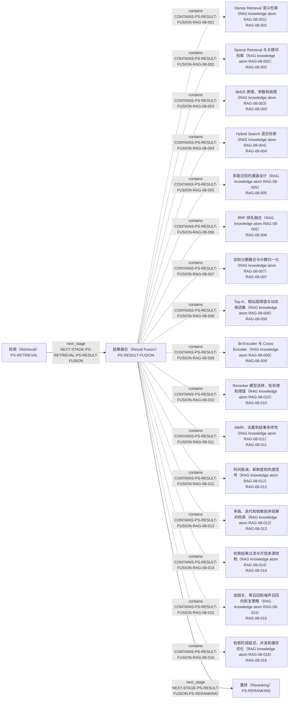

局部节点（Local Nodes）：implementation: `IMP-RAG-0001`, `IMP-RAG-0002`, `IMP-RAG-0003`, `IMP-RAG-0004`, `IMP-RAG-0006`; knowledge: `RAG-08-001`, `RAG-08-002`, `RAG-08-003`, `RAG-08-004`, `RAG-08-005`, `RAG-08-006`, `RAG-08-007`, `RAG-08-008`, `RAG-08-009`, `RAG-08-010`, `RAG-08-011`, `RAG-08-012`, `RAG-08-013`, `RAG-08-014`, `RAG-08-015`, `RAG-08-016`; pipeline_stage: `PS-RERANKING`, `PS-RESULT-FUSION`, `PS-RETRIEVAL`; problem_question: `PQ-RAG-0002`, `PQ-RAG-0004`, `PQ-RAG-0005`, `PQ-RAG-0015`, `PQ-RAG-0016`, `PQ-RAG-0017`, `PQ-RAG-0018`, `PQ-RAG-0019`, `PQ-RAG-0023`, `PQ-RAG-0024`。

| 边 ID | 受控关系 | 起点 | 终点 |
|---|---|---|---|
| `CONTAINS-PS-RESULT-FUSION-RAG-08-001` | 包含（Contains） `contains` | 结果融合（Result Fusion） [`PS-RESULT-FUSION`] | Dense Retrieval 语义检索（RAG knowledge atom RAG-08-001） [`RAG-08-001`] |
| `CONTAINS-PS-RESULT-FUSION-RAG-08-002` | 包含（Contains） `contains` | 结果融合（Result Fusion） [`PS-RESULT-FUSION`] | Sparse Retrieval 与关键词检索（RAG knowledge atom RAG-08-002） [`RAG-08-002`] |
| `CONTAINS-PS-RESULT-FUSION-RAG-08-003` | 包含（Contains） `contains` | 结果融合（Result Fusion） [`PS-RESULT-FUSION`] | BM25 原理、参数和局限（RAG knowledge atom RAG-08-003） [`RAG-08-003`] |
| `CONTAINS-PS-RESULT-FUSION-RAG-08-004` | 包含（Contains） `contains` | 结果融合（Result Fusion） [`PS-RESULT-FUSION`] | Hybrid Search 混合检索（RAG knowledge atom RAG-08-004） [`RAG-08-004`] |
| `CONTAINS-PS-RESULT-FUSION-RAG-08-005` | 包含（Contains） `contains` | 结果融合（Result Fusion） [`PS-RESULT-FUSION`] | 多路召回的通道设计（RAG knowledge atom RAG-08-005） [`RAG-08-005`] |
| `CONTAINS-PS-RESULT-FUSION-RAG-08-006` | 包含（Contains） `contains` | 结果融合（Result Fusion） [`PS-RESULT-FUSION`] | RRF 排名融合（RAG knowledge atom RAG-08-006） [`RAG-08-006`] |
| `CONTAINS-PS-RESULT-FUSION-RAG-08-007` | 包含（Contains） `contains` | 结果融合（Result Fusion） [`PS-RESULT-FUSION`] | 加权分数融合与分数归一化（RAG knowledge atom RAG-08-007） [`RAG-08-007`] |
| `CONTAINS-PS-RESULT-FUSION-RAG-08-008` | 包含（Contains） `contains` | 结果融合（Result Fusion） [`PS-RESULT-FUSION`] | Top-K、相似度阈值与动态候选集（RAG knowledge atom RAG-08-008） [`RAG-08-008`] |
| `CONTAINS-PS-RESULT-FUSION-RAG-08-009` | 包含（Contains） `contains` | 结果融合（Result Fusion） [`PS-RESULT-FUSION`] | Bi-Encoder 与 Cross-Encoder（RAG knowledge atom RAG-08-009） [`RAG-08-009`] |
| `CONTAINS-PS-RESULT-FUSION-RAG-08-010` | 包含（Contains） `contains` | 结果融合（Result Fusion） [`PS-RESULT-FUSION`] | Reranker 模型选择、批处理和阈值（RAG knowledge atom RAG-08-010） [`RAG-08-010`] |
| `CONTAINS-PS-RESULT-FUSION-RAG-08-011` | 包含（Contains） `contains` | 结果融合（Result Fusion） [`PS-RESULT-FUSION`] | MMR、去重和结果多样性（RAG knowledge atom RAG-08-011） [`RAG-08-011`] |
| `CONTAINS-PS-RESULT-FUSION-RAG-08-012` | 包含（Contains） `contains` | 结果融合（Result Fusion） [`PS-RESULT-FUSION`] | 时间衰减、新鲜度和热度信号（RAG knowledge atom RAG-08-012） [`RAG-08-012`] |
| `CONTAINS-PS-RESULT-FUSION-RAG-08-013` | 包含（Contains） `contains` | 结果融合（Result Fusion） [`PS-RESULT-FUSION`] | 多跳、迭代和依赖前序结果的检索（RAG knowledge atom RAG-08-013） [`RAG-08-013`] |
| `CONTAINS-PS-RESULT-FUSION-RAG-08-014` | 包含（Contains） `contains` | 结果融合（Result Fusion） [`PS-RESULT-FUSION`] | 检索结果过滤与可信来源控制（RAG knowledge atom RAG-08-014） [`RAG-08-014`] |
| `CONTAINS-PS-RESULT-FUSION-RAG-08-015` | 包含（Contains） `contains` | 结果融合（Result Fusion） [`PS-RESULT-FUSION`] | 低相关、零召回和噪声召回的恢复策略（RAG knowledge atom RAG-08-015） [`RAG-08-015`] |
| `CONTAINS-PS-RESULT-FUSION-RAG-08-016` | 包含（Contains） `contains` | 结果融合（Result Fusion） [`PS-RESULT-FUSION`] | 检索阶段延迟、并发和缓存优化（RAG knowledge atom RAG-08-016） [`RAG-08-016`] |
| `IMPLEMENTS-IMP-RAG-0001-RAG-08-008` | 实现（Implements） `implements` | VectorRAG 与 FAISS 链路（VectorRAG and FAISS Pipeline） [`IMP-RAG-0001`] | Top-K、相似度阈值与动态候选集（RAG knowledge atom RAG-08-008） [`RAG-08-008`] |
| `IMPLEMENTS-IMP-RAG-0001-RAG-08-013` | 实现（Implements） `implements` | VectorRAG 与 FAISS 链路（VectorRAG and FAISS Pipeline） [`IMP-RAG-0001`] | 多跳、迭代和依赖前序结果的检索（RAG knowledge atom RAG-08-013） [`RAG-08-013`] |
| `IMPLEMENTS-IMP-RAG-0002-RAG-08-001` | 实现（Implements） `implements` | LangChain MultiQueryRetriever（LangChain MultiQueryRetriever） [`IMP-RAG-0002`] | Dense Retrieval 语义检索（RAG knowledge atom RAG-08-001） [`RAG-08-001`] |
| `IMPLEMENTS-IMP-RAG-0002-RAG-08-002` | 实现（Implements） `implements` | LangChain MultiQueryRetriever（LangChain MultiQueryRetriever） [`IMP-RAG-0002`] | Sparse Retrieval 与关键词检索（RAG knowledge atom RAG-08-002） [`RAG-08-002`] |
| `IMPLEMENTS-IMP-RAG-0002-RAG-08-003` | 实现（Implements） `implements` | LangChain MultiQueryRetriever（LangChain MultiQueryRetriever） [`IMP-RAG-0002`] | BM25 原理、参数和局限（RAG knowledge atom RAG-08-003） [`RAG-08-003`] |
| `IMPLEMENTS-IMP-RAG-0002-RAG-08-004` | 实现（Implements） `implements` | LangChain MultiQueryRetriever（LangChain MultiQueryRetriever） [`IMP-RAG-0002`] | Hybrid Search 混合检索（RAG knowledge atom RAG-08-004） [`RAG-08-004`] |
| `IMPLEMENTS-IMP-RAG-0002-RAG-08-005` | 实现（Implements） `implements` | LangChain MultiQueryRetriever（LangChain MultiQueryRetriever） [`IMP-RAG-0002`] | 多路召回的通道设计（RAG knowledge atom RAG-08-005） [`RAG-08-005`] |
| `IMPLEMENTS-IMP-RAG-0002-RAG-08-008` | 实现（Implements） `implements` | LangChain MultiQueryRetriever（LangChain MultiQueryRetriever） [`IMP-RAG-0002`] | Top-K、相似度阈值与动态候选集（RAG knowledge atom RAG-08-008） [`RAG-08-008`] |
| `IMPLEMENTS-IMP-RAG-0002-RAG-08-011` | 实现（Implements） `implements` | LangChain MultiQueryRetriever（LangChain MultiQueryRetriever） [`IMP-RAG-0002`] | MMR、去重和结果多样性（RAG knowledge atom RAG-08-011） [`RAG-08-011`] |
| `IMPLEMENTS-IMP-RAG-0002-RAG-08-014` | 实现（Implements） `implements` | LangChain MultiQueryRetriever（LangChain MultiQueryRetriever） [`IMP-RAG-0002`] | 检索结果过滤与可信来源控制（RAG knowledge atom RAG-08-014） [`RAG-08-014`] |
| `IMPLEMENTS-IMP-RAG-0002-RAG-08-015` | 实现（Implements） `implements` | LangChain MultiQueryRetriever（LangChain MultiQueryRetriever） [`IMP-RAG-0002`] | 低相关、零召回和噪声召回的恢复策略（RAG knowledge atom RAG-08-015） [`RAG-08-015`] |
| `IMPLEMENTS-IMP-RAG-0003-RAG-08-004` | 实现（Implements） `implements` | LlamaIndex QueryFusionRetriever（LlamaIndex QueryFusionRetriever） [`IMP-RAG-0003`] | Hybrid Search 混合检索（RAG knowledge atom RAG-08-004） [`RAG-08-004`] |
| `IMPLEMENTS-IMP-RAG-0003-RAG-08-005` | 实现（Implements） `implements` | LlamaIndex QueryFusionRetriever（LlamaIndex QueryFusionRetriever） [`IMP-RAG-0003`] | 多路召回的通道设计（RAG knowledge atom RAG-08-005） [`RAG-08-005`] |
| `IMPLEMENTS-IMP-RAG-0003-RAG-08-006` | 实现（Implements） `implements` | LlamaIndex QueryFusionRetriever（LlamaIndex QueryFusionRetriever） [`IMP-RAG-0003`] | RRF 排名融合（RAG knowledge atom RAG-08-006） [`RAG-08-006`] |
| `IMPLEMENTS-IMP-RAG-0003-RAG-08-007` | 实现（Implements） `implements` | LlamaIndex QueryFusionRetriever（LlamaIndex QueryFusionRetriever） [`IMP-RAG-0003`] | 加权分数融合与分数归一化（RAG knowledge atom RAG-08-007） [`RAG-08-007`] |
| `IMPLEMENTS-IMP-RAG-0003-RAG-08-008` | 实现（Implements） `implements` | LlamaIndex QueryFusionRetriever（LlamaIndex QueryFusionRetriever） [`IMP-RAG-0003`] | Top-K、相似度阈值与动态候选集（RAG knowledge atom RAG-08-008） [`RAG-08-008`] |
| `IMPLEMENTS-IMP-RAG-0003-RAG-08-009` | 实现（Implements） `implements` | LlamaIndex QueryFusionRetriever（LlamaIndex QueryFusionRetriever） [`IMP-RAG-0003`] | Bi-Encoder 与 Cross-Encoder（RAG knowledge atom RAG-08-009） [`RAG-08-009`] |
| `IMPLEMENTS-IMP-RAG-0003-RAG-08-010` | 实现（Implements） `implements` | LlamaIndex QueryFusionRetriever（LlamaIndex QueryFusionRetriever） [`IMP-RAG-0003`] | Reranker 模型选择、批处理和阈值（RAG knowledge atom RAG-08-010） [`RAG-08-010`] |
| `IMPLEMENTS-IMP-RAG-0003-RAG-08-011` | 实现（Implements） `implements` | LlamaIndex QueryFusionRetriever（LlamaIndex QueryFusionRetriever） [`IMP-RAG-0003`] | MMR、去重和结果多样性（RAG knowledge atom RAG-08-011） [`RAG-08-011`] |
| `IMPLEMENTS-IMP-RAG-0003-RAG-08-016` | 实现（Implements） `implements` | LlamaIndex QueryFusionRetriever（LlamaIndex QueryFusionRetriever） [`IMP-RAG-0003`] | 检索阶段延迟、并发和缓存优化（RAG knowledge atom RAG-08-016） [`RAG-08-016`] |
| `IMPLEMENTS-IMP-RAG-0004-RAG-08-004` | 实现（Implements） `implements` | Unstructured 解析与切分策略（Unstructured Partitioning and Chunking） [`IMP-RAG-0004`] | Hybrid Search 混合检索（RAG knowledge atom RAG-08-004） [`RAG-08-004`] |
| `IMPLEMENTS-IMP-RAG-0004-RAG-08-010` | 实现（Implements） `implements` | Unstructured 解析与切分策略（Unstructured Partitioning and Chunking） [`IMP-RAG-0004`] | Reranker 模型选择、批处理和阈值（RAG knowledge atom RAG-08-010） [`RAG-08-010`] |
| `IMPLEMENTS-IMP-RAG-0006-RAG-08-008` | 实现（Implements） `implements` | 非对称 Embedding 与 Rerank API（Asymmetric Embedding and Rerank APIs） [`IMP-RAG-0006`] | Top-K、相似度阈值与动态候选集（RAG knowledge atom RAG-08-008） [`RAG-08-008`] |
| `IMPLEMENTS-IMP-RAG-0006-RAG-08-009` | 实现（Implements） `implements` | 非对称 Embedding 与 Rerank API（Asymmetric Embedding and Rerank APIs） [`IMP-RAG-0006`] | Bi-Encoder 与 Cross-Encoder（RAG knowledge atom RAG-08-009） [`RAG-08-009`] |
| `IMPLEMENTS-IMP-RAG-0006-RAG-08-010` | 实现（Implements） `implements` | 非对称 Embedding 与 Rerank API（Asymmetric Embedding and Rerank APIs） [`IMP-RAG-0006`] | Reranker 模型选择、批处理和阈值（RAG knowledge atom RAG-08-010） [`RAG-08-010`] |
| `IMPLEMENTS-IMP-RAG-0006-RAG-08-011` | 实现（Implements） `implements` | 非对称 Embedding 与 Rerank API（Asymmetric Embedding and Rerank APIs） [`IMP-RAG-0006`] | MMR、去重和结果多样性（RAG knowledge atom RAG-08-011） [`RAG-08-011`] |
| `IMPLEMENTS-IMP-RAG-0006-RAG-08-016` | 实现（Implements） `implements` | 非对称 Embedding 与 Rerank API（Asymmetric Embedding and Rerank APIs） [`IMP-RAG-0006`] | 检索阶段延迟、并发和缓存优化（RAG knowledge atom RAG-08-016） [`RAG-08-016`] |
| `NEXT-STAGE-PS-RESULT-FUSION-PS-RERANKING` | 下一阶段（Next Stage） `next_stage` | 结果融合（Result Fusion） [`PS-RESULT-FUSION`] | 重排（Reranking） [`PS-RERANKING`] |
| `NEXT-STAGE-PS-RETRIEVAL-PS-RESULT-FUSION` | 下一阶段（Next Stage） `next_stage` | 检索（Retrieval） [`PS-RETRIEVAL`] | 结果融合（Result Fusion） [`PS-RESULT-FUSION`] |
| `PROBLEM-AT-PQ-RAG-0002-RAG-08-004` | 出现问题于（Problem At） `problem_at` | 法律条文包含条、款、项、引用关系和扫描件噪声时，如何设计结构解析、父子 Chunk、Metadata、Hybrid Retrieval、Rerank、引用和质检？（RAG engineering problem RAG-SCENE-002） [`PQ-RAG-0002`] | Hybrid Search 混合检索（RAG knowledge atom RAG-08-004） [`RAG-08-004`] |
| `PROBLEM-AT-PQ-RAG-0002-RAG-08-010` | 出现问题于（Problem At） `problem_at` | 法律条文包含条、款、项、引用关系和扫描件噪声时，如何设计结构解析、父子 Chunk、Metadata、Hybrid Retrieval、Rerank、引用和质检？（RAG engineering problem RAG-SCENE-002） [`PQ-RAG-0002`] | Reranker 模型选择、批处理和阈值（RAG knowledge atom RAG-08-010） [`RAG-08-010`] |
| `PROBLEM-AT-PQ-RAG-0004-RAG-08-008` | 出现问题于（Problem At） `problem_at` | 补全 Query/Document Embedding、批量建库、FAISS Top-K 检索、ID 映射、上下文生成和准确率记录的完整 VectorRAG 链路。（RAG engineering problem RAG-SCENE-004） [`PQ-RAG-0004`] | Top-K、相似度阈值与动态候选集（RAG knowledge atom RAG-08-008） [`RAG-08-008`] |
| `PROBLEM-AT-PQ-RAG-0005-RAG-08-013` | 出现问题于（Problem At） `problem_at` | 实现实体召回、多跳子图抽取、路径去重、语义剪枝、生产者消费者队列、提前停止，并分析路径爆炸和图算法选型。（RAG engineering problem RAG-SCENE-005） [`PQ-RAG-0005`] | 多跳、迭代和依赖前序结果的检索（RAG knowledge atom RAG-08-013） [`RAG-08-013`] |
| `PROBLEM-AT-PQ-RAG-0015-RAG-08-011` | 出现问题于（Problem At） `problem_at` | 长尾 Query 召回低时，如何在 Multi-Query、HyDE、子问题分解、会话改写和 Step-back Prompting 之间选择，并防止专有名词丢失、语义漂移、噪声放大及延迟失控？（RAG engineering problem RAG-SCENE-015） [`PQ-RAG-0015`] | MMR、去重和结果多样性（RAG knowledge atom RAG-08-011） [`RAG-08-011`] |
| `PROBLEM-AT-PQ-RAG-0016-RAG-08-013` | 出现问题于（Problem At） `problem_at` | 一个请求什么时候无需检索、只需单次检索、需要多次检索或应路由到外部工具，如何设计置信度、成本预算、降级和错误路由评估？（RAG engineering problem RAG-SCENE-016） [`PQ-RAG-0016`] | 多跳、迭代和依赖前序结果的检索（RAG knowledge atom RAG-08-013） [`RAG-08-013`] |
| `PROBLEM-AT-PQ-RAG-0017-RAG-08-001` | 出现问题于（Problem At） `problem_at` | 产品编号和专业术语依赖精确匹配、口语问题又依赖语义检索时，如何设计 Dense、Sparse 与 Hybrid Search 多路召回，并诊断零召回、噪声召回和权限过滤问题？（RAG engineering problem RAG-SCENE-017） [`PQ-RAG-0017`] | Dense Retrieval 语义检索（RAG knowledge atom RAG-08-001） [`RAG-08-001`] |
| `PROBLEM-AT-PQ-RAG-0017-RAG-08-002` | 出现问题于（Problem At） `problem_at` | 产品编号和专业术语依赖精确匹配、口语问题又依赖语义检索时，如何设计 Dense、Sparse 与 Hybrid Search 多路召回，并诊断零召回、噪声召回和权限过滤问题？（RAG engineering problem RAG-SCENE-017） [`PQ-RAG-0017`] | Sparse Retrieval 与关键词检索（RAG knowledge atom RAG-08-002） [`RAG-08-002`] |
| `PROBLEM-AT-PQ-RAG-0017-RAG-08-003` | 出现问题于（Problem At） `problem_at` | 产品编号和专业术语依赖精确匹配、口语问题又依赖语义检索时，如何设计 Dense、Sparse 与 Hybrid Search 多路召回，并诊断零召回、噪声召回和权限过滤问题？（RAG engineering problem RAG-SCENE-017） [`PQ-RAG-0017`] | BM25 原理、参数和局限（RAG knowledge atom RAG-08-003） [`RAG-08-003`] |
| `PROBLEM-AT-PQ-RAG-0017-RAG-08-004` | 出现问题于（Problem At） `problem_at` | 产品编号和专业术语依赖精确匹配、口语问题又依赖语义检索时，如何设计 Dense、Sparse 与 Hybrid Search 多路召回，并诊断零召回、噪声召回和权限过滤问题？（RAG engineering problem RAG-SCENE-017） [`PQ-RAG-0017`] | Hybrid Search 混合检索（RAG knowledge atom RAG-08-004） [`RAG-08-004`] |
| `PROBLEM-AT-PQ-RAG-0017-RAG-08-005` | 出现问题于（Problem At） `problem_at` | 产品编号和专业术语依赖精确匹配、口语问题又依赖语义检索时，如何设计 Dense、Sparse 与 Hybrid Search 多路召回，并诊断零召回、噪声召回和权限过滤问题？（RAG engineering problem RAG-SCENE-017） [`PQ-RAG-0017`] | 多路召回的通道设计（RAG knowledge atom RAG-08-005） [`RAG-08-005`] |
| `PROBLEM-AT-PQ-RAG-0017-RAG-08-008` | 出现问题于（Problem At） `problem_at` | 产品编号和专业术语依赖精确匹配、口语问题又依赖语义检索时，如何设计 Dense、Sparse 与 Hybrid Search 多路召回，并诊断零召回、噪声召回和权限过滤问题？（RAG engineering problem RAG-SCENE-017） [`PQ-RAG-0017`] | Top-K、相似度阈值与动态候选集（RAG knowledge atom RAG-08-008） [`RAG-08-008`] |
| `PROBLEM-AT-PQ-RAG-0017-RAG-08-014` | 出现问题于（Problem At） `problem_at` | 产品编号和专业术语依赖精确匹配、口语问题又依赖语义检索时，如何设计 Dense、Sparse 与 Hybrid Search 多路召回，并诊断零召回、噪声召回和权限过滤问题？（RAG engineering problem RAG-SCENE-017） [`PQ-RAG-0017`] | 检索结果过滤与可信来源控制（RAG knowledge atom RAG-08-014） [`RAG-08-014`] |
| `PROBLEM-AT-PQ-RAG-0017-RAG-08-015` | 出现问题于（Problem At） `problem_at` | 产品编号和专业术语依赖精确匹配、口语问题又依赖语义检索时，如何设计 Dense、Sparse 与 Hybrid Search 多路召回，并诊断零召回、噪声召回和权限过滤问题？（RAG engineering problem RAG-SCENE-017） [`PQ-RAG-0017`] | 低相关、零召回和噪声召回的恢复策略（RAG knowledge atom RAG-08-015） [`RAG-08-015`] |
| `PROBLEM-AT-PQ-RAG-0018-RAG-08-004` | 出现问题于（Problem At） `problem_at` | BM25 与向量检索的原始分数尺度不可直接比较且会返回重复 Chunk 时，如何用 RRF 或分数归一化融合、去重，并验证某个通道没有被系统性淹没？（RAG engineering problem RAG-SCENE-018） [`PQ-RAG-0018`] | Hybrid Search 混合检索（RAG knowledge atom RAG-08-004） [`RAG-08-004`] |
| `PROBLEM-AT-PQ-RAG-0018-RAG-08-005` | 出现问题于（Problem At） `problem_at` | BM25 与向量检索的原始分数尺度不可直接比较且会返回重复 Chunk 时，如何用 RRF 或分数归一化融合、去重，并验证某个通道没有被系统性淹没？（RAG engineering problem RAG-SCENE-018） [`PQ-RAG-0018`] | 多路召回的通道设计（RAG knowledge atom RAG-08-005） [`RAG-08-005`] |
| `PROBLEM-AT-PQ-RAG-0018-RAG-08-006` | 出现问题于（Problem At） `problem_at` | BM25 与向量检索的原始分数尺度不可直接比较且会返回重复 Chunk 时，如何用 RRF 或分数归一化融合、去重，并验证某个通道没有被系统性淹没？（RAG engineering problem RAG-SCENE-018） [`PQ-RAG-0018`] | RRF 排名融合（RAG knowledge atom RAG-08-006） [`RAG-08-006`] |
| `PROBLEM-AT-PQ-RAG-0018-RAG-08-007` | 出现问题于（Problem At） `problem_at` | BM25 与向量检索的原始分数尺度不可直接比较且会返回重复 Chunk 时，如何用 RRF 或分数归一化融合、去重，并验证某个通道没有被系统性淹没？（RAG engineering problem RAG-SCENE-018） [`PQ-RAG-0018`] | 加权分数融合与分数归一化（RAG knowledge atom RAG-08-007） [`RAG-08-007`] |
| `PROBLEM-AT-PQ-RAG-0018-RAG-08-008` | 出现问题于（Problem At） `problem_at` | BM25 与向量检索的原始分数尺度不可直接比较且会返回重复 Chunk 时，如何用 RRF 或分数归一化融合、去重，并验证某个通道没有被系统性淹没？（RAG engineering problem RAG-SCENE-018） [`PQ-RAG-0018`] | Top-K、相似度阈值与动态候选集（RAG knowledge atom RAG-08-008） [`RAG-08-008`] |
| `PROBLEM-AT-PQ-RAG-0018-RAG-08-011` | 出现问题于（Problem At） `problem_at` | BM25 与向量检索的原始分数尺度不可直接比较且会返回重复 Chunk 时，如何用 RRF 或分数归一化融合、去重，并验证某个通道没有被系统性淹没？（RAG engineering problem RAG-SCENE-018） [`PQ-RAG-0018`] | MMR、去重和结果多样性（RAG knowledge atom RAG-08-011） [`RAG-08-011`] |
| `PROBLEM-AT-PQ-RAG-0019-RAG-08-008` | 出现问题于（Problem At） `problem_at` | Reranker 不新增候选却增加明显延迟时，怎样选择进入重排的候选数、最终 Top-N、跳过重排条件和降级链路，并分别解释 Recall、NDCG 与 MRR 的变化？（RAG engineering problem RAG-SCENE-019） [`PQ-RAG-0019`] | Top-K、相似度阈值与动态候选集（RAG knowledge atom RAG-08-008） [`RAG-08-008`] |
| `PROBLEM-AT-PQ-RAG-0019-RAG-08-009` | 出现问题于（Problem At） `problem_at` | Reranker 不新增候选却增加明显延迟时，怎样选择进入重排的候选数、最终 Top-N、跳过重排条件和降级链路，并分别解释 Recall、NDCG 与 MRR 的变化？（RAG engineering problem RAG-SCENE-019） [`PQ-RAG-0019`] | Bi-Encoder 与 Cross-Encoder（RAG knowledge atom RAG-08-009） [`RAG-08-009`] |
| `PROBLEM-AT-PQ-RAG-0019-RAG-08-010` | 出现问题于（Problem At） `problem_at` | Reranker 不新增候选却增加明显延迟时，怎样选择进入重排的候选数、最终 Top-N、跳过重排条件和降级链路，并分别解释 Recall、NDCG 与 MRR 的变化？（RAG engineering problem RAG-SCENE-019） [`PQ-RAG-0019`] | Reranker 模型选择、批处理和阈值（RAG knowledge atom RAG-08-010） [`RAG-08-010`] |
| `PROBLEM-AT-PQ-RAG-0019-RAG-08-011` | 出现问题于（Problem At） `problem_at` | Reranker 不新增候选却增加明显延迟时，怎样选择进入重排的候选数、最终 Top-N、跳过重排条件和降级链路，并分别解释 Recall、NDCG 与 MRR 的变化？（RAG engineering problem RAG-SCENE-019） [`PQ-RAG-0019`] | MMR、去重和结果多样性（RAG knowledge atom RAG-08-011） [`RAG-08-011`] |
| `PROBLEM-AT-PQ-RAG-0019-RAG-08-016` | 出现问题于（Problem At） `problem_at` | Reranker 不新增候选却增加明显延迟时，怎样选择进入重排的候选数、最终 Top-N、跳过重排条件和降级链路，并分别解释 Recall、NDCG 与 MRR 的变化？（RAG engineering problem RAG-SCENE-019） [`PQ-RAG-0019`] | 检索阶段延迟、并发和缓存优化（RAG knowledge atom RAG-08-016） [`RAG-08-016`] |
| `PROBLEM-AT-PQ-RAG-0023-RAG-08-008` | 出现问题于（Problem At） `problem_at` | 当检索结果质量不足但生成器仍会强制作答时，如何识别 Retrieval Bias（检索偏置），区分零召回、低相关和证据不足，并在过滤、拒答、回退及迭代检索之间选择？（RAG engineering problem RAG-SCENE-023） [`PQ-RAG-0023`] | Top-K、相似度阈值与动态候选集（RAG knowledge atom RAG-08-008） [`RAG-08-008`] |
| `PROBLEM-AT-PQ-RAG-0023-RAG-08-013` | 出现问题于（Problem At） `problem_at` | 当检索结果质量不足但生成器仍会强制作答时，如何识别 Retrieval Bias（检索偏置），区分零召回、低相关和证据不足，并在过滤、拒答、回退及迭代检索之间选择？（RAG engineering problem RAG-SCENE-023） [`PQ-RAG-0023`] | 多跳、迭代和依赖前序结果的检索（RAG knowledge atom RAG-08-013） [`RAG-08-013`] |
| `PROBLEM-AT-PQ-RAG-0023-RAG-08-015` | 出现问题于（Problem At） `problem_at` | 当检索结果质量不足但生成器仍会强制作答时，如何识别 Retrieval Bias（检索偏置），区分零召回、低相关和证据不足，并在过滤、拒答、回退及迭代检索之间选择？（RAG engineering problem RAG-SCENE-023） [`PQ-RAG-0023`] | 低相关、零召回和噪声召回的恢复策略（RAG knowledge atom RAG-08-015） [`RAG-08-015`] |
| `PROBLEM-AT-PQ-RAG-0024-RAG-08-014` | 出现问题于（Problem At） `problem_at` | 多个已召回文档在事实、时间或观点上互相冲突时，如何保留来源与时间 Metadata（元数据），进行可信度排序和交叉验证，并在答案中显式呈现共识、分歧与不确定性？（RAG engineering problem RAG-SCENE-024） [`PQ-RAG-0024`] | 检索结果过滤与可信来源控制（RAG knowledge atom RAG-08-014） [`RAG-08-014`] |

<a id="ps-reranking"></a>
### 重排（Reranking） [`PS-RERANKING`]

一跳局部图（One-hop Local Map）含 18 条边；二跳扩展（Two-hop Expansion）含 56 条边。包含的知识节点（Knowledge Node）：`RAG-08-001`, `RAG-08-002`, `RAG-08-003`, `RAG-08-004`, `RAG-08-005`, `RAG-08-006`, `RAG-08-007`, `RAG-08-008`, `RAG-08-009`, `RAG-08-010`, `RAG-08-011`, `RAG-08-012`, `RAG-08-013`, `RAG-08-014`, `RAG-08-015`, `RAG-08-016`。

```mermaid
flowchart LR
    n0["上下文组装（Context Assembly）<br/>PS-CONTEXT-ASSEMBLY"]
    n1["重排（Reranking）<br/>PS-RERANKING"]
    n2["结果融合（Result Fusion）<br/>PS-RESULT-FUSION"]
    n3["Dense Retrieval 语义检索（RAG knowledge atom RAG-08-001）<br/>RAG-08-001"]
    n4["Sparse Retrieval 与关键词检索（RAG knowledge atom RAG-08-002）<br/>RAG-08-002"]
    n5["BM25 原理、参数和局限（RAG knowledge atom RAG-08-003）<br/>RAG-08-003"]
    n6["Hybrid Search 混合检索（RAG knowledge atom RAG-08-004）<br/>RAG-08-004"]
    n7["多路召回的通道设计（RAG knowledge atom RAG-08-005）<br/>RAG-08-005"]
    n8["RRF 排名融合（RAG knowledge atom RAG-08-006）<br/>RAG-08-006"]
    n9["加权分数融合与分数归一化（RAG knowledge atom RAG-08-007）<br/>RAG-08-007"]
    n10["Top-K、相似度阈值与动态候选集（RAG knowledge atom RAG-08-008）<br/>RAG-08-008"]
    n11["Bi-Encoder 与 Cross-Encoder（RAG knowledge atom RAG-08-009）<br/>RAG-08-009"]
    n12["Reranker 模型选择、批处理和阈值（RAG knowledge atom RAG-08-010）<br/>RAG-08-010"]
    n13["MMR、去重和结果多样性（RAG knowledge atom RAG-08-011）<br/>RAG-08-011"]
    n14["时间衰减、新鲜度和热度信号（RAG knowledge atom RAG-08-012）<br/>RAG-08-012"]
    n15["多跳、迭代和依赖前序结果的检索（RAG knowledge atom RAG-08-013）<br/>RAG-08-013"]
    n16["检索结果过滤与可信来源控制（RAG knowledge atom RAG-08-014）<br/>RAG-08-014"]
    n17["低相关、零召回和噪声召回的恢复策略（RAG knowledge atom RAG-08-015）<br/>RAG-08-015"]
    n18["检索阶段延迟、并发和缓存优化（RAG knowledge atom RAG-08-016）<br/>RAG-08-016"]
    n1 -.->|contains<br/>CONTAINS-PS-RERANKING-RAG-08-001| n3
    n1 -.->|contains<br/>CONTAINS-PS-RERANKING-RAG-08-002| n4
    n1 -.->|contains<br/>CONTAINS-PS-RERANKING-RAG-08-003| n5
    n1 -.->|contains<br/>CONTAINS-PS-RERANKING-RAG-08-004| n6
    n1 -.->|contains<br/>CONTAINS-PS-RERANKING-RAG-08-005| n7
    n1 -.->|contains<br/>CONTAINS-PS-RERANKING-RAG-08-006| n8
    n1 -.->|contains<br/>CONTAINS-PS-RERANKING-RAG-08-007| n9
    n1 -.->|contains<br/>CONTAINS-PS-RERANKING-RAG-08-008| n10
    n1 -.->|contains<br/>CONTAINS-PS-RERANKING-RAG-08-009| n11
    n1 -.->|contains<br/>CONTAINS-PS-RERANKING-RAG-08-010| n12
    n1 -.->|contains<br/>CONTAINS-PS-RERANKING-RAG-08-011| n13
    n1 -.->|contains<br/>CONTAINS-PS-RERANKING-RAG-08-012| n14
    n1 -.->|contains<br/>CONTAINS-PS-RERANKING-RAG-08-013| n15
    n1 -.->|contains<br/>CONTAINS-PS-RERANKING-RAG-08-014| n16
    n1 -.->|contains<br/>CONTAINS-PS-RERANKING-RAG-08-015| n17
    n1 -.->|contains<br/>CONTAINS-PS-RERANKING-RAG-08-016| n18
    n1 -->|next_stage<br/>NEXT-STAGE-PS-RERANKING-PS-CONTEXT-ASSEMBLY| n0
    n2 -->|next_stage<br/>NEXT-STAGE-PS-RESULT-FUSION-PS-RERANKING| n1
```

局部节点（Local Nodes）：implementation: `IMP-RAG-0001`, `IMP-RAG-0002`, `IMP-RAG-0003`, `IMP-RAG-0004`, `IMP-RAG-0006`; knowledge: `RAG-08-001`, `RAG-08-002`, `RAG-08-003`, `RAG-08-004`, `RAG-08-005`, `RAG-08-006`, `RAG-08-007`, `RAG-08-008`, `RAG-08-009`, `RAG-08-010`, `RAG-08-011`, `RAG-08-012`, `RAG-08-013`, `RAG-08-014`, `RAG-08-015`, `RAG-08-016`; pipeline_stage: `PS-CONTEXT-ASSEMBLY`, `PS-RERANKING`, `PS-RESULT-FUSION`; problem_question: `PQ-RAG-0002`, `PQ-RAG-0004`, `PQ-RAG-0005`, `PQ-RAG-0015`, `PQ-RAG-0016`, `PQ-RAG-0017`, `PQ-RAG-0018`, `PQ-RAG-0019`, `PQ-RAG-0023`, `PQ-RAG-0024`。

| 边 ID | 受控关系 | 起点 | 终点 |
|---|---|---|---|
| `CONTAINS-PS-RERANKING-RAG-08-001` | 包含（Contains） `contains` | 重排（Reranking） [`PS-RERANKING`] | Dense Retrieval 语义检索（RAG knowledge atom RAG-08-001） [`RAG-08-001`] |
| `CONTAINS-PS-RERANKING-RAG-08-002` | 包含（Contains） `contains` | 重排（Reranking） [`PS-RERANKING`] | Sparse Retrieval 与关键词检索（RAG knowledge atom RAG-08-002） [`RAG-08-002`] |
| `CONTAINS-PS-RERANKING-RAG-08-003` | 包含（Contains） `contains` | 重排（Reranking） [`PS-RERANKING`] | BM25 原理、参数和局限（RAG knowledge atom RAG-08-003） [`RAG-08-003`] |
| `CONTAINS-PS-RERANKING-RAG-08-004` | 包含（Contains） `contains` | 重排（Reranking） [`PS-RERANKING`] | Hybrid Search 混合检索（RAG knowledge atom RAG-08-004） [`RAG-08-004`] |
| `CONTAINS-PS-RERANKING-RAG-08-005` | 包含（Contains） `contains` | 重排（Reranking） [`PS-RERANKING`] | 多路召回的通道设计（RAG knowledge atom RAG-08-005） [`RAG-08-005`] |
| `CONTAINS-PS-RERANKING-RAG-08-006` | 包含（Contains） `contains` | 重排（Reranking） [`PS-RERANKING`] | RRF 排名融合（RAG knowledge atom RAG-08-006） [`RAG-08-006`] |
| `CONTAINS-PS-RERANKING-RAG-08-007` | 包含（Contains） `contains` | 重排（Reranking） [`PS-RERANKING`] | 加权分数融合与分数归一化（RAG knowledge atom RAG-08-007） [`RAG-08-007`] |
| `CONTAINS-PS-RERANKING-RAG-08-008` | 包含（Contains） `contains` | 重排（Reranking） [`PS-RERANKING`] | Top-K、相似度阈值与动态候选集（RAG knowledge atom RAG-08-008） [`RAG-08-008`] |
| `CONTAINS-PS-RERANKING-RAG-08-009` | 包含（Contains） `contains` | 重排（Reranking） [`PS-RERANKING`] | Bi-Encoder 与 Cross-Encoder（RAG knowledge atom RAG-08-009） [`RAG-08-009`] |
| `CONTAINS-PS-RERANKING-RAG-08-010` | 包含（Contains） `contains` | 重排（Reranking） [`PS-RERANKING`] | Reranker 模型选择、批处理和阈值（RAG knowledge atom RAG-08-010） [`RAG-08-010`] |
| `CONTAINS-PS-RERANKING-RAG-08-011` | 包含（Contains） `contains` | 重排（Reranking） [`PS-RERANKING`] | MMR、去重和结果多样性（RAG knowledge atom RAG-08-011） [`RAG-08-011`] |
| `CONTAINS-PS-RERANKING-RAG-08-012` | 包含（Contains） `contains` | 重排（Reranking） [`PS-RERANKING`] | 时间衰减、新鲜度和热度信号（RAG knowledge atom RAG-08-012） [`RAG-08-012`] |
| `CONTAINS-PS-RERANKING-RAG-08-013` | 包含（Contains） `contains` | 重排（Reranking） [`PS-RERANKING`] | 多跳、迭代和依赖前序结果的检索（RAG knowledge atom RAG-08-013） [`RAG-08-013`] |
| `CONTAINS-PS-RERANKING-RAG-08-014` | 包含（Contains） `contains` | 重排（Reranking） [`PS-RERANKING`] | 检索结果过滤与可信来源控制（RAG knowledge atom RAG-08-014） [`RAG-08-014`] |
| `CONTAINS-PS-RERANKING-RAG-08-015` | 包含（Contains） `contains` | 重排（Reranking） [`PS-RERANKING`] | 低相关、零召回和噪声召回的恢复策略（RAG knowledge atom RAG-08-015） [`RAG-08-015`] |
| `CONTAINS-PS-RERANKING-RAG-08-016` | 包含（Contains） `contains` | 重排（Reranking） [`PS-RERANKING`] | 检索阶段延迟、并发和缓存优化（RAG knowledge atom RAG-08-016） [`RAG-08-016`] |
| `IMPLEMENTS-IMP-RAG-0001-RAG-08-008` | 实现（Implements） `implements` | VectorRAG 与 FAISS 链路（VectorRAG and FAISS Pipeline） [`IMP-RAG-0001`] | Top-K、相似度阈值与动态候选集（RAG knowledge atom RAG-08-008） [`RAG-08-008`] |
| `IMPLEMENTS-IMP-RAG-0001-RAG-08-013` | 实现（Implements） `implements` | VectorRAG 与 FAISS 链路（VectorRAG and FAISS Pipeline） [`IMP-RAG-0001`] | 多跳、迭代和依赖前序结果的检索（RAG knowledge atom RAG-08-013） [`RAG-08-013`] |
| `IMPLEMENTS-IMP-RAG-0002-RAG-08-001` | 实现（Implements） `implements` | LangChain MultiQueryRetriever（LangChain MultiQueryRetriever） [`IMP-RAG-0002`] | Dense Retrieval 语义检索（RAG knowledge atom RAG-08-001） [`RAG-08-001`] |
| `IMPLEMENTS-IMP-RAG-0002-RAG-08-002` | 实现（Implements） `implements` | LangChain MultiQueryRetriever（LangChain MultiQueryRetriever） [`IMP-RAG-0002`] | Sparse Retrieval 与关键词检索（RAG knowledge atom RAG-08-002） [`RAG-08-002`] |
| `IMPLEMENTS-IMP-RAG-0002-RAG-08-003` | 实现（Implements） `implements` | LangChain MultiQueryRetriever（LangChain MultiQueryRetriever） [`IMP-RAG-0002`] | BM25 原理、参数和局限（RAG knowledge atom RAG-08-003） [`RAG-08-003`] |
| `IMPLEMENTS-IMP-RAG-0002-RAG-08-004` | 实现（Implements） `implements` | LangChain MultiQueryRetriever（LangChain MultiQueryRetriever） [`IMP-RAG-0002`] | Hybrid Search 混合检索（RAG knowledge atom RAG-08-004） [`RAG-08-004`] |
| `IMPLEMENTS-IMP-RAG-0002-RAG-08-005` | 实现（Implements） `implements` | LangChain MultiQueryRetriever（LangChain MultiQueryRetriever） [`IMP-RAG-0002`] | 多路召回的通道设计（RAG knowledge atom RAG-08-005） [`RAG-08-005`] |
| `IMPLEMENTS-IMP-RAG-0002-RAG-08-008` | 实现（Implements） `implements` | LangChain MultiQueryRetriever（LangChain MultiQueryRetriever） [`IMP-RAG-0002`] | Top-K、相似度阈值与动态候选集（RAG knowledge atom RAG-08-008） [`RAG-08-008`] |
| `IMPLEMENTS-IMP-RAG-0002-RAG-08-011` | 实现（Implements） `implements` | LangChain MultiQueryRetriever（LangChain MultiQueryRetriever） [`IMP-RAG-0002`] | MMR、去重和结果多样性（RAG knowledge atom RAG-08-011） [`RAG-08-011`] |
| `IMPLEMENTS-IMP-RAG-0002-RAG-08-014` | 实现（Implements） `implements` | LangChain MultiQueryRetriever（LangChain MultiQueryRetriever） [`IMP-RAG-0002`] | 检索结果过滤与可信来源控制（RAG knowledge atom RAG-08-014） [`RAG-08-014`] |
| `IMPLEMENTS-IMP-RAG-0002-RAG-08-015` | 实现（Implements） `implements` | LangChain MultiQueryRetriever（LangChain MultiQueryRetriever） [`IMP-RAG-0002`] | 低相关、零召回和噪声召回的恢复策略（RAG knowledge atom RAG-08-015） [`RAG-08-015`] |
| `IMPLEMENTS-IMP-RAG-0003-RAG-08-004` | 实现（Implements） `implements` | LlamaIndex QueryFusionRetriever（LlamaIndex QueryFusionRetriever） [`IMP-RAG-0003`] | Hybrid Search 混合检索（RAG knowledge atom RAG-08-004） [`RAG-08-004`] |
| `IMPLEMENTS-IMP-RAG-0003-RAG-08-005` | 实现（Implements） `implements` | LlamaIndex QueryFusionRetriever（LlamaIndex QueryFusionRetriever） [`IMP-RAG-0003`] | 多路召回的通道设计（RAG knowledge atom RAG-08-005） [`RAG-08-005`] |
| `IMPLEMENTS-IMP-RAG-0003-RAG-08-006` | 实现（Implements） `implements` | LlamaIndex QueryFusionRetriever（LlamaIndex QueryFusionRetriever） [`IMP-RAG-0003`] | RRF 排名融合（RAG knowledge atom RAG-08-006） [`RAG-08-006`] |
| `IMPLEMENTS-IMP-RAG-0003-RAG-08-007` | 实现（Implements） `implements` | LlamaIndex QueryFusionRetriever（LlamaIndex QueryFusionRetriever） [`IMP-RAG-0003`] | 加权分数融合与分数归一化（RAG knowledge atom RAG-08-007） [`RAG-08-007`] |
| `IMPLEMENTS-IMP-RAG-0003-RAG-08-008` | 实现（Implements） `implements` | LlamaIndex QueryFusionRetriever（LlamaIndex QueryFusionRetriever） [`IMP-RAG-0003`] | Top-K、相似度阈值与动态候选集（RAG knowledge atom RAG-08-008） [`RAG-08-008`] |
| `IMPLEMENTS-IMP-RAG-0003-RAG-08-009` | 实现（Implements） `implements` | LlamaIndex QueryFusionRetriever（LlamaIndex QueryFusionRetriever） [`IMP-RAG-0003`] | Bi-Encoder 与 Cross-Encoder（RAG knowledge atom RAG-08-009） [`RAG-08-009`] |
| `IMPLEMENTS-IMP-RAG-0003-RAG-08-010` | 实现（Implements） `implements` | LlamaIndex QueryFusionRetriever（LlamaIndex QueryFusionRetriever） [`IMP-RAG-0003`] | Reranker 模型选择、批处理和阈值（RAG knowledge atom RAG-08-010） [`RAG-08-010`] |
| `IMPLEMENTS-IMP-RAG-0003-RAG-08-011` | 实现（Implements） `implements` | LlamaIndex QueryFusionRetriever（LlamaIndex QueryFusionRetriever） [`IMP-RAG-0003`] | MMR、去重和结果多样性（RAG knowledge atom RAG-08-011） [`RAG-08-011`] |
| `IMPLEMENTS-IMP-RAG-0003-RAG-08-016` | 实现（Implements） `implements` | LlamaIndex QueryFusionRetriever（LlamaIndex QueryFusionRetriever） [`IMP-RAG-0003`] | 检索阶段延迟、并发和缓存优化（RAG knowledge atom RAG-08-016） [`RAG-08-016`] |
| `IMPLEMENTS-IMP-RAG-0004-RAG-08-004` | 实现（Implements） `implements` | Unstructured 解析与切分策略（Unstructured Partitioning and Chunking） [`IMP-RAG-0004`] | Hybrid Search 混合检索（RAG knowledge atom RAG-08-004） [`RAG-08-004`] |
| `IMPLEMENTS-IMP-RAG-0004-RAG-08-010` | 实现（Implements） `implements` | Unstructured 解析与切分策略（Unstructured Partitioning and Chunking） [`IMP-RAG-0004`] | Reranker 模型选择、批处理和阈值（RAG knowledge atom RAG-08-010） [`RAG-08-010`] |
| `IMPLEMENTS-IMP-RAG-0006-RAG-08-008` | 实现（Implements） `implements` | 非对称 Embedding 与 Rerank API（Asymmetric Embedding and Rerank APIs） [`IMP-RAG-0006`] | Top-K、相似度阈值与动态候选集（RAG knowledge atom RAG-08-008） [`RAG-08-008`] |
| `IMPLEMENTS-IMP-RAG-0006-RAG-08-009` | 实现（Implements） `implements` | 非对称 Embedding 与 Rerank API（Asymmetric Embedding and Rerank APIs） [`IMP-RAG-0006`] | Bi-Encoder 与 Cross-Encoder（RAG knowledge atom RAG-08-009） [`RAG-08-009`] |
| `IMPLEMENTS-IMP-RAG-0006-RAG-08-010` | 实现（Implements） `implements` | 非对称 Embedding 与 Rerank API（Asymmetric Embedding and Rerank APIs） [`IMP-RAG-0006`] | Reranker 模型选择、批处理和阈值（RAG knowledge atom RAG-08-010） [`RAG-08-010`] |
| `IMPLEMENTS-IMP-RAG-0006-RAG-08-011` | 实现（Implements） `implements` | 非对称 Embedding 与 Rerank API（Asymmetric Embedding and Rerank APIs） [`IMP-RAG-0006`] | MMR、去重和结果多样性（RAG knowledge atom RAG-08-011） [`RAG-08-011`] |
| `IMPLEMENTS-IMP-RAG-0006-RAG-08-016` | 实现（Implements） `implements` | 非对称 Embedding 与 Rerank API（Asymmetric Embedding and Rerank APIs） [`IMP-RAG-0006`] | 检索阶段延迟、并发和缓存优化（RAG knowledge atom RAG-08-016） [`RAG-08-016`] |
| `NEXT-STAGE-PS-RERANKING-PS-CONTEXT-ASSEMBLY` | 下一阶段（Next Stage） `next_stage` | 重排（Reranking） [`PS-RERANKING`] | 上下文组装（Context Assembly） [`PS-CONTEXT-ASSEMBLY`] |
| `NEXT-STAGE-PS-RESULT-FUSION-PS-RERANKING` | 下一阶段（Next Stage） `next_stage` | 结果融合（Result Fusion） [`PS-RESULT-FUSION`] | 重排（Reranking） [`PS-RERANKING`] |
| `PROBLEM-AT-PQ-RAG-0002-RAG-08-004` | 出现问题于（Problem At） `problem_at` | 法律条文包含条、款、项、引用关系和扫描件噪声时，如何设计结构解析、父子 Chunk、Metadata、Hybrid Retrieval、Rerank、引用和质检？（RAG engineering problem RAG-SCENE-002） [`PQ-RAG-0002`] | Hybrid Search 混合检索（RAG knowledge atom RAG-08-004） [`RAG-08-004`] |
| `PROBLEM-AT-PQ-RAG-0002-RAG-08-010` | 出现问题于（Problem At） `problem_at` | 法律条文包含条、款、项、引用关系和扫描件噪声时，如何设计结构解析、父子 Chunk、Metadata、Hybrid Retrieval、Rerank、引用和质检？（RAG engineering problem RAG-SCENE-002） [`PQ-RAG-0002`] | Reranker 模型选择、批处理和阈值（RAG knowledge atom RAG-08-010） [`RAG-08-010`] |
| `PROBLEM-AT-PQ-RAG-0004-RAG-08-008` | 出现问题于（Problem At） `problem_at` | 补全 Query/Document Embedding、批量建库、FAISS Top-K 检索、ID 映射、上下文生成和准确率记录的完整 VectorRAG 链路。（RAG engineering problem RAG-SCENE-004） [`PQ-RAG-0004`] | Top-K、相似度阈值与动态候选集（RAG knowledge atom RAG-08-008） [`RAG-08-008`] |
| `PROBLEM-AT-PQ-RAG-0005-RAG-08-013` | 出现问题于（Problem At） `problem_at` | 实现实体召回、多跳子图抽取、路径去重、语义剪枝、生产者消费者队列、提前停止，并分析路径爆炸和图算法选型。（RAG engineering problem RAG-SCENE-005） [`PQ-RAG-0005`] | 多跳、迭代和依赖前序结果的检索（RAG knowledge atom RAG-08-013） [`RAG-08-013`] |
| `PROBLEM-AT-PQ-RAG-0015-RAG-08-011` | 出现问题于（Problem At） `problem_at` | 长尾 Query 召回低时，如何在 Multi-Query、HyDE、子问题分解、会话改写和 Step-back Prompting 之间选择，并防止专有名词丢失、语义漂移、噪声放大及延迟失控？（RAG engineering problem RAG-SCENE-015） [`PQ-RAG-0015`] | MMR、去重和结果多样性（RAG knowledge atom RAG-08-011） [`RAG-08-011`] |
| `PROBLEM-AT-PQ-RAG-0016-RAG-08-013` | 出现问题于（Problem At） `problem_at` | 一个请求什么时候无需检索、只需单次检索、需要多次检索或应路由到外部工具，如何设计置信度、成本预算、降级和错误路由评估？（RAG engineering problem RAG-SCENE-016） [`PQ-RAG-0016`] | 多跳、迭代和依赖前序结果的检索（RAG knowledge atom RAG-08-013） [`RAG-08-013`] |
| `PROBLEM-AT-PQ-RAG-0017-RAG-08-001` | 出现问题于（Problem At） `problem_at` | 产品编号和专业术语依赖精确匹配、口语问题又依赖语义检索时，如何设计 Dense、Sparse 与 Hybrid Search 多路召回，并诊断零召回、噪声召回和权限过滤问题？（RAG engineering problem RAG-SCENE-017） [`PQ-RAG-0017`] | Dense Retrieval 语义检索（RAG knowledge atom RAG-08-001） [`RAG-08-001`] |
| `PROBLEM-AT-PQ-RAG-0017-RAG-08-002` | 出现问题于（Problem At） `problem_at` | 产品编号和专业术语依赖精确匹配、口语问题又依赖语义检索时，如何设计 Dense、Sparse 与 Hybrid Search 多路召回，并诊断零召回、噪声召回和权限过滤问题？（RAG engineering problem RAG-SCENE-017） [`PQ-RAG-0017`] | Sparse Retrieval 与关键词检索（RAG knowledge atom RAG-08-002） [`RAG-08-002`] |
| `PROBLEM-AT-PQ-RAG-0017-RAG-08-003` | 出现问题于（Problem At） `problem_at` | 产品编号和专业术语依赖精确匹配、口语问题又依赖语义检索时，如何设计 Dense、Sparse 与 Hybrid Search 多路召回，并诊断零召回、噪声召回和权限过滤问题？（RAG engineering problem RAG-SCENE-017） [`PQ-RAG-0017`] | BM25 原理、参数和局限（RAG knowledge atom RAG-08-003） [`RAG-08-003`] |
| `PROBLEM-AT-PQ-RAG-0017-RAG-08-004` | 出现问题于（Problem At） `problem_at` | 产品编号和专业术语依赖精确匹配、口语问题又依赖语义检索时，如何设计 Dense、Sparse 与 Hybrid Search 多路召回，并诊断零召回、噪声召回和权限过滤问题？（RAG engineering problem RAG-SCENE-017） [`PQ-RAG-0017`] | Hybrid Search 混合检索（RAG knowledge atom RAG-08-004） [`RAG-08-004`] |
| `PROBLEM-AT-PQ-RAG-0017-RAG-08-005` | 出现问题于（Problem At） `problem_at` | 产品编号和专业术语依赖精确匹配、口语问题又依赖语义检索时，如何设计 Dense、Sparse 与 Hybrid Search 多路召回，并诊断零召回、噪声召回和权限过滤问题？（RAG engineering problem RAG-SCENE-017） [`PQ-RAG-0017`] | 多路召回的通道设计（RAG knowledge atom RAG-08-005） [`RAG-08-005`] |
| `PROBLEM-AT-PQ-RAG-0017-RAG-08-008` | 出现问题于（Problem At） `problem_at` | 产品编号和专业术语依赖精确匹配、口语问题又依赖语义检索时，如何设计 Dense、Sparse 与 Hybrid Search 多路召回，并诊断零召回、噪声召回和权限过滤问题？（RAG engineering problem RAG-SCENE-017） [`PQ-RAG-0017`] | Top-K、相似度阈值与动态候选集（RAG knowledge atom RAG-08-008） [`RAG-08-008`] |
| `PROBLEM-AT-PQ-RAG-0017-RAG-08-014` | 出现问题于（Problem At） `problem_at` | 产品编号和专业术语依赖精确匹配、口语问题又依赖语义检索时，如何设计 Dense、Sparse 与 Hybrid Search 多路召回，并诊断零召回、噪声召回和权限过滤问题？（RAG engineering problem RAG-SCENE-017） [`PQ-RAG-0017`] | 检索结果过滤与可信来源控制（RAG knowledge atom RAG-08-014） [`RAG-08-014`] |
| `PROBLEM-AT-PQ-RAG-0017-RAG-08-015` | 出现问题于（Problem At） `problem_at` | 产品编号和专业术语依赖精确匹配、口语问题又依赖语义检索时，如何设计 Dense、Sparse 与 Hybrid Search 多路召回，并诊断零召回、噪声召回和权限过滤问题？（RAG engineering problem RAG-SCENE-017） [`PQ-RAG-0017`] | 低相关、零召回和噪声召回的恢复策略（RAG knowledge atom RAG-08-015） [`RAG-08-015`] |
| `PROBLEM-AT-PQ-RAG-0018-RAG-08-004` | 出现问题于（Problem At） `problem_at` | BM25 与向量检索的原始分数尺度不可直接比较且会返回重复 Chunk 时，如何用 RRF 或分数归一化融合、去重，并验证某个通道没有被系统性淹没？（RAG engineering problem RAG-SCENE-018） [`PQ-RAG-0018`] | Hybrid Search 混合检索（RAG knowledge atom RAG-08-004） [`RAG-08-004`] |
| `PROBLEM-AT-PQ-RAG-0018-RAG-08-005` | 出现问题于（Problem At） `problem_at` | BM25 与向量检索的原始分数尺度不可直接比较且会返回重复 Chunk 时，如何用 RRF 或分数归一化融合、去重，并验证某个通道没有被系统性淹没？（RAG engineering problem RAG-SCENE-018） [`PQ-RAG-0018`] | 多路召回的通道设计（RAG knowledge atom RAG-08-005） [`RAG-08-005`] |
| `PROBLEM-AT-PQ-RAG-0018-RAG-08-006` | 出现问题于（Problem At） `problem_at` | BM25 与向量检索的原始分数尺度不可直接比较且会返回重复 Chunk 时，如何用 RRF 或分数归一化融合、去重，并验证某个通道没有被系统性淹没？（RAG engineering problem RAG-SCENE-018） [`PQ-RAG-0018`] | RRF 排名融合（RAG knowledge atom RAG-08-006） [`RAG-08-006`] |
| `PROBLEM-AT-PQ-RAG-0018-RAG-08-007` | 出现问题于（Problem At） `problem_at` | BM25 与向量检索的原始分数尺度不可直接比较且会返回重复 Chunk 时，如何用 RRF 或分数归一化融合、去重，并验证某个通道没有被系统性淹没？（RAG engineering problem RAG-SCENE-018） [`PQ-RAG-0018`] | 加权分数融合与分数归一化（RAG knowledge atom RAG-08-007） [`RAG-08-007`] |
| `PROBLEM-AT-PQ-RAG-0018-RAG-08-008` | 出现问题于（Problem At） `problem_at` | BM25 与向量检索的原始分数尺度不可直接比较且会返回重复 Chunk 时，如何用 RRF 或分数归一化融合、去重，并验证某个通道没有被系统性淹没？（RAG engineering problem RAG-SCENE-018） [`PQ-RAG-0018`] | Top-K、相似度阈值与动态候选集（RAG knowledge atom RAG-08-008） [`RAG-08-008`] |
| `PROBLEM-AT-PQ-RAG-0018-RAG-08-011` | 出现问题于（Problem At） `problem_at` | BM25 与向量检索的原始分数尺度不可直接比较且会返回重复 Chunk 时，如何用 RRF 或分数归一化融合、去重，并验证某个通道没有被系统性淹没？（RAG engineering problem RAG-SCENE-018） [`PQ-RAG-0018`] | MMR、去重和结果多样性（RAG knowledge atom RAG-08-011） [`RAG-08-011`] |
| `PROBLEM-AT-PQ-RAG-0019-RAG-08-008` | 出现问题于（Problem At） `problem_at` | Reranker 不新增候选却增加明显延迟时，怎样选择进入重排的候选数、最终 Top-N、跳过重排条件和降级链路，并分别解释 Recall、NDCG 与 MRR 的变化？（RAG engineering problem RAG-SCENE-019） [`PQ-RAG-0019`] | Top-K、相似度阈值与动态候选集（RAG knowledge atom RAG-08-008） [`RAG-08-008`] |
| `PROBLEM-AT-PQ-RAG-0019-RAG-08-009` | 出现问题于（Problem At） `problem_at` | Reranker 不新增候选却增加明显延迟时，怎样选择进入重排的候选数、最终 Top-N、跳过重排条件和降级链路，并分别解释 Recall、NDCG 与 MRR 的变化？（RAG engineering problem RAG-SCENE-019） [`PQ-RAG-0019`] | Bi-Encoder 与 Cross-Encoder（RAG knowledge atom RAG-08-009） [`RAG-08-009`] |
| `PROBLEM-AT-PQ-RAG-0019-RAG-08-010` | 出现问题于（Problem At） `problem_at` | Reranker 不新增候选却增加明显延迟时，怎样选择进入重排的候选数、最终 Top-N、跳过重排条件和降级链路，并分别解释 Recall、NDCG 与 MRR 的变化？（RAG engineering problem RAG-SCENE-019） [`PQ-RAG-0019`] | Reranker 模型选择、批处理和阈值（RAG knowledge atom RAG-08-010） [`RAG-08-010`] |
| `PROBLEM-AT-PQ-RAG-0019-RAG-08-011` | 出现问题于（Problem At） `problem_at` | Reranker 不新增候选却增加明显延迟时，怎样选择进入重排的候选数、最终 Top-N、跳过重排条件和降级链路，并分别解释 Recall、NDCG 与 MRR 的变化？（RAG engineering problem RAG-SCENE-019） [`PQ-RAG-0019`] | MMR、去重和结果多样性（RAG knowledge atom RAG-08-011） [`RAG-08-011`] |
| `PROBLEM-AT-PQ-RAG-0019-RAG-08-016` | 出现问题于（Problem At） `problem_at` | Reranker 不新增候选却增加明显延迟时，怎样选择进入重排的候选数、最终 Top-N、跳过重排条件和降级链路，并分别解释 Recall、NDCG 与 MRR 的变化？（RAG engineering problem RAG-SCENE-019） [`PQ-RAG-0019`] | 检索阶段延迟、并发和缓存优化（RAG knowledge atom RAG-08-016） [`RAG-08-016`] |
| `PROBLEM-AT-PQ-RAG-0023-RAG-08-008` | 出现问题于（Problem At） `problem_at` | 当检索结果质量不足但生成器仍会强制作答时，如何识别 Retrieval Bias（检索偏置），区分零召回、低相关和证据不足，并在过滤、拒答、回退及迭代检索之间选择？（RAG engineering problem RAG-SCENE-023） [`PQ-RAG-0023`] | Top-K、相似度阈值与动态候选集（RAG knowledge atom RAG-08-008） [`RAG-08-008`] |
| `PROBLEM-AT-PQ-RAG-0023-RAG-08-013` | 出现问题于（Problem At） `problem_at` | 当检索结果质量不足但生成器仍会强制作答时，如何识别 Retrieval Bias（检索偏置），区分零召回、低相关和证据不足，并在过滤、拒答、回退及迭代检索之间选择？（RAG engineering problem RAG-SCENE-023） [`PQ-RAG-0023`] | 多跳、迭代和依赖前序结果的检索（RAG knowledge atom RAG-08-013） [`RAG-08-013`] |
| `PROBLEM-AT-PQ-RAG-0023-RAG-08-015` | 出现问题于（Problem At） `problem_at` | 当检索结果质量不足但生成器仍会强制作答时，如何识别 Retrieval Bias（检索偏置），区分零召回、低相关和证据不足，并在过滤、拒答、回退及迭代检索之间选择？（RAG engineering problem RAG-SCENE-023） [`PQ-RAG-0023`] | 低相关、零召回和噪声召回的恢复策略（RAG knowledge atom RAG-08-015） [`RAG-08-015`] |
| `PROBLEM-AT-PQ-RAG-0024-RAG-08-014` | 出现问题于（Problem At） `problem_at` | 多个已召回文档在事实、时间或观点上互相冲突时，如何保留来源与时间 Metadata（元数据），进行可信度排序和交叉验证，并在答案中显式呈现共识、分歧与不确定性？（RAG engineering problem RAG-SCENE-024） [`PQ-RAG-0024`] | 检索结果过滤与可信来源控制（RAG knowledge atom RAG-08-014） [`RAG-08-014`] |

<a id="ps-context-assembly"></a>
### 上下文组装（Context Assembly） [`PS-CONTEXT-ASSEMBLY`]

一跳局部图（One-hop Local Map）含 18 条边；二跳扩展（Two-hop Expansion）含 17 条边。包含的知识节点（Knowledge Node）：`RAG-09-001`, `RAG-09-002`, `RAG-09-003`, `RAG-09-004`, `RAG-09-005`, `RAG-09-006`, `RAG-09-007`, `RAG-09-008`, `RAG-09-009`, `RAG-09-010`, `RAG-09-011`, `RAG-09-012`, `RAG-09-013`, `RAG-09-014`, `RAG-09-015`, `RAG-09-016`。

```mermaid
flowchart LR
    n0["答案生成（Answer Generation）<br/>PS-ANSWER-GENERATION"]
    n1["上下文组装（Context Assembly）<br/>PS-CONTEXT-ASSEMBLY"]
    n2["重排（Reranking）<br/>PS-RERANKING"]
    n3["System Prompt、问题、证据和输出约束的组装（RAG knowledge atom RAG-09-001）<br/>RAG-09-001"]
    n4["上下文预算与 Token 分配（RAG knowledge atom RAG-09-002）<br/>RAG-09-002"]
    n5["检索结果排序和上下文位置（RAG knowledge atom RAG-09-003）<br/>RAG-09-003"]
    n6["Lost in the Middle 问题与缓解（RAG knowledge atom RAG-09-004）<br/>RAG-09-004"]
    n7["Contextual Compression 与证据压缩（RAG knowledge atom RAG-09-005）<br/>RAG-09-005"]
    n8["基于证据的 Grounded Generation（RAG knowledge atom RAG-09-006）<br/>RAG-09-006"]
    n9["引用编号、出处和可追溯答案（RAG knowledge atom RAG-09-007）<br/>RAG-09-007"]
    n10["证据不足时的拒答与不确定性表达（RAG knowledge atom RAG-09-008）<br/>RAG-09-008"]
    n11["RAG 幻觉类型和产生链路（RAG knowledge atom RAG-09-009）<br/>RAG-09-009"]
    n12["生成后事实核查与证据对齐（RAG knowledge atom RAG-09-010）<br/>RAG-09-010"]
    n13["来源可信度与多源交叉验证（RAG knowledge atom RAG-09-011）<br/>RAG-09-011"]
    n14["事实、观点和推断的区分（RAG knowledge atom RAG-09-012）<br/>RAG-09-012"]
    n15["来源冲突、时效冲突和答案合并（RAG knowledge atom RAG-09-013）<br/>RAG-09-013"]
    n16["结构化输出与答案 Schema（RAG knowledge atom RAG-09-014）<br/>RAG-09-014"]
    n17["长上下文与 Prompt Caching 的边界（RAG knowledge atom RAG-09-015）<br/>RAG-09-015"]
    n18["面向检索证据输入的生成器适配与微调（RAG knowledge atom RAG-09-016）<br/>RAG-09-016"]
    n1 -.->|contains<br/>CONTAINS-PS-CONTEXT-ASSEMBLY-RAG-09-001| n3
    n1 -.->|contains<br/>CONTAINS-PS-CONTEXT-ASSEMBLY-RAG-09-002| n4
    n1 -.->|contains<br/>CONTAINS-PS-CONTEXT-ASSEMBLY-RAG-09-003| n5
    n1 -.->|contains<br/>CONTAINS-PS-CONTEXT-ASSEMBLY-RAG-09-004| n6
    n1 -.->|contains<br/>CONTAINS-PS-CONTEXT-ASSEMBLY-RAG-09-005| n7
    n1 -.->|contains<br/>CONTAINS-PS-CONTEXT-ASSEMBLY-RAG-09-006| n8
    n1 -.->|contains<br/>CONTAINS-PS-CONTEXT-ASSEMBLY-RAG-09-007| n9
    n1 -.->|contains<br/>CONTAINS-PS-CONTEXT-ASSEMBLY-RAG-09-008| n10
    n1 -.->|contains<br/>CONTAINS-PS-CONTEXT-ASSEMBLY-RAG-09-009| n11
    n1 -.->|contains<br/>CONTAINS-PS-CONTEXT-ASSEMBLY-RAG-09-010| n12
    n1 -.->|contains<br/>CONTAINS-PS-CONTEXT-ASSEMBLY-RAG-09-011| n13
    n1 -.->|contains<br/>CONTAINS-PS-CONTEXT-ASSEMBLY-RAG-09-012| n14
    n1 -.->|contains<br/>CONTAINS-PS-CONTEXT-ASSEMBLY-RAG-09-013| n15
    n1 -.->|contains<br/>CONTAINS-PS-CONTEXT-ASSEMBLY-RAG-09-014| n16
    n1 -.->|contains<br/>CONTAINS-PS-CONTEXT-ASSEMBLY-RAG-09-015| n17
    n1 -.->|contains<br/>CONTAINS-PS-CONTEXT-ASSEMBLY-RAG-09-016| n18
    n1 -->|next_stage<br/>NEXT-STAGE-PS-CONTEXT-ASSEMBLY-PS-ANSWER-GENERATION| n0
    n2 -->|next_stage<br/>NEXT-STAGE-PS-RERANKING-PS-CONTEXT-ASSEMBLY| n1
```

局部节点（Local Nodes）：implementation: `IMP-RAG-0001`, `IMP-RAG-0004`; knowledge: `RAG-09-001`, `RAG-09-002`, `RAG-09-003`, `RAG-09-004`, `RAG-09-005`, `RAG-09-006`, `RAG-09-007`, `RAG-09-008`, `RAG-09-009`, `RAG-09-010`, `RAG-09-011`, `RAG-09-012`, `RAG-09-013`, `RAG-09-014`, `RAG-09-015`, `RAG-09-016`; pipeline_stage: `PS-ANSWER-GENERATION`, `PS-CONTEXT-ASSEMBLY`, `PS-RERANKING`; problem_question: `PQ-RAG-0002`, `PQ-RAG-0004`, `PQ-RAG-0020`, `PQ-RAG-0023`, `PQ-RAG-0024`。

| 边 ID | 受控关系 | 起点 | 终点 |
|---|---|---|---|
| `CONTAINS-PS-CONTEXT-ASSEMBLY-RAG-09-001` | 包含（Contains） `contains` | 上下文组装（Context Assembly） [`PS-CONTEXT-ASSEMBLY`] | System Prompt、问题、证据和输出约束的组装（RAG knowledge atom RAG-09-001） [`RAG-09-001`] |
| `CONTAINS-PS-CONTEXT-ASSEMBLY-RAG-09-002` | 包含（Contains） `contains` | 上下文组装（Context Assembly） [`PS-CONTEXT-ASSEMBLY`] | 上下文预算与 Token 分配（RAG knowledge atom RAG-09-002） [`RAG-09-002`] |
| `CONTAINS-PS-CONTEXT-ASSEMBLY-RAG-09-003` | 包含（Contains） `contains` | 上下文组装（Context Assembly） [`PS-CONTEXT-ASSEMBLY`] | 检索结果排序和上下文位置（RAG knowledge atom RAG-09-003） [`RAG-09-003`] |
| `CONTAINS-PS-CONTEXT-ASSEMBLY-RAG-09-004` | 包含（Contains） `contains` | 上下文组装（Context Assembly） [`PS-CONTEXT-ASSEMBLY`] | Lost in the Middle 问题与缓解（RAG knowledge atom RAG-09-004） [`RAG-09-004`] |
| `CONTAINS-PS-CONTEXT-ASSEMBLY-RAG-09-005` | 包含（Contains） `contains` | 上下文组装（Context Assembly） [`PS-CONTEXT-ASSEMBLY`] | Contextual Compression 与证据压缩（RAG knowledge atom RAG-09-005） [`RAG-09-005`] |
| `CONTAINS-PS-CONTEXT-ASSEMBLY-RAG-09-006` | 包含（Contains） `contains` | 上下文组装（Context Assembly） [`PS-CONTEXT-ASSEMBLY`] | 基于证据的 Grounded Generation（RAG knowledge atom RAG-09-006） [`RAG-09-006`] |
| `CONTAINS-PS-CONTEXT-ASSEMBLY-RAG-09-007` | 包含（Contains） `contains` | 上下文组装（Context Assembly） [`PS-CONTEXT-ASSEMBLY`] | 引用编号、出处和可追溯答案（RAG knowledge atom RAG-09-007） [`RAG-09-007`] |
| `CONTAINS-PS-CONTEXT-ASSEMBLY-RAG-09-008` | 包含（Contains） `contains` | 上下文组装（Context Assembly） [`PS-CONTEXT-ASSEMBLY`] | 证据不足时的拒答与不确定性表达（RAG knowledge atom RAG-09-008） [`RAG-09-008`] |
| `CONTAINS-PS-CONTEXT-ASSEMBLY-RAG-09-009` | 包含（Contains） `contains` | 上下文组装（Context Assembly） [`PS-CONTEXT-ASSEMBLY`] | RAG 幻觉类型和产生链路（RAG knowledge atom RAG-09-009） [`RAG-09-009`] |
| `CONTAINS-PS-CONTEXT-ASSEMBLY-RAG-09-010` | 包含（Contains） `contains` | 上下文组装（Context Assembly） [`PS-CONTEXT-ASSEMBLY`] | 生成后事实核查与证据对齐（RAG knowledge atom RAG-09-010） [`RAG-09-010`] |
| `CONTAINS-PS-CONTEXT-ASSEMBLY-RAG-09-011` | 包含（Contains） `contains` | 上下文组装（Context Assembly） [`PS-CONTEXT-ASSEMBLY`] | 来源可信度与多源交叉验证（RAG knowledge atom RAG-09-011） [`RAG-09-011`] |
| `CONTAINS-PS-CONTEXT-ASSEMBLY-RAG-09-012` | 包含（Contains） `contains` | 上下文组装（Context Assembly） [`PS-CONTEXT-ASSEMBLY`] | 事实、观点和推断的区分（RAG knowledge atom RAG-09-012） [`RAG-09-012`] |
| `CONTAINS-PS-CONTEXT-ASSEMBLY-RAG-09-013` | 包含（Contains） `contains` | 上下文组装（Context Assembly） [`PS-CONTEXT-ASSEMBLY`] | 来源冲突、时效冲突和答案合并（RAG knowledge atom RAG-09-013） [`RAG-09-013`] |
| `CONTAINS-PS-CONTEXT-ASSEMBLY-RAG-09-014` | 包含（Contains） `contains` | 上下文组装（Context Assembly） [`PS-CONTEXT-ASSEMBLY`] | 结构化输出与答案 Schema（RAG knowledge atom RAG-09-014） [`RAG-09-014`] |
| `CONTAINS-PS-CONTEXT-ASSEMBLY-RAG-09-015` | 包含（Contains） `contains` | 上下文组装（Context Assembly） [`PS-CONTEXT-ASSEMBLY`] | 长上下文与 Prompt Caching 的边界（RAG knowledge atom RAG-09-015） [`RAG-09-015`] |
| `CONTAINS-PS-CONTEXT-ASSEMBLY-RAG-09-016` | 包含（Contains） `contains` | 上下文组装（Context Assembly） [`PS-CONTEXT-ASSEMBLY`] | 面向检索证据输入的生成器适配与微调（RAG knowledge atom RAG-09-016） [`RAG-09-016`] |
| `IMPLEMENTS-IMP-RAG-0001-RAG-09-006` | 实现（Implements） `implements` | VectorRAG 与 FAISS 链路（VectorRAG and FAISS Pipeline） [`IMP-RAG-0001`] | 基于证据的 Grounded Generation（RAG knowledge atom RAG-09-006） [`RAG-09-006`] |
| `IMPLEMENTS-IMP-RAG-0004-RAG-09-007` | 实现（Implements） `implements` | Unstructured 解析与切分策略（Unstructured Partitioning and Chunking） [`IMP-RAG-0004`] | 引用编号、出处和可追溯答案（RAG knowledge atom RAG-09-007） [`RAG-09-007`] |
| `NEXT-STAGE-PS-CONTEXT-ASSEMBLY-PS-ANSWER-GENERATION` | 下一阶段（Next Stage） `next_stage` | 上下文组装（Context Assembly） [`PS-CONTEXT-ASSEMBLY`] | 答案生成（Answer Generation） [`PS-ANSWER-GENERATION`] |
| `NEXT-STAGE-PS-RERANKING-PS-CONTEXT-ASSEMBLY` | 下一阶段（Next Stage） `next_stage` | 重排（Reranking） [`PS-RERANKING`] | 上下文组装（Context Assembly） [`PS-CONTEXT-ASSEMBLY`] |
| `PROBLEM-AT-PQ-RAG-0002-RAG-09-007` | 出现问题于（Problem At） `problem_at` | 法律条文包含条、款、项、引用关系和扫描件噪声时，如何设计结构解析、父子 Chunk、Metadata、Hybrid Retrieval、Rerank、引用和质检？（RAG engineering problem RAG-SCENE-002） [`PQ-RAG-0002`] | 引用编号、出处和可追溯答案（RAG knowledge atom RAG-09-007） [`RAG-09-007`] |
| `PROBLEM-AT-PQ-RAG-0004-RAG-09-006` | 出现问题于（Problem At） `problem_at` | 补全 Query/Document Embedding、批量建库、FAISS Top-K 检索、ID 映射、上下文生成和准确率记录的完整 VectorRAG 链路。（RAG engineering problem RAG-SCENE-004） [`PQ-RAG-0004`] | 基于证据的 Grounded Generation（RAG knowledge atom RAG-09-006） [`RAG-09-006`] |
| `PROBLEM-AT-PQ-RAG-0020-RAG-09-002` | 出现问题于（Problem At） `problem_at` | 相关证据已经召回但位于长上下文中间、被重复片段或冲突证据淹没时，如何分配 Token 预算、排序、去重、压缩并验证没有丢失关键依据？（RAG engineering problem RAG-SCENE-020） [`PQ-RAG-0020`] | 上下文预算与 Token 分配（RAG knowledge atom RAG-09-002） [`RAG-09-002`] |
| `PROBLEM-AT-PQ-RAG-0020-RAG-09-003` | 出现问题于（Problem At） `problem_at` | 相关证据已经召回但位于长上下文中间、被重复片段或冲突证据淹没时，如何分配 Token 预算、排序、去重、压缩并验证没有丢失关键依据？（RAG engineering problem RAG-SCENE-020） [`PQ-RAG-0020`] | 检索结果排序和上下文位置（RAG knowledge atom RAG-09-003） [`RAG-09-003`] |
| `PROBLEM-AT-PQ-RAG-0020-RAG-09-004` | 出现问题于（Problem At） `problem_at` | 相关证据已经召回但位于长上下文中间、被重复片段或冲突证据淹没时，如何分配 Token 预算、排序、去重、压缩并验证没有丢失关键依据？（RAG engineering problem RAG-SCENE-020） [`PQ-RAG-0020`] | Lost in the Middle 问题与缓解（RAG knowledge atom RAG-09-004） [`RAG-09-004`] |
| `PROBLEM-AT-PQ-RAG-0020-RAG-09-005` | 出现问题于（Problem At） `problem_at` | 相关证据已经召回但位于长上下文中间、被重复片段或冲突证据淹没时，如何分配 Token 预算、排序、去重、压缩并验证没有丢失关键依据？（RAG engineering problem RAG-SCENE-020） [`PQ-RAG-0020`] | Contextual Compression 与证据压缩（RAG knowledge atom RAG-09-005） [`RAG-09-005`] |
| `PROBLEM-AT-PQ-RAG-0020-RAG-09-011` | 出现问题于（Problem At） `problem_at` | 相关证据已经召回但位于长上下文中间、被重复片段或冲突证据淹没时，如何分配 Token 预算、排序、去重、压缩并验证没有丢失关键依据？（RAG engineering problem RAG-SCENE-020） [`PQ-RAG-0020`] | 来源可信度与多源交叉验证（RAG knowledge atom RAG-09-011） [`RAG-09-011`] |
| `PROBLEM-AT-PQ-RAG-0020-RAG-09-013` | 出现问题于（Problem At） `problem_at` | 相关证据已经召回但位于长上下文中间、被重复片段或冲突证据淹没时，如何分配 Token 预算、排序、去重、压缩并验证没有丢失关键依据？（RAG engineering problem RAG-SCENE-020） [`PQ-RAG-0020`] | 来源冲突、时效冲突和答案合并（RAG knowledge atom RAG-09-013） [`RAG-09-013`] |
| `PROBLEM-AT-PQ-RAG-0023-RAG-09-006` | 出现问题于（Problem At） `problem_at` | 当检索结果质量不足但生成器仍会强制作答时，如何识别 Retrieval Bias（检索偏置），区分零召回、低相关和证据不足，并在过滤、拒答、回退及迭代检索之间选择？（RAG engineering problem RAG-SCENE-023） [`PQ-RAG-0023`] | 基于证据的 Grounded Generation（RAG knowledge atom RAG-09-006） [`RAG-09-006`] |
| `PROBLEM-AT-PQ-RAG-0023-RAG-09-008` | 出现问题于（Problem At） `problem_at` | 当检索结果质量不足但生成器仍会强制作答时，如何识别 Retrieval Bias（检索偏置），区分零召回、低相关和证据不足，并在过滤、拒答、回退及迭代检索之间选择？（RAG engineering problem RAG-SCENE-023） [`PQ-RAG-0023`] | 证据不足时的拒答与不确定性表达（RAG knowledge atom RAG-09-008） [`RAG-09-008`] |
| `PROBLEM-AT-PQ-RAG-0023-RAG-09-009` | 出现问题于（Problem At） `problem_at` | 当检索结果质量不足但生成器仍会强制作答时，如何识别 Retrieval Bias（检索偏置），区分零召回、低相关和证据不足，并在过滤、拒答、回退及迭代检索之间选择？（RAG engineering problem RAG-SCENE-023） [`PQ-RAG-0023`] | RAG 幻觉类型和产生链路（RAG knowledge atom RAG-09-009） [`RAG-09-009`] |
| `PROBLEM-AT-PQ-RAG-0024-RAG-09-007` | 出现问题于（Problem At） `problem_at` | 多个已召回文档在事实、时间或观点上互相冲突时，如何保留来源与时间 Metadata（元数据），进行可信度排序和交叉验证，并在答案中显式呈现共识、分歧与不确定性？（RAG engineering problem RAG-SCENE-024） [`PQ-RAG-0024`] | 引用编号、出处和可追溯答案（RAG knowledge atom RAG-09-007） [`RAG-09-007`] |
| `PROBLEM-AT-PQ-RAG-0024-RAG-09-011` | 出现问题于（Problem At） `problem_at` | 多个已召回文档在事实、时间或观点上互相冲突时，如何保留来源与时间 Metadata（元数据），进行可信度排序和交叉验证，并在答案中显式呈现共识、分歧与不确定性？（RAG engineering problem RAG-SCENE-024） [`PQ-RAG-0024`] | 来源可信度与多源交叉验证（RAG knowledge atom RAG-09-011） [`RAG-09-011`] |
| `PROBLEM-AT-PQ-RAG-0024-RAG-09-012` | 出现问题于（Problem At） `problem_at` | 多个已召回文档在事实、时间或观点上互相冲突时，如何保留来源与时间 Metadata（元数据），进行可信度排序和交叉验证，并在答案中显式呈现共识、分歧与不确定性？（RAG engineering problem RAG-SCENE-024） [`PQ-RAG-0024`] | 事实、观点和推断的区分（RAG knowledge atom RAG-09-012） [`RAG-09-012`] |
| `PROBLEM-AT-PQ-RAG-0024-RAG-09-013` | 出现问题于（Problem At） `problem_at` | 多个已召回文档在事实、时间或观点上互相冲突时，如何保留来源与时间 Metadata（元数据），进行可信度排序和交叉验证，并在答案中显式呈现共识、分歧与不确定性？（RAG engineering problem RAG-SCENE-024） [`PQ-RAG-0024`] | 来源冲突、时效冲突和答案合并（RAG knowledge atom RAG-09-013） [`RAG-09-013`] |

<a id="ps-answer-generation"></a>
### 答案生成（Answer Generation） [`PS-ANSWER-GENERATION`]

一跳局部图（One-hop Local Map）含 18 条边；二跳扩展（Two-hop Expansion）含 17 条边。包含的知识节点（Knowledge Node）：`RAG-09-001`, `RAG-09-002`, `RAG-09-003`, `RAG-09-004`, `RAG-09-005`, `RAG-09-006`, `RAG-09-007`, `RAG-09-008`, `RAG-09-009`, `RAG-09-010`, `RAG-09-011`, `RAG-09-012`, `RAG-09-013`, `RAG-09-014`, `RAG-09-015`, `RAG-09-016`。

```mermaid
flowchart LR
    n0["答案生成（Answer Generation）<br/>PS-ANSWER-GENERATION"]
    n1["引用与验证（Citation and Verification）<br/>PS-CITATION-VERIFICATION"]
    n2["上下文组装（Context Assembly）<br/>PS-CONTEXT-ASSEMBLY"]
    n3["System Prompt、问题、证据和输出约束的组装（RAG knowledge atom RAG-09-001）<br/>RAG-09-001"]
    n4["上下文预算与 Token 分配（RAG knowledge atom RAG-09-002）<br/>RAG-09-002"]
    n5["检索结果排序和上下文位置（RAG knowledge atom RAG-09-003）<br/>RAG-09-003"]
    n6["Lost in the Middle 问题与缓解（RAG knowledge atom RAG-09-004）<br/>RAG-09-004"]
    n7["Contextual Compression 与证据压缩（RAG knowledge atom RAG-09-005）<br/>RAG-09-005"]
    n8["基于证据的 Grounded Generation（RAG knowledge atom RAG-09-006）<br/>RAG-09-006"]
    n9["引用编号、出处和可追溯答案（RAG knowledge atom RAG-09-007）<br/>RAG-09-007"]
    n10["证据不足时的拒答与不确定性表达（RAG knowledge atom RAG-09-008）<br/>RAG-09-008"]
    n11["RAG 幻觉类型和产生链路（RAG knowledge atom RAG-09-009）<br/>RAG-09-009"]
    n12["生成后事实核查与证据对齐（RAG knowledge atom RAG-09-010）<br/>RAG-09-010"]
    n13["来源可信度与多源交叉验证（RAG knowledge atom RAG-09-011）<br/>RAG-09-011"]
    n14["事实、观点和推断的区分（RAG knowledge atom RAG-09-012）<br/>RAG-09-012"]
    n15["来源冲突、时效冲突和答案合并（RAG knowledge atom RAG-09-013）<br/>RAG-09-013"]
    n16["结构化输出与答案 Schema（RAG knowledge atom RAG-09-014）<br/>RAG-09-014"]
    n17["长上下文与 Prompt Caching 的边界（RAG knowledge atom RAG-09-015）<br/>RAG-09-015"]
    n18["面向检索证据输入的生成器适配与微调（RAG knowledge atom RAG-09-016）<br/>RAG-09-016"]
    n0 -.->|contains<br/>CONTAINS-PS-ANSWER-GENERATION-RAG-09-001| n3
    n0 -.->|contains<br/>CONTAINS-PS-ANSWER-GENERATION-RAG-09-002| n4
    n0 -.->|contains<br/>CONTAINS-PS-ANSWER-GENERATION-RAG-09-003| n5
    n0 -.->|contains<br/>CONTAINS-PS-ANSWER-GENERATION-RAG-09-004| n6
    n0 -.->|contains<br/>CONTAINS-PS-ANSWER-GENERATION-RAG-09-005| n7
    n0 -.->|contains<br/>CONTAINS-PS-ANSWER-GENERATION-RAG-09-006| n8
    n0 -.->|contains<br/>CONTAINS-PS-ANSWER-GENERATION-RAG-09-007| n9
    n0 -.->|contains<br/>CONTAINS-PS-ANSWER-GENERATION-RAG-09-008| n10
    n0 -.->|contains<br/>CONTAINS-PS-ANSWER-GENERATION-RAG-09-009| n11
    n0 -.->|contains<br/>CONTAINS-PS-ANSWER-GENERATION-RAG-09-010| n12
    n0 -.->|contains<br/>CONTAINS-PS-ANSWER-GENERATION-RAG-09-011| n13
    n0 -.->|contains<br/>CONTAINS-PS-ANSWER-GENERATION-RAG-09-012| n14
    n0 -.->|contains<br/>CONTAINS-PS-ANSWER-GENERATION-RAG-09-013| n15
    n0 -.->|contains<br/>CONTAINS-PS-ANSWER-GENERATION-RAG-09-014| n16
    n0 -.->|contains<br/>CONTAINS-PS-ANSWER-GENERATION-RAG-09-015| n17
    n0 -.->|contains<br/>CONTAINS-PS-ANSWER-GENERATION-RAG-09-016| n18
    n0 -->|next_stage<br/>NEXT-STAGE-PS-ANSWER-GENERATION-PS-CITATION-VERIFICATION| n1
    n2 -->|next_stage<br/>NEXT-STAGE-PS-CONTEXT-ASSEMBLY-PS-ANSWER-GENERATION| n0
```

局部节点（Local Nodes）：implementation: `IMP-RAG-0001`, `IMP-RAG-0004`; knowledge: `RAG-09-001`, `RAG-09-002`, `RAG-09-003`, `RAG-09-004`, `RAG-09-005`, `RAG-09-006`, `RAG-09-007`, `RAG-09-008`, `RAG-09-009`, `RAG-09-010`, `RAG-09-011`, `RAG-09-012`, `RAG-09-013`, `RAG-09-014`, `RAG-09-015`, `RAG-09-016`; pipeline_stage: `PS-ANSWER-GENERATION`, `PS-CITATION-VERIFICATION`, `PS-CONTEXT-ASSEMBLY`; problem_question: `PQ-RAG-0002`, `PQ-RAG-0004`, `PQ-RAG-0020`, `PQ-RAG-0023`, `PQ-RAG-0024`。

| 边 ID | 受控关系 | 起点 | 终点 |
|---|---|---|---|
| `CONTAINS-PS-ANSWER-GENERATION-RAG-09-001` | 包含（Contains） `contains` | 答案生成（Answer Generation） [`PS-ANSWER-GENERATION`] | System Prompt、问题、证据和输出约束的组装（RAG knowledge atom RAG-09-001） [`RAG-09-001`] |
| `CONTAINS-PS-ANSWER-GENERATION-RAG-09-002` | 包含（Contains） `contains` | 答案生成（Answer Generation） [`PS-ANSWER-GENERATION`] | 上下文预算与 Token 分配（RAG knowledge atom RAG-09-002） [`RAG-09-002`] |
| `CONTAINS-PS-ANSWER-GENERATION-RAG-09-003` | 包含（Contains） `contains` | 答案生成（Answer Generation） [`PS-ANSWER-GENERATION`] | 检索结果排序和上下文位置（RAG knowledge atom RAG-09-003） [`RAG-09-003`] |
| `CONTAINS-PS-ANSWER-GENERATION-RAG-09-004` | 包含（Contains） `contains` | 答案生成（Answer Generation） [`PS-ANSWER-GENERATION`] | Lost in the Middle 问题与缓解（RAG knowledge atom RAG-09-004） [`RAG-09-004`] |
| `CONTAINS-PS-ANSWER-GENERATION-RAG-09-005` | 包含（Contains） `contains` | 答案生成（Answer Generation） [`PS-ANSWER-GENERATION`] | Contextual Compression 与证据压缩（RAG knowledge atom RAG-09-005） [`RAG-09-005`] |
| `CONTAINS-PS-ANSWER-GENERATION-RAG-09-006` | 包含（Contains） `contains` | 答案生成（Answer Generation） [`PS-ANSWER-GENERATION`] | 基于证据的 Grounded Generation（RAG knowledge atom RAG-09-006） [`RAG-09-006`] |
| `CONTAINS-PS-ANSWER-GENERATION-RAG-09-007` | 包含（Contains） `contains` | 答案生成（Answer Generation） [`PS-ANSWER-GENERATION`] | 引用编号、出处和可追溯答案（RAG knowledge atom RAG-09-007） [`RAG-09-007`] |
| `CONTAINS-PS-ANSWER-GENERATION-RAG-09-008` | 包含（Contains） `contains` | 答案生成（Answer Generation） [`PS-ANSWER-GENERATION`] | 证据不足时的拒答与不确定性表达（RAG knowledge atom RAG-09-008） [`RAG-09-008`] |
| `CONTAINS-PS-ANSWER-GENERATION-RAG-09-009` | 包含（Contains） `contains` | 答案生成（Answer Generation） [`PS-ANSWER-GENERATION`] | RAG 幻觉类型和产生链路（RAG knowledge atom RAG-09-009） [`RAG-09-009`] |
| `CONTAINS-PS-ANSWER-GENERATION-RAG-09-010` | 包含（Contains） `contains` | 答案生成（Answer Generation） [`PS-ANSWER-GENERATION`] | 生成后事实核查与证据对齐（RAG knowledge atom RAG-09-010） [`RAG-09-010`] |
| `CONTAINS-PS-ANSWER-GENERATION-RAG-09-011` | 包含（Contains） `contains` | 答案生成（Answer Generation） [`PS-ANSWER-GENERATION`] | 来源可信度与多源交叉验证（RAG knowledge atom RAG-09-011） [`RAG-09-011`] |
| `CONTAINS-PS-ANSWER-GENERATION-RAG-09-012` | 包含（Contains） `contains` | 答案生成（Answer Generation） [`PS-ANSWER-GENERATION`] | 事实、观点和推断的区分（RAG knowledge atom RAG-09-012） [`RAG-09-012`] |
| `CONTAINS-PS-ANSWER-GENERATION-RAG-09-013` | 包含（Contains） `contains` | 答案生成（Answer Generation） [`PS-ANSWER-GENERATION`] | 来源冲突、时效冲突和答案合并（RAG knowledge atom RAG-09-013） [`RAG-09-013`] |
| `CONTAINS-PS-ANSWER-GENERATION-RAG-09-014` | 包含（Contains） `contains` | 答案生成（Answer Generation） [`PS-ANSWER-GENERATION`] | 结构化输出与答案 Schema（RAG knowledge atom RAG-09-014） [`RAG-09-014`] |
| `CONTAINS-PS-ANSWER-GENERATION-RAG-09-015` | 包含（Contains） `contains` | 答案生成（Answer Generation） [`PS-ANSWER-GENERATION`] | 长上下文与 Prompt Caching 的边界（RAG knowledge atom RAG-09-015） [`RAG-09-015`] |
| `CONTAINS-PS-ANSWER-GENERATION-RAG-09-016` | 包含（Contains） `contains` | 答案生成（Answer Generation） [`PS-ANSWER-GENERATION`] | 面向检索证据输入的生成器适配与微调（RAG knowledge atom RAG-09-016） [`RAG-09-016`] |
| `IMPLEMENTS-IMP-RAG-0001-RAG-09-006` | 实现（Implements） `implements` | VectorRAG 与 FAISS 链路（VectorRAG and FAISS Pipeline） [`IMP-RAG-0001`] | 基于证据的 Grounded Generation（RAG knowledge atom RAG-09-006） [`RAG-09-006`] |
| `IMPLEMENTS-IMP-RAG-0004-RAG-09-007` | 实现（Implements） `implements` | Unstructured 解析与切分策略（Unstructured Partitioning and Chunking） [`IMP-RAG-0004`] | 引用编号、出处和可追溯答案（RAG knowledge atom RAG-09-007） [`RAG-09-007`] |
| `NEXT-STAGE-PS-ANSWER-GENERATION-PS-CITATION-VERIFICATION` | 下一阶段（Next Stage） `next_stage` | 答案生成（Answer Generation） [`PS-ANSWER-GENERATION`] | 引用与验证（Citation and Verification） [`PS-CITATION-VERIFICATION`] |
| `NEXT-STAGE-PS-CONTEXT-ASSEMBLY-PS-ANSWER-GENERATION` | 下一阶段（Next Stage） `next_stage` | 上下文组装（Context Assembly） [`PS-CONTEXT-ASSEMBLY`] | 答案生成（Answer Generation） [`PS-ANSWER-GENERATION`] |
| `PROBLEM-AT-PQ-RAG-0002-RAG-09-007` | 出现问题于（Problem At） `problem_at` | 法律条文包含条、款、项、引用关系和扫描件噪声时，如何设计结构解析、父子 Chunk、Metadata、Hybrid Retrieval、Rerank、引用和质检？（RAG engineering problem RAG-SCENE-002） [`PQ-RAG-0002`] | 引用编号、出处和可追溯答案（RAG knowledge atom RAG-09-007） [`RAG-09-007`] |
| `PROBLEM-AT-PQ-RAG-0004-RAG-09-006` | 出现问题于（Problem At） `problem_at` | 补全 Query/Document Embedding、批量建库、FAISS Top-K 检索、ID 映射、上下文生成和准确率记录的完整 VectorRAG 链路。（RAG engineering problem RAG-SCENE-004） [`PQ-RAG-0004`] | 基于证据的 Grounded Generation（RAG knowledge atom RAG-09-006） [`RAG-09-006`] |
| `PROBLEM-AT-PQ-RAG-0020-RAG-09-002` | 出现问题于（Problem At） `problem_at` | 相关证据已经召回但位于长上下文中间、被重复片段或冲突证据淹没时，如何分配 Token 预算、排序、去重、压缩并验证没有丢失关键依据？（RAG engineering problem RAG-SCENE-020） [`PQ-RAG-0020`] | 上下文预算与 Token 分配（RAG knowledge atom RAG-09-002） [`RAG-09-002`] |
| `PROBLEM-AT-PQ-RAG-0020-RAG-09-003` | 出现问题于（Problem At） `problem_at` | 相关证据已经召回但位于长上下文中间、被重复片段或冲突证据淹没时，如何分配 Token 预算、排序、去重、压缩并验证没有丢失关键依据？（RAG engineering problem RAG-SCENE-020） [`PQ-RAG-0020`] | 检索结果排序和上下文位置（RAG knowledge atom RAG-09-003） [`RAG-09-003`] |
| `PROBLEM-AT-PQ-RAG-0020-RAG-09-004` | 出现问题于（Problem At） `problem_at` | 相关证据已经召回但位于长上下文中间、被重复片段或冲突证据淹没时，如何分配 Token 预算、排序、去重、压缩并验证没有丢失关键依据？（RAG engineering problem RAG-SCENE-020） [`PQ-RAG-0020`] | Lost in the Middle 问题与缓解（RAG knowledge atom RAG-09-004） [`RAG-09-004`] |
| `PROBLEM-AT-PQ-RAG-0020-RAG-09-005` | 出现问题于（Problem At） `problem_at` | 相关证据已经召回但位于长上下文中间、被重复片段或冲突证据淹没时，如何分配 Token 预算、排序、去重、压缩并验证没有丢失关键依据？（RAG engineering problem RAG-SCENE-020） [`PQ-RAG-0020`] | Contextual Compression 与证据压缩（RAG knowledge atom RAG-09-005） [`RAG-09-005`] |
| `PROBLEM-AT-PQ-RAG-0020-RAG-09-011` | 出现问题于（Problem At） `problem_at` | 相关证据已经召回但位于长上下文中间、被重复片段或冲突证据淹没时，如何分配 Token 预算、排序、去重、压缩并验证没有丢失关键依据？（RAG engineering problem RAG-SCENE-020） [`PQ-RAG-0020`] | 来源可信度与多源交叉验证（RAG knowledge atom RAG-09-011） [`RAG-09-011`] |
| `PROBLEM-AT-PQ-RAG-0020-RAG-09-013` | 出现问题于（Problem At） `problem_at` | 相关证据已经召回但位于长上下文中间、被重复片段或冲突证据淹没时，如何分配 Token 预算、排序、去重、压缩并验证没有丢失关键依据？（RAG engineering problem RAG-SCENE-020） [`PQ-RAG-0020`] | 来源冲突、时效冲突和答案合并（RAG knowledge atom RAG-09-013） [`RAG-09-013`] |
| `PROBLEM-AT-PQ-RAG-0023-RAG-09-006` | 出现问题于（Problem At） `problem_at` | 当检索结果质量不足但生成器仍会强制作答时，如何识别 Retrieval Bias（检索偏置），区分零召回、低相关和证据不足，并在过滤、拒答、回退及迭代检索之间选择？（RAG engineering problem RAG-SCENE-023） [`PQ-RAG-0023`] | 基于证据的 Grounded Generation（RAG knowledge atom RAG-09-006） [`RAG-09-006`] |
| `PROBLEM-AT-PQ-RAG-0023-RAG-09-008` | 出现问题于（Problem At） `problem_at` | 当检索结果质量不足但生成器仍会强制作答时，如何识别 Retrieval Bias（检索偏置），区分零召回、低相关和证据不足，并在过滤、拒答、回退及迭代检索之间选择？（RAG engineering problem RAG-SCENE-023） [`PQ-RAG-0023`] | 证据不足时的拒答与不确定性表达（RAG knowledge atom RAG-09-008） [`RAG-09-008`] |
| `PROBLEM-AT-PQ-RAG-0023-RAG-09-009` | 出现问题于（Problem At） `problem_at` | 当检索结果质量不足但生成器仍会强制作答时，如何识别 Retrieval Bias（检索偏置），区分零召回、低相关和证据不足，并在过滤、拒答、回退及迭代检索之间选择？（RAG engineering problem RAG-SCENE-023） [`PQ-RAG-0023`] | RAG 幻觉类型和产生链路（RAG knowledge atom RAG-09-009） [`RAG-09-009`] |
| `PROBLEM-AT-PQ-RAG-0024-RAG-09-007` | 出现问题于（Problem At） `problem_at` | 多个已召回文档在事实、时间或观点上互相冲突时，如何保留来源与时间 Metadata（元数据），进行可信度排序和交叉验证，并在答案中显式呈现共识、分歧与不确定性？（RAG engineering problem RAG-SCENE-024） [`PQ-RAG-0024`] | 引用编号、出处和可追溯答案（RAG knowledge atom RAG-09-007） [`RAG-09-007`] |
| `PROBLEM-AT-PQ-RAG-0024-RAG-09-011` | 出现问题于（Problem At） `problem_at` | 多个已召回文档在事实、时间或观点上互相冲突时，如何保留来源与时间 Metadata（元数据），进行可信度排序和交叉验证，并在答案中显式呈现共识、分歧与不确定性？（RAG engineering problem RAG-SCENE-024） [`PQ-RAG-0024`] | 来源可信度与多源交叉验证（RAG knowledge atom RAG-09-011） [`RAG-09-011`] |
| `PROBLEM-AT-PQ-RAG-0024-RAG-09-012` | 出现问题于（Problem At） `problem_at` | 多个已召回文档在事实、时间或观点上互相冲突时，如何保留来源与时间 Metadata（元数据），进行可信度排序和交叉验证，并在答案中显式呈现共识、分歧与不确定性？（RAG engineering problem RAG-SCENE-024） [`PQ-RAG-0024`] | 事实、观点和推断的区分（RAG knowledge atom RAG-09-012） [`RAG-09-012`] |
| `PROBLEM-AT-PQ-RAG-0024-RAG-09-013` | 出现问题于（Problem At） `problem_at` | 多个已召回文档在事实、时间或观点上互相冲突时，如何保留来源与时间 Metadata（元数据），进行可信度排序和交叉验证，并在答案中显式呈现共识、分歧与不确定性？（RAG engineering problem RAG-SCENE-024） [`PQ-RAG-0024`] | 来源冲突、时效冲突和答案合并（RAG knowledge atom RAG-09-013） [`RAG-09-013`] |

<a id="ps-citation-verification"></a>
### 引用与验证（Citation and Verification） [`PS-CITATION-VERIFICATION`]

一跳局部图（One-hop Local Map）含 18 条边；二跳扩展（Two-hop Expansion）含 17 条边。包含的知识节点（Knowledge Node）：`RAG-09-001`, `RAG-09-002`, `RAG-09-003`, `RAG-09-004`, `RAG-09-005`, `RAG-09-006`, `RAG-09-007`, `RAG-09-008`, `RAG-09-009`, `RAG-09-010`, `RAG-09-011`, `RAG-09-012`, `RAG-09-013`, `RAG-09-014`, `RAG-09-015`, `RAG-09-016`。

```mermaid
flowchart LR
    n0["答案生成（Answer Generation）<br/>PS-ANSWER-GENERATION"]
    n1["引用与验证（Citation and Verification）<br/>PS-CITATION-VERIFICATION"]
    n2["评估（Evaluation）<br/>PS-EVALUATION"]
    n3["System Prompt、问题、证据和输出约束的组装（RAG knowledge atom RAG-09-001）<br/>RAG-09-001"]
    n4["上下文预算与 Token 分配（RAG knowledge atom RAG-09-002）<br/>RAG-09-002"]
    n5["检索结果排序和上下文位置（RAG knowledge atom RAG-09-003）<br/>RAG-09-003"]
    n6["Lost in the Middle 问题与缓解（RAG knowledge atom RAG-09-004）<br/>RAG-09-004"]
    n7["Contextual Compression 与证据压缩（RAG knowledge atom RAG-09-005）<br/>RAG-09-005"]
    n8["基于证据的 Grounded Generation（RAG knowledge atom RAG-09-006）<br/>RAG-09-006"]
    n9["引用编号、出处和可追溯答案（RAG knowledge atom RAG-09-007）<br/>RAG-09-007"]
    n10["证据不足时的拒答与不确定性表达（RAG knowledge atom RAG-09-008）<br/>RAG-09-008"]
    n11["RAG 幻觉类型和产生链路（RAG knowledge atom RAG-09-009）<br/>RAG-09-009"]
    n12["生成后事实核查与证据对齐（RAG knowledge atom RAG-09-010）<br/>RAG-09-010"]
    n13["来源可信度与多源交叉验证（RAG knowledge atom RAG-09-011）<br/>RAG-09-011"]
    n14["事实、观点和推断的区分（RAG knowledge atom RAG-09-012）<br/>RAG-09-012"]
    n15["来源冲突、时效冲突和答案合并（RAG knowledge atom RAG-09-013）<br/>RAG-09-013"]
    n16["结构化输出与答案 Schema（RAG knowledge atom RAG-09-014）<br/>RAG-09-014"]
    n17["长上下文与 Prompt Caching 的边界（RAG knowledge atom RAG-09-015）<br/>RAG-09-015"]
    n18["面向检索证据输入的生成器适配与微调（RAG knowledge atom RAG-09-016）<br/>RAG-09-016"]
    n1 -.->|contains<br/>CONTAINS-PS-CITATION-VERIFICATION-RAG-09-001| n3
    n1 -.->|contains<br/>CONTAINS-PS-CITATION-VERIFICATION-RAG-09-002| n4
    n1 -.->|contains<br/>CONTAINS-PS-CITATION-VERIFICATION-RAG-09-003| n5
    n1 -.->|contains<br/>CONTAINS-PS-CITATION-VERIFICATION-RAG-09-004| n6
    n1 -.->|contains<br/>CONTAINS-PS-CITATION-VERIFICATION-RAG-09-005| n7
    n1 -.->|contains<br/>CONTAINS-PS-CITATION-VERIFICATION-RAG-09-006| n8
    n1 -.->|contains<br/>CONTAINS-PS-CITATION-VERIFICATION-RAG-09-007| n9
    n1 -.->|contains<br/>CONTAINS-PS-CITATION-VERIFICATION-RAG-09-008| n10
    n1 -.->|contains<br/>CONTAINS-PS-CITATION-VERIFICATION-RAG-09-009| n11
    n1 -.->|contains<br/>CONTAINS-PS-CITATION-VERIFICATION-RAG-09-010| n12
    n1 -.->|contains<br/>CONTAINS-PS-CITATION-VERIFICATION-RAG-09-011| n13
    n1 -.->|contains<br/>CONTAINS-PS-CITATION-VERIFICATION-RAG-09-012| n14
    n1 -.->|contains<br/>CONTAINS-PS-CITATION-VERIFICATION-RAG-09-013| n15
    n1 -.->|contains<br/>CONTAINS-PS-CITATION-VERIFICATION-RAG-09-014| n16
    n1 -.->|contains<br/>CONTAINS-PS-CITATION-VERIFICATION-RAG-09-015| n17
    n1 -.->|contains<br/>CONTAINS-PS-CITATION-VERIFICATION-RAG-09-016| n18
    n0 -->|next_stage<br/>NEXT-STAGE-PS-ANSWER-GENERATION-PS-CITATION-VERIFICATION| n1
    n1 -->|next_stage<br/>NEXT-STAGE-PS-CITATION-VERIFICATION-PS-EVALUATION| n2
```

局部节点（Local Nodes）：implementation: `IMP-RAG-0001`, `IMP-RAG-0004`; knowledge: `RAG-09-001`, `RAG-09-002`, `RAG-09-003`, `RAG-09-004`, `RAG-09-005`, `RAG-09-006`, `RAG-09-007`, `RAG-09-008`, `RAG-09-009`, `RAG-09-010`, `RAG-09-011`, `RAG-09-012`, `RAG-09-013`, `RAG-09-014`, `RAG-09-015`, `RAG-09-016`; pipeline_stage: `PS-ANSWER-GENERATION`, `PS-CITATION-VERIFICATION`, `PS-EVALUATION`; problem_question: `PQ-RAG-0002`, `PQ-RAG-0004`, `PQ-RAG-0020`, `PQ-RAG-0023`, `PQ-RAG-0024`。

| 边 ID | 受控关系 | 起点 | 终点 |
|---|---|---|---|
| `CONTAINS-PS-CITATION-VERIFICATION-RAG-09-001` | 包含（Contains） `contains` | 引用与验证（Citation and Verification） [`PS-CITATION-VERIFICATION`] | System Prompt、问题、证据和输出约束的组装（RAG knowledge atom RAG-09-001） [`RAG-09-001`] |
| `CONTAINS-PS-CITATION-VERIFICATION-RAG-09-002` | 包含（Contains） `contains` | 引用与验证（Citation and Verification） [`PS-CITATION-VERIFICATION`] | 上下文预算与 Token 分配（RAG knowledge atom RAG-09-002） [`RAG-09-002`] |
| `CONTAINS-PS-CITATION-VERIFICATION-RAG-09-003` | 包含（Contains） `contains` | 引用与验证（Citation and Verification） [`PS-CITATION-VERIFICATION`] | 检索结果排序和上下文位置（RAG knowledge atom RAG-09-003） [`RAG-09-003`] |
| `CONTAINS-PS-CITATION-VERIFICATION-RAG-09-004` | 包含（Contains） `contains` | 引用与验证（Citation and Verification） [`PS-CITATION-VERIFICATION`] | Lost in the Middle 问题与缓解（RAG knowledge atom RAG-09-004） [`RAG-09-004`] |
| `CONTAINS-PS-CITATION-VERIFICATION-RAG-09-005` | 包含（Contains） `contains` | 引用与验证（Citation and Verification） [`PS-CITATION-VERIFICATION`] | Contextual Compression 与证据压缩（RAG knowledge atom RAG-09-005） [`RAG-09-005`] |
| `CONTAINS-PS-CITATION-VERIFICATION-RAG-09-006` | 包含（Contains） `contains` | 引用与验证（Citation and Verification） [`PS-CITATION-VERIFICATION`] | 基于证据的 Grounded Generation（RAG knowledge atom RAG-09-006） [`RAG-09-006`] |
| `CONTAINS-PS-CITATION-VERIFICATION-RAG-09-007` | 包含（Contains） `contains` | 引用与验证（Citation and Verification） [`PS-CITATION-VERIFICATION`] | 引用编号、出处和可追溯答案（RAG knowledge atom RAG-09-007） [`RAG-09-007`] |
| `CONTAINS-PS-CITATION-VERIFICATION-RAG-09-008` | 包含（Contains） `contains` | 引用与验证（Citation and Verification） [`PS-CITATION-VERIFICATION`] | 证据不足时的拒答与不确定性表达（RAG knowledge atom RAG-09-008） [`RAG-09-008`] |
| `CONTAINS-PS-CITATION-VERIFICATION-RAG-09-009` | 包含（Contains） `contains` | 引用与验证（Citation and Verification） [`PS-CITATION-VERIFICATION`] | RAG 幻觉类型和产生链路（RAG knowledge atom RAG-09-009） [`RAG-09-009`] |
| `CONTAINS-PS-CITATION-VERIFICATION-RAG-09-010` | 包含（Contains） `contains` | 引用与验证（Citation and Verification） [`PS-CITATION-VERIFICATION`] | 生成后事实核查与证据对齐（RAG knowledge atom RAG-09-010） [`RAG-09-010`] |
| `CONTAINS-PS-CITATION-VERIFICATION-RAG-09-011` | 包含（Contains） `contains` | 引用与验证（Citation and Verification） [`PS-CITATION-VERIFICATION`] | 来源可信度与多源交叉验证（RAG knowledge atom RAG-09-011） [`RAG-09-011`] |
| `CONTAINS-PS-CITATION-VERIFICATION-RAG-09-012` | 包含（Contains） `contains` | 引用与验证（Citation and Verification） [`PS-CITATION-VERIFICATION`] | 事实、观点和推断的区分（RAG knowledge atom RAG-09-012） [`RAG-09-012`] |
| `CONTAINS-PS-CITATION-VERIFICATION-RAG-09-013` | 包含（Contains） `contains` | 引用与验证（Citation and Verification） [`PS-CITATION-VERIFICATION`] | 来源冲突、时效冲突和答案合并（RAG knowledge atom RAG-09-013） [`RAG-09-013`] |
| `CONTAINS-PS-CITATION-VERIFICATION-RAG-09-014` | 包含（Contains） `contains` | 引用与验证（Citation and Verification） [`PS-CITATION-VERIFICATION`] | 结构化输出与答案 Schema（RAG knowledge atom RAG-09-014） [`RAG-09-014`] |
| `CONTAINS-PS-CITATION-VERIFICATION-RAG-09-015` | 包含（Contains） `contains` | 引用与验证（Citation and Verification） [`PS-CITATION-VERIFICATION`] | 长上下文与 Prompt Caching 的边界（RAG knowledge atom RAG-09-015） [`RAG-09-015`] |
| `CONTAINS-PS-CITATION-VERIFICATION-RAG-09-016` | 包含（Contains） `contains` | 引用与验证（Citation and Verification） [`PS-CITATION-VERIFICATION`] | 面向检索证据输入的生成器适配与微调（RAG knowledge atom RAG-09-016） [`RAG-09-016`] |
| `IMPLEMENTS-IMP-RAG-0001-RAG-09-006` | 实现（Implements） `implements` | VectorRAG 与 FAISS 链路（VectorRAG and FAISS Pipeline） [`IMP-RAG-0001`] | 基于证据的 Grounded Generation（RAG knowledge atom RAG-09-006） [`RAG-09-006`] |
| `IMPLEMENTS-IMP-RAG-0004-RAG-09-007` | 实现（Implements） `implements` | Unstructured 解析与切分策略（Unstructured Partitioning and Chunking） [`IMP-RAG-0004`] | 引用编号、出处和可追溯答案（RAG knowledge atom RAG-09-007） [`RAG-09-007`] |
| `NEXT-STAGE-PS-ANSWER-GENERATION-PS-CITATION-VERIFICATION` | 下一阶段（Next Stage） `next_stage` | 答案生成（Answer Generation） [`PS-ANSWER-GENERATION`] | 引用与验证（Citation and Verification） [`PS-CITATION-VERIFICATION`] |
| `NEXT-STAGE-PS-CITATION-VERIFICATION-PS-EVALUATION` | 下一阶段（Next Stage） `next_stage` | 引用与验证（Citation and Verification） [`PS-CITATION-VERIFICATION`] | 评估（Evaluation） [`PS-EVALUATION`] |
| `PROBLEM-AT-PQ-RAG-0002-RAG-09-007` | 出现问题于（Problem At） `problem_at` | 法律条文包含条、款、项、引用关系和扫描件噪声时，如何设计结构解析、父子 Chunk、Metadata、Hybrid Retrieval、Rerank、引用和质检？（RAG engineering problem RAG-SCENE-002） [`PQ-RAG-0002`] | 引用编号、出处和可追溯答案（RAG knowledge atom RAG-09-007） [`RAG-09-007`] |
| `PROBLEM-AT-PQ-RAG-0004-RAG-09-006` | 出现问题于（Problem At） `problem_at` | 补全 Query/Document Embedding、批量建库、FAISS Top-K 检索、ID 映射、上下文生成和准确率记录的完整 VectorRAG 链路。（RAG engineering problem RAG-SCENE-004） [`PQ-RAG-0004`] | 基于证据的 Grounded Generation（RAG knowledge atom RAG-09-006） [`RAG-09-006`] |
| `PROBLEM-AT-PQ-RAG-0020-RAG-09-002` | 出现问题于（Problem At） `problem_at` | 相关证据已经召回但位于长上下文中间、被重复片段或冲突证据淹没时，如何分配 Token 预算、排序、去重、压缩并验证没有丢失关键依据？（RAG engineering problem RAG-SCENE-020） [`PQ-RAG-0020`] | 上下文预算与 Token 分配（RAG knowledge atom RAG-09-002） [`RAG-09-002`] |
| `PROBLEM-AT-PQ-RAG-0020-RAG-09-003` | 出现问题于（Problem At） `problem_at` | 相关证据已经召回但位于长上下文中间、被重复片段或冲突证据淹没时，如何分配 Token 预算、排序、去重、压缩并验证没有丢失关键依据？（RAG engineering problem RAG-SCENE-020） [`PQ-RAG-0020`] | 检索结果排序和上下文位置（RAG knowledge atom RAG-09-003） [`RAG-09-003`] |
| `PROBLEM-AT-PQ-RAG-0020-RAG-09-004` | 出现问题于（Problem At） `problem_at` | 相关证据已经召回但位于长上下文中间、被重复片段或冲突证据淹没时，如何分配 Token 预算、排序、去重、压缩并验证没有丢失关键依据？（RAG engineering problem RAG-SCENE-020） [`PQ-RAG-0020`] | Lost in the Middle 问题与缓解（RAG knowledge atom RAG-09-004） [`RAG-09-004`] |
| `PROBLEM-AT-PQ-RAG-0020-RAG-09-005` | 出现问题于（Problem At） `problem_at` | 相关证据已经召回但位于长上下文中间、被重复片段或冲突证据淹没时，如何分配 Token 预算、排序、去重、压缩并验证没有丢失关键依据？（RAG engineering problem RAG-SCENE-020） [`PQ-RAG-0020`] | Contextual Compression 与证据压缩（RAG knowledge atom RAG-09-005） [`RAG-09-005`] |
| `PROBLEM-AT-PQ-RAG-0020-RAG-09-011` | 出现问题于（Problem At） `problem_at` | 相关证据已经召回但位于长上下文中间、被重复片段或冲突证据淹没时，如何分配 Token 预算、排序、去重、压缩并验证没有丢失关键依据？（RAG engineering problem RAG-SCENE-020） [`PQ-RAG-0020`] | 来源可信度与多源交叉验证（RAG knowledge atom RAG-09-011） [`RAG-09-011`] |
| `PROBLEM-AT-PQ-RAG-0020-RAG-09-013` | 出现问题于（Problem At） `problem_at` | 相关证据已经召回但位于长上下文中间、被重复片段或冲突证据淹没时，如何分配 Token 预算、排序、去重、压缩并验证没有丢失关键依据？（RAG engineering problem RAG-SCENE-020） [`PQ-RAG-0020`] | 来源冲突、时效冲突和答案合并（RAG knowledge atom RAG-09-013） [`RAG-09-013`] |
| `PROBLEM-AT-PQ-RAG-0023-RAG-09-006` | 出现问题于（Problem At） `problem_at` | 当检索结果质量不足但生成器仍会强制作答时，如何识别 Retrieval Bias（检索偏置），区分零召回、低相关和证据不足，并在过滤、拒答、回退及迭代检索之间选择？（RAG engineering problem RAG-SCENE-023） [`PQ-RAG-0023`] | 基于证据的 Grounded Generation（RAG knowledge atom RAG-09-006） [`RAG-09-006`] |
| `PROBLEM-AT-PQ-RAG-0023-RAG-09-008` | 出现问题于（Problem At） `problem_at` | 当检索结果质量不足但生成器仍会强制作答时，如何识别 Retrieval Bias（检索偏置），区分零召回、低相关和证据不足，并在过滤、拒答、回退及迭代检索之间选择？（RAG engineering problem RAG-SCENE-023） [`PQ-RAG-0023`] | 证据不足时的拒答与不确定性表达（RAG knowledge atom RAG-09-008） [`RAG-09-008`] |
| `PROBLEM-AT-PQ-RAG-0023-RAG-09-009` | 出现问题于（Problem At） `problem_at` | 当检索结果质量不足但生成器仍会强制作答时，如何识别 Retrieval Bias（检索偏置），区分零召回、低相关和证据不足，并在过滤、拒答、回退及迭代检索之间选择？（RAG engineering problem RAG-SCENE-023） [`PQ-RAG-0023`] | RAG 幻觉类型和产生链路（RAG knowledge atom RAG-09-009） [`RAG-09-009`] |
| `PROBLEM-AT-PQ-RAG-0024-RAG-09-007` | 出现问题于（Problem At） `problem_at` | 多个已召回文档在事实、时间或观点上互相冲突时，如何保留来源与时间 Metadata（元数据），进行可信度排序和交叉验证，并在答案中显式呈现共识、分歧与不确定性？（RAG engineering problem RAG-SCENE-024） [`PQ-RAG-0024`] | 引用编号、出处和可追溯答案（RAG knowledge atom RAG-09-007） [`RAG-09-007`] |
| `PROBLEM-AT-PQ-RAG-0024-RAG-09-011` | 出现问题于（Problem At） `problem_at` | 多个已召回文档在事实、时间或观点上互相冲突时，如何保留来源与时间 Metadata（元数据），进行可信度排序和交叉验证，并在答案中显式呈现共识、分歧与不确定性？（RAG engineering problem RAG-SCENE-024） [`PQ-RAG-0024`] | 来源可信度与多源交叉验证（RAG knowledge atom RAG-09-011） [`RAG-09-011`] |
| `PROBLEM-AT-PQ-RAG-0024-RAG-09-012` | 出现问题于（Problem At） `problem_at` | 多个已召回文档在事实、时间或观点上互相冲突时，如何保留来源与时间 Metadata（元数据），进行可信度排序和交叉验证，并在答案中显式呈现共识、分歧与不确定性？（RAG engineering problem RAG-SCENE-024） [`PQ-RAG-0024`] | 事实、观点和推断的区分（RAG knowledge atom RAG-09-012） [`RAG-09-012`] |
| `PROBLEM-AT-PQ-RAG-0024-RAG-09-013` | 出现问题于（Problem At） `problem_at` | 多个已召回文档在事实、时间或观点上互相冲突时，如何保留来源与时间 Metadata（元数据），进行可信度排序和交叉验证，并在答案中显式呈现共识、分歧与不确定性？（RAG engineering problem RAG-SCENE-024） [`PQ-RAG-0024`] | 来源冲突、时效冲突和答案合并（RAG knowledge atom RAG-09-013） [`RAG-09-013`] |

<a id="ps-evaluation"></a>
### 评估（Evaluation） [`PS-EVALUATION`]

一跳局部图（One-hop Local Map）含 16 条边；二跳扩展（Two-hop Expansion）含 52 条边。包含的知识节点（Knowledge Node）：`RAG-10-001`, `RAG-10-002`, `RAG-10-003`, `RAG-10-004`, `RAG-10-005`, `RAG-10-006`, `RAG-10-007`, `RAG-10-008`, `RAG-10-009`, `RAG-10-010`, `RAG-10-011`, `RAG-10-012`, `RAG-10-013`, `RAG-10-014`。

```mermaid
flowchart LR
    n0["引用与验证（Citation and Verification）<br/>PS-CITATION-VERIFICATION"]
    n1["评估（Evaluation）<br/>PS-EVALUATION"]
    n2["生产治理（Production Governance）<br/>PS-PRODUCTION-GOVERNANCE"]
    n3["解析、检索、生成和端到端分层评估（RAG knowledge atom RAG-10-001）<br/>RAG-10-001"]
    n4["Golden Dataset 与问题、答案、证据标注（RAG knowledge atom RAG-10-002）<br/>RAG-10-002"]
    n5["人工数据、日志数据和合成数据构建（RAG knowledge atom RAG-10-003）<br/>RAG-10-003"]
    n6["Precision、Recall、Hit Rate 与 Coverage（RAG knowledge atom RAG-10-004）<br/>RAG-10-004"]
    n7["MRR、MAP 与 nDCG 排序指标（RAG knowledge atom RAG-10-005）<br/>RAG-10-005"]
    n8["Reranker 评估和候选集条件（RAG knowledge atom RAG-10-006）<br/>RAG-10-006"]
    n9["Answer Correctness、Relevancy 与 Completeness（RAG knowledge atom RAG-10-007）<br/>RAG-10-007"]
    n10["Faithfulness、Groundedness 与幻觉评估（RAG knowledge atom RAG-10-008）<br/>RAG-10-008"]
    n11["Citation Accuracy 与 Citation Completeness（RAG knowledge atom RAG-10-009）<br/>RAG-10-009"]
    n12["RAGAS 等自动评测框架（RAG knowledge atom RAG-10-010）<br/>RAG-10-010"]
    n13["LLM-as-a-Judge 的偏差和校准（RAG knowledge atom RAG-10-011）<br/>RAG-10-011"]
    n14["人工抽检、评分标准和一致性（RAG knowledge atom RAG-10-012）<br/>RAG-10-012"]
    n15["线上任务成功、满意度和 A/B 实验（RAG knowledge atom RAG-10-013）<br/>RAG-10-013"]
    n16["失败归因、消融实验与回归测试（RAG knowledge atom RAG-10-014）<br/>RAG-10-014"]
    n1 -.->|contains<br/>CONTAINS-PS-EVALUATION-RAG-10-001| n3
    n1 -.->|contains<br/>CONTAINS-PS-EVALUATION-RAG-10-002| n4
    n1 -.->|contains<br/>CONTAINS-PS-EVALUATION-RAG-10-003| n5
    n1 -.->|contains<br/>CONTAINS-PS-EVALUATION-RAG-10-004| n6
    n1 -.->|contains<br/>CONTAINS-PS-EVALUATION-RAG-10-005| n7
    n1 -.->|contains<br/>CONTAINS-PS-EVALUATION-RAG-10-006| n8
    n1 -.->|contains<br/>CONTAINS-PS-EVALUATION-RAG-10-007| n9
    n1 -.->|contains<br/>CONTAINS-PS-EVALUATION-RAG-10-008| n10
    n1 -.->|contains<br/>CONTAINS-PS-EVALUATION-RAG-10-009| n11
    n1 -.->|contains<br/>CONTAINS-PS-EVALUATION-RAG-10-010| n12
    n1 -.->|contains<br/>CONTAINS-PS-EVALUATION-RAG-10-011| n13
    n1 -.->|contains<br/>CONTAINS-PS-EVALUATION-RAG-10-012| n14
    n1 -.->|contains<br/>CONTAINS-PS-EVALUATION-RAG-10-013| n15
    n1 -.->|contains<br/>CONTAINS-PS-EVALUATION-RAG-10-014| n16
    n0 -->|next_stage<br/>NEXT-STAGE-PS-CITATION-VERIFICATION-PS-EVALUATION| n1
    n1 -->|next_stage<br/>NEXT-STAGE-PS-EVALUATION-PS-PRODUCTION-GOVERNANCE| n2
```

局部节点（Local Nodes）：implementation: `IMP-RAG-0003`, `IMP-RAG-0004`, `IMP-RAG-0005`, `IMP-RAG-0006`; knowledge: `RAG-10-001`, `RAG-10-002`, `RAG-10-003`, `RAG-10-004`, `RAG-10-005`, `RAG-10-006`, `RAG-10-007`, `RAG-10-008`, `RAG-10-009`, `RAG-10-010`, `RAG-10-011`, `RAG-10-012`, `RAG-10-013`, `RAG-10-014`; pipeline_stage: `PS-CITATION-VERIFICATION`, `PS-EVALUATION`, `PS-PRODUCTION-GOVERNANCE`; problem_question: `PQ-RAG-0001`, `PQ-RAG-0003`, `PQ-RAG-0006`, `PQ-RAG-0007`, `PQ-RAG-0008`, `PQ-RAG-0010`, `PQ-RAG-0014`, `PQ-RAG-0018`, `PQ-RAG-0019`, `PQ-RAG-0020`, `PQ-RAG-0021`, `PQ-RAG-0023`, `PQ-RAG-0024`, `PQ-RAG-0025`。

| 边 ID | 受控关系 | 起点 | 终点 |
|---|---|---|---|
| `CONTAINS-PS-EVALUATION-RAG-10-001` | 包含（Contains） `contains` | 评估（Evaluation） [`PS-EVALUATION`] | 解析、检索、生成和端到端分层评估（RAG knowledge atom RAG-10-001） [`RAG-10-001`] |
| `CONTAINS-PS-EVALUATION-RAG-10-002` | 包含（Contains） `contains` | 评估（Evaluation） [`PS-EVALUATION`] | Golden Dataset 与问题、答案、证据标注（RAG knowledge atom RAG-10-002） [`RAG-10-002`] |
| `CONTAINS-PS-EVALUATION-RAG-10-003` | 包含（Contains） `contains` | 评估（Evaluation） [`PS-EVALUATION`] | 人工数据、日志数据和合成数据构建（RAG knowledge atom RAG-10-003） [`RAG-10-003`] |
| `CONTAINS-PS-EVALUATION-RAG-10-004` | 包含（Contains） `contains` | 评估（Evaluation） [`PS-EVALUATION`] | Precision、Recall、Hit Rate 与 Coverage（RAG knowledge atom RAG-10-004） [`RAG-10-004`] |
| `CONTAINS-PS-EVALUATION-RAG-10-005` | 包含（Contains） `contains` | 评估（Evaluation） [`PS-EVALUATION`] | MRR、MAP 与 nDCG 排序指标（RAG knowledge atom RAG-10-005） [`RAG-10-005`] |
| `CONTAINS-PS-EVALUATION-RAG-10-006` | 包含（Contains） `contains` | 评估（Evaluation） [`PS-EVALUATION`] | Reranker 评估和候选集条件（RAG knowledge atom RAG-10-006） [`RAG-10-006`] |
| `CONTAINS-PS-EVALUATION-RAG-10-007` | 包含（Contains） `contains` | 评估（Evaluation） [`PS-EVALUATION`] | Answer Correctness、Relevancy 与 Completeness（RAG knowledge atom RAG-10-007） [`RAG-10-007`] |
| `CONTAINS-PS-EVALUATION-RAG-10-008` | 包含（Contains） `contains` | 评估（Evaluation） [`PS-EVALUATION`] | Faithfulness、Groundedness 与幻觉评估（RAG knowledge atom RAG-10-008） [`RAG-10-008`] |
| `CONTAINS-PS-EVALUATION-RAG-10-009` | 包含（Contains） `contains` | 评估（Evaluation） [`PS-EVALUATION`] | Citation Accuracy 与 Citation Completeness（RAG knowledge atom RAG-10-009） [`RAG-10-009`] |
| `CONTAINS-PS-EVALUATION-RAG-10-010` | 包含（Contains） `contains` | 评估（Evaluation） [`PS-EVALUATION`] | RAGAS 等自动评测框架（RAG knowledge atom RAG-10-010） [`RAG-10-010`] |
| `CONTAINS-PS-EVALUATION-RAG-10-011` | 包含（Contains） `contains` | 评估（Evaluation） [`PS-EVALUATION`] | LLM-as-a-Judge 的偏差和校准（RAG knowledge atom RAG-10-011） [`RAG-10-011`] |
| `CONTAINS-PS-EVALUATION-RAG-10-012` | 包含（Contains） `contains` | 评估（Evaluation） [`PS-EVALUATION`] | 人工抽检、评分标准和一致性（RAG knowledge atom RAG-10-012） [`RAG-10-012`] |
| `CONTAINS-PS-EVALUATION-RAG-10-013` | 包含（Contains） `contains` | 评估（Evaluation） [`PS-EVALUATION`] | 线上任务成功、满意度和 A/B 实验（RAG knowledge atom RAG-10-013） [`RAG-10-013`] |
| `CONTAINS-PS-EVALUATION-RAG-10-014` | 包含（Contains） `contains` | 评估（Evaluation） [`PS-EVALUATION`] | 失败归因、消融实验与回归测试（RAG knowledge atom RAG-10-014） [`RAG-10-014`] |
| `IMPLEMENTS-IMP-RAG-0003-RAG-10-002` | 实现（Implements） `implements` | LlamaIndex QueryFusionRetriever（LlamaIndex QueryFusionRetriever） [`IMP-RAG-0003`] | Golden Dataset 与问题、答案、证据标注（RAG knowledge atom RAG-10-002） [`RAG-10-002`] |
| `IMPLEMENTS-IMP-RAG-0003-RAG-10-003` | 实现（Implements） `implements` | LlamaIndex QueryFusionRetriever（LlamaIndex QueryFusionRetriever） [`IMP-RAG-0003`] | 人工数据、日志数据和合成数据构建（RAG knowledge atom RAG-10-003） [`RAG-10-003`] |
| `IMPLEMENTS-IMP-RAG-0003-RAG-10-004` | 实现（Implements） `implements` | LlamaIndex QueryFusionRetriever（LlamaIndex QueryFusionRetriever） [`IMP-RAG-0003`] | Precision、Recall、Hit Rate 与 Coverage（RAG knowledge atom RAG-10-004） [`RAG-10-004`] |
| `IMPLEMENTS-IMP-RAG-0003-RAG-10-009` | 实现（Implements） `implements` | LlamaIndex QueryFusionRetriever（LlamaIndex QueryFusionRetriever） [`IMP-RAG-0003`] | Citation Accuracy 与 Citation Completeness（RAG knowledge atom RAG-10-009） [`RAG-10-009`] |
| `IMPLEMENTS-IMP-RAG-0004-RAG-10-009` | 实现（Implements） `implements` | Unstructured 解析与切分策略（Unstructured Partitioning and Chunking） [`IMP-RAG-0004`] | Citation Accuracy 与 Citation Completeness（RAG knowledge atom RAG-10-009） [`RAG-10-009`] |
| `IMPLEMENTS-IMP-RAG-0005-RAG-10-001` | 实现（Implements） `implements` | Qdrant/Azure 索引更新与迁移（Qdrant/Azure Index Updates and Migration） [`IMP-RAG-0005`] | 解析、检索、生成和端到端分层评估（RAG knowledge atom RAG-10-001） [`RAG-10-001`] |
| `IMPLEMENTS-IMP-RAG-0006-RAG-10-002` | 实现（Implements） `implements` | 非对称 Embedding 与 Rerank API（Asymmetric Embedding and Rerank APIs） [`IMP-RAG-0006`] | Golden Dataset 与问题、答案、证据标注（RAG knowledge atom RAG-10-002） [`RAG-10-002`] |
| `IMPLEMENTS-IMP-RAG-0006-RAG-10-003` | 实现（Implements） `implements` | 非对称 Embedding 与 Rerank API（Asymmetric Embedding and Rerank APIs） [`IMP-RAG-0006`] | 人工数据、日志数据和合成数据构建（RAG knowledge atom RAG-10-003） [`RAG-10-003`] |
| `IMPLEMENTS-IMP-RAG-0006-RAG-10-004` | 实现（Implements） `implements` | 非对称 Embedding 与 Rerank API（Asymmetric Embedding and Rerank APIs） [`IMP-RAG-0006`] | Precision、Recall、Hit Rate 与 Coverage（RAG knowledge atom RAG-10-004） [`RAG-10-004`] |
| `NEXT-STAGE-PS-CITATION-VERIFICATION-PS-EVALUATION` | 下一阶段（Next Stage） `next_stage` | 引用与验证（Citation and Verification） [`PS-CITATION-VERIFICATION`] | 评估（Evaluation） [`PS-EVALUATION`] |
| `NEXT-STAGE-PS-EVALUATION-PS-PRODUCTION-GOVERNANCE` | 下一阶段（Next Stage） `next_stage` | 评估（Evaluation） [`PS-EVALUATION`] | 生产治理（Production Governance） [`PS-PRODUCTION-GOVERNANCE`] |
| `PROBLEM-AT-PQ-RAG-0001-RAG-10-001` | 出现问题于（Problem At） `problem_at` | 已有 Recall@5 指标时，如何证明结果足够好，评测集规模和分布如何设计，怎样建立公平基线并区分检索错误与生成错误？（RAG engineering problem RAG-SCENE-001） [`PQ-RAG-0001`] | 解析、检索、生成和端到端分层评估（RAG knowledge atom RAG-10-001） [`RAG-10-001`] |
| `PROBLEM-AT-PQ-RAG-0001-RAG-10-002` | 出现问题于（Problem At） `problem_at` | 已有 Recall@5 指标时，如何证明结果足够好，评测集规模和分布如何设计，怎样建立公平基线并区分检索错误与生成错误？（RAG engineering problem RAG-SCENE-001） [`PQ-RAG-0001`] | Golden Dataset 与问题、答案、证据标注（RAG knowledge atom RAG-10-002） [`RAG-10-002`] |
| `PROBLEM-AT-PQ-RAG-0001-RAG-10-003` | 出现问题于（Problem At） `problem_at` | 已有 Recall@5 指标时，如何证明结果足够好，评测集规模和分布如何设计，怎样建立公平基线并区分检索错误与生成错误？（RAG engineering problem RAG-SCENE-001） [`PQ-RAG-0001`] | 人工数据、日志数据和合成数据构建（RAG knowledge atom RAG-10-003） [`RAG-10-003`] |
| `PROBLEM-AT-PQ-RAG-0001-RAG-10-004` | 出现问题于（Problem At） `problem_at` | 已有 Recall@5 指标时，如何证明结果足够好，评测集规模和分布如何设计，怎样建立公平基线并区分检索错误与生成错误？（RAG engineering problem RAG-SCENE-001） [`PQ-RAG-0001`] | Precision、Recall、Hit Rate 与 Coverage（RAG knowledge atom RAG-10-004） [`RAG-10-004`] |
| `PROBLEM-AT-PQ-RAG-0001-RAG-10-009` | 出现问题于（Problem At） `problem_at` | 已有 Recall@5 指标时，如何证明结果足够好，评测集规模和分布如何设计，怎样建立公平基线并区分检索错误与生成错误？（RAG engineering problem RAG-SCENE-001） [`PQ-RAG-0001`] | Citation Accuracy 与 Citation Completeness（RAG knowledge atom RAG-10-009） [`RAG-10-009`] |
| `PROBLEM-AT-PQ-RAG-0001-RAG-10-011` | 出现问题于（Problem At） `problem_at` | 已有 Recall@5 指标时，如何证明结果足够好，评测集规模和分布如何设计，怎样建立公平基线并区分检索错误与生成错误？（RAG engineering problem RAG-SCENE-001） [`PQ-RAG-0001`] | LLM-as-a-Judge 的偏差和校准（RAG knowledge atom RAG-10-011） [`RAG-10-011`] |
| `PROBLEM-AT-PQ-RAG-0001-RAG-10-013` | 出现问题于（Problem At） `problem_at` | 已有 Recall@5 指标时，如何证明结果足够好，评测集规模和分布如何设计，怎样建立公平基线并区分检索错误与生成错误？（RAG engineering problem RAG-SCENE-001） [`PQ-RAG-0001`] | 线上任务成功、满意度和 A/B 实验（RAG knowledge atom RAG-10-013） [`RAG-10-013`] |
| `PROBLEM-AT-PQ-RAG-0003-RAG-10-009` | 出现问题于（Problem At） `problem_at` | 面对给定文档量、Chunk 数和固定 Token 长度，如何验证切分参数自洽，并用数据而不是经验值证明选择？（RAG engineering problem RAG-SCENE-003） [`PQ-RAG-0003`] | Citation Accuracy 与 Citation Completeness（RAG knowledge atom RAG-10-009） [`RAG-10-009`] |
| `PROBLEM-AT-PQ-RAG-0006-RAG-10-003` | 出现问题于（Problem At） `problem_at` | 把 VectorRAG 和 GraphRAG 日志转换为评测数据，计算 Faithfulness、Context Precision 和 Context Recall，并输出可比较的明细结果。（RAG engineering problem RAG-SCENE-006） [`PQ-RAG-0006`] | 人工数据、日志数据和合成数据构建（RAG knowledge atom RAG-10-003） [`RAG-10-003`] |
| `PROBLEM-AT-PQ-RAG-0006-RAG-10-004` | 出现问题于（Problem At） `problem_at` | 把 VectorRAG 和 GraphRAG 日志转换为评测数据，计算 Faithfulness、Context Precision 和 Context Recall，并输出可比较的明细结果。（RAG engineering problem RAG-SCENE-006） [`PQ-RAG-0006`] | Precision、Recall、Hit Rate 与 Coverage（RAG knowledge atom RAG-10-004） [`RAG-10-004`] |
| `PROBLEM-AT-PQ-RAG-0006-RAG-10-006` | 出现问题于（Problem At） `problem_at` | 把 VectorRAG 和 GraphRAG 日志转换为评测数据，计算 Faithfulness、Context Precision 和 Context Recall，并输出可比较的明细结果。（RAG engineering problem RAG-SCENE-006） [`PQ-RAG-0006`] | Reranker 评估和候选集条件（RAG knowledge atom RAG-10-006） [`RAG-10-006`] |
| `PROBLEM-AT-PQ-RAG-0006-RAG-10-008` | 出现问题于（Problem At） `problem_at` | 把 VectorRAG 和 GraphRAG 日志转换为评测数据，计算 Faithfulness、Context Precision 和 Context Recall，并输出可比较的明细结果。（RAG engineering problem RAG-SCENE-006） [`PQ-RAG-0006`] | Faithfulness、Groundedness 与幻觉评估（RAG knowledge atom RAG-10-008） [`RAG-10-008`] |
| `PROBLEM-AT-PQ-RAG-0006-RAG-10-013` | 出现问题于（Problem At） `problem_at` | 把 VectorRAG 和 GraphRAG 日志转换为评测数据，计算 Faithfulness、Context Precision 和 Context Recall，并输出可比较的明细结果。（RAG engineering problem RAG-SCENE-006） [`PQ-RAG-0006`] | 线上任务成功、满意度和 A/B 实验（RAG knowledge atom RAG-10-013） [`RAG-10-013`] |
| `PROBLEM-AT-PQ-RAG-0007-RAG-10-009` | 出现问题于（Problem At） `problem_at` | 如何按文档结构、模型长度和业务查询选择文本切分大小、重叠与高级切分方案，并用检索和端到端实验验证参数？（RAG engineering problem RAG-SCENE-007） [`PQ-RAG-0007`] | Citation Accuracy 与 Citation Completeness（RAG knowledge atom RAG-10-009） [`RAG-10-009`] |
| `PROBLEM-AT-PQ-RAG-0008-RAG-10-001` | 出现问题于（Problem At） `problem_at` | 生产 RAG 面对复杂文档解析、增量索引、多语言检索、延迟、模型升级、缓存、监控和敏感信息权限时，应如何分层定位与治理？（RAG engineering problem RAG-SCENE-008） [`PQ-RAG-0008`] | 解析、检索、生成和端到端分层评估（RAG knowledge atom RAG-10-001） [`RAG-10-001`] |
| `PROBLEM-AT-PQ-RAG-0010-RAG-10-009` | 出现问题于（Problem At） `problem_at` | 固定长度、滑动窗口、语义切分和分层切分分别怎样影响召回、精度、索引规模和上下文完整性，应该如何设计对照实验？（RAG engineering problem RAG-SCENE-010） [`PQ-RAG-0010`] | Citation Accuracy 与 Citation Completeness（RAG knowledge atom RAG-10-009） [`RAG-10-009`] |
| `PROBLEM-AT-PQ-RAG-0014-RAG-10-009` | 出现问题于（Problem At） `problem_at` | 线上存在复合意图、表达省略、地域歧义和新业务类型时，如何证明规则与模型的意图识别覆盖真实流量，并用影子对比、拒识和错误路由样本发现盲区？（RAG engineering problem RAG-SCENE-014） [`PQ-RAG-0014`] | Citation Accuracy 与 Citation Completeness（RAG knowledge atom RAG-10-009） [`RAG-10-009`] |
| `PROBLEM-AT-PQ-RAG-0014-RAG-10-011` | 出现问题于（Problem At） `problem_at` | 线上存在复合意图、表达省略、地域歧义和新业务类型时，如何证明规则与模型的意图识别覆盖真实流量，并用影子对比、拒识和错误路由样本发现盲区？（RAG engineering problem RAG-SCENE-014） [`PQ-RAG-0014`] | LLM-as-a-Judge 的偏差和校准（RAG knowledge atom RAG-10-011） [`RAG-10-011`] |
| `PROBLEM-AT-PQ-RAG-0018-RAG-10-009` | 出现问题于（Problem At） `problem_at` | BM25 与向量检索的原始分数尺度不可直接比较且会返回重复 Chunk 时，如何用 RRF 或分数归一化融合、去重，并验证某个通道没有被系统性淹没？（RAG engineering problem RAG-SCENE-018） [`PQ-RAG-0018`] | Citation Accuracy 与 Citation Completeness（RAG knowledge atom RAG-10-009） [`RAG-10-009`] |
| `PROBLEM-AT-PQ-RAG-0019-RAG-10-002` | 出现问题于（Problem At） `problem_at` | Reranker 不新增候选却增加明显延迟时，怎样选择进入重排的候选数、最终 Top-N、跳过重排条件和降级链路，并分别解释 Recall、NDCG 与 MRR 的变化？（RAG engineering problem RAG-SCENE-019） [`PQ-RAG-0019`] | Golden Dataset 与问题、答案、证据标注（RAG knowledge atom RAG-10-002） [`RAG-10-002`] |
| `PROBLEM-AT-PQ-RAG-0019-RAG-10-003` | 出现问题于（Problem At） `problem_at` | Reranker 不新增候选却增加明显延迟时，怎样选择进入重排的候选数、最终 Top-N、跳过重排条件和降级链路，并分别解释 Recall、NDCG 与 MRR 的变化？（RAG engineering problem RAG-SCENE-019） [`PQ-RAG-0019`] | 人工数据、日志数据和合成数据构建（RAG knowledge atom RAG-10-003） [`RAG-10-003`] |
| `PROBLEM-AT-PQ-RAG-0019-RAG-10-004` | 出现问题于（Problem At） `problem_at` | Reranker 不新增候选却增加明显延迟时，怎样选择进入重排的候选数、最终 Top-N、跳过重排条件和降级链路，并分别解释 Recall、NDCG 与 MRR 的变化？（RAG engineering problem RAG-SCENE-019） [`PQ-RAG-0019`] | Precision、Recall、Hit Rate 与 Coverage（RAG knowledge atom RAG-10-004） [`RAG-10-004`] |
| `PROBLEM-AT-PQ-RAG-0020-RAG-10-014` | 出现问题于（Problem At） `problem_at` | 相关证据已经召回但位于长上下文中间、被重复片段或冲突证据淹没时，如何分配 Token 预算、排序、去重、压缩并验证没有丢失关键依据？（RAG engineering problem RAG-SCENE-020） [`PQ-RAG-0020`] | 失败归因、消融实验与回归测试（RAG knowledge atom RAG-10-014） [`RAG-10-014`] |
| `PROBLEM-AT-PQ-RAG-0021-RAG-10-001` | 出现问题于（Problem At） `problem_at` | 一次回答失败时，如何区分解析、召回、排序、上下文、生成和引用错误，并联合设计 Golden Dataset、分层指标、LLM-as-a-Judge 校准、人工抽检及线上 A/B 实验？（RAG engineering problem RAG-SCENE-021） [`PQ-RAG-0021`] | 解析、检索、生成和端到端分层评估（RAG knowledge atom RAG-10-001） [`RAG-10-001`] |
| `PROBLEM-AT-PQ-RAG-0021-RAG-10-002` | 出现问题于（Problem At） `problem_at` | 一次回答失败时，如何区分解析、召回、排序、上下文、生成和引用错误，并联合设计 Golden Dataset、分层指标、LLM-as-a-Judge 校准、人工抽检及线上 A/B 实验？（RAG engineering problem RAG-SCENE-021） [`PQ-RAG-0021`] | Golden Dataset 与问题、答案、证据标注（RAG knowledge atom RAG-10-002） [`RAG-10-002`] |
| `PROBLEM-AT-PQ-RAG-0021-RAG-10-004` | 出现问题于（Problem At） `problem_at` | 一次回答失败时，如何区分解析、召回、排序、上下文、生成和引用错误，并联合设计 Golden Dataset、分层指标、LLM-as-a-Judge 校准、人工抽检及线上 A/B 实验？（RAG engineering problem RAG-SCENE-021） [`PQ-RAG-0021`] | Precision、Recall、Hit Rate 与 Coverage（RAG knowledge atom RAG-10-004） [`RAG-10-004`] |
| `PROBLEM-AT-PQ-RAG-0021-RAG-10-005` | 出现问题于（Problem At） `problem_at` | 一次回答失败时，如何区分解析、召回、排序、上下文、生成和引用错误，并联合设计 Golden Dataset、分层指标、LLM-as-a-Judge 校准、人工抽检及线上 A/B 实验？（RAG engineering problem RAG-SCENE-021） [`PQ-RAG-0021`] | MRR、MAP 与 nDCG 排序指标（RAG knowledge atom RAG-10-005） [`RAG-10-005`] |
| `PROBLEM-AT-PQ-RAG-0021-RAG-10-007` | 出现问题于（Problem At） `problem_at` | 一次回答失败时，如何区分解析、召回、排序、上下文、生成和引用错误，并联合设计 Golden Dataset、分层指标、LLM-as-a-Judge 校准、人工抽检及线上 A/B 实验？（RAG engineering problem RAG-SCENE-021） [`PQ-RAG-0021`] | Answer Correctness、Relevancy 与 Completeness（RAG knowledge atom RAG-10-007） [`RAG-10-007`] |
| `PROBLEM-AT-PQ-RAG-0021-RAG-10-008` | 出现问题于（Problem At） `problem_at` | 一次回答失败时，如何区分解析、召回、排序、上下文、生成和引用错误，并联合设计 Golden Dataset、分层指标、LLM-as-a-Judge 校准、人工抽检及线上 A/B 实验？（RAG engineering problem RAG-SCENE-021） [`PQ-RAG-0021`] | Faithfulness、Groundedness 与幻觉评估（RAG knowledge atom RAG-10-008） [`RAG-10-008`] |
| `PROBLEM-AT-PQ-RAG-0021-RAG-10-009` | 出现问题于（Problem At） `problem_at` | 一次回答失败时，如何区分解析、召回、排序、上下文、生成和引用错误，并联合设计 Golden Dataset、分层指标、LLM-as-a-Judge 校准、人工抽检及线上 A/B 实验？（RAG engineering problem RAG-SCENE-021） [`PQ-RAG-0021`] | Citation Accuracy 与 Citation Completeness（RAG knowledge atom RAG-10-009） [`RAG-10-009`] |
| `PROBLEM-AT-PQ-RAG-0021-RAG-10-011` | 出现问题于（Problem At） `problem_at` | 一次回答失败时，如何区分解析、召回、排序、上下文、生成和引用错误，并联合设计 Golden Dataset、分层指标、LLM-as-a-Judge 校准、人工抽检及线上 A/B 实验？（RAG engineering problem RAG-SCENE-021） [`PQ-RAG-0021`] | LLM-as-a-Judge 的偏差和校准（RAG knowledge atom RAG-10-011） [`RAG-10-011`] |
| `PROBLEM-AT-PQ-RAG-0021-RAG-10-013` | 出现问题于（Problem At） `problem_at` | 一次回答失败时，如何区分解析、召回、排序、上下文、生成和引用错误，并联合设计 Golden Dataset、分层指标、LLM-as-a-Judge 校准、人工抽检及线上 A/B 实验？（RAG engineering problem RAG-SCENE-021） [`PQ-RAG-0021`] | 线上任务成功、满意度和 A/B 实验（RAG knowledge atom RAG-10-013） [`RAG-10-013`] |
| `PROBLEM-AT-PQ-RAG-0021-RAG-10-014` | 出现问题于（Problem At） `problem_at` | 一次回答失败时，如何区分解析、召回、排序、上下文、生成和引用错误，并联合设计 Golden Dataset、分层指标、LLM-as-a-Judge 校准、人工抽检及线上 A/B 实验？（RAG engineering problem RAG-SCENE-021） [`PQ-RAG-0021`] | 失败归因、消融实验与回归测试（RAG knowledge atom RAG-10-014） [`RAG-10-014`] |
| `PROBLEM-AT-PQ-RAG-0023-RAG-10-014` | 出现问题于（Problem At） `problem_at` | 当检索结果质量不足但生成器仍会强制作答时，如何识别 Retrieval Bias（检索偏置），区分零召回、低相关和证据不足，并在过滤、拒答、回退及迭代检索之间选择？（RAG engineering problem RAG-SCENE-023） [`PQ-RAG-0023`] | 失败归因、消融实验与回归测试（RAG knowledge atom RAG-10-014） [`RAG-10-014`] |
| `PROBLEM-AT-PQ-RAG-0024-RAG-10-008` | 出现问题于（Problem At） `problem_at` | 多个已召回文档在事实、时间或观点上互相冲突时，如何保留来源与时间 Metadata（元数据），进行可信度排序和交叉验证，并在答案中显式呈现共识、分歧与不确定性？（RAG engineering problem RAG-SCENE-024） [`PQ-RAG-0024`] | Faithfulness、Groundedness 与幻觉评估（RAG knowledge atom RAG-10-008） [`RAG-10-008`] |
| `PROBLEM-AT-PQ-RAG-0024-RAG-10-009` | 出现问题于（Problem At） `problem_at` | 多个已召回文档在事实、时间或观点上互相冲突时，如何保留来源与时间 Metadata（元数据），进行可信度排序和交叉验证，并在答案中显式呈现共识、分歧与不确定性？（RAG engineering problem RAG-SCENE-024） [`PQ-RAG-0024`] | Citation Accuracy 与 Citation Completeness（RAG knowledge atom RAG-10-009） [`RAG-10-009`] |
| `PROBLEM-AT-PQ-RAG-0025-RAG-10-001` | 出现问题于（Problem At） `problem_at` | RAG 评测命中率接近 100% 时，如何排查样本过小、针对性调参、训练或提示泄漏、公开文档进入模型预训练数据等污染，并用私有未见数据、冻结快照和分层置信区间证明结果可信？（RAG engineering problem RAG-SCENE-025） [`PQ-RAG-0025`] | 解析、检索、生成和端到端分层评估（RAG knowledge atom RAG-10-001） [`RAG-10-001`] |
| `PROBLEM-AT-PQ-RAG-0025-RAG-10-002` | 出现问题于（Problem At） `problem_at` | RAG 评测命中率接近 100% 时，如何排查样本过小、针对性调参、训练或提示泄漏、公开文档进入模型预训练数据等污染，并用私有未见数据、冻结快照和分层置信区间证明结果可信？（RAG engineering problem RAG-SCENE-025） [`PQ-RAG-0025`] | Golden Dataset 与问题、答案、证据标注（RAG knowledge atom RAG-10-002） [`RAG-10-002`] |
| `PROBLEM-AT-PQ-RAG-0025-RAG-10-003` | 出现问题于（Problem At） `problem_at` | RAG 评测命中率接近 100% 时，如何排查样本过小、针对性调参、训练或提示泄漏、公开文档进入模型预训练数据等污染，并用私有未见数据、冻结快照和分层置信区间证明结果可信？（RAG engineering problem RAG-SCENE-025） [`PQ-RAG-0025`] | 人工数据、日志数据和合成数据构建（RAG knowledge atom RAG-10-003） [`RAG-10-003`] |
| `PROBLEM-AT-PQ-RAG-0025-RAG-10-004` | 出现问题于（Problem At） `problem_at` | RAG 评测命中率接近 100% 时，如何排查样本过小、针对性调参、训练或提示泄漏、公开文档进入模型预训练数据等污染，并用私有未见数据、冻结快照和分层置信区间证明结果可信？（RAG engineering problem RAG-SCENE-025） [`PQ-RAG-0025`] | Precision、Recall、Hit Rate 与 Coverage（RAG knowledge atom RAG-10-004） [`RAG-10-004`] |
| `PROBLEM-AT-PQ-RAG-0025-RAG-10-011` | 出现问题于（Problem At） `problem_at` | RAG 评测命中率接近 100% 时，如何排查样本过小、针对性调参、训练或提示泄漏、公开文档进入模型预训练数据等污染，并用私有未见数据、冻结快照和分层置信区间证明结果可信？（RAG engineering problem RAG-SCENE-025） [`PQ-RAG-0025`] | LLM-as-a-Judge 的偏差和校准（RAG knowledge atom RAG-10-011） [`RAG-10-011`] |
| `PROBLEM-AT-PQ-RAG-0025-RAG-10-012` | 出现问题于（Problem At） `problem_at` | RAG 评测命中率接近 100% 时，如何排查样本过小、针对性调参、训练或提示泄漏、公开文档进入模型预训练数据等污染，并用私有未见数据、冻结快照和分层置信区间证明结果可信？（RAG engineering problem RAG-SCENE-025） [`PQ-RAG-0025`] | 人工抽检、评分标准和一致性（RAG knowledge atom RAG-10-012） [`RAG-10-012`] |
| `PROBLEM-AT-PQ-RAG-0025-RAG-10-014` | 出现问题于（Problem At） `problem_at` | RAG 评测命中率接近 100% 时，如何排查样本过小、针对性调参、训练或提示泄漏、公开文档进入模型预训练数据等污染，并用私有未见数据、冻结快照和分层置信区间证明结果可信？（RAG engineering problem RAG-SCENE-025） [`PQ-RAG-0025`] | 失败归因、消融实验与回归测试（RAG knowledge atom RAG-10-014） [`RAG-10-014`] |

<a id="ps-production-governance"></a>
### 生产治理（Production Governance） [`PS-PRODUCTION-GOVERNANCE`]

一跳局部图（One-hop Local Map）含 21 条边；二跳扩展（Two-hop Expansion）含 28 条边。包含的知识节点（Knowledge Node）：`RAG-11-001`, `RAG-11-002`, `RAG-11-003`, `RAG-11-004`, `RAG-11-005`, `RAG-11-006`, `RAG-11-007`, `RAG-11-008`, `RAG-11-009`, `RAG-11-010`, `RAG-11-011`, `RAG-11-012`, `RAG-11-013`, `RAG-11-014`, `RAG-11-015`, `RAG-11-016`, `RAG-11-017`, `RAG-11-018`, `RAG-11-019`。

```mermaid
flowchart LR
    n0["高级检索增强生成（Advanced RAG）<br/>PS-ADVANCED-RAG"]
    n1["评估（Evaluation）<br/>PS-EVALUATION"]
    n2["生产治理（Production Governance）<br/>PS-PRODUCTION-GOVERNANCE"]
    n3["文档变更检测、哈希和事件来源（RAG knowledge atom RAG-11-001）<br/>RAG-11-001"]
    n4["新增、修改、删除的增量更新（RAG knowledge atom RAG-11-002）<br/>RAG-11-002"]
    n5["新旧数据和模型分布不一致（RAG knowledge atom RAG-11-003）<br/>RAG-11-003"]
    n6["索引版本、双写、灰度和原子切换（RAG knowledge atom RAG-11-004）<br/>RAG-11-004"]
    n7["知识新鲜度、时间衰减和过期策略（RAG knowledge atom RAG-11-005）<br/>RAG-11-005"]
    n8["Embedding、检索、Rerank 和答案缓存（RAG knowledge atom RAG-11-006）<br/>RAG-11-006"]
    n9["批处理、异步和并行流水线（RAG knowledge atom RAG-11-007）<br/>RAG-11-007"]
    n10["在线延迟预算与阶段耗时拆解（RAG knowledge atom RAG-11-008）<br/>RAG-11-008"]
    n11["高并发、限流、背压和资源隔离（RAG knowledge atom RAG-11-009）<br/>RAG-11-009"]
    n12["超时、重试、熔断和故障转移（RAG knowledge atom RAG-11-010）<br/>RAG-11-010"]
    n13["检索和生成降级策略（RAG knowledge atom RAG-11-011）<br/>RAG-11-011"]
    n14["多租户数据隔离（RAG knowledge atom RAG-11-012）<br/>RAG-11-012"]
    n15["文档级、Chunk 级 ACL 权限过滤（RAG knowledge atom RAG-11-013）<br/>RAG-11-013"]
    n16["PII、数据保留和删除合规（RAG knowledge atom RAG-11-014）<br/>RAG-11-014"]
    n17["间接 Prompt Injection 与恶意文档（RAG knowledge atom RAG-11-015）<br/>RAG-11-015"]
    n18["数据投毒、来源伪造和信息泄露（RAG knowledge atom RAG-11-016）<br/>RAG-11-016"]
    n19["Tracing、日志、反馈和可观测性（RAG knowledge atom RAG-11-017）<br/>RAG-11-017"]
    n20["Token、模型、存储和检索成本优化（RAG knowledge atom RAG-11-018）<br/>RAG-11-018"]
    n21["备份、恢复、重建和灾难恢复（RAG knowledge atom RAG-11-019）<br/>RAG-11-019"]
    n2 -.->|contains<br/>CONTAINS-PS-PRODUCTION-GOVERNANCE-RAG-11-001| n3
    n2 -.->|contains<br/>CONTAINS-PS-PRODUCTION-GOVERNANCE-RAG-11-002| n4
    n2 -.->|contains<br/>CONTAINS-PS-PRODUCTION-GOVERNANCE-RAG-11-003| n5
    n2 -.->|contains<br/>CONTAINS-PS-PRODUCTION-GOVERNANCE-RAG-11-004| n6
    n2 -.->|contains<br/>CONTAINS-PS-PRODUCTION-GOVERNANCE-RAG-11-005| n7
    n2 -.->|contains<br/>CONTAINS-PS-PRODUCTION-GOVERNANCE-RAG-11-006| n8
    n2 -.->|contains<br/>CONTAINS-PS-PRODUCTION-GOVERNANCE-RAG-11-007| n9
    n2 -.->|contains<br/>CONTAINS-PS-PRODUCTION-GOVERNANCE-RAG-11-008| n10
    n2 -.->|contains<br/>CONTAINS-PS-PRODUCTION-GOVERNANCE-RAG-11-009| n11
    n2 -.->|contains<br/>CONTAINS-PS-PRODUCTION-GOVERNANCE-RAG-11-010| n12
    n2 -.->|contains<br/>CONTAINS-PS-PRODUCTION-GOVERNANCE-RAG-11-011| n13
    n2 -.->|contains<br/>CONTAINS-PS-PRODUCTION-GOVERNANCE-RAG-11-012| n14
    n2 -.->|contains<br/>CONTAINS-PS-PRODUCTION-GOVERNANCE-RAG-11-013| n15
    n2 -.->|contains<br/>CONTAINS-PS-PRODUCTION-GOVERNANCE-RAG-11-014| n16
    n2 -.->|contains<br/>CONTAINS-PS-PRODUCTION-GOVERNANCE-RAG-11-015| n17
    n2 -.->|contains<br/>CONTAINS-PS-PRODUCTION-GOVERNANCE-RAG-11-016| n18
    n2 -.->|contains<br/>CONTAINS-PS-PRODUCTION-GOVERNANCE-RAG-11-017| n19
    n2 -.->|contains<br/>CONTAINS-PS-PRODUCTION-GOVERNANCE-RAG-11-018| n20
    n2 -.->|contains<br/>CONTAINS-PS-PRODUCTION-GOVERNANCE-RAG-11-019| n21
    n1 -->|next_stage<br/>NEXT-STAGE-PS-EVALUATION-PS-PRODUCTION-GOVERNANCE| n2
    n2 -->|next_stage<br/>NEXT-STAGE-PS-PRODUCTION-GOVERNANCE-PS-ADVANCED-RAG| n0
```

局部节点（Local Nodes）：implementation: `IMP-RAG-0001`, `IMP-RAG-0004`, `IMP-RAG-0005`; knowledge: `RAG-11-001`, `RAG-11-002`, `RAG-11-003`, `RAG-11-004`, `RAG-11-005`, `RAG-11-006`, `RAG-11-007`, `RAG-11-008`, `RAG-11-009`, `RAG-11-010`, `RAG-11-011`, `RAG-11-012`, `RAG-11-013`, `RAG-11-014`, `RAG-11-015`, `RAG-11-016`, `RAG-11-017`, `RAG-11-018`, `RAG-11-019`; pipeline_stage: `PS-ADVANCED-RAG`, `PS-EVALUATION`, `PS-PRODUCTION-GOVERNANCE`; problem_question: `PQ-RAG-0002`, `PQ-RAG-0005`, `PQ-RAG-0008`, `PQ-RAG-0009`, `PQ-RAG-0013`, `PQ-RAG-0022`, `PQ-RAG-0026`。

| 边 ID | 受控关系 | 起点 | 终点 |
|---|---|---|---|
| `CONTAINS-PS-PRODUCTION-GOVERNANCE-RAG-11-001` | 包含（Contains） `contains` | 生产治理（Production Governance） [`PS-PRODUCTION-GOVERNANCE`] | 文档变更检测、哈希和事件来源（RAG knowledge atom RAG-11-001） [`RAG-11-001`] |
| `CONTAINS-PS-PRODUCTION-GOVERNANCE-RAG-11-002` | 包含（Contains） `contains` | 生产治理（Production Governance） [`PS-PRODUCTION-GOVERNANCE`] | 新增、修改、删除的增量更新（RAG knowledge atom RAG-11-002） [`RAG-11-002`] |
| `CONTAINS-PS-PRODUCTION-GOVERNANCE-RAG-11-003` | 包含（Contains） `contains` | 生产治理（Production Governance） [`PS-PRODUCTION-GOVERNANCE`] | 新旧数据和模型分布不一致（RAG knowledge atom RAG-11-003） [`RAG-11-003`] |
| `CONTAINS-PS-PRODUCTION-GOVERNANCE-RAG-11-004` | 包含（Contains） `contains` | 生产治理（Production Governance） [`PS-PRODUCTION-GOVERNANCE`] | 索引版本、双写、灰度和原子切换（RAG knowledge atom RAG-11-004） [`RAG-11-004`] |
| `CONTAINS-PS-PRODUCTION-GOVERNANCE-RAG-11-005` | 包含（Contains） `contains` | 生产治理（Production Governance） [`PS-PRODUCTION-GOVERNANCE`] | 知识新鲜度、时间衰减和过期策略（RAG knowledge atom RAG-11-005） [`RAG-11-005`] |
| `CONTAINS-PS-PRODUCTION-GOVERNANCE-RAG-11-006` | 包含（Contains） `contains` | 生产治理（Production Governance） [`PS-PRODUCTION-GOVERNANCE`] | Embedding、检索、Rerank 和答案缓存（RAG knowledge atom RAG-11-006） [`RAG-11-006`] |
| `CONTAINS-PS-PRODUCTION-GOVERNANCE-RAG-11-007` | 包含（Contains） `contains` | 生产治理（Production Governance） [`PS-PRODUCTION-GOVERNANCE`] | 批处理、异步和并行流水线（RAG knowledge atom RAG-11-007） [`RAG-11-007`] |
| `CONTAINS-PS-PRODUCTION-GOVERNANCE-RAG-11-008` | 包含（Contains） `contains` | 生产治理（Production Governance） [`PS-PRODUCTION-GOVERNANCE`] | 在线延迟预算与阶段耗时拆解（RAG knowledge atom RAG-11-008） [`RAG-11-008`] |
| `CONTAINS-PS-PRODUCTION-GOVERNANCE-RAG-11-009` | 包含（Contains） `contains` | 生产治理（Production Governance） [`PS-PRODUCTION-GOVERNANCE`] | 高并发、限流、背压和资源隔离（RAG knowledge atom RAG-11-009） [`RAG-11-009`] |
| `CONTAINS-PS-PRODUCTION-GOVERNANCE-RAG-11-010` | 包含（Contains） `contains` | 生产治理（Production Governance） [`PS-PRODUCTION-GOVERNANCE`] | 超时、重试、熔断和故障转移（RAG knowledge atom RAG-11-010） [`RAG-11-010`] |
| `CONTAINS-PS-PRODUCTION-GOVERNANCE-RAG-11-011` | 包含（Contains） `contains` | 生产治理（Production Governance） [`PS-PRODUCTION-GOVERNANCE`] | 检索和生成降级策略（RAG knowledge atom RAG-11-011） [`RAG-11-011`] |
| `CONTAINS-PS-PRODUCTION-GOVERNANCE-RAG-11-012` | 包含（Contains） `contains` | 生产治理（Production Governance） [`PS-PRODUCTION-GOVERNANCE`] | 多租户数据隔离（RAG knowledge atom RAG-11-012） [`RAG-11-012`] |
| `CONTAINS-PS-PRODUCTION-GOVERNANCE-RAG-11-013` | 包含（Contains） `contains` | 生产治理（Production Governance） [`PS-PRODUCTION-GOVERNANCE`] | 文档级、Chunk 级 ACL 权限过滤（RAG knowledge atom RAG-11-013） [`RAG-11-013`] |
| `CONTAINS-PS-PRODUCTION-GOVERNANCE-RAG-11-014` | 包含（Contains） `contains` | 生产治理（Production Governance） [`PS-PRODUCTION-GOVERNANCE`] | PII、数据保留和删除合规（RAG knowledge atom RAG-11-014） [`RAG-11-014`] |
| `CONTAINS-PS-PRODUCTION-GOVERNANCE-RAG-11-015` | 包含（Contains） `contains` | 生产治理（Production Governance） [`PS-PRODUCTION-GOVERNANCE`] | 间接 Prompt Injection 与恶意文档（RAG knowledge atom RAG-11-015） [`RAG-11-015`] |
| `CONTAINS-PS-PRODUCTION-GOVERNANCE-RAG-11-016` | 包含（Contains） `contains` | 生产治理（Production Governance） [`PS-PRODUCTION-GOVERNANCE`] | 数据投毒、来源伪造和信息泄露（RAG knowledge atom RAG-11-016） [`RAG-11-016`] |
| `CONTAINS-PS-PRODUCTION-GOVERNANCE-RAG-11-017` | 包含（Contains） `contains` | 生产治理（Production Governance） [`PS-PRODUCTION-GOVERNANCE`] | Tracing、日志、反馈和可观测性（RAG knowledge atom RAG-11-017） [`RAG-11-017`] |
| `CONTAINS-PS-PRODUCTION-GOVERNANCE-RAG-11-018` | 包含（Contains） `contains` | 生产治理（Production Governance） [`PS-PRODUCTION-GOVERNANCE`] | Token、模型、存储和检索成本优化（RAG knowledge atom RAG-11-018） [`RAG-11-018`] |
| `CONTAINS-PS-PRODUCTION-GOVERNANCE-RAG-11-019` | 包含（Contains） `contains` | 生产治理（Production Governance） [`PS-PRODUCTION-GOVERNANCE`] | 备份、恢复、重建和灾难恢复（RAG knowledge atom RAG-11-019） [`RAG-11-019`] |
| `IMPLEMENTS-IMP-RAG-0001-RAG-11-007` | 实现（Implements） `implements` | VectorRAG 与 FAISS 链路（VectorRAG and FAISS Pipeline） [`IMP-RAG-0001`] | 批处理、异步和并行流水线（RAG knowledge atom RAG-11-007） [`RAG-11-007`] |
| `IMPLEMENTS-IMP-RAG-0004-RAG-11-005` | 实现（Implements） `implements` | Unstructured 解析与切分策略（Unstructured Partitioning and Chunking） [`IMP-RAG-0004`] | 知识新鲜度、时间衰减和过期策略（RAG knowledge atom RAG-11-005） [`RAG-11-005`] |
| `IMPLEMENTS-IMP-RAG-0005-RAG-11-002` | 实现（Implements） `implements` | Qdrant/Azure 索引更新与迁移（Qdrant/Azure Index Updates and Migration） [`IMP-RAG-0005`] | 新增、修改、删除的增量更新（RAG knowledge atom RAG-11-002） [`RAG-11-002`] |
| `IMPLEMENTS-IMP-RAG-0005-RAG-11-003` | 实现（Implements） `implements` | Qdrant/Azure 索引更新与迁移（Qdrant/Azure Index Updates and Migration） [`IMP-RAG-0005`] | 新旧数据和模型分布不一致（RAG knowledge atom RAG-11-003） [`RAG-11-003`] |
| `IMPLEMENTS-IMP-RAG-0005-RAG-11-004` | 实现（Implements） `implements` | Qdrant/Azure 索引更新与迁移（Qdrant/Azure Index Updates and Migration） [`IMP-RAG-0005`] | 索引版本、双写、灰度和原子切换（RAG knowledge atom RAG-11-004） [`RAG-11-004`] |
| `IMPLEMENTS-IMP-RAG-0005-RAG-11-008` | 实现（Implements） `implements` | Qdrant/Azure 索引更新与迁移（Qdrant/Azure Index Updates and Migration） [`IMP-RAG-0005`] | 在线延迟预算与阶段耗时拆解（RAG knowledge atom RAG-11-008） [`RAG-11-008`] |
| `IMPLEMENTS-IMP-RAG-0005-RAG-11-012` | 实现（Implements） `implements` | Qdrant/Azure 索引更新与迁移（Qdrant/Azure Index Updates and Migration） [`IMP-RAG-0005`] | 多租户数据隔离（RAG knowledge atom RAG-11-012） [`RAG-11-012`] |
| `IMPLEMENTS-IMP-RAG-0005-RAG-11-013` | 实现（Implements） `implements` | Qdrant/Azure 索引更新与迁移（Qdrant/Azure Index Updates and Migration） [`IMP-RAG-0005`] | 文档级、Chunk 级 ACL 权限过滤（RAG knowledge atom RAG-11-013） [`RAG-11-013`] |
| `IMPLEMENTS-IMP-RAG-0005-RAG-11-019` | 实现（Implements） `implements` | Qdrant/Azure 索引更新与迁移（Qdrant/Azure Index Updates and Migration） [`IMP-RAG-0005`] | 备份、恢复、重建和灾难恢复（RAG knowledge atom RAG-11-019） [`RAG-11-019`] |
| `NEXT-STAGE-PS-EVALUATION-PS-PRODUCTION-GOVERNANCE` | 下一阶段（Next Stage） `next_stage` | 评估（Evaluation） [`PS-EVALUATION`] | 生产治理（Production Governance） [`PS-PRODUCTION-GOVERNANCE`] |
| `NEXT-STAGE-PS-PRODUCTION-GOVERNANCE-PS-ADVANCED-RAG` | 下一阶段（Next Stage） `next_stage` | 生产治理（Production Governance） [`PS-PRODUCTION-GOVERNANCE`] | 高级检索增强生成（Advanced RAG） [`PS-ADVANCED-RAG`] |
| `PROBLEM-AT-PQ-RAG-0002-RAG-11-005` | 出现问题于（Problem At） `problem_at` | 法律条文包含条、款、项、引用关系和扫描件噪声时，如何设计结构解析、父子 Chunk、Metadata、Hybrid Retrieval、Rerank、引用和质检？（RAG engineering problem RAG-SCENE-002） [`PQ-RAG-0002`] | 知识新鲜度、时间衰减和过期策略（RAG knowledge atom RAG-11-005） [`RAG-11-005`] |
| `PROBLEM-AT-PQ-RAG-0005-RAG-11-007` | 出现问题于（Problem At） `problem_at` | 实现实体召回、多跳子图抽取、路径去重、语义剪枝、生产者消费者队列、提前停止，并分析路径爆炸和图算法选型。（RAG engineering problem RAG-SCENE-005） [`PQ-RAG-0005`] | 批处理、异步和并行流水线（RAG knowledge atom RAG-11-007） [`RAG-11-007`] |
| `PROBLEM-AT-PQ-RAG-0008-RAG-11-002` | 出现问题于（Problem At） `problem_at` | 生产 RAG 面对复杂文档解析、增量索引、多语言检索、延迟、模型升级、缓存、监控和敏感信息权限时，应如何分层定位与治理？（RAG engineering problem RAG-SCENE-008） [`PQ-RAG-0008`] | 新增、修改、删除的增量更新（RAG knowledge atom RAG-11-002） [`RAG-11-002`] |
| `PROBLEM-AT-PQ-RAG-0008-RAG-11-013` | 出现问题于（Problem At） `problem_at` | 生产 RAG 面对复杂文档解析、增量索引、多语言检索、延迟、模型升级、缓存、监控和敏感信息权限时，应如何分层定位与治理？（RAG engineering problem RAG-SCENE-008） [`PQ-RAG-0008`] | 文档级、Chunk 级 ACL 权限过滤（RAG knowledge atom RAG-11-013） [`RAG-11-013`] |
| `PROBLEM-AT-PQ-RAG-0009-RAG-11-002` | 出现问题于（Problem At） `problem_at` | 向量索引中的文档发生新增、修改和删除时，如何在全量重建、软删除、版本化标识和延迟压缩之间选择，并保证在线一致性与回滚能力？（RAG engineering problem RAG-SCENE-009） [`PQ-RAG-0009`] | 新增、修改、删除的增量更新（RAG knowledge atom RAG-11-002） [`RAG-11-002`] |
| `PROBLEM-AT-PQ-RAG-0009-RAG-11-003` | 出现问题于（Problem At） `problem_at` | 向量索引中的文档发生新增、修改和删除时，如何在全量重建、软删除、版本化标识和延迟压缩之间选择，并保证在线一致性与回滚能力？（RAG engineering problem RAG-SCENE-009） [`PQ-RAG-0009`] | 新旧数据和模型分布不一致（RAG knowledge atom RAG-11-003） [`RAG-11-003`] |
| `PROBLEM-AT-PQ-RAG-0009-RAG-11-004` | 出现问题于（Problem At） `problem_at` | 向量索引中的文档发生新增、修改和删除时，如何在全量重建、软删除、版本化标识和延迟压缩之间选择，并保证在线一致性与回滚能力？（RAG engineering problem RAG-SCENE-009） [`PQ-RAG-0009`] | 索引版本、双写、灰度和原子切换（RAG knowledge atom RAG-11-004） [`RAG-11-004`] |
| `PROBLEM-AT-PQ-RAG-0013-RAG-11-004` | 出现问题于（Problem At） `problem_at` | 向量数据库在数据增长、高并发、Metadata 过滤、删除更新和 Embedding 模型升级时，如何选择 Exact、HNSW 或 IVF，定位过滤后召回下降，并完成无停机索引迁移？（RAG engineering problem RAG-SCENE-013） [`PQ-RAG-0013`] | 索引版本、双写、灰度和原子切换（RAG knowledge atom RAG-11-004） [`RAG-11-004`] |
| `PROBLEM-AT-PQ-RAG-0022-RAG-11-002` | 出现问题于（Problem At） `problem_at` | 为大量企业租户设计支持复杂文档、增量更新、文档级权限、检索质量目标和 P99 延迟目标的 RAG 系统时，如何选择索引与隔离方式，规划分片副本、无停机模型迁移、备份恢复和分层评测？（RAG engineering problem RAG-SCENE-022） [`PQ-RAG-0022`] | 新增、修改、删除的增量更新（RAG knowledge atom RAG-11-002） [`RAG-11-002`] |
| `PROBLEM-AT-PQ-RAG-0022-RAG-11-004` | 出现问题于（Problem At） `problem_at` | 为大量企业租户设计支持复杂文档、增量更新、文档级权限、检索质量目标和 P99 延迟目标的 RAG 系统时，如何选择索引与隔离方式，规划分片副本、无停机模型迁移、备份恢复和分层评测？（RAG engineering problem RAG-SCENE-022） [`PQ-RAG-0022`] | 索引版本、双写、灰度和原子切换（RAG knowledge atom RAG-11-004） [`RAG-11-004`] |
| `PROBLEM-AT-PQ-RAG-0022-RAG-11-008` | 出现问题于（Problem At） `problem_at` | 为大量企业租户设计支持复杂文档、增量更新、文档级权限、检索质量目标和 P99 延迟目标的 RAG 系统时，如何选择索引与隔离方式，规划分片副本、无停机模型迁移、备份恢复和分层评测？（RAG engineering problem RAG-SCENE-022） [`PQ-RAG-0022`] | 在线延迟预算与阶段耗时拆解（RAG knowledge atom RAG-11-008） [`RAG-11-008`] |
| `PROBLEM-AT-PQ-RAG-0022-RAG-11-012` | 出现问题于（Problem At） `problem_at` | 为大量企业租户设计支持复杂文档、增量更新、文档级权限、检索质量目标和 P99 延迟目标的 RAG 系统时，如何选择索引与隔离方式，规划分片副本、无停机模型迁移、备份恢复和分层评测？（RAG engineering problem RAG-SCENE-022） [`PQ-RAG-0022`] | 多租户数据隔离（RAG knowledge atom RAG-11-012） [`RAG-11-012`] |
| `PROBLEM-AT-PQ-RAG-0022-RAG-11-013` | 出现问题于（Problem At） `problem_at` | 为大量企业租户设计支持复杂文档、增量更新、文档级权限、检索质量目标和 P99 延迟目标的 RAG 系统时，如何选择索引与隔离方式，规划分片副本、无停机模型迁移、备份恢复和分层评测？（RAG engineering problem RAG-SCENE-022） [`PQ-RAG-0022`] | 文档级、Chunk 级 ACL 权限过滤（RAG knowledge atom RAG-11-013） [`RAG-11-013`] |
| `PROBLEM-AT-PQ-RAG-0022-RAG-11-019` | 出现问题于（Problem At） `problem_at` | 为大量企业租户设计支持复杂文档、增量更新、文档级权限、检索质量目标和 P99 延迟目标的 RAG 系统时，如何选择索引与隔离方式，规划分片副本、无停机模型迁移、备份恢复和分层评测？（RAG engineering problem RAG-SCENE-022） [`PQ-RAG-0022`] | 备份、恢复、重建和灾难恢复（RAG knowledge atom RAG-11-019） [`RAG-11-019`] |
| `PROBLEM-AT-PQ-RAG-0026-RAG-11-012` | 出现问题于（Problem At） `problem_at` | Agentic RAG（智能体检索增强生成）中的工具怎样注册并描述参数、权限和作用范围，如何把请求用户身份与最小权限传播到每次工具调用，并防止工具描述投毒、跨服务越权和高风险调用绕过人工确认？（RAG engineering problem RAG-SCENE-026） [`PQ-RAG-0026`] | 多租户数据隔离（RAG knowledge atom RAG-11-012） [`RAG-11-012`] |
| `PROBLEM-AT-PQ-RAG-0026-RAG-11-013` | 出现问题于（Problem At） `problem_at` | Agentic RAG（智能体检索增强生成）中的工具怎样注册并描述参数、权限和作用范围，如何把请求用户身份与最小权限传播到每次工具调用，并防止工具描述投毒、跨服务越权和高风险调用绕过人工确认？（RAG engineering problem RAG-SCENE-026） [`PQ-RAG-0026`] | 文档级、Chunk 级 ACL 权限过滤（RAG knowledge atom RAG-11-013） [`RAG-11-013`] |
| `PROBLEM-AT-PQ-RAG-0026-RAG-11-015` | 出现问题于（Problem At） `problem_at` | Agentic RAG（智能体检索增强生成）中的工具怎样注册并描述参数、权限和作用范围，如何把请求用户身份与最小权限传播到每次工具调用，并防止工具描述投毒、跨服务越权和高风险调用绕过人工确认？（RAG engineering problem RAG-SCENE-026） [`PQ-RAG-0026`] | 间接 Prompt Injection 与恶意文档（RAG knowledge atom RAG-11-015） [`RAG-11-015`] |
| `PROBLEM-AT-PQ-RAG-0026-RAG-11-016` | 出现问题于（Problem At） `problem_at` | Agentic RAG（智能体检索增强生成）中的工具怎样注册并描述参数、权限和作用范围，如何把请求用户身份与最小权限传播到每次工具调用，并防止工具描述投毒、跨服务越权和高风险调用绕过人工确认？（RAG engineering problem RAG-SCENE-026） [`PQ-RAG-0026`] | 数据投毒、来源伪造和信息泄露（RAG knowledge atom RAG-11-016） [`RAG-11-016`] |
| `PROBLEM-AT-PQ-RAG-0026-RAG-11-017` | 出现问题于（Problem At） `problem_at` | Agentic RAG（智能体检索增强生成）中的工具怎样注册并描述参数、权限和作用范围，如何把请求用户身份与最小权限传播到每次工具调用，并防止工具描述投毒、跨服务越权和高风险调用绕过人工确认？（RAG engineering problem RAG-SCENE-026） [`PQ-RAG-0026`] | Tracing、日志、反馈和可观测性（RAG knowledge atom RAG-11-017） [`RAG-11-017`] |

<a id="ps-advanced-rag"></a>
### 高级检索增强生成（Advanced RAG） [`PS-ADVANCED-RAG`]

一跳局部图（One-hop Local Map）含 21 条边；二跳扩展（Two-hop Expansion）含 14 条边。包含的知识节点（Knowledge Node）：`RAG-12-001`, `RAG-12-002`, `RAG-12-003`, `RAG-12-004`, `RAG-12-005`, `RAG-12-006`, `RAG-12-007`, `RAG-12-008`, `RAG-12-009`, `RAG-12-010`, `RAG-12-011`, `RAG-12-012`, `RAG-12-013`, `RAG-12-014`, `RAG-12-015`, `RAG-12-016`, `RAG-12-017`, `RAG-12-018`, `RAG-12-019`, `RAG-12-020`。

```mermaid
flowchart LR
    n0["高级检索增强生成（Advanced RAG）<br/>PS-ADVANCED-RAG"]
    n1["生产治理（Production Governance）<br/>PS-PRODUCTION-GOVERNANCE"]
    n2["Naive RAG 的流程和局限（RAG knowledge atom RAG-12-001）<br/>RAG-12-001"]
    n3["Advanced RAG 的查询、检索和生成优化（RAG knowledge atom RAG-12-002）<br/>RAG-12-002"]
    n4["Modular RAG 的组件化和路由（RAG knowledge atom RAG-12-003）<br/>RAG-12-003"]
    n5["Agentic RAG 的动态决策闭环（RAG knowledge atom RAG-12-004）<br/>RAG-12-004"]
    n6["Adaptive Retrieval 与是否检索判断（RAG knowledge atom RAG-12-005）<br/>RAG-12-005"]
    n7["Self-RAG 的检索和反思控制（RAG knowledge atom RAG-12-006）<br/>RAG-12-006"]
    n8["CRAG 的检索评估和纠错（RAG knowledge atom RAG-12-007）<br/>RAG-12-007"]
    n9["Multi-Step 与 Iterative Retrieval（RAG knowledge atom RAG-12-008）<br/>RAG-12-008"]
    n10["GraphRAG 的图构建、社区和全局检索（RAG knowledge atom RAG-12-009）<br/>RAG-12-009"]
    n11["知识图谱与向量检索的组合（RAG knowledge atom RAG-12-010）<br/>RAG-12-010"]
    n12["多模态 RAG 的解析、索引、路由和生成（RAG knowledge atom RAG-12-011）<br/>RAG-12-011"]
    n13["视觉文档检索与 Late Interaction（RAG knowledge atom RAG-12-012）<br/>RAG-12-012"]
    n14["Agentic Search 与传统搜索、传统 RAG（RAG knowledge atom RAG-12-013）<br/>RAG-12-013"]
    n15["Deep Research 的任务分解和搜索规划（RAG knowledge atom RAG-12-014）<br/>RAG-12-014"]
    n16["Deep Research 的多源交叉验证（RAG knowledge atom RAG-12-015）<br/>RAG-12-015"]
    n17["信息饱和、搜索预算和停止条件（RAG knowledge atom RAG-12-016）<br/>RAG-12-016"]
    n18["长研究任务的中间证据和上下文组织（RAG knowledge atom RAG-12-017）<br/>RAG-12-017"]
    n19["高级 RAG 的成本、风险和适用边界（RAG knowledge atom RAG-12-018）<br/>RAG-12-018"]
    n20["RAG 范式的概念与分类维度（RAG knowledge atom RAG-12-019）<br/>RAG-12-019"]
    n21["GraphRAG 的 Local、Global、DRIFT 与基础搜索模式（RAG knowledge atom RAG-12-020）<br/>RAG-12-020"]
    n0 -.->|contains<br/>CONTAINS-PS-ADVANCED-RAG-RAG-12-001| n2
    n0 -.->|contains<br/>CONTAINS-PS-ADVANCED-RAG-RAG-12-002| n3
    n0 -.->|contains<br/>CONTAINS-PS-ADVANCED-RAG-RAG-12-003| n4
    n0 -.->|contains<br/>CONTAINS-PS-ADVANCED-RAG-RAG-12-004| n5
    n0 -.->|contains<br/>CONTAINS-PS-ADVANCED-RAG-RAG-12-005| n6
    n0 -.->|contains<br/>CONTAINS-PS-ADVANCED-RAG-RAG-12-006| n7
    n0 -.->|contains<br/>CONTAINS-PS-ADVANCED-RAG-RAG-12-007| n8
    n0 -.->|contains<br/>CONTAINS-PS-ADVANCED-RAG-RAG-12-008| n9
    n0 -.->|contains<br/>CONTAINS-PS-ADVANCED-RAG-RAG-12-009| n10
    n0 -.->|contains<br/>CONTAINS-PS-ADVANCED-RAG-RAG-12-010| n11
    n0 -.->|contains<br/>CONTAINS-PS-ADVANCED-RAG-RAG-12-011| n12
    n0 -.->|contains<br/>CONTAINS-PS-ADVANCED-RAG-RAG-12-012| n13
    n0 -.->|contains<br/>CONTAINS-PS-ADVANCED-RAG-RAG-12-013| n14
    n0 -.->|contains<br/>CONTAINS-PS-ADVANCED-RAG-RAG-12-014| n15
    n0 -.->|contains<br/>CONTAINS-PS-ADVANCED-RAG-RAG-12-015| n16
    n0 -.->|contains<br/>CONTAINS-PS-ADVANCED-RAG-RAG-12-016| n17
    n0 -.->|contains<br/>CONTAINS-PS-ADVANCED-RAG-RAG-12-017| n18
    n0 -.->|contains<br/>CONTAINS-PS-ADVANCED-RAG-RAG-12-018| n19
    n0 -.->|contains<br/>CONTAINS-PS-ADVANCED-RAG-RAG-12-019| n20
    n0 -.->|contains<br/>CONTAINS-PS-ADVANCED-RAG-RAG-12-020| n21
    n1 -->|next_stage<br/>NEXT-STAGE-PS-PRODUCTION-GOVERNANCE-PS-ADVANCED-RAG| n0
```

局部节点（Local Nodes）：implementation: `IMP-RAG-0001`, `IMP-RAG-0004`; knowledge: `RAG-12-001`, `RAG-12-002`, `RAG-12-003`, `RAG-12-004`, `RAG-12-005`, `RAG-12-006`, `RAG-12-007`, `RAG-12-008`, `RAG-12-009`, `RAG-12-010`, `RAG-12-011`, `RAG-12-012`, `RAG-12-013`, `RAG-12-014`, `RAG-12-015`, `RAG-12-016`, `RAG-12-017`, `RAG-12-018`, `RAG-12-019`, `RAG-12-020`; pipeline_stage: `PS-ADVANCED-RAG`, `PS-PRODUCTION-GOVERNANCE`; problem_question: `PQ-RAG-0005`, `PQ-RAG-0011`, `PQ-RAG-0016`, `PQ-RAG-0026`。

| 边 ID | 受控关系 | 起点 | 终点 |
|---|---|---|---|
| `CONTAINS-PS-ADVANCED-RAG-RAG-12-001` | 包含（Contains） `contains` | 高级检索增强生成（Advanced RAG） [`PS-ADVANCED-RAG`] | Naive RAG 的流程和局限（RAG knowledge atom RAG-12-001） [`RAG-12-001`] |
| `CONTAINS-PS-ADVANCED-RAG-RAG-12-002` | 包含（Contains） `contains` | 高级检索增强生成（Advanced RAG） [`PS-ADVANCED-RAG`] | Advanced RAG 的查询、检索和生成优化（RAG knowledge atom RAG-12-002） [`RAG-12-002`] |
| `CONTAINS-PS-ADVANCED-RAG-RAG-12-003` | 包含（Contains） `contains` | 高级检索增强生成（Advanced RAG） [`PS-ADVANCED-RAG`] | Modular RAG 的组件化和路由（RAG knowledge atom RAG-12-003） [`RAG-12-003`] |
| `CONTAINS-PS-ADVANCED-RAG-RAG-12-004` | 包含（Contains） `contains` | 高级检索增强生成（Advanced RAG） [`PS-ADVANCED-RAG`] | Agentic RAG 的动态决策闭环（RAG knowledge atom RAG-12-004） [`RAG-12-004`] |
| `CONTAINS-PS-ADVANCED-RAG-RAG-12-005` | 包含（Contains） `contains` | 高级检索增强生成（Advanced RAG） [`PS-ADVANCED-RAG`] | Adaptive Retrieval 与是否检索判断（RAG knowledge atom RAG-12-005） [`RAG-12-005`] |
| `CONTAINS-PS-ADVANCED-RAG-RAG-12-006` | 包含（Contains） `contains` | 高级检索增强生成（Advanced RAG） [`PS-ADVANCED-RAG`] | Self-RAG 的检索和反思控制（RAG knowledge atom RAG-12-006） [`RAG-12-006`] |
| `CONTAINS-PS-ADVANCED-RAG-RAG-12-007` | 包含（Contains） `contains` | 高级检索增强生成（Advanced RAG） [`PS-ADVANCED-RAG`] | CRAG 的检索评估和纠错（RAG knowledge atom RAG-12-007） [`RAG-12-007`] |
| `CONTAINS-PS-ADVANCED-RAG-RAG-12-008` | 包含（Contains） `contains` | 高级检索增强生成（Advanced RAG） [`PS-ADVANCED-RAG`] | Multi-Step 与 Iterative Retrieval（RAG knowledge atom RAG-12-008） [`RAG-12-008`] |
| `CONTAINS-PS-ADVANCED-RAG-RAG-12-009` | 包含（Contains） `contains` | 高级检索增强生成（Advanced RAG） [`PS-ADVANCED-RAG`] | GraphRAG 的图构建、社区和全局检索（RAG knowledge atom RAG-12-009） [`RAG-12-009`] |
| `CONTAINS-PS-ADVANCED-RAG-RAG-12-010` | 包含（Contains） `contains` | 高级检索增强生成（Advanced RAG） [`PS-ADVANCED-RAG`] | 知识图谱与向量检索的组合（RAG knowledge atom RAG-12-010） [`RAG-12-010`] |
| `CONTAINS-PS-ADVANCED-RAG-RAG-12-011` | 包含（Contains） `contains` | 高级检索增强生成（Advanced RAG） [`PS-ADVANCED-RAG`] | 多模态 RAG 的解析、索引、路由和生成（RAG knowledge atom RAG-12-011） [`RAG-12-011`] |
| `CONTAINS-PS-ADVANCED-RAG-RAG-12-012` | 包含（Contains） `contains` | 高级检索增强生成（Advanced RAG） [`PS-ADVANCED-RAG`] | 视觉文档检索与 Late Interaction（RAG knowledge atom RAG-12-012） [`RAG-12-012`] |
| `CONTAINS-PS-ADVANCED-RAG-RAG-12-013` | 包含（Contains） `contains` | 高级检索增强生成（Advanced RAG） [`PS-ADVANCED-RAG`] | Agentic Search 与传统搜索、传统 RAG（RAG knowledge atom RAG-12-013） [`RAG-12-013`] |
| `CONTAINS-PS-ADVANCED-RAG-RAG-12-014` | 包含（Contains） `contains` | 高级检索增强生成（Advanced RAG） [`PS-ADVANCED-RAG`] | Deep Research 的任务分解和搜索规划（RAG knowledge atom RAG-12-014） [`RAG-12-014`] |
| `CONTAINS-PS-ADVANCED-RAG-RAG-12-015` | 包含（Contains） `contains` | 高级检索增强生成（Advanced RAG） [`PS-ADVANCED-RAG`] | Deep Research 的多源交叉验证（RAG knowledge atom RAG-12-015） [`RAG-12-015`] |
| `CONTAINS-PS-ADVANCED-RAG-RAG-12-016` | 包含（Contains） `contains` | 高级检索增强生成（Advanced RAG） [`PS-ADVANCED-RAG`] | 信息饱和、搜索预算和停止条件（RAG knowledge atom RAG-12-016） [`RAG-12-016`] |
| `CONTAINS-PS-ADVANCED-RAG-RAG-12-017` | 包含（Contains） `contains` | 高级检索增强生成（Advanced RAG） [`PS-ADVANCED-RAG`] | 长研究任务的中间证据和上下文组织（RAG knowledge atom RAG-12-017） [`RAG-12-017`] |
| `CONTAINS-PS-ADVANCED-RAG-RAG-12-018` | 包含（Contains） `contains` | 高级检索增强生成（Advanced RAG） [`PS-ADVANCED-RAG`] | 高级 RAG 的成本、风险和适用边界（RAG knowledge atom RAG-12-018） [`RAG-12-018`] |
| `CONTAINS-PS-ADVANCED-RAG-RAG-12-019` | 包含（Contains） `contains` | 高级检索增强生成（Advanced RAG） [`PS-ADVANCED-RAG`] | RAG 范式的概念与分类维度（RAG knowledge atom RAG-12-019） [`RAG-12-019`] |
| `CONTAINS-PS-ADVANCED-RAG-RAG-12-020` | 包含（Contains） `contains` | 高级检索增强生成（Advanced RAG） [`PS-ADVANCED-RAG`] | GraphRAG 的 Local、Global、DRIFT 与基础搜索模式（RAG knowledge atom RAG-12-020） [`RAG-12-020`] |
| `IMPLEMENTS-IMP-RAG-0001-RAG-12-009` | 实现（Implements） `implements` | VectorRAG 与 FAISS 链路（VectorRAG and FAISS Pipeline） [`IMP-RAG-0001`] | GraphRAG 的图构建、社区和全局检索（RAG knowledge atom RAG-12-009） [`RAG-12-009`] |
| `IMPLEMENTS-IMP-RAG-0001-RAG-12-010` | 实现（Implements） `implements` | VectorRAG 与 FAISS 链路（VectorRAG and FAISS Pipeline） [`IMP-RAG-0001`] | 知识图谱与向量检索的组合（RAG knowledge atom RAG-12-010） [`RAG-12-010`] |
| `IMPLEMENTS-IMP-RAG-0001-RAG-12-020` | 实现（Implements） `implements` | VectorRAG 与 FAISS 链路（VectorRAG and FAISS Pipeline） [`IMP-RAG-0001`] | GraphRAG 的 Local、Global、DRIFT 与基础搜索模式（RAG knowledge atom RAG-12-020） [`RAG-12-020`] |
| `IMPLEMENTS-IMP-RAG-0004-RAG-12-011` | 实现（Implements） `implements` | Unstructured 解析与切分策略（Unstructured Partitioning and Chunking） [`IMP-RAG-0004`] | 多模态 RAG 的解析、索引、路由和生成（RAG knowledge atom RAG-12-011） [`RAG-12-011`] |
| `NEXT-STAGE-PS-PRODUCTION-GOVERNANCE-PS-ADVANCED-RAG` | 下一阶段（Next Stage） `next_stage` | 生产治理（Production Governance） [`PS-PRODUCTION-GOVERNANCE`] | 高级检索增强生成（Advanced RAG） [`PS-ADVANCED-RAG`] |
| `PROBLEM-AT-PQ-RAG-0005-RAG-12-009` | 出现问题于（Problem At） `problem_at` | 实现实体召回、多跳子图抽取、路径去重、语义剪枝、生产者消费者队列、提前停止，并分析路径爆炸和图算法选型。（RAG engineering problem RAG-SCENE-005） [`PQ-RAG-0005`] | GraphRAG 的图构建、社区和全局检索（RAG knowledge atom RAG-12-009） [`RAG-12-009`] |
| `PROBLEM-AT-PQ-RAG-0005-RAG-12-010` | 出现问题于（Problem At） `problem_at` | 实现实体召回、多跳子图抽取、路径去重、语义剪枝、生产者消费者队列、提前停止，并分析路径爆炸和图算法选型。（RAG engineering problem RAG-SCENE-005） [`PQ-RAG-0005`] | 知识图谱与向量检索的组合（RAG knowledge atom RAG-12-010） [`RAG-12-010`] |
| `PROBLEM-AT-PQ-RAG-0005-RAG-12-020` | 出现问题于（Problem At） `problem_at` | 实现实体召回、多跳子图抽取、路径去重、语义剪枝、生产者消费者队列、提前停止，并分析路径爆炸和图算法选型。（RAG engineering problem RAG-SCENE-005） [`PQ-RAG-0005`] | GraphRAG 的 Local、Global、DRIFT 与基础搜索模式（RAG knowledge atom RAG-12-020） [`RAG-12-020`] |
| `PROBLEM-AT-PQ-RAG-0011-RAG-12-011` | 出现问题于（Problem At） `problem_at` | 如何从混合文本、表格和图片的 PDF 中保留版面、页码和模态关系，分别建立检索表示，并在答案中恢复可靠引用？（RAG engineering problem RAG-SCENE-011） [`PQ-RAG-0011`] | 多模态 RAG 的解析、索引、路由和生成（RAG knowledge atom RAG-12-011） [`RAG-12-011`] |
| `PROBLEM-AT-PQ-RAG-0016-RAG-12-004` | 出现问题于（Problem At） `problem_at` | 一个请求什么时候无需检索、只需单次检索、需要多次检索或应路由到外部工具，如何设计置信度、成本预算、降级和错误路由评估？（RAG engineering problem RAG-SCENE-016） [`PQ-RAG-0016`] | Agentic RAG 的动态决策闭环（RAG knowledge atom RAG-12-004） [`RAG-12-004`] |
| `PROBLEM-AT-PQ-RAG-0016-RAG-12-005` | 出现问题于（Problem At） `problem_at` | 一个请求什么时候无需检索、只需单次检索、需要多次检索或应路由到外部工具，如何设计置信度、成本预算、降级和错误路由评估？（RAG engineering problem RAG-SCENE-016） [`PQ-RAG-0016`] | Adaptive Retrieval 与是否检索判断（RAG knowledge atom RAG-12-005） [`RAG-12-005`] |
| `PROBLEM-AT-PQ-RAG-0016-RAG-12-006` | 出现问题于（Problem At） `problem_at` | 一个请求什么时候无需检索、只需单次检索、需要多次检索或应路由到外部工具，如何设计置信度、成本预算、降级和错误路由评估？（RAG engineering problem RAG-SCENE-016） [`PQ-RAG-0016`] | Self-RAG 的检索和反思控制（RAG knowledge atom RAG-12-006） [`RAG-12-006`] |
| `PROBLEM-AT-PQ-RAG-0016-RAG-12-007` | 出现问题于（Problem At） `problem_at` | 一个请求什么时候无需检索、只需单次检索、需要多次检索或应路由到外部工具，如何设计置信度、成本预算、降级和错误路由评估？（RAG engineering problem RAG-SCENE-016） [`PQ-RAG-0016`] | CRAG 的检索评估和纠错（RAG knowledge atom RAG-12-007） [`RAG-12-007`] |
| `PROBLEM-AT-PQ-RAG-0026-RAG-12-004` | 出现问题于（Problem At） `problem_at` | Agentic RAG（智能体检索增强生成）中的工具怎样注册并描述参数、权限和作用范围，如何把请求用户身份与最小权限传播到每次工具调用，并防止工具描述投毒、跨服务越权和高风险调用绕过人工确认？（RAG engineering problem RAG-SCENE-026） [`PQ-RAG-0026`] | Agentic RAG 的动态决策闭环（RAG knowledge atom RAG-12-004） [`RAG-12-004`] |
| `PROBLEM-AT-PQ-RAG-0026-RAG-12-018` | 出现问题于（Problem At） `problem_at` | Agentic RAG（智能体检索增强生成）中的工具怎样注册并描述参数、权限和作用范围，如何把请求用户身份与最小权限传播到每次工具调用，并防止工具描述投毒、跨服务越权和高风险调用绕过人工确认？（RAG engineering problem RAG-SCENE-026） [`PQ-RAG-0026`] | 高级 RAG 的成本、风险和适用边界（RAG knowledge atom RAG-12-018） [`RAG-12-018`] |

## 回查与限制

- 所有节点、边、关系和来源引用均回查 [`knowledge/rag/graph.json`](../../knowledge/rag/graph.json)；关系名称由 [`taxonomy/rag-graph-model.json`](../../taxonomy/rag-graph-model.json) 的受控枚举读取。
- 结构与覆盖结果见 [`audits/rag/graph-structure-audit.json`](../../audits/rag/graph-structure-audit.json) 与 [`audits/rag/graph-coverage-audit.json`](../../audits/rag/graph-coverage-audit.json)。
- `RAG-07-001` 与 `RAG-13-011` 是无来源引用的库存草稿（Inventory Draft）知识节点；本页只把它们作为图谱现状的一部分，不将其表述为正式结论。
- 已豁免的 EUR-Lex 来源保持非证据性（Non-evidentiary），本投影不把它用于任何技术或法律结论。
