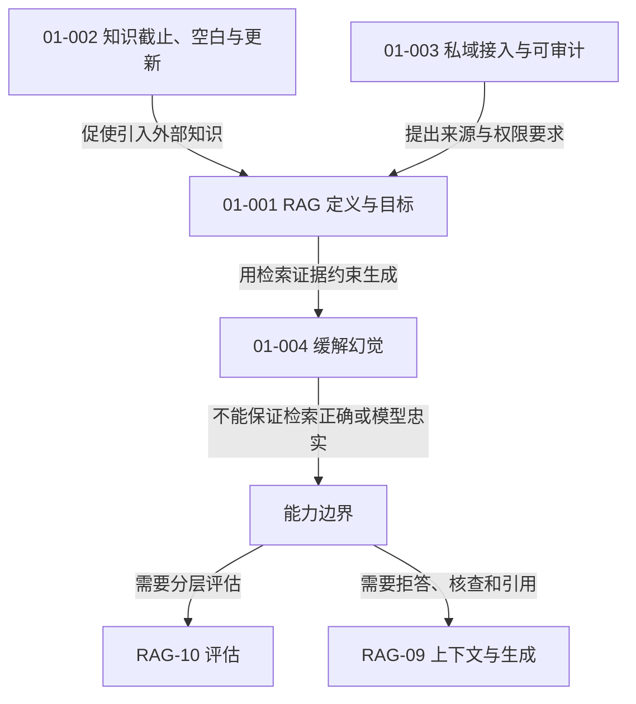
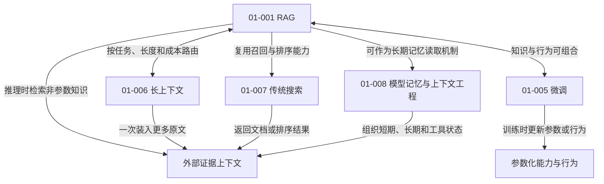
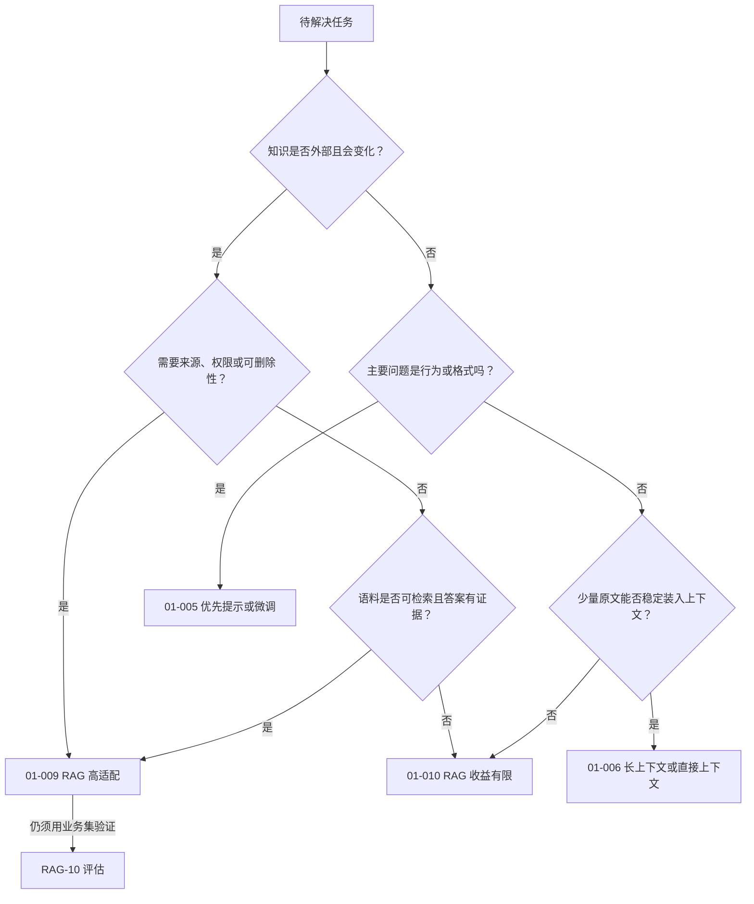

# RAG-01 基础与边界：关系图

> 本模块回答三个问题：为什么需要 RAG、RAG 与相邻方案是什么关系、什么时候不应默认选择 RAG。

## 图 1：问题、机制与能力边界

核心关系是“缓解”而不是“消灭”：RAG 增加了可检查的非参数知识通道，却同时引入解析、切分、召回、排序、上下文组装和生成忠实度等新的故障点。

## 图 2：RAG 与相邻技术的关系

这些概念不处于同一维度：微调改变模型参数或行为；长上下文描述输入容量；传统搜索关注信息检索；记忆/上下文工程管理信息何时写入、读取和组装。它们都可能与 RAG 组合。

## 图 3：适用性决策关系

## 原子知识覆盖

| 原子 ID | 在图中的角色 | 主要关系 |
|---|---|---|
| RAG-01-001 | RAG 定义与目标 | 由知识问题触发，产生外部证据上下文 |
| RAG-01-002 | 知识截止、空白、更新 | `促使引入` RAG |
| RAG-01-003 | 私域与审计 | `约束` 来源、权限与追踪 |
| RAG-01-004 | 幻觉缓解与边界 | RAG `改进但不保证` 忠实性 |
| RAG-01-005 | RAG 与微调 | `替代或组合` |
| RAG-01-006 | RAG 与长上下文 | `路由、替代或组合` |
| RAG-01-007 | RAG 与传统搜索 | RAG `复用并扩展` 搜索 |
| RAG-01-008 | RAG 与记忆、上下文工程 | RAG `实现` 部分长期记忆读取 |
| RAG-01-009 | 适合 RAG 的条件 | 由适用性判断 `选择` |
| RAG-01-010 | 不适合或收益有限 | 由边界条件 `排除` |

覆盖：**10 / 10**。详细解释见[标准学习正文](../../../knowledge/rag/chapters/rag-01-foundations.md)。

