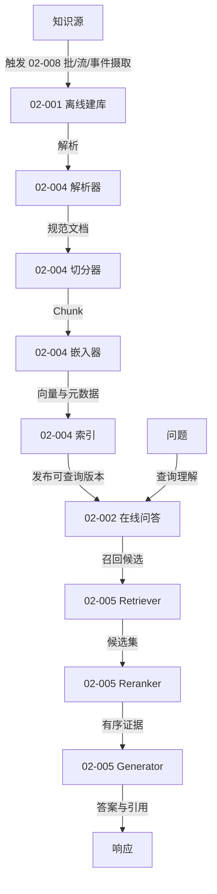
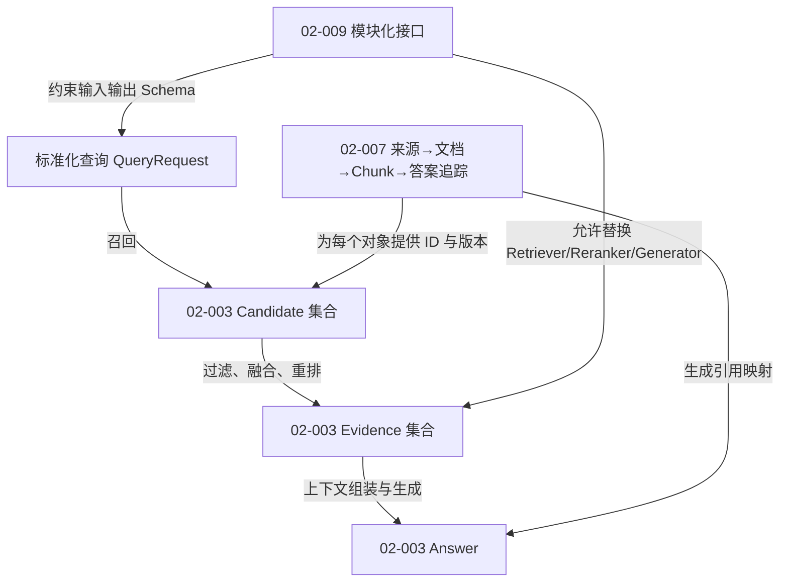
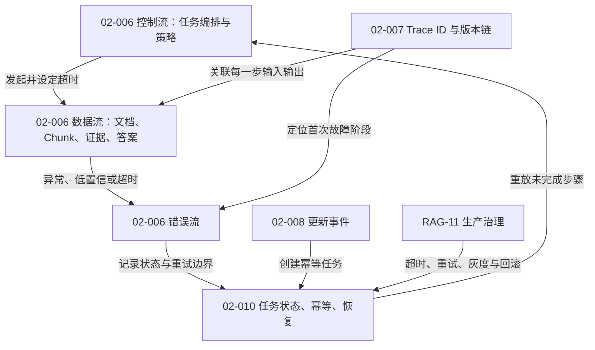

# RAG-02 系统架构与生命周期：关系图

> 本模块把 RAG 看成一个可追踪、可替换、可恢复的系统，而不是一次 `retrieve()` 加一次模型调用。

## 图 1：离线与在线双链路

## 图 2：三段式链路与数据契约

召回阶段追求候选覆盖，过滤/重排阶段追求相关性、权限和证据质量，生成阶段追求忠实回答。三个阶段目标不同，不能只用一个“答案好不好”指标替代分层观测。

## 图 3：数据流、控制流与错误流

## 原子知识覆盖

| 原子 ID | 在图中的角色 | 主要关系 |
|---|---|---|
| RAG-02-001 | 离线建库 | `产生` 可发布索引 |
| RAG-02-002 | 在线问答 | `消费` 索引并产生答案 |
| RAG-02-003 | 召回、过滤、生成 | `分解` 在线目标 |
| RAG-02-004 | 解析、切分、嵌入、索引、检索边界 | `实现` 离线和在线组件 |
| RAG-02-005 | Retriever、Reranker、Generator | `串联` 候选、证据和答案 |
| RAG-02-006 | 数据流、控制流、错误流 | `描述` 三类系统行为 |
| RAG-02-007 | 可追溯链路 | `关联` 全链路对象和版本 |
| RAG-02-008 | 批、流、事件更新 | `触发` 建库或增量任务 |
| RAG-02-009 | 模块化接口 | `约束` 数据契约并支持替换 |
| RAG-02-010 | 状态、幂等、失败恢复 | `控制` 重试和恢复 |

覆盖：**10 / 10**。详细解释见[标准学习正文](../../../knowledge/rag/chapters/rag-02-architecture-lifecycle.md)。

