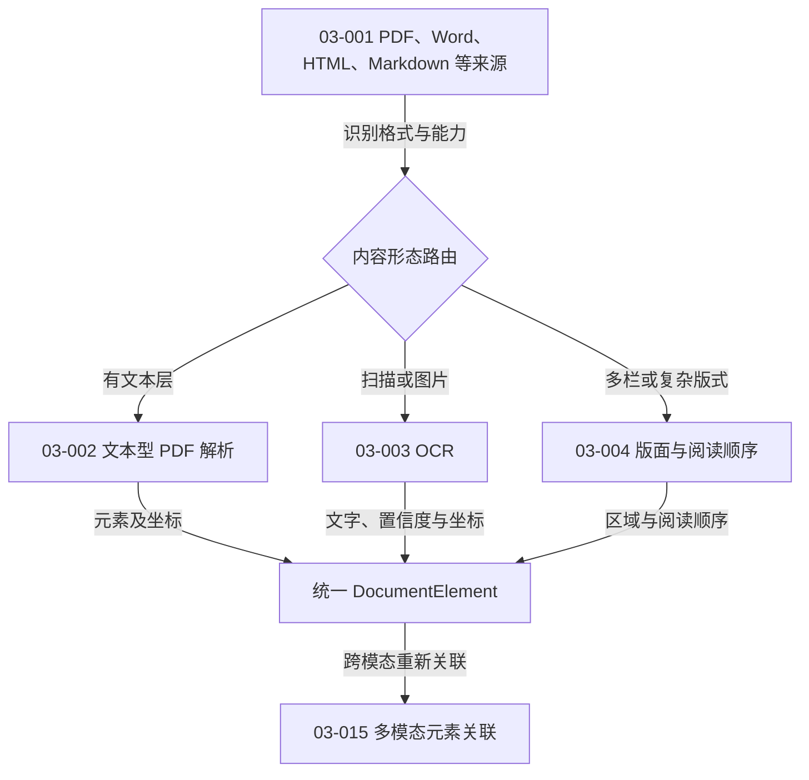
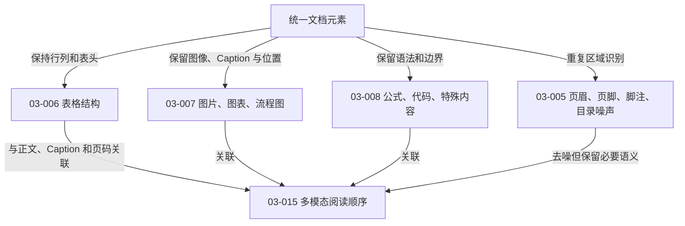
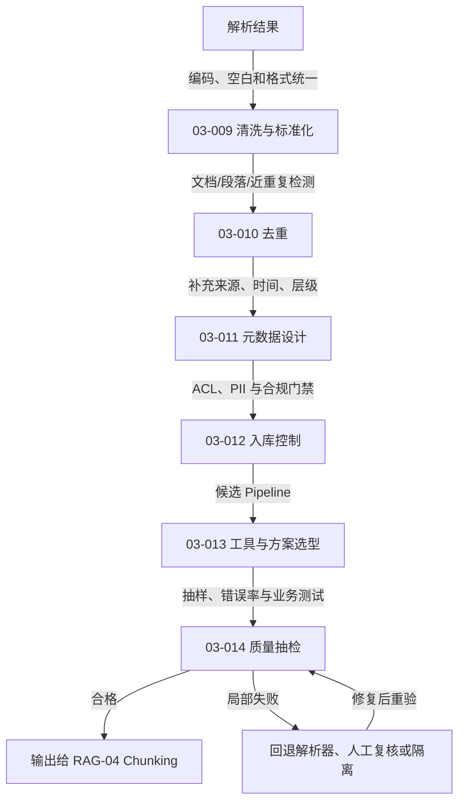

# RAG-03 文档解析与数据治理：关系图

> 本模块关注“进入检索系统之前”的信息质量。解析错误会沿 Chunk、Embedding、检索和生成继续传播，后面很难补救。

## 图 1：来源类型决定解析路线

## 图 2：特殊元素不能一律压成纯文本

## 图 3：治理、质量门禁与回退

## 原子知识覆盖

| 原子 ID | 主要关系 |
|---|---|
| RAG-03-001 | `决定` 解析器和能力路由 |
| RAG-03-002 | `处理` 有文本层 PDF 并输出元素 |
| RAG-03-003 | `补偿` 扫描件无文本层问题 |
| RAG-03-004 | `恢复` 区域、层级和阅读顺序 |
| RAG-03-005 | `去除或标注` 重复版面噪声 |
| RAG-03-006 | `保留` 表格结构并支持专项检索 |
| RAG-03-007 | `连接` 视觉元素、Caption 与正文 |
| RAG-03-008 | `保护` 公式、代码和特殊语法边界 |
| RAG-03-009 | `规范化` 所有下游输入 |
| RAG-03-010 | `减少` 重复索引与答案偏置 |
| RAG-03-011 | `支撑` 过滤、追溯、时效和引用 |
| RAG-03-012 | `约束` 入库范围与在线可见性 |
| RAG-03-013 | `组合` 解析能力和回退路径 |
| RAG-03-014 | `评估并门禁` 解析结果 |
| RAG-03-015 | `重建` 跨元素关联与完整语义 |

覆盖：**15 / 15**。详细解释见[标准学习正文](../../../knowledge/rag/chapters/rag-03-document-parsing-governance.md)。

