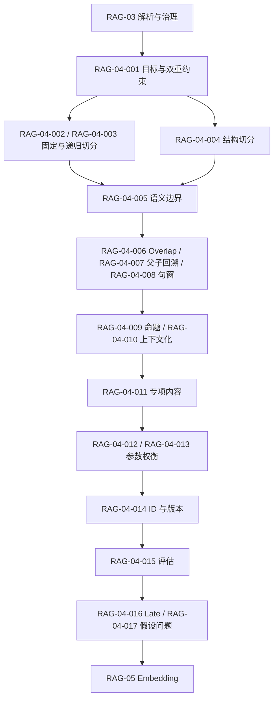

# RAG-04 文本切分（Chunking）：关系图

## 原子覆盖

`RAG-04-001` 至 `RAG-04-017`，共 17/17；详细正文见 [`rag-04-chunking.md`](../../../knowledge/rag/chapters/rag-04-chunking.md)。切分策略由解析质量输入，以评估结果决定是否发布。

逐项引用：`RAG-04-001`、`RAG-04-002`、`RAG-04-003`、`RAG-04-004`、`RAG-04-005`、`RAG-04-006`、`RAG-04-007`、`RAG-04-008`、`RAG-04-009`、`RAG-04-010`、`RAG-04-011`、`RAG-04-012`、`RAG-04-013`、`RAG-04-014`、`RAG-04-015`、`RAG-04-016`、`RAG-04-017`。
