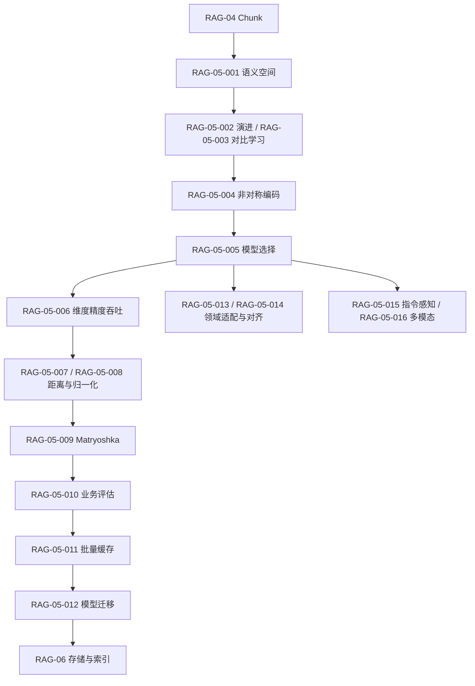

# RAG-05 向量嵌入（Embedding）：关系图

## 原子覆盖

`RAG-05-001` 至 `RAG-05-016`，共 16/16；详细正文见 [`rag-05-embedding.md`](../../../knowledge/rag/chapters/rag-05-embedding.md)。模型和向量版本必须与索引契约一致。

逐项引用：`RAG-05-001`、`RAG-05-002`、`RAG-05-003`、`RAG-05-004`、`RAG-05-005`、`RAG-05-006`、`RAG-05-007`、`RAG-05-008`、`RAG-05-009`、`RAG-05-010`、`RAG-05-011`、`RAG-05-012`、`RAG-05-013`、`RAG-05-014`、`RAG-05-015`、`RAG-05-016`。
