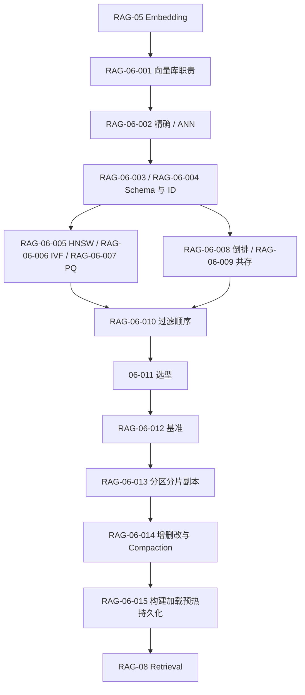

# RAG-06 存储与索引（Storage and Indexing）：关系图

## 原子覆盖

`RAG-06-001` 至 `RAG-06-015`，共 15/15；详细正文见 [`rag-06-storage-indexing.md`](../../../knowledge/rag/chapters/rag-06-storage-indexing.md)。索引参数、过滤语义和产品能力需按固定版本复核。

逐项引用：`RAG-06-001`、`RAG-06-002`、`RAG-06-003`、`RAG-06-004`、`RAG-06-005`、`RAG-06-006`、`RAG-06-007`、`RAG-06-008`、`RAG-06-009`、`RAG-06-010`、`RAG-06-011`、`RAG-06-012`、`RAG-06-013`、`RAG-06-014`、`RAG-06-015`。
