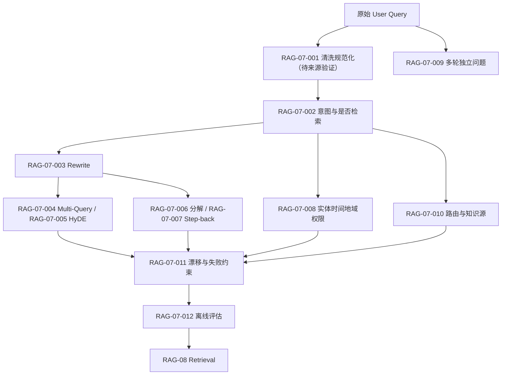

# RAG-07 查询理解（Query Understanding）：关系图

## 原子覆盖

`RAG-07-001` 至 `RAG-07-012`，共 12/12；详细正文见 [`rag-07-query-understanding.md`](../../../knowledge/rag/chapters/rag-07-query-understanding.md)。`RAG-07-001` 无来源，图中明确标为待验证。

逐项引用：`RAG-07-001`、`RAG-07-002`、`RAG-07-003`、`RAG-07-004`、`RAG-07-005`、`RAG-07-006`、`RAG-07-007`、`RAG-07-008`、`RAG-07-009`、`RAG-07-010`、`RAG-07-011`、`RAG-07-012`。
