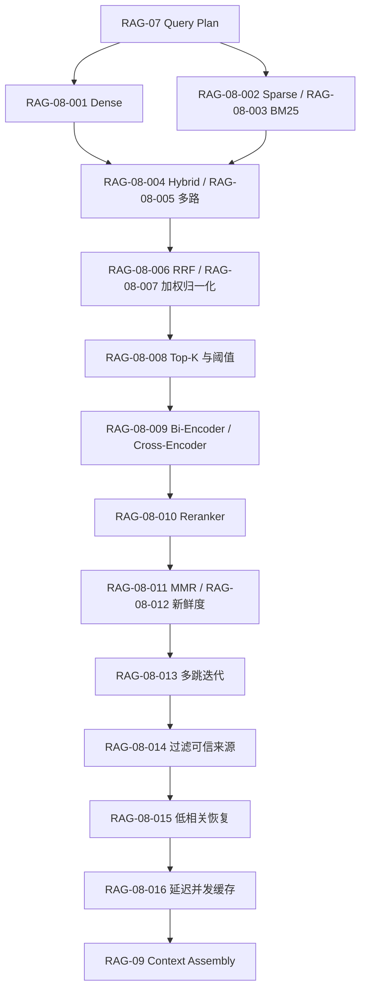

# RAG-08 检索、融合与重排（Retrieval, Fusion and Reranking）：关系图

## 原子覆盖

`RAG-08-001` 至 `RAG-08-016`，共 16/16；详细正文见 [`rag-08-retrieval-fusion-reranking.md`](../../../knowledge/rag/chapters/rag-08-retrieval-fusion-reranking.md)。各通道指标、过滤数量、重排耗时和索引版本需进入追踪。

逐项引用：`RAG-08-001`、`RAG-08-002`、`RAG-08-003`、`RAG-08-004`、`RAG-08-005`、`RAG-08-006`、`RAG-08-007`、`RAG-08-008`、`RAG-08-009`、`RAG-08-010`、`RAG-08-011`、`RAG-08-012`、`RAG-08-013`、`RAG-08-014`、`RAG-08-015`、`RAG-08-016`。
