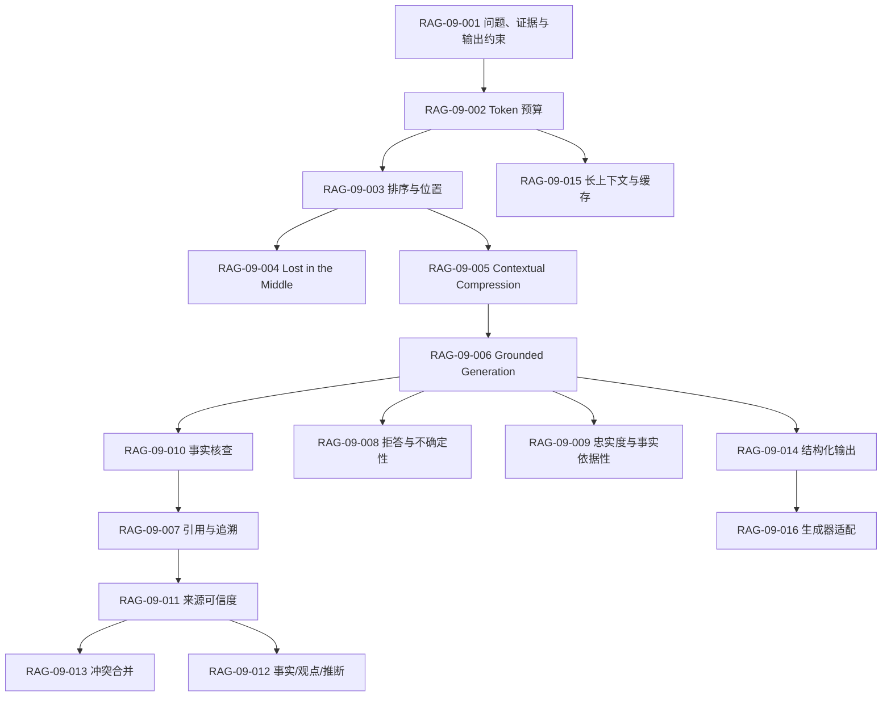

# RAG-09 上下文与生成：关系图

所有 16 个原子均由 [标准学习正文](../../../knowledge/rag/chapters/rag-09-context-generation.md) 覆盖。逐项引用：`RAG-09-001`、`RAG-09-002`、`RAG-09-003`、`RAG-09-004`、`RAG-09-005`、`RAG-09-006`、`RAG-09-007`、`RAG-09-008`、`RAG-09-009`、`RAG-09-010`、`RAG-09-011`、`RAG-09-012`、`RAG-09-013`、`RAG-09-014`、`RAG-09-015`、`RAG-09-016`。关系图只表达数据流和约束，不新增独立技术结论。
