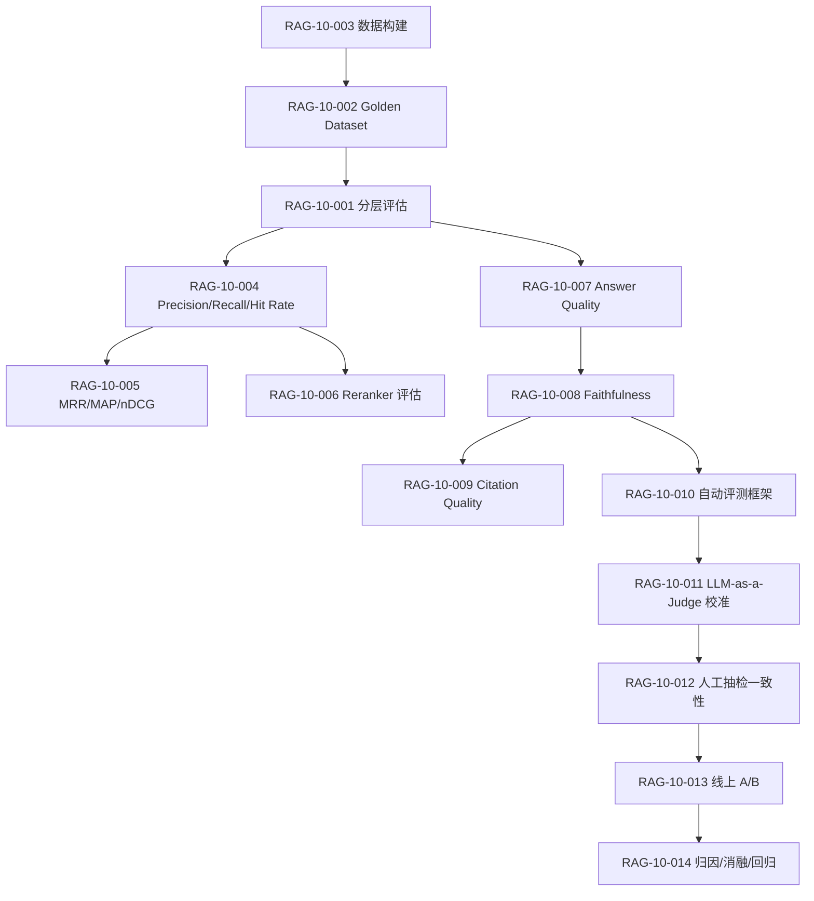

# RAG-10 评估：关系图

```mermaid
flowchart TD
  D["RAG-10-002 Golden Dataset"] --> L["RAG-10-001 分层评估"]
  X["RAG-10-003 数据构建"] --> D
  L --> R["RAG-10-004 Precision/Recall/Hit Rate"] --> S["RAG-10-005 MRR/MAP/nDCG"]
  R --> RR["RAG-10-006 Reranker 评估"]
  L --> A["RAG-10-007 Answer Quality"] --> F["RAG-10-008 Faithfulness"]
  F --> C["RAG-10-009 Citation Quality"]
  F --> AUTO["RAG-10-010 自动评测框架"] --> J["RAG-10-011 LLM-as-a-Judge 校准"]
  J --> H["RAG-10-012 人工抽检一致性"]
  H --> AB["RAG-10-013 线上 A/B"] --> T["RAG-10-014 归因/消融/回归"]
```

所有 14 个原子均由 [标准学习正文](../../../knowledge/rag/chapters/rag-10-evaluation.md) 覆盖。
