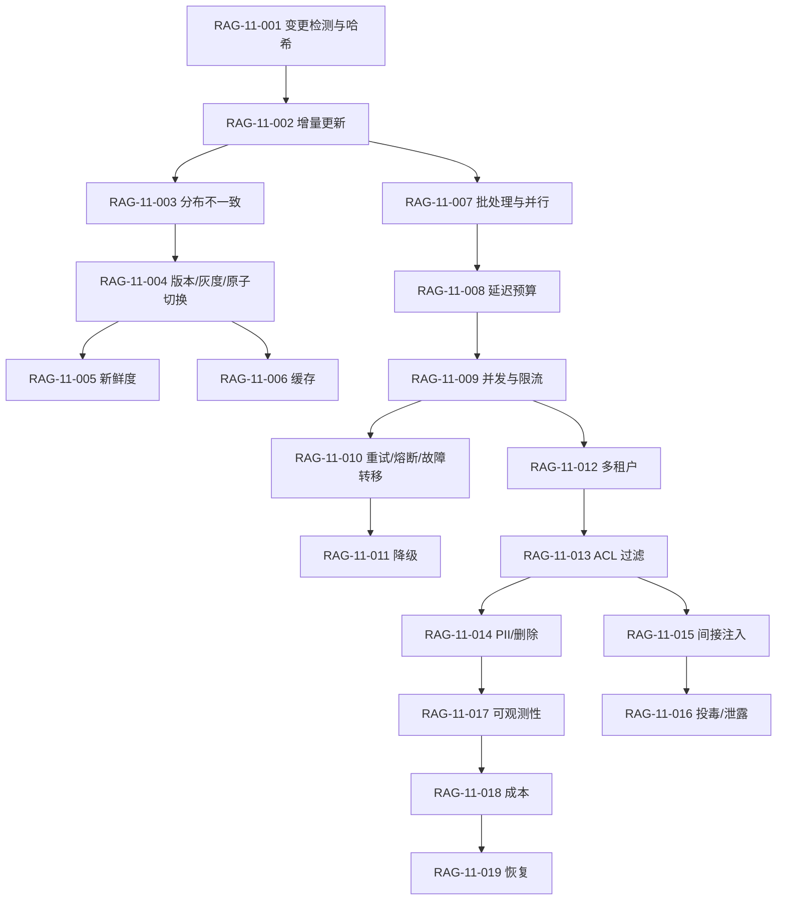

# RAG-11 生产工程与治理：关系图

```mermaid
flowchart TD
  E["RAG-11-001 变更检测与哈希"] --> U["RAG-11-002 增量更新"] --> D["RAG-11-003 分布不一致"]
  D --> V["RAG-11-004 版本/灰度/原子切换"] --> F["RAG-11-005 新鲜度"]
  U --> P["RAG-11-007 批处理与并行"] --> T["RAG-11-008 延迟预算"]
  T --> C["RAG-11-009 并发与限流"] --> R["RAG-11-010 重试/熔断/故障转移"]
  R --> G["RAG-11-011 降级"]
  V --> K["RAG-11-006 缓存"]
  C --> M["RAG-11-012 多租户"] --> ACL["RAG-11-013 ACL 过滤"] --> PII["RAG-11-014 PII/删除"]
  ACL --> I["RAG-11-015 间接注入"] --> PO["RAG-11-016 投毒/泄露"]
  PII --> O["RAG-11-017 可观测性"] --> COST["RAG-11-018 成本"] --> DR["RAG-11-019 恢复"]
```

所有 19 个原子均由 [标准学习正文](../../../knowledge/rag/chapters/rag-11-production-governance.md) 覆盖。
