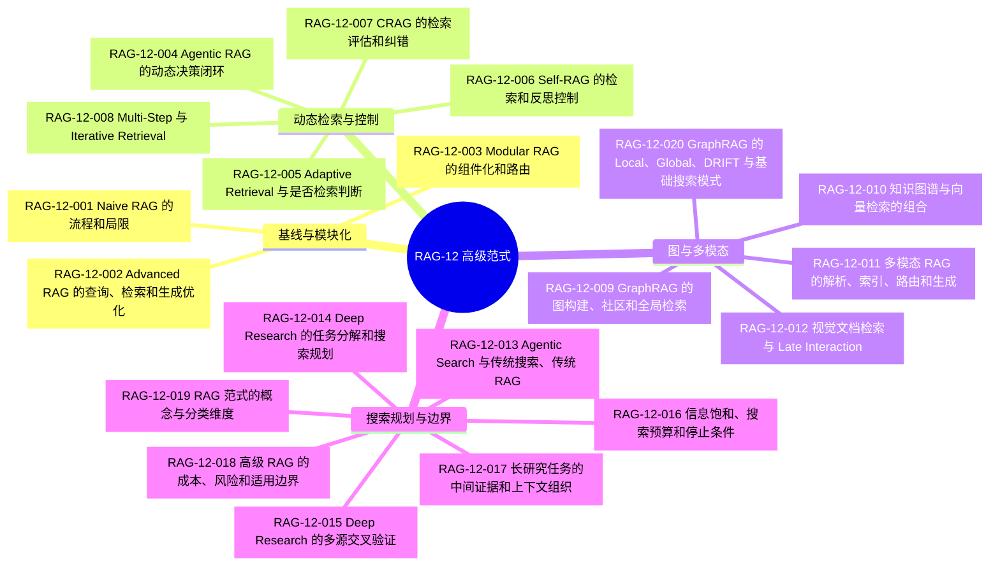
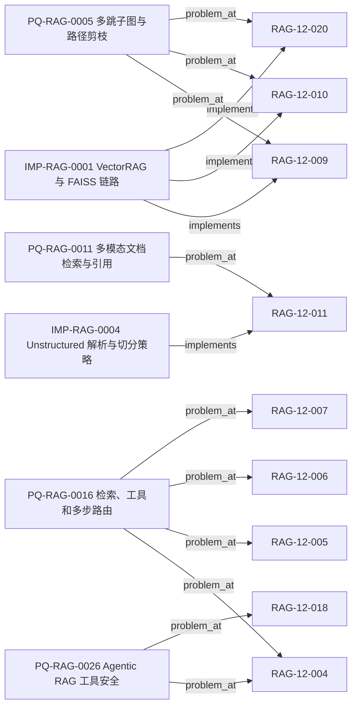

# RAG-12 高级范式：关系图

> 本图是由 `knowledge/rag/graph.json` 投影的学习视图。叶子节点只对应标准知识原子；图中不新增脱离图谱来源的技术结论。

## 图 1：范式原子覆盖

## 图 2：图谱中已登记的实现与问题关系

## 原子知识覆盖

| 原子 ID | 图中分组 | 图谱关系 |
|---|---|---|
| `RAG-12-001` 至 `RAG-12-003` | 基线与模块化 | `contains`（`PS-ADVANCED-RAG`） |
| `RAG-12-004` 至 `RAG-12-008` | 动态检索与控制 | `contains`；`problem_at`（`PQ-RAG-0016` 部分） |
| `RAG-12-009`、`RAG-12-010`、`RAG-12-020` | 图与多模态 | `implements`（`IMP-RAG-0001`）；`problem_at`（`PQ-RAG-0005`） |
| `RAG-12-011`、`RAG-12-012` | 图与多模态 | `implements`（`IMP-RAG-0004`）及 `problem_at`（`PQ-RAG-0011`） |
| `RAG-12-013` 至 `RAG-12-019` | 搜索规划与边界 | `contains`（`PS-ADVANCED-RAG`） |
| `RAG-12-020` | 图与多模态 | `implements`（`IMP-RAG-0001`）；`problem_at`（`PQ-RAG-0005`） |

覆盖：**20 / 20**。标准正文见 [`rag-12-advanced-paradigms.md`](../../../knowledge/rag/chapters/rag-12-advanced-paradigms.md)。

