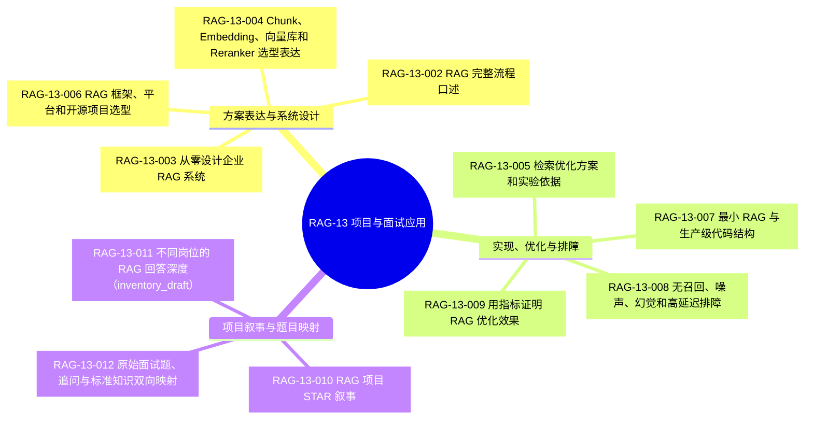
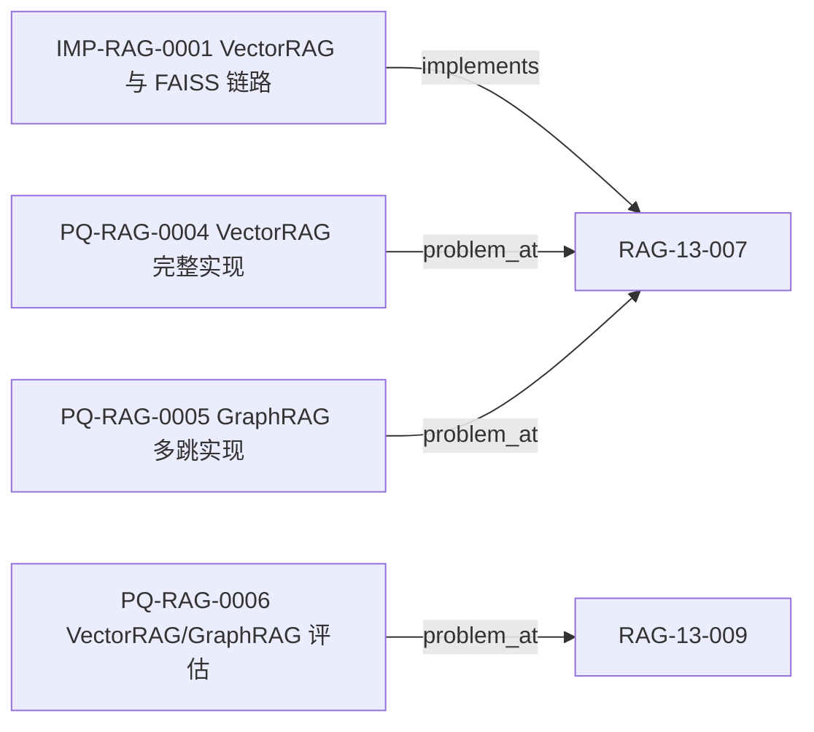

# RAG-13 项目与面试应用：关系图

> 本图是由 `knowledge/rag/graph.json` 投影的学习视图。`RAG-13-011` 是无来源的 `inventory_draft` 原子，仅为覆盖登记，不构成正式结论。

## 图 1：项目与面试原子覆盖

## 图 2：图谱中已登记的实现与问题关系

## 原子知识覆盖

| 原子 ID | 图中分组 | 图谱关系与状态 |
|---|---|---|
| `RAG-13-002`、`RAG-13-003`、`RAG-13-004`、`RAG-13-006` | 方案表达与系统设计 | `contains`（`BB-RAG`） |
| `RAG-13-005`、`RAG-13-007`、`RAG-13-008`、`RAG-13-009` | 实现、优化与排障 | `contains`（`BB-RAG`）；`RAG-13-007` 有 `implements`/`problem_at`，`RAG-13-009` 有 `problem_at` |
| `RAG-13-010`、`RAG-13-012` | 项目叙事与题目映射 | `contains`（`BB-RAG`） |
| `RAG-13-011` | 项目叙事与题目映射 | `contains`（`BB-RAG`），状态 `inventory_draft`，无来源且未作为正文结论 |

覆盖：**11 / 11**（其中 1 个为待处置库存原子）。标准正文见 [`rag-13-project-interview.md`](../../../knowledge/rag/chapters/rag-13-project-interview.md)。

