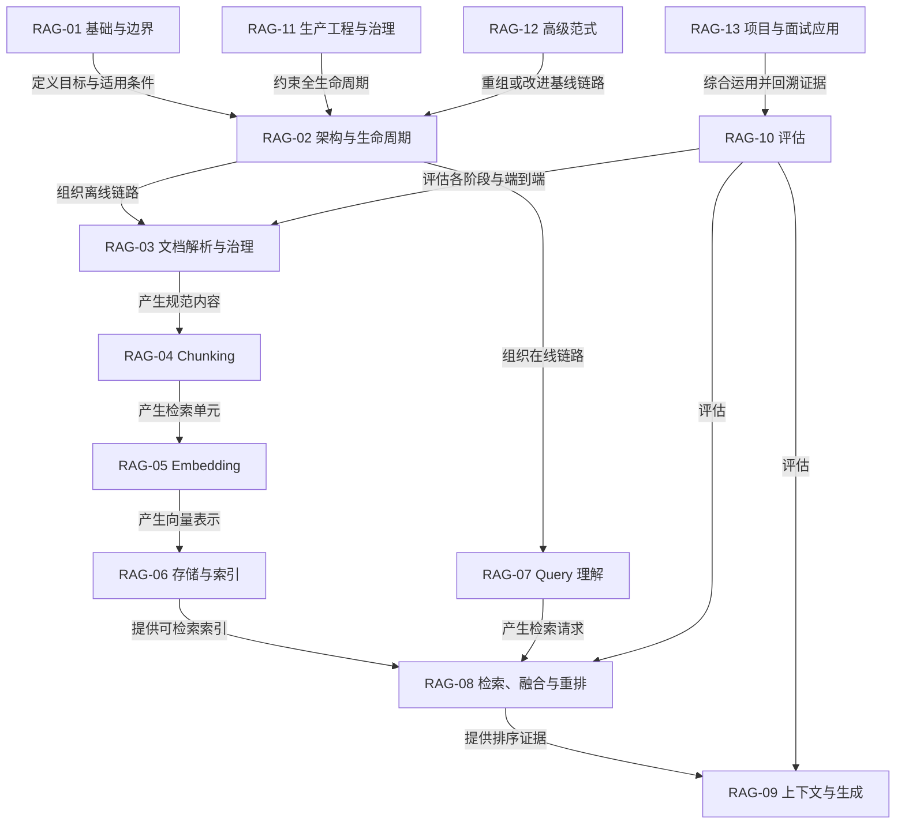
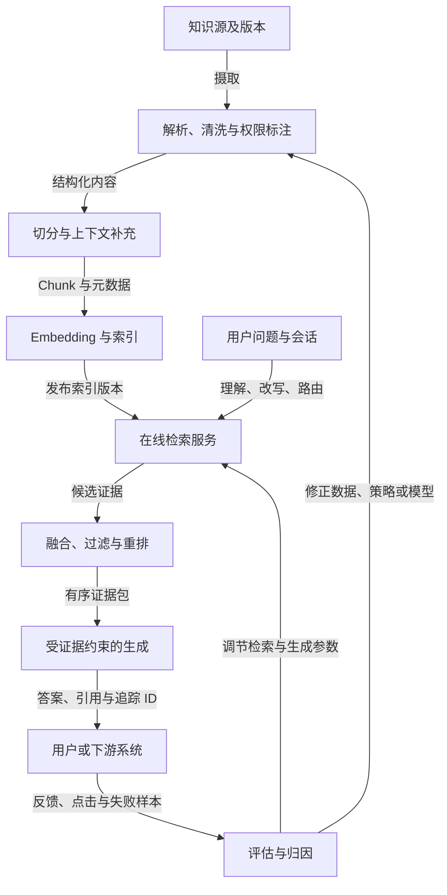

# RAG 学习总览与导航

> 状态：`formal_release_bounded`。本页是正式学习入口，不替代原子知识审计。`RAG-01` 至 `RAG-13` 均已通过严格验收；正式集合为 189 个有来源原子，2 个无来源原子仅作库存占位。

开始学习请先阅读[学习启动页](START_HERE.md)，再按本页的完整流程和模块入口推进。

## 如何阅读这些图

本项目不用一张超大图承载全部内容，而是采用三层结构：

1. **全局图**：只看 13 个模块在完整系统中的依赖关系。
2. **模块图**：展开一个模块内部的原子知识及其有向关系。
3. **机制图**：对数据流、控制流、算法或故障传播等复杂过程再次放大。

关系线使用动词短语，不用无含义的连线。主要关系如下：

| 关系 | 含义 | 阅读方式 |
|---|---|---|
| `前置` | 学习或运行前必须先具备 | A 是 B 的前置 |
| `产生/输入` | 数据或状态向下游流动 | A 产生或输入 B |
| `实现` | 组件或方法落实某个目标 | A 实现 B |
| `改进` | 在基线方法上提高某项能力 | A 改进 B |
| `约束/治理` | 对目标施加权限、成本或质量边界 | A 约束 B |
| `替代/组合` | 可选另一条路径，或共同使用 | A 与 B 替代或组合 |
| `评估` | 用指标或实验验证目标 | A 评估 B |
| `暴露故障` | 上游问题在下游表现出来 | A 的故障影响 B |

## 图 1：完整 RAG 系统的模块依赖

这张图只回答“模块怎样协作”，不展开算法细节。`RAG-03` 到 `RAG-06` 构成离线建库主干；`RAG-07` 到 `RAG-09` 构成在线问答主干；评估和生产治理不是最后补上的步骤，而是横跨全链路。

## 图 2：离线建库、在线问答与反馈闭环

## 正式模块入口

| 模块 | 关系图 | 标准学习正文 | 状态 |
|---|---|---|---|
| RAG-01 基础与边界 | [查看](maps/rag-01.md) | [查看](../../knowledge/rag/chapters/rag-01-foundations.md) | 正式发布（有界） |
| RAG-02 系统架构与生命周期 | [查看](maps/rag-02.md) | [查看](../../knowledge/rag/chapters/rag-02-architecture-lifecycle.md) | 正式发布（有界） |
| RAG-03 文档解析与数据治理 | [查看](maps/rag-03.md) | [查看](../../knowledge/rag/chapters/rag-03-document-parsing-governance.md) | 正式发布（有界） |
| RAG-04 Chunking | [查看](maps/rag-04.md) | [查看](../../knowledge/rag/chapters/rag-04-chunking.md) | 正式发布（有界） |
| RAG-05 Embedding | [查看](maps/rag-05.md) | [查看](../../knowledge/rag/chapters/rag-05-embedding.md) | 正式发布（有界） |
| RAG-06 存储与索引 | [查看](maps/rag-06.md) | [查看](../../knowledge/rag/chapters/rag-06-storage-indexing.md) | 正式发布（有界） |
| RAG-07 Query 理解 | [查看](maps/rag-07.md) | [查看](../../knowledge/rag/chapters/rag-07-query-understanding.md) | 正式发布（有界），含 1 个库存占位 |
| RAG-08 检索、融合与重排 | [查看](maps/rag-08.md) | [查看](../../knowledge/rag/chapters/rag-08-retrieval-fusion-reranking.md) | 正式发布（有界） |
| RAG-09 上下文与生成 | [查看](maps/rag-09.md) | [查看](../../knowledge/rag/chapters/rag-09-context-generation.md) | 正式发布（有界） |
| RAG-10 评估 | [查看](maps/rag-10.md) | [查看](../../knowledge/rag/chapters/rag-10-evaluation.md) | 正式发布（有界） |
| RAG-11 生产工程与治理 | [查看](maps/rag-11.md) | [查看](../../knowledge/rag/chapters/rag-11-production-governance.md) | 正式发布（有界） |
| RAG-12 高级范式 | [查看](maps/rag-12.md) | [查看](../../knowledge/rag/chapters/rag-12-advanced-paradigms.md) | 正式发布（有界） |
| RAG-13 项目与面试应用 | [查看](maps/rag-13.md) | [查看](../../knowledge/rag/chapters/rag-13-project-interview.md) | 正式发布（有界），含 1 个库存占位 |

## 完整性说明

- 原子知识是否遗漏，以 [`catalog.json`](../../knowledge/rag/catalog.json) 和来源映射审计为准。
- 正式图中的知识 ID 可直接回查目录、正文和来源单元。
- 图为了可读性可以把多个强相关原子放入同一机制图，但不得删除原子；模块末尾的覆盖表负责逐项核对。
- 当前目录共 191 个原子，其中 189 个进入正式发布集合，`RAG-07-001` 和 `RAG-13-011` 保留为 `inventory_draft` 占位；有新证据时允许补齐或调整，禁止静默删除。
