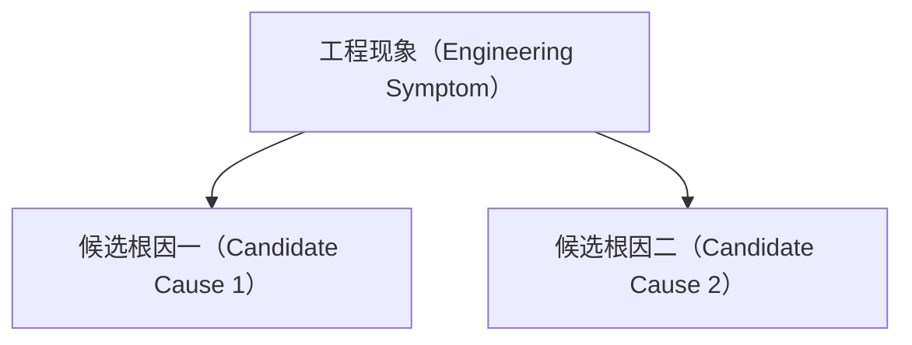

# 工程问题/面试题（Engineering Problem / Interview Question）：待填写

> 每次出现专业技术术语都必须使用 [`knowledge/rag/TERMINOLOGY.md`](../knowledge/rag/TERMINOLOGY.md) 中的统一双语表达。

## 1. 问题或题目

保留问题的工程条件。公开题目采用自己的转述，不复制未知许可来源的长篇答案。

## 2. 来源与可信度

| 字段 | 内容 |
|---|---|
| 来源类型 | 第一人称面经（First-person Interview Report）/公开题库（Public Question Bank）/项目型考题（Project Interview Exercise）/工程问题（Engineering Case）/二次索引（Secondary Index） |
| 原始链接 | 待填写 |
| 日期或固定提交 | 待填写 |
| 原始定位 | 待填写 |
| 核验说明 | 待填写 |

没有公开面试来源时必须标记为工程问题（Engineering Case），不得声称来自真实公司面试。

## 3. 实际工程现象和业务条件

说明系统观察到什么、当前配置和约束是什么、哪些条件发生变化后问题出现。

## 4. 关联流程节点

| 角色 | 节点 ID | 流程节点（Pipeline Stage） | 关联原因 |
|---|---|---|---|
| 主要定位 | 待填写 | 待填写 | 待填写 |
| 相关定位 | 待填写 | 待填写 | 待填写 |

一个问题可以连接多个流程节点，不能为了目录整齐强制归入一个节点。

## 5. 根因分支

逐项解释根因为什么会产生当前现象，以及如何区分不同根因。

## 6. 解决方案分支

对每个解决方案说明解决的根因、原理、适用条件、与其他方案的关系以及引入的成本或风险。

## 7. 方案选择依据

根据数据、质量、延迟、成本、权限、维护难度和业务风险做选择。不能只给单一“最佳方案”。

## 8. 具体技术或框架实现

说明自研实现和当前框架实现，包括组件、调用顺序、输入输出、关键应用程序编程接口（Application Programming Interface，API）、配置、代码、版本、日志和追踪字段。

## 9. 验证方法

说明离线数据和指标、消融实验（Ablation Study）、回归测试（Regression Test）、线上观测和失败样本复查。

## 10. 关联知识章节

| 知识节点 ID | 中文名称（English Name） | 为什么需要查看 |
|---|---|---|
| 待填写 | 待填写 | 待填写 |

## 11. 相关追问和跨节点关系

- 相关公开追问：待填写；
- 相邻工程问题：待填写；
- 跨主干关系：待填写。

## 12. 来源、冲突与版本说明

记录技术结论的一手资料、来源冲突、审核日期、适用版本和未验证假设。

